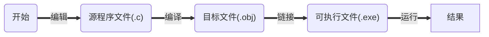
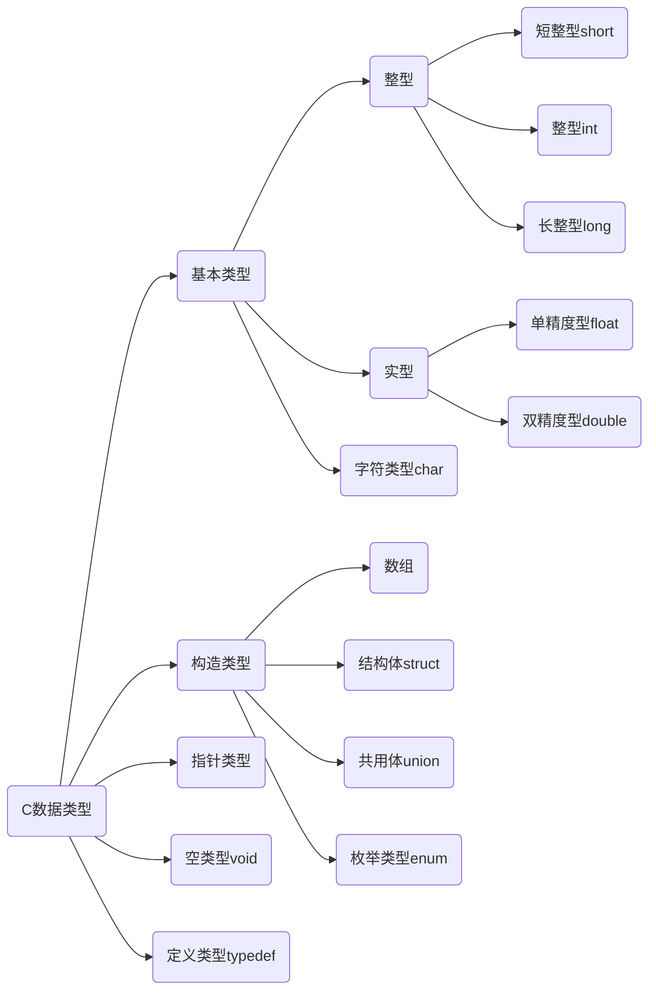

#  32个关键字

|  关键字  | 含义                         |  关键字  | 含义                       |
| :------: | :--------------------------- | :------: | -------------------------- |
|   auto   | 储存类别为自动变量           |   long   | 长整数                     |
|  break   | 终止switch或循环语句         |   main   | 主函数                     |
|   case   | 字符类型                     | register | 寄存器类型                 |
|   char   | 字符类型                     |  return  | 函数返回                   |
|  const   | 常量——“不变的”类型           |  short   | 短整数类型                 |
| continue | 中止循环的当次运行           |  signed  | 有符号的类型               |
| default  | switch语句的默认条件         |  sizeof  | 求类型、变量等的字节数     |
|    do    | 循环语句之一，需要while配合  |  static  | 储存类别为静态的           |
|  double  | 双精度实数类型               |  struct  | 结构体类型                 |
|   else   | if语句的条件为假时执行的部分 |  switch  | 多路分支语句，需要case配合 |
|   enum   | 枚举类型                     | typedef  | 类型别名定义               |
|  extern  | 说明函数、变量为外部的       |  union   | 共用体类型                 |
|  float   | 单精度实数类型               | unsigned | 无符号类型                 |
|   for    | 循环语句之一                 |   void   | “空“（无）类型             |
|   goto   | 转向语句，需要标号配合       | volatile | ”可变的“类型               |
|    if    | 根据条件的分支语句           |  while   | 循环语句之一               |
|   int    | 整数类型                     |          |                            |


# 标识符：（名字）

​	用户标识符：由字母（26个大小写字母）、数字（0-9）和下划线（"_"组成），不能以数字开头，区分大小写。

+ 用户标识符不能含有除字母、数字和下划线外的其他字符
+ 用户标识符不能和关键字重名


# C语言程序的结构

## 结构特点:

+ 函数与主函数
  + 程序由一个或多个函数组成
  + 必须有且只能有一个主函数main()
  + 程序执行从main开始,在main中结束
+ 程序语句
  + C程序由语句组成
  + 用" ; "作为语句终止符
+ 注释
  + /*       */为注释


# C程序运行步骤和方法




# 算法

## 什么是算法

### 一个程序应包括两个方面的内容:

+ 对数据组织的描述:
  + ==数据结构== 顺序存储(数组)和链式存储V

+ 对操作步骤的描述:
  + ==算法== 	穷举、迭代和递归，查找、添加、删除、改写
  + ==数据结构+算法=程序==

`所谓算法，是为解决一个问题而采取的方法和步骤。`

## 算法的特性

+ ==**有穷性**==：包含有限的操作步骤

+ ==**确定性**==：算法中的每一个步骤都应当是确定的

+ ==**有零个或多个输入**==：输入是指在执行算法时需要从外界取得必要的信息

+ ==**有一个或多个输出**==：算法的目的是为了求解, “解”就是输出

+ ==**有效性**==：算法中的每一个步骤都应当能有效地执行,并得到确定的结果,

# 基本数据类型

## C数据类型




# 常量

## 定义：

程序运行时其值不能改变的量（即常量）

## 分类

+ 符号常量：用标识符代表常量
  + 定义格式： ==*#define 符号常量 常量*==

+ 直接常量：
  + 整型常量
  + 实型常量
  + 字符常量
  + 字符串常量

## 整型常量

### 三种形式

+ 十进制整数：由数字0~9和正负号表示。（123）
+ 八进制整数：由数字0开头，只有0~7.（012）
+ 十六进制整数：由0xx开头，有0~9，和  A~F( a~ f)。(0x12A)

## 实型常量（实数或浮点数）

### 表示形式：

+ 十进制小数形式：0.2
+ 指数形式：1.2E-3

##  字符常量

### 定义：

用*单引号*括起来的单个**普通字符**或**转义字符**

+ 常规字符：例如：'A'、'2'、'#'等

+ 转义字符：由一反斜杠'\\'后跟规定字符构成。

| 转义字符 | 含义                 | 转义字符 | 含义                  |
| -------- | -------------------- | -------- | --------------------- |
| \n       | 换行                 | \t       | 水平制表（八列）      |
| \v       | 垂直制表             | \b       | 退格                  |
| \r       | 回车                 | \f       | 换页                  |
| \a       | 响铃                 | \\       | 反斜杠                |
| \\'      | 单引号               | \\"      | 双引号                |
| \ddd     | 3位8进制数代表的字符 | \xhh     | 2位16进制数代表的字符 |

## 字符串常量

定义：

用*双引号*括起来的字符序列

存储：每个字符串尾**自动**加一个'\0'作为字符串结束标志

| 0    | 1    | 2    | 3    | 4    | 5    |
| ---- | ---- | ---- | ---- | ---- | ---- |
| 'C'  | 'h'  | 'i'  | 'n'  | 'a'  | '\0' |

# 变量

+ 概念：是指在程序运行期间值可以发生变化的量。
+ 作用：变量是一个存储数据的容器，即存储单元，它的功能就是用来存放程序中需要处理的数据。
+ 变量的基本操作：
  + 赋值
  + 取值
+ 变量的命名：遵守C语言标识符的命名规则。
+ 变量的使用原则：先定义后使用。

变量定义语句的一般形式为：==**类型识别符 变量名;**==

## 整型变量

+ 占字节数随机器不同而不同,一般占一个机器字
+ short (2B) <= int <= long (4B)
+ 可用sizeof (类型标识符) 测量

## 实型变量

+ float: 占4字节
+ double: 占8字节

## 字符型变量

+ 字符变量存放字符ASCII码
+ char与int数据间可进行算术运算

# 数据类型转换

## 强制类型转换符

+ 形式：(类型名) 表达式

(int) 2.2	=>2

(int) 5.5 / (int) 2.5	=>2

## 自动类型转换

设char w; int x; float y; double z; 则表达式w*x+z-y的值的类型是double.

# 运算符和表达式

## 算数运算符和算数表达式

+ 基本算数运算符：+ - * / %

+ 结合方向：从左到右
+ 优先级：+ - $\longrightarrow$  * / % $\longrightarrow$ + -
+ 说明："-"作为单目运算符时，右结合

**求余左右两边必须是整数： ==5.5%2  $\textcolor{red}{\times}$==**

## C语言运算符优先级

<table align="center" border="1" cellpadding="1" cellspacing="1" style="width:700px;">
    <tbody>
    <tr>
        <td style="text-align:center;width:81px;">优先级</td>
        <td style="text-align:center;width:457px;">运算符</td>
        <td style="text-align:center;width:110px;">说明</td>
        <td style="width:91px;">结合性</td>
    </tr>
    <tr>
        <td style="text-align:center;width:81px;">1</td>
        <td style="text-align:center;width:457px;"><span style="color:#fe2c24;">( )</span> <span style="color:#fe2c24;">[ ]</span>&nbsp;
            <span style="color:#fe2c24;">&nbsp;.</span>(成员选择(对象))&nbsp; &nbsp;<span
                    style="color:#fe2c24;"> &nbsp;-&gt;</span>(成员选择(指针))
        </td>
        <td style="text-align:center;width:110px;"></td>
        <td style="width:91px;">从左到右</td>
    </tr>
    <tr>
        <td style="text-align:center;width:81px;">2</td>
        <td style="text-align:center;width:457px;"><p><span style="color:#fe2c24;">&nbsp;&nbsp;&nbsp;&nbsp;&nbsp;&nbsp;&nbsp;&nbsp;&nbsp;！</span>(逻辑非运算符)<span
                style="color:#fe2c24;">&nbsp; &nbsp;+</span>(正)&nbsp;
            <span style="color:#fe2c24;">&nbsp;-</span>(负)&nbsp; &nbsp;<span style="color:#fe2c24;">~</span>&nbsp;
            &nbsp;<span style="color:#fe2c24;">++</span>&nbsp; &nbsp;<span style="color:#fe2c24;">--</span>&nbsp; <span
                    style="color:#fe2c24;">&nbsp;*</span><span style="color:#0d0016;">(取值运算符)&nbsp; </span>&nbsp; <span
                    style="color:#fe2c24;">&amp;</span><span style="color:#0d0016;">(取地址符)&nbsp; &nbsp;</span></p>
            <p><span style="color:#0d0016;">&nbsp;&nbsp;&nbsp;&nbsp;&nbsp;&nbsp;&nbsp;&nbsp;&nbsp;&nbsp;&nbsp;&nbsp;&nbsp;&nbsp;&nbsp;&nbsp;&nbsp;&nbsp;&nbsp;&nbsp;&nbsp;&nbsp;&nbsp;&nbsp;</span><span
                    style="color:#fe2c24;">sizeof</span><span style="color:#0d0016;">(</span>长度运算符<span
                    style="color:#0d0016;">)</span></p></td>
        <td style="text-align:center;width:110px;">单目运算符</td>
        <td style="width:91px;">从右到左</td>
    </tr>
    <tr>
        <td style="text-align:center;width:81px;">3</td>
        <td style="text-align:center;width:457px;"><span style="color:#fe2c24;">*</span>(乘)&nbsp; &nbsp; <span
                style="color:#fe2c24;">/</span>(除)&nbsp; <span style="color:#fe2c24;">&nbsp; %</span>(取余)
        </td>
        <td colspan="1" rowspan="10" style="text-align:center;width:110px;">双目运算符</td>
        <td style="width:91px;">从左到右</td>
    </tr>
    <tr>
        <td style="text-align:center;width:81px;">4</td>
        <td style="text-align:center;width:457px;"><span style="color:#fe2c24;">+</span>(加)&nbsp; &nbsp; &nbsp;
            &nbsp;<span style="color:#fe2c24;"> -</span>(减)
        </td>
        <td style="width:91px;">从左到右</td>
    </tr>
    <tr>
        <td style="text-align:center;width:81px;">5</td>
        <td style="text-align:center;width:457px;"><span style="color:#fe2c24;">&lt;&lt;</span>(左移)&nbsp; &nbsp;<span
                style="color:#fe2c24;"> &gt;&gt;</span>(右移)&nbsp; &nbsp;<span
                style="color:#fe2c24;"> &gt;&gt;&gt;</span></td>
        <td style="width:91px;">从左到右</td>
    </tr>
    <tr>
        <td style="text-align:center;width:81px;">6</td>
        <td style="text-align:center;width:457px;"><span style="color:#fe2c24;">&gt;</span>(大于)&nbsp; &nbsp; &nbsp;<span
                style="color:#fe2c24;">&gt;=</span>(大于等于)&nbsp; &nbsp; &nbsp;<span style="color:#fe2c24;">&lt;</span>(小于)&nbsp;
            &nbsp; &nbsp;<span style="color:#fe2c24;">&lt;=</span>(小于等于)
        </td>
        <td style="width:91px;">从左到右</td>
    </tr>
    <tr>
        <td style="text-align:center;width:81px;">7</td>
        <td style="text-align:center;width:457px;"><span style="color:#fe2c24;">==</span>(等于)&nbsp; &nbsp; &nbsp; &nbsp;<span
                style="color:#fe2c24;"> !=</span>(不等于)
        </td>
        <td style="width:91px;">从左到右</td>
    </tr>
    <tr>
        <td style="text-align:center;width:81px;">8</td>
        <td style="text-align:center;width:457px;"><span style="color:#fe2c24;">&amp;</span>(按位与)</td>
        <td style="width:91px;">从左到右</td>
    </tr>
    <tr>
        <td style="text-align:center;width:81px;">9</td>
        <td style="text-align:center;width:457px;"><span style="color:#fe2c24;">^</span>(按位异或)</td>
        <td style="width:91px;">从左到右</td>
    </tr>
    <tr>
        <td style="text-align:center;width:81px;">10</td>
        <td style="text-align:center;width:457px;"><span style="color:#fe2c24;">|</span>(按位或)</td>
        <td style="width:91px;">从左到右</td>
    </tr>
    <tr>
        <td style="text-align:center;width:81px;">11</td>
        <td style="text-align:center;width:457px;"><span style="color:#fe2c24;">&amp;&amp;</span>(逻辑与)</td>
        <td style="width:91px;">从左到右</td>
    </tr>
    <tr>
        <td style="text-align:center;width:81px;">12</td>
        <td style="text-align:center;width:457px;"><span style="color:#fe2c24;">||</span>(逻辑或)</td>
        <td style="width:91px;">从左到右</td>
    </tr>
    <tr>
        <td style="text-align:center;width:81px;">13</td>
        <td style="text-align:center;width:457px;"><span style="color:#fe2c24;">?:</span>(条件运算符)</td>
        <td style="text-align:center;width:110px;">三目运算符</td>
        <td style="width:91px;">从右到左</td>
    </tr>
    <tr>
        <td style="text-align:center;width:81px;">14</td>
        <td style="text-align:center;width:457px;"><span style="color:#fe2c24;">=</span>(赋值运算符)&nbsp; &nbsp; <span
                style="color:#fe2c24;">/=</span>(除后赋值)&nbsp; &nbsp;<span style="color:#fe2c24;"> *=</span>(乘后赋值)&nbsp;
            &nbsp; <span style="color:#fe2c24;">%=</span>(取余后赋值)&nbsp; &nbsp; <span style="color:#fe2c24;">+=</span>(加后赋值)&nbsp;
            &nbsp;<span style="color:#fe2c24;"> -=</span>(减后赋值)&nbsp; &nbsp; <span
                    style="color:#fe2c24;">&gt;&gt;=</span>(右移后赋值)&nbsp; &nbsp; <span
                    style="color:#fe2c24;">&lt;&lt;=</span>(左移后赋值)&nbsp; <span
                    style="color:#fe2c24;">&nbsp; &amp;=</span>(按位与后赋值)&nbsp; &nbsp; <span
                    style="color:#fe2c24;">|=</span>(按位或后赋值)&nbsp; &nbsp; <span style="color:#fe2c24;">^=</span>(按位异或后赋值)&nbsp;
            &nbsp;&nbsp;
        </td>
        <td style="text-align:center;width:110px;">复合运算符</td>
        <td style="width:91px;">从右到左</td>
    </tr>
    <tr>
        <td style="text-align:center;width:81px;">15</td>
        <td style="text-align:center;width:457px;"><span style="color:#fe2c24;">,</span>(逗号运算符)</td>
        <td style="text-align:center;width:110px;">从左向右顺序运算</td>
        <td style="width:91px;">从左到右</td>
    </tr>
    </tbody>
</table>


输入

```
```


# 输出格式化

```

%o	八进制

%d 十进制

%x	16进制

%u	无符号十进制

%c	单个字符

%s	字符串

```