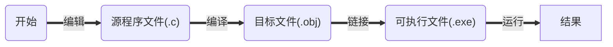
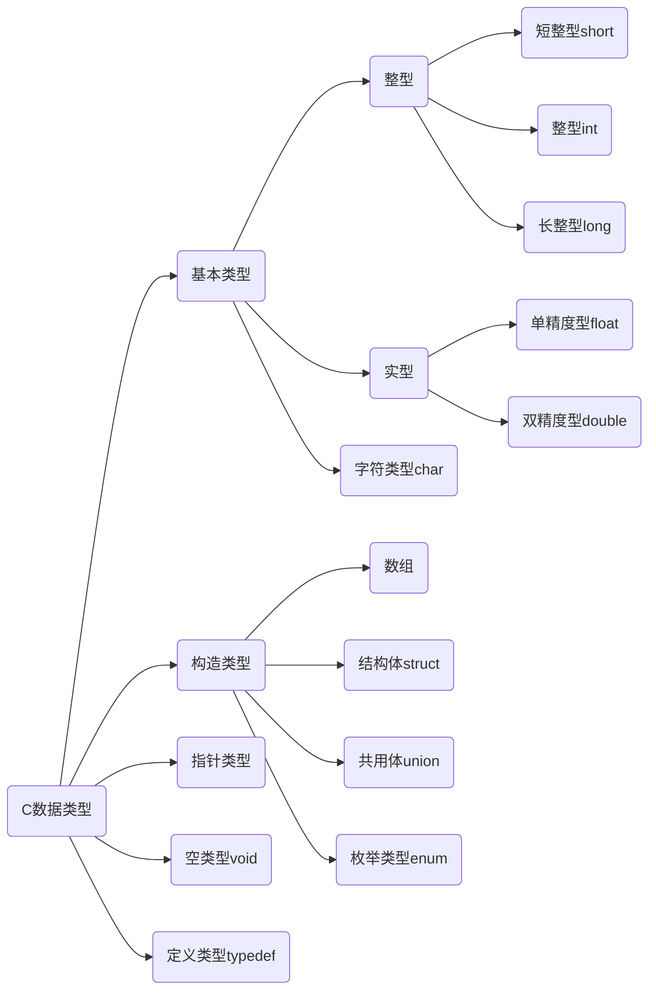
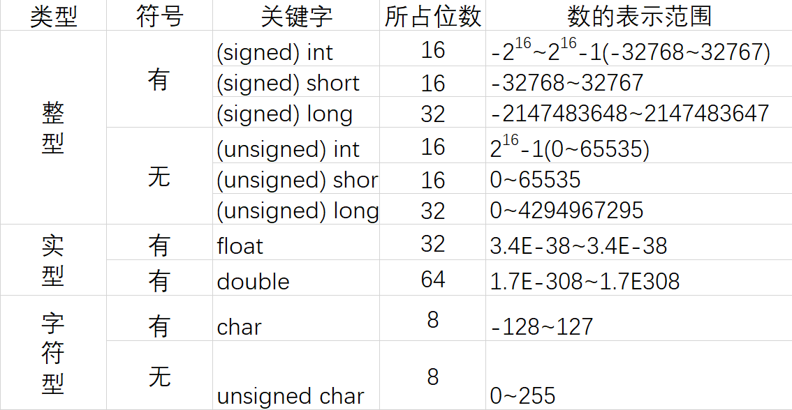
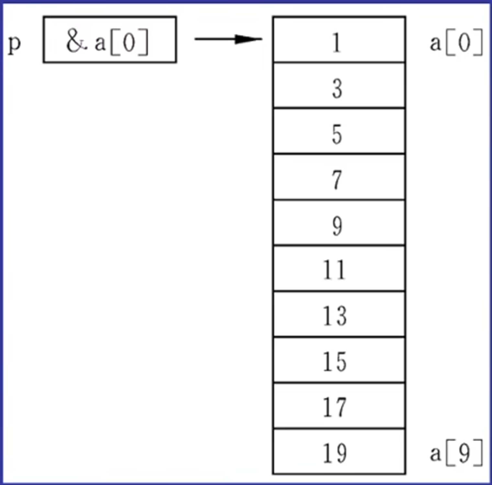

#  <span style="color:red;">32个关键字</span>

|  关键字  | 含义                         |  关键字  | 含义                       |
| :------: | :--------------------------- | :------: | -------------------------- |
|   auto   | 储存类别为自动变量           |   long   | 长整数                     |
|  break   | 终止switch或循环语句         |   main   | 主函数                     |
|   case   | 字符类型                     | register | 寄存器类型                 |
|   char   | 字符类型                     |  return  | 函数返回                   |
|  const   | 常量——“不变的”类型           |  short   | 短整数类型                 |
| continue | 中止循环的当次运行           |  signed  | 有符号的类型               |
| default  | switch语句的默认条件         |  sizeof  | 求类型、变量等的字节数     |
|    do    | 循环语句之一，需要while配合  |  static  | 储存类别为静态的           |
|  double  | 双精度实数类型               |  struct  | 结构体类型                 |
|   else   | if语句的条件为假时执行的部分 |  switch  | 多路分支语句，需要case配合 |
|   enum   | 枚举类型                     | typedef  | 类型别名定义               |
|  extern  | 说明函数、变量为外部的       |  union   | 共用体类型                 |
|  float   | 单精度实数类型               | unsigned | 无符号类型                 |
|   for    | 循环语句之一                 |   void   | “空“（无）类型             |
|   goto   | 转向语句，需要标号配合       | volatile | ”可变的“类型               |
|    if    | 根据条件的分支语句           |  while   | 循环语句之一               |
|   int    | 整数类型                     |          |                            |


# 标识符：（名字）

​	用户标识符：由字母（26个大小写字母）、数字（0-9）和下划线（"_"组成），不能以数字开头，区分大小写。

+ 用户标识符不能含有除字母、数字和下划线外的其他字符
+ 用户标识符不能和关键字重名


# C语言程序的结构

## 结构特点:

+ 函数与主函数
  + 程序由一个或多个函数组成
  + 必须有且只能有一个主函数main()
  + 程序执行从main开始,在main中结束
+ 程序语句
  + C程序由语句组成
  + 用" ; "作为语句终止符
+ 注释
  + /*       */为注释


# C程序运行步骤和方法




# 算法

## 什么是算法

### 一个程序应包括两个方面的内容:

+ 对数据组织的描述:
  + ==数据结构== 顺序存储(数组)和链式存储V

+ 对操作步骤的描述:
  + ==算法== 	穷举、迭代和递归，查找、添加、删除、改写
  + ==数据结构+算法=程序==

`所谓算法，是为解决一个问题而采取的方法和步骤。`

## 算法的特性

+ ==**有穷性**==：包含有限的操作步骤

+ ==**确定性**==：算法中的每一个步骤都应当是确定的

+ ==**有零个或多个输入**==：输入是指在执行算法时需要从外界取得必要的信息

+ ==**有一个或多个输出**==：算法的目的是为了求解, “解”就是输出

+ ==**有效性**==：算法中的每一个步骤都应当能有效地执行,并得到确定的结果,

# 基本数据类型

## C数据类型





### 有符号整数类型

| 类型                       | 名称         | 字节数 | 取值范围                                                     |
| -------------------------- | ------------ | ------ | ------------------------------------------------------------ |
| signed char                | 有符号字符型 | 1      | -2 ^7(-128) ~ 2 ^7 - 1<br />(127)                            |
| short int 或 short         | 短整型       | 2      | -2 ^15(-32 768) ~ 2 ^15 - 1<br />(32 767)                    |
| int                        | 整型         | 4      | -2 ^31(-2 147 483 648) ~<br /> 2 ^31 - 1(2 147 483 647)      |
| long int 或 long           | 长整型(早期) | 4      | -2 ^31(-2 147 483 648) ~ <br />2 ^31 - 1(2 147 483 647)      |
| long long int 或 long long | 长整型(现任) | 8      | -2 ^63(-9.223372036548e+18) ~ <br />2 ^63-1(9.2233720368548e+18) |

### 无符号整数类型

| 类型                                         | 名称               | 字节数 | 取值范围                              |
| -------------------------------------------- | ------------------ | ------ | ------------------------------------- |
| unsigned char                                | 无符号字符型       | 1      | 0 ~ 2 ^8 -1 <br />(255)               |
| unsigned short int 或 unsigned short         | 无符号短整型       | 2      | 0 ~ 2 ^16 -1<br />(65 535)            |
| unsigned int                                 | 无符号整型         | 4      | 0 ~ 2 ^32 -1<br />(4 294 967 295)     |
| unsigned long int 或 unsigned long           | 无符号长整形(早期) | 4      | 0 ~ 2 ^32 -1<br />(4 294 967 295)     |
| unsigned long long int 或 unsigned long long | 无符号长整形(现任) | 8      | 0 ~ 2 ^64-1<br />(1.844674407371e+19) |

### 浮点类型

| 类型        | 名称           | 字节数 | 取值范围                     |
| ----------- | -------------- | ------ | ---------------------------- |
| float       | 单精度浮点型   | 4      | -/+3.4e38(精确到6位小数)     |
| double      | 双精度浮点型   | 8      | -/+1.7e308(精确到15位小数)   |
| long double | 长双精度浮点型 | 12     | -/+1.19e4932(精确到18位小数) |

# 常量

## 定义：

程序运行时其值不能改变的量（即常量）

## 分类

+ 符号常量：用标识符代表常量
  + 定义格式： ==*#define 符号常量 常量*==

+ 直接常量：
  + 整型常量
  + 实型常量
  + 字符常量
  + 字符串常量

## 整型常量

### 三种形式

+ 十进制整数：由数字0~9和正负号表示。（123）
+ 八进制整数：由数字0开头，只有0~7.（012）
+ 十六进制整数：由0xx开头，有0~9，和  A~F( a~ f)。(0x12A)

## 实型常量（实数或浮点数）

### 表示形式：

+ 十进制小数形式：0.2
+ 指数形式：1.2E-3

##  字符常量

### 定义：

用*单引号*括起来的单个**普通字符**或**转义字符**

+ 常规字符：例如：'A'、'2'、'#'等

+ 转义字符：由一反斜杠'\\'后跟规定字符构成。

| 转义字符 | 含义                 | 转义字符 | 含义                  |
| -------- | -------------------- | -------- | --------------------- |
| \n       | 换行                 | \t       | 水平制表（八列）      |
| \v       | 垂直制表             | \b       | 退格                  |
| \r       | 回车                 | \f       | 换页                  |
| \a       | 响铃                 | \\       | 反斜杠                |
| \\'      | 单引号               | \\"      | 双引号                |
| \ddd     | 3位8进制数代表的字符 | \xhh     | 2位16进制数代表的字符 |

## 字符串常量

定义：

用*双引号*括起来的字符序列

存储：每个字符串尾**自动**加一个'\0'作为字符串结束标志

| 0    | 1    | 2    | 3    | 4    | 5    |
| ---- | ---- | ---- | ---- | ---- | ---- |
| 'C'  | 'h'  | 'i'  | 'n'  | 'a'  | '\0' |

# 变量

+ 概念：是指在程序运行期间值可以发生变化的量。
+ 作用：变量是一个存储数据的容器，即存储单元，它的功能就是用来存放程序中需要处理的数据。
+ 变量的基本操作：
  + 赋值
  + 取值
+ 变量的命名：遵守C语言标识符的命名规则。
+ 变量的使用原则：先定义后使用。

变量定义语句的一般形式为：==**类型识别符 变量名;**==

## 整型变量

+ 占字节数随机器不同而不同,一般占一个机器字
+ short (2B) <= int <= long (4B)
+ 可用sizeof (类型标识符) 测量

## 实型变量

+ float: 占4字节
+ double: 占8字节

## 字符型变量

+ 字符变量存放字符ASCII码
+ char与int数据间可进行算术运算

# 数据类型转换

## 强制类型转换符

+ 形式：(类型名) 表达式

(int) 2.2	=>2

(int) 5.5 / (int) 2.5	=>2

## 自动类型转换

设char w; int x; float y; double z; 则表达式w*x+z-y的值的类型是double.

# 运算符和表达式

## 算数运算符和算数表达式

+ 基本算数运算符：+ - * / %

+ 结合方向：从左到右
+ 优先级：+ - $\longrightarrow$  * / % $\longrightarrow$ + -
+ 说明："-"作为单目运算符时，右结合

**求余左右两边必须是整数： 5.5%2  $\textcolor{red}{\times}$**

## C语言运算符优先级

<table align="center" border="1" cellpadding="1" cellspacing="1" style="width:700px;">
    <tbody>
    <tr>
        <td style="text-align:center;width:81px;">优先级</td>
        <td style="text-align:center;width:457px;">运算符</td>
        <td style="text-align:center;width:110px;">说明</td>
        <td style="width:91px;">结合性</td>
    </tr>
    <tr>
        <td style="text-align:center;width:81px;">1</td>
        <td style="text-align:center;width:457px;"><span style="color:#fe2c24;">( )</span> <span style="color:#fe2c24;">[ ]</span>&nbsp;
            <span style="color:#fe2c24;">&nbsp;.</span>(成员选择(对象))&nbsp; &nbsp;<span
                    style="color:#fe2c24;"> &nbsp;-&gt;</span>(成员选择(指针))
        </td>
        <td style="text-align:center;width:110px;"></td>
        <td style="width:91px;">从左到右</td>
    </tr>
    <tr>
        <td style="text-align:center;width:81px;">2</td>
        <td style="text-align:center;width:457px;"><p><span style="color:#fe2c24;">&nbsp;&nbsp;&nbsp;&nbsp;&nbsp;&nbsp;&nbsp;&nbsp;&nbsp;！</span>(逻辑非运算符)<span
                style="color:#fe2c24;">&nbsp; &nbsp;+</span>(正)&nbsp;
            <span style="color:#fe2c24;">&nbsp;-</span>(负)&nbsp; &nbsp;<span style="color:#fe2c24;">~</span>&nbsp;
            &nbsp;<span style="color:#fe2c24;">++</span>&nbsp; &nbsp;<span style="color:#fe2c24;">--</span>&nbsp; <span
                    style="color:#fe2c24;">&nbsp;*</span><span style="color:#0d0016;">(取值运算符)&nbsp; </span>&nbsp; <span
                    style="color:#fe2c24;">&amp;</span><span style="color:#0d0016;">(取地址符)&nbsp; &nbsp;</span></p>
            <p><span style="color:#0d0016;">&nbsp;&nbsp;&nbsp;&nbsp;&nbsp;&nbsp;&nbsp;&nbsp;&nbsp;&nbsp;&nbsp;&nbsp;&nbsp;&nbsp;&nbsp;&nbsp;&nbsp;&nbsp;&nbsp;&nbsp;&nbsp;&nbsp;&nbsp;&nbsp;</span><span
                    style="color:#fe2c24;">sizeof</span><span style="color:#0d0016;">(</span>长度运算符<span
                    style="color:#0d0016;">)</span></p></td>
        <td style="text-align:center;width:110px;">单目运算符</td>
        <td style="width:91px;">从右到左</td>
    </tr>
    <tr>
        <td style="text-align:center;width:81px;">3</td>
        <td style="text-align:center;width:457px;"><span style="color:#fe2c24;">*</span>(乘)&nbsp; &nbsp; <span
                style="color:#fe2c24;">/</span>(除)&nbsp; <span style="color:#fe2c24;">&nbsp; %</span>(取余)
        </td>
        <td colspan="1" rowspan="10" style="text-align:center;width:110px;">双目运算符</td>
        <td style="width:91px;">从左到右</td>
    </tr>
    <tr>
        <td style="text-align:center;width:81px;">4</td>
        <td style="text-align:center;width:457px;"><span style="color:#fe2c24;">+</span>(加)&nbsp; &nbsp; &nbsp;
            &nbsp;<span style="color:#fe2c24;"> -</span>(减)
        </td>
        <td style="width:91px;">从左到右</td>
    </tr>
    <tr>
        <td style="text-align:center;width:81px;">5</td>
        <td style="text-align:center;width:457px;"><span style="color:#fe2c24;">&lt;&lt;</span>(左移)&nbsp; &nbsp;<span
                style="color:#fe2c24;"> &gt;&gt;</span>(右移)&nbsp; &nbsp;<span
                style="color:#fe2c24;"> &gt;&gt;&gt;</span></td>
        <td style="width:91px;">从左到右</td>
    </tr>
    <tr>
        <td style="text-align:center;width:81px;">6</td>
        <td style="text-align:center;width:457px;"><span style="color:#fe2c24;">&gt;</span>(大于)&nbsp; &nbsp; &nbsp;<span
                style="color:#fe2c24;">&gt;=</span>(大于等于)&nbsp; &nbsp; &nbsp;<span style="color:#fe2c24;">&lt;</span>(小于)&nbsp;
            &nbsp; &nbsp;<span style="color:#fe2c24;">&lt;=</span>(小于等于)
        </td>
        <td style="width:91px;">从左到右</td>
    </tr>
    <tr>
        <td style="text-align:center;width:81px;">7</td>
        <td style="text-align:center;width:457px;"><span style="color:#fe2c24;">==</span>(等于)&nbsp; &nbsp; &nbsp; &nbsp;<span
                style="color:#fe2c24;"> !=</span>(不等于)
        </td>
        <td style="width:91px;">从左到右</td>
    </tr>
    <tr>
        <td style="text-align:center;width:81px;">8</td>
        <td style="text-align:center;width:457px;"><span style="color:#fe2c24;">&amp;</span>(按位与)</td>
        <td style="width:91px;">从左到右</td>
    </tr>
    <tr>
        <td style="text-align:center;width:81px;">9</td>
        <td style="text-align:center;width:457px;"><span style="color:#fe2c24;">^</span>(按位异或)</td>
        <td style="width:91px;">从左到右</td>
    </tr>
    <tr>
        <td style="text-align:center;width:81px;">10</td>
        <td style="text-align:center;width:457px;"><span style="color:#fe2c24;">|</span>(按位或)</td>
        <td style="width:91px;">从左到右</td>
    </tr>
    <tr>
        <td style="text-align:center;width:81px;">11</td>
        <td style="text-align:center;width:457px;"><span style="color:#fe2c24;">&amp;&amp;</span>(逻辑与)</td>
        <td style="width:91px;">从左到右</td>
    </tr>
    <tr>
        <td style="text-align:center;width:81px;">12</td>
        <td style="text-align:center;width:457px;"><span style="color:#fe2c24;">||</span>(逻辑或)</td>
        <td style="width:91px;">从左到右</td>
    </tr>
    <tr>
        <td style="text-align:center;width:81px;">13</td>
        <td style="text-align:center;width:457px;"><span style="color:#fe2c24;">?:</span>(条件运算符)</td>
        <td style="text-align:center;width:110px;">三目运算符</td>
        <td style="width:91px;">从右到左</td>
    </tr>
    <tr>
        <td style="text-align:center;width:81px;">14</td>
        <td style="text-align:center;width:457px;"><span style="color:#fe2c24;">=</span>(赋值运算符)&nbsp; &nbsp; <span
                style="color:#fe2c24;">/=</span>(除后赋值)&nbsp; &nbsp;<span style="color:#fe2c24;"> *=</span>(乘后赋值)&nbsp;
            &nbsp; <span style="color:#fe2c24;">%=</span>(取余后赋值)&nbsp; &nbsp; <span style="color:#fe2c24;">+=</span>(加后赋值)&nbsp;
            &nbsp;<span style="color:#fe2c24;"> -=</span>(减后赋值)&nbsp; &nbsp; <span
                    style="color:#fe2c24;">&gt;&gt;=</span>(右移后赋值)&nbsp; &nbsp; <span
                    style="color:#fe2c24;">&lt;&lt;=</span>(左移后赋值)&nbsp; <span
                    style="color:#fe2c24;">&nbsp; &amp;=</span>(按位与后赋值)&nbsp; &nbsp; <span
                    style="color:#fe2c24;">|=</span>(按位或后赋值)&nbsp; &nbsp; <span style="color:#fe2c24;">^=</span>(按位异或后赋值)&nbsp;
            &nbsp;&nbsp;
        </td>
        <td style="text-align:center;width:110px;">复合运算符</td>
        <td style="width:91px;">从右到左</td>
    </tr>
    <tr>
        <td style="text-align:center;width:81px;">15</td>
        <td style="text-align:center;width:457px;"><span style="color:#fe2c24;">,</span>(逗号运算符)</td>
        <td style="text-align:center;width:110px;">从左向右顺序运算</td>
        <td style="width:91px;">从左到右</td>
    </tr>
    </tbody>
</table>


## 自增自减运算

### 运算符

自增( ++ )、自减( -- )

### 作用

自增运算符使单个变量的值增一，自减运算使单个变量的值减一

用法和运算规则

+ 前置运算：++i , --i

**<span style="color:red;">先增减、后运算</span>**

+ 后置运算：i++ , i++

**<span style="color:red;">先运算、后增减</span>**

## 逗号运算符和表达式

### 形式：

表达式1 <span style="color:red;">,</span> 表达式2 <span style="color:red;">,</span> ……表达式n

### 结合性：

从左到右

### 优先级：

最低

### 逗号表达式的值：

等于表达式n的值

### 例子：

| 表达式                                                       | 值               |
| ------------------------------------------------------------ | ---------------- |
| a=3*5,a\*4                                                   | a=15，60         |
| a=3*5,a\*4,a+5                                               | a=15，20         |
| x=(a=3,6*a)                                                  | x=18，18         |
| x=a=3,6*a                                                    | x=3，18          |
| a=1;b=2,c=3;<br />printf("%d,%d,%d",a,b,c);<br />printf("%d,%d,%d",(a,b,c),b,c); | 1,2,3<br />3,2,3 |

### 短路特性

逻辑表达式求解时，并非所有的逻辑运算符都被执行，只是在必须执行下一个逻辑运算符才能求出表达式的解时，才执行该运算符

+ 与&&：有假就是假
+ 或||：有真就是真

## 条件运算符与表达式

一般形式： expr1(条件) <span style="color:red;">?</span> exper2(真) <span style="color:red;">:</span> expr3(假)

例子：求a+|b|

​	`printf("a+|b|=%d\n,b>0?a+b:a-b");`

# 数据输入与输出

+ C语言无I/O语句，I/O操作由函数实现
+ #include <stdio.h>

## 数据输出

### （1）字符输出函数

+ 格式：<span style="color:red;font-weight:bolder;">putchar</span> (c)

+ 参数：c为*字符常量、变量、或表达式*

+ 功能：把字符c输出到显示器上

###  （2）格式输出函数

+ 格式：<span style="color:red;font-weight:bolder;">`printf("格式控制串",输出表)`</span>

+ 功能：按指定格式向显示器输出数据

+ 输出表：要输出的数据(可以没有，多个时以 ",” 分隔)

+ 格式控制串:包含两种信息

+ 格式说明： <span style="color:green;">%</span>[修饰符]格式字符，用于指定输出格式

+ 普通字符或转义序列：原样输出

+ 格式字符

  + | 修饰符 | 含义               | 例子                              | 输出值     |
    | ------ | ------------------ | --------------------------------- | ---------- |
    | d      | 十进制整数         | `int a=567;printf ("%d",a);`      | 567        |
    | x,X    | 十六进制无符号整数 | ` int a=255;printf(“%x",a);`      | ff         |
    | o      | 八进制无符号整数   | `int a=65;printf("%o",a);`        | 101        |
    | u      | 不带符号十进制整数 | `int a=567;printf(“%u",a);`       | 567        |
    | c      | 单一字符           | `char a=65;printf("%c",a);`       | A          |
    | s      | 字符串             | `printf(“%s","ABC");`             | ABC        |
    | f      | 小数形式浮点小数   | `float a=567.789;printf("%f",a);` | 567.789000 |

  + 说明

    + 格式字符要用小写
    + 格式字符与输出项个数应相同,按先后顺序一一对应
    + 输出转换：格式字符与输出项类型不一致，自动按指定格式输出

### 例子：

```c
int a=234;
printf("a=%d\n",a);//a=□234
pringf("a=%d\n",a);//a=234
/*
说明：
	1. 输出右对齐，左补空格
	2. 指定小于实际，原样输出
*/

float f=24.3567;
printf("f=%7.2f\n",f);//f=□□24.36
printf("f=%10.5f\n",f);//f=□□24.35670
/*
说明：%m.nf
	m 数据总长，n 小数位
	实际>n则四舍五入	实际<n则补零  
*/
	
int a=1,b=2;
printf("%d\n",(a,b));//2
printf("%d\n",a,b);//1
/*
说明：
	输出格式少于输出项，多余的输出项将不输出。
*/
```

## 数据输入

### （1）字符输入函数

格式：<span style="color:red;font-weight:bolder;">getchar</span>() 

功能：从键盘读一个字符

### （2）格式输入函数

格式：<span style="color:red;font-weight:bolder;">`scanf("格式控制串",地址表)`</span> 

功能：按指定格式从键盘读入数据，存入地址表指定的存储单元中，并按回车键结束

地址表：变量的地址，常用<span style="color:red;font-weight:bolder;">取地址运算符&</span> 

# 选择结构

## if语句

| 单分支if语句                                                 | 双分支if语句                                                 |
| ------------------------------------------------------------ | ------------------------------------------------------------ |
| 形式：<br /><span style="color:red;font-weight:bolder;">if(条件) 语句；</span> | 形式：<br /><span style="color:red;font-weight:bolder;">if(条件) 语句1;<br />else 语句2；</span> |

## switch语句

```c
switch(表达式){
    case 常量表达式1: 
        语句1;
        break;
    case 常量表达式2: 
        语句2;
        break;
        ……
    case 常量表达式n: 
        语句n;
        break;
    [default: 语句n+1]//其它，可有可无
}
```

# 循环结构

+ <span style="color:red;font-weight:bolder;">while</span> 语句
+ <span style="color:red;font-weight:bolder;">do~while</span> 语句
+ <span style="color:red;font-weight:bolder;">for</span> 语句

## while语句

### 一般形式：

```c
while(表达式)
    循环体语句;
```

### 执行流程：

```flow
st=>start: while
e=>end: 结束
comd=>condition: expr
op1=>operation: 循环体

st->comd(yes@真（非0）)->op1(left)->comd
comd(yes@真（非0）)->op1
comd(no@假（0）)->e 
op1@>comd({"stroke":"Red"})
```


### 特点：

先判断表达式，后执行循环体

## do~while语句

### 一般形式：

```c
do
    循环体语句;
while(表达式);
```

### 执行流程：

```flow
st=>start: do 
e=>end: 结束
op1=>operation: 循环体
comd=>condition: expr

st->op1->comd->e
comd(yes@真（非0）)->op1
comd(no@假（0）,bottom)->e 
comd@>op1({"stroke":"Red"})

```

### 特点：

先执行循环体，后判断表达式

## for语句

### 一般形式：

```c
for([expr1]:[expr2]:[expr3])
   循环体语句;
```

<span style="color:red;font-weight:bolder;">`for(循环变量赋初值;循环条件;循环变量增值)`</span>

### 执行流程：

```flow
st=>start: for
e=>end: 结束
op1=>operation: expr1
op2=>operation: 循环体
op3=>operation: expr3
comd=>condition: expr2

st->op1->comd->op2->op3(left)->comd
comd(yes@真（非0）)->op2
comd(no@假（0）)->e 
op3(left)@>comd({"stroke":"Red"})
```

## break与continue

### break语句

+ break语句可以用来从循环体内跳出循环体，即提前结束循环，接着执行循环下面的语句
+ 一般形式：`break;`
+ <span style="color:red;font-weight:bolder;">注意：</span>
  + break语句不能用于<span style="text-decoration: underline">循环语句和switch语句</span>之外的任何其他语句中。

### continue语句

+ 作用为结束本次循环，即跳过循环体中下面尚未执行的语句，接着进行下一次是否执行循环的判定

+ 一般形式：`continue;`

# 数组的应用

## 一维数组的定义和引用

数组：是一组具有<span style="color:red;font-weight:bolder;">相同数据类型</span>的数据的<span style="color:aqua;font-weight:bolder;">有序集合</span>

### 一维数组的定义格式为：

<span style="color:red;font-weight:bolder;">类型说明符 数组名 [常量表达式]</span>

例如：`int a [10];`

​	它表示定义了一个整型数组，数组名为a，此数组有10个元素。

### 一维数组的引用

#### 数组元素的引用方式：

<span style="color:red;font-weight:bolder;">数组名[下标]</span>

下标可以是整型常量或整型表达式

#### 一维数组的初始化

#### （1）在定义数组是对数组元素赋初值

例如：`int a[10]={0,1,2,3,4,5,6,7,8,9};`

#### （2）可以只给一部分元素赋值

例如：`int a[10]={0,1,2,3};`

<span style="color:red;">没有赋值的元素默认是0</span>

#### （3）在对全部元素赋初值时，由于数据的个数已经确定，因此可以不指定数组长度

例如：`int a[5]={1,2,3,4,5};`

也可以写成`int a[]={1,2,3,4,5};`

## 二维数组的定义和引用

### 二维数组的定义

<span style="color:red;font-weight:bolder;">类型说明符 数组名 [常量表达式] [常量表达式]</span>

例如：

定义a为3*4（三行四列）的数组，b为5*10（五行十列）的数组

如下：

`float a[3][4],b[5][10];`

### 二位数组的引用

#### 二位数组元素的表示形式为：

<span style="color:red;font-weight:bolder;">数组名 [下标] [下标]</span>

例如：a [2] [3]

下标可以是整型表达式，如a [2-1] [2*2-1]

### 二位数组的初始化

#### （1）分行给二维数组赋初值

`int a [3] [4] ={{1,2,3,4},{5,6,7,8}};`

#### （2）可以将所有的数据写在一个花括号内，按数组排列的顺序对各元素赋初值。

`int a [2] [4] ={0,1,2,3,4,5,6,7,8,9};`

#### （3）可以对部分元素赋初值

`int a [3] [3] ={{1},{4},{7}};`

#### （4）如果对全部元素都赋初值，这定义数组时对第一维的长度可以不指定，但第二维的长度不能省

`int a[] [4]={0,1,2,3,4,5,6,7,8,9,10,11};`

## 字符数组

### 字符数组的定义

用来存放字符数据的数组是字符数组。字符数组中的一个元素存放一个字符。

```c
char c [5];
c[0]='C';
c[1]='H';
c[3]='I';
c[4]='N';
c[5]='A';
```

### 字符数组的初始化

对字符数组初始化，可以逐个字符赋给数组中的各元素

1. `char c[10] = {'t','','a','n','','0','0','','x','u'};`

2. `char c[15] = {'t','','a','n','','0','0','','x','u'};`

3. `char c[] = {'t','','a','n','','0','0','','x','u'};`
4. `char c[5] = {'t','','a','n','','0','0','','x','u'};` $\textcolor{red}{\times}$不可以定义少，赋值多

+ <span style="color:red;font-weight:bolder;">只定义未赋值会是随机值。如：`char [5];`</span>

+ <span style="color:red;font-weight:bolder;">给部分元素赋值了，剩下的默认是'\0'，如：2</span>

## 字符串和字符串结束标志

C语言规定了字符串结束标志，以字符 ' <span style="color:red;font-weight:bolder;">\0</span> '作为标志。可以用字符串常量来使字符数组初始化。

例如：

```c
char c []= {"China"};//char c[6]
char c []= "China";//char c[6]
char c []= {'C','h','i','n','a','\0'};//char c[6]
char c [10] ={"China"};//char c[10]，有5个\0
```

### 字符数组的输入和输出

利用scanf和pringtf函数

+ <span style="color:red;font-weight:bolder;">如果字符串中包含多个\0，那么字符串输出在第一个\0处就截止</span>

  + 例如：

    + ```c
      char c [5] = {'a', 'b','\0','c','d','\0'};
      printf("%s\n",c);
      //输出
      ab
      ```

###  字符串输入输出函数

+ <span style="color:red;font-weight:bolder;">gets</span>

+ <span style="color:red;font-weight:bolder;">puts</span>

### 字符串处理函数

#### （1）<span style="color:red;font-weight:bolder;">strcat函数——连接</span>

```c
char s[20]="ABC";
char t[20]="DEF";
strcat(s,t);
printf("%s,%s\n",s,t);
//输出结果
ABCDEF,DEF
```

#### （2）<span style="color:red;font-weight:bolder;">strcpy函数——复制</span>

```c
char s[20]="ABC";
char t[20]="DEF";
strcpy(s,t);
printf("%s,%s\n",s,t);
//输出结果
DEF,DEF
```

#### （3）<span style="color:red;font-weight:bolder;">strcmp函数——比较</span>

+ 如果字符串1=字符串2，函数值为0
+ 如果字符串1>字符串2，函数值为一正整数
+ 如果字符串1<字符串2，函数值为一负整数

```c
strcmp("ABC","ABC");//0
strcmp("ABC","ABB");//1
strcmp("ABC","ACB");//-1
```

<span style="color:red;font-weight:bolder;">逐个字符进行比较，只要不相等就停下</span>

#### （4）<span style="color:red;font-weight:bolder;">strlen函数——长度</span>

strlen是测试字符串长度的函数。函数的值为字符串中的实际长度（不包括'\0'在内）

```c
char str [10] ={"China"};
printf("%d",strlen(str));
//输出结果
5
```

#### （5）<span style="color:red;font-weight:bolder;">strlwr——小写</span>

一般形式：`strlwr(字符串)`

strlwr函数的作用是将字符串中的大写字母换成小写字母。

#### （6）<span style="color:red;font-weight:bolder;">strupr函数——大写</span>

一般形式：`strupr(字符串)`

strlwr函数的作用是将字符串中的小写字母换成大写字母。

# 函数

## 函数的定义

### 无参函数

```c
类型标识符 函数名()
{
	声明部分
    语句部分
}
```

### 有参函数

```c
类型标识符 函数名(形式参数列表)
{
	声明部分
    语句部分
}
```

### 空函数

```c
类型标识符 函数名()
{
}
```

## 函数调用

### 函数调用的形式

1. <span style="color:aqua;font-weight:bolder;">语句调用</span>
   + 例如: `fun(a,b);`
2. <span style="color:aqua;font-weight:bolder;">表达式调用</span>
   + 例如: `y=fun(x);`
3. <span style="color:aqua;font-weight:bolder;">参数调用</span>
   + 将函数的返回值作为实参进行调用,称为函数的参数调用

## 函数参数和函数的值

<span style="color:red;font-weight:bolder;">形式参数</span>：在定义函数时函数名后面括弧中的变量名，简称<span style="color:red;font-weight:bolder;">形参</span>，作用是<span style="color:aqua;font-weight:bolder;text-decoration:underline;">接收</span>传来的数据。

<span style="color:red;font-weight:bolder;">实际参数</span>：在主调函数中调用一个函数时,函数名后面括弧中的参数(可以是一个表达式)，简称<span style="color:red;font-weight:bolder;">实参</span>。

<span style="color:red;font-weight:bolder;">函数返回值</span>：<span style="color:aqua;font-weight:bolder;text-decoration:underline;">return</span>后面表达式的值。

<span style="color:red;font-weight:bolder;">函数返回值类型</span>：定义函数时的类型。

### 关于形参和实参的说明：

1. 形参须单独定义，属于临时变量，调用函数时为其分配存储单元，函数调用结束后释放其存储单元。
2. 实参可以是常量、变量或表达式。
3. 实参的类型可以与形参类型不一致，以形参的类型为准。
4. 实参向对形参的数据传递是“<span style="color: aqua;font-weight:bolder;text-decoration:underline;">值传递</span>”,<span style="color: aqua;font-weight:bolder;text-decoration:underline;">单向</span>传递，只由实参传给形参，而不能由形参传回来给实参。
5. 实参与形参各占用独立的存储单元。

### 关于返回值的说明：

1. 如果需要从被调用函数带回一个函数值供主调函数使用，被调用函数中必须包含return语句。如果不需要从被调用函数带回函数值可以不要return语句。
2. 一个函数中可以有一个以上的return语句，执行到哪一个return语句，哪一个语句起作用。return语句后面的括弧也可以不要。
3. 对于不带回值的函数，应当用"void”定义函数为“无类型”(或称“空类型”)。这样，系统就保证不使函数带回任何值，即禁止在调用函数中使用被调用函数的返回值。此时在函数体中不得出现return语句。

## 函数声明

声明的作用：是把函数名、函数参数的个数和参数类型等信息通知编译系统，以便在遇到函数调用时，编译系统能正确识别函数并检查调用是否合法。如果被调用函数的定义出现在主调函数之前可以不必加以声明。

## 函数的嵌套调用

C语言<span style="color:red;font-weight:bolder;">不能嵌套定义</span>函数（嵌套定义就是在定义一个函数时，其函数体内又包含另一个函数的完整定义），但<span style="color:red;font-weight:bolder;">可以嵌套调用函数</span>，也就是说，在调用一个函数的过程中，又调用另一个函数。

## 函数的递归调用

在调用一个函数的过程中又出现<span style="color:red;font-weight:bolder;">直接</span>或<span style="color:red;font-weight:bolder;">间接</span>地调用该函数本身，称为函数的递归调用。

## 局部变量和全局变量

<span style="color:red;font-weight:bolder;">局部变量</span>：所有*函数内部、复合语句内部*定义的变量都是局部变量。仅仅在其所属的范围有效。

<span style="color:red;font-weight:bolder;">全局变量</span>：在所有*函数外面*定义的变量是全局变量，他的作用范围是从定义开始直至源文件结束。

<span style="color:red;font-weight:bolder;">全局变量和局部变量可以同名，当全局变量和局部变量都出现时，优先局部变量</span>

## 变量的存储类别

存储方式分为两大类：<span style="color:red;font-weight:bolder;">静态</span>存储类和<span style="color:red;font-weight:bolder;">动态</span>存储类。

具体包含四种:

1. <span style="color:red;font-weight:bolder;">自动</span>的(auto)
2. <span style="color:red;font-weight:bolder;">静态</span>的(static)
3. 寄存器的(register)
4. 外部的(extern)

### 静态局部变量

静态(<span style="color:red;font-weight:bolder;">static</span>)局部变量的初值在<span style="color: aqua;font-weight:bolder;">编译</span>时赋予,在整个程序运行期间存在。其作用域仍然只限于定义它的函数,其他函数不能引用。

```c
int fun(int n){
    static int s = 2;
    s+=n;
    return s;
}
int main(){
    int x=2;
    printf("%d\n",fun(x));
    printf("%d\n",fun(x));
}
//输出结果
4
6
```

# 指针

## 指针与变量

### （1）指针的概念

一个变量的<span style="color:red;font-weight:bolder;">地址</span>称为该变量的指针。

### （2）指针的定义

类型名 <span style="color:red;font-weight:bolder;">*</span>指针变量名;

`int *p;`

### （3）指针的赋值

1. 通过取地址运算符：

   ```c
   int a, *p;
   p=&a;
   ```

2. 通过另一个指针

   ```c
   int a, *p, *q;
   p=&a;
   q=p;
   ```

3. 空指针的定义

   `int *p = NULL;`

### （4）函数之间的地址传递

```c
void fun(int *x, int *y){
    *X+=*y;
    *y+=*x;
}
main(){
    int a =3,b=5;
    fun(&a,&b);
    printf("%d,%d\n",a,b);
}
//输出结果
8,13
```

#### 例子：

交换内容

```c
int a,b,*p,*q,t;
p=&a; q=&b;
scanf("%d%d",p,q);
t=*p; *p=*q; *q=t;
printf("%d,%d\n",*p,*q);
//输出结果
5,3
```

交换地址

```c
int a,b,*p,*q,t;
p=&a; q=&b;
scanf("%d%d",p,q);
t=p; p=q; q=t;
printf("%d,%d\n",*p,*q);
//输出结果
5,3
```

+ 交换内容，地址不变；（有*号）

+ 交换地址，内容不变；

## 指针与一维数组

### （1）指向数组元素的指针

```c
int a[10];
int *p;
p=&a[0];
```



### （2）通过指针引用数组元素

1. 下标法，如<span style="color:red;font-weight:bolder;">a[ i ]</span>形式
2. 指针法，如<span style="color:red;font-weight:bolder;">* (a + i)</span>或* (p + i)。
   + 其中a是数组名，p是指向数组元素的指针变量，其初值p=a。
     + <span style="color:red;font-weight:bolder;">数组名</span>代表<span style="color:red;font-weight:bolder;">首地址</span>，及第0个地址。<span style="color: aqua;font-weight:bolder;">&a[0]</span>

###   （3）数组名做函数参数

```c
int fun(int b[], int n){
    int i,s=0;
    for(i=0;i<n;i+=2){
        s+=b[i];
    }
    return s;
}
main(){
    int a[]={1,,2,3,4,5},s;
    s=fun(a,5);//a == &a[0]
    printf("%d\n",s);
}
```

## 指针与二维数组

### （1）二维数组的地址

`int a[3][4];`

 说明，a是二维数组名，即二维数组的首地址，第0行的地址。

+ `*(a+1)+2`：第一行第二列的地址
+ `*(*(a+2)+3)`：第二行第三列的内容

+ `a[1]+2`：第一行第二列的地址
+ `*(a[2]+3)`：第二行第三列的内容

### （2）引用二维数组元素

#### 二维数组a引用的四种形式

1. <span style="color:red;font-weight:bolder;">a[i]\[j]</span>
2. <span style="color:red;font-weight:bolder;">*(\*(a+i)+j)</span>
3. <span style="color:red;font-weight:bolder;">*(a[i]+j)</span>
4. <span style="color:red;font-weight:bolder;">(*(a+i))[j]</span>

##### 例子：

`int a[2][3]={1,2,3,4,5,6};`

*(\*(a+1)+2)=<span style="text-decoration: underline;text-decoration-color: aqua">     6     </span> , *(a[0]+2)=<span style="text-decoration: underline;text-decoration-color: aqua">     3     </span> ,

*(\*a+1)=<span style="text-decoration: underline;text-decoration-color: aqua">     2     </span> , *(a[1]+1)=<span style="text-decoration: underline;text-decoration-color: aqua">     5     </span> .

### （3）指向二维数组的指针

```c
int a[2][3]={1,2,3,4,5,6},*p;
int m,s;
p=&a[0][0];
m=(*p)*(*(p+2))*(*(p+4));//m==1*3*5==15
s=p[1]+p[3]+p[5];//2+4+6==12
```

## 指针与字符串

### （1）字符串指针的定义

`char *p;`

### （2）字符串指针的赋值

`char *p="ABCD";` 

把字符串的首地址给到p，即字符串ABCD的A的地址

1. `char s[]="ABCD",*p=s;`

   则*(p+4)的值为<span style="text-decoration: underline;text-decoration-color: aqua">  0 </span> 。

2. 有如下说明`char s[8]="distance"; char *p=s;`

   则*(p+2)的值为<span style="text-decoration: underline;text-decoration-color: aqua">  s  </span> 。

3. 在C语句中`char s[8]="glister"; char *p=s; `

   则*(p+4)的值为<span style="text-decoration: underline;text-decoration-color: aqua">  t  </span> 。

## 指针数组和数组指针

### （1）数组指针

<span style="color:red;font-weight:bolder;">`int (*p)[4];`</span>

说明：p是类型为int型<span style="color: aqua;font-weight:bolder;">数组的指针</span>。改数组长度为4.

### （2）指针数组

<span style="color:red;font-weight:bolder;">`int *q[3];`</span>

