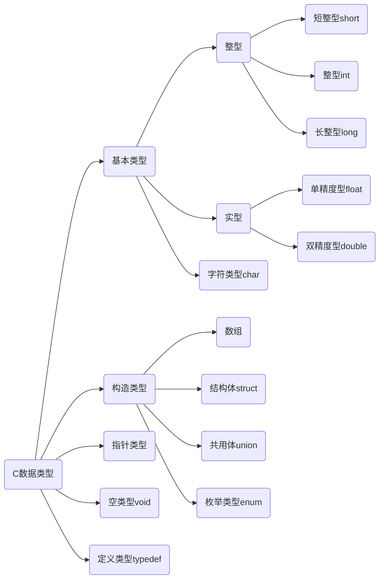

#  32个关键字

|  关键字  | 含义                         |  关键字  | 含义                       |
| :------: | :--------------------------- | :------: | -------------------------- |
|   auto   | 储存类别为自动变量           |   long   | 长整数                     |
|  break   | 终止switch或循环语句         |   main   | 主函数                     |
|   case   | 字符类型                     | register | 寄存器类型                 |
|   char   | 字符类型                     |  return  | 函数返回                   |
|  const   | 常量——“不变的”类型           |  short   | 短整数类型                 |
| continue | 中止循环的当次运行           |  signed  | 有符号的类型               |
| default  | switch语句的默认条件         |  sizeof  | 求类型、变量等的字节数     |
|    do    | 循环语句之一，需要while配合  |  static  | 储存类别为静态的           |
|  double  | 双精度实数类型               |  struct  | 结构体类型                 |
|   else   | if语句的条件为假时执行的部分 |  switch  | 多路分支语句，需要case配合 |
|   enum   | 枚举类型                     | typedef  | 类型别名定义               |
|  extern  | 说明函数、变量为外部的       |  union   | 共用体类型                 |
|  float   | 单精度实数类型               | unsigned | 无符号类型                 |
|   for    | 循环语句之一                 |   void   | “空“（无）类型             |
|   goto   | 转向语句，需要标号配合       | volatile | ”可变的“类型               |
|    if    | 根据条件的分支语句           |  while   | 循环语句之一               |
|   int    | 整数类型                     |          |                            |


# 标识符：（名字）

​	用户标识符：由字母（26个大小写字母）、数字（0-9）和下划线（"_"组成），不能以数字开头，区分大小写。

+ 用户标识符不能含有除字母、数字和下划线外的其他字符
+ 用户标识符不能和关键字重名


# C语言程序的结构

## 结构特点:

+ 函数与主函数
  + 程序由一个或多个函数组成
  + 必须有且只能有一个主函数main()
  + 程序执行从main开始,在main中结束
+ 程序语句
  + C程序由语句组成
  + 用" ; "作为语句终止符
+ 注释
  + /*       */为注释


# C程序运行步骤和方法


# 算法

## 什么是算法

### 一个程序应包括两个方面的内容:

+ 对数据组织的描述:
  + ==数据结构== 顺序存储(数组)和链式存储V

+ 对操作步骤的描述:
  + ==算法== 	穷举、迭代和递归，查找、添加、删除、改写
  + ==数据结构+算法=程序==

`所谓算法，是为解决一个问题而采取的方法和步骤。`

## 算法的特性

+ ==**有穷性**==：包含有限的操作步骤

+ ==**确定性**==：算法中的每一个步骤都应当是确定的

+ ==**有零个或多个输入**==：输入是指在执行算法时需要从外界取得必要的信息

+ ==**有一个或多个输出**==：算法的目的是为了求解, “解”就是输出

+ ==**有效性**==：算法中的每一个步骤都应当能有效地执行,并得到确定的结果,

# 基本数据类型

## C数据类型




### 有符号整数类型

| 类型                       | 名称         | 字节数 | 取值范围                                                     |
| -------------------------- | ------------ | ------ | ------------------------------------------------------------ |
| signed char                | 有符号字符型 | 1      | -2 ^7(-128) ~ 2 ^7 - 1<br />(127)                            |
| short int 或 short         | 短整型       | 2      | -2 ^15(-32 768) ~ 2 ^15 - 1<br />(32 767)                    |
| int                        | 整型         | 4      | -2 ^31(-2 147 483 648) ~<br /> 2 ^31 - 1(2 147 483 647)      |
| long int 或 long           | 长整型(早期) | 4      | -2 ^31(-2 147 483 648) ~ <br />2 ^31 - 1(2 147 483 647)      |
| long long int 或 long long | 长整型(现任) | 8      | -2 ^63(-9.223372036548e+18) ~ <br />2 ^63-1(9.2233720368548e+18) |

### 无符号整数类型

| 类型                                         | 名称               | 字节数 | 取值范围                              |
| -------------------------------------------- | ------------------ | ------ | ------------------------------------- |
| unsigned char                                | 无符号字符型       | 1      | 0 ~ 2 ^8 -1 <br />(255)               |
| unsigned short int 或 unsigned short         | 无符号短整型       | 2      | 0 ~ 2 ^16 -1<br />(65 535)            |
| unsigned int                                 | 无符号整型         | 4      | 0 ~ 2 ^32 -1<br />(4 294 967 295)     |
| unsigned long int 或 unsigned long           | 无符号长整形(早期) | 4      | 0 ~ 2 ^32 -1<br />(4 294 967 295)     |
| unsigned long long int 或 unsigned long long | 无符号长整形(现任) | 8      | 0 ~ 2 ^64-1<br />(1.844674407371e+19) |

### 浮点类型

| 类型        | 名称           | 字节数 | 取值范围                     |
| ----------- | -------------- | ------ | ---------------------------- |
| float       | 单精度浮点型   | 4      | -/+3.4e38(精确到6位小数)     |
| double      | 双精度浮点型   | 8      | -/+1.7e308(精确到15位小数)   |
| long double | 长双精度浮点型 | 12     | -/+1.19e4932(精确到18位小数) |

# 常量

## 定义：

程序运行时其值不能改变的量（即常量）

## 分类

+ 符号常量：用标识符代表常量
  + 定义格式： ==*#define 符号常量 常量*==

+ 直接常量：
  + 整型常量
  + 实型常量
  + 字符常量
  + 字符串常量

## 整型常量

### 三种形式

+ 十进制整数：由数字0~9和正负号表示。（123）
+ 八进制整数：由数字0开头，只有0~7.（012）
+ 十六进制整数：由0xx开头，有0~9，和  A~F( a~ f)。(0x12A)

## 实型常量（实数或浮点数）

### 表示形式：

+ 十进制小数形式：0.2
+ 指数形式：1.2E-3

##  字符常量

### 定义：

用*单引号*括起来的单个**普通字符**或**转义字符**

+ 常规字符：例如：'A'、'2'、'#'等

+ 转义字符：由一反斜杠'\\'后跟规定字符构成。

| 转义字符 | 含义                 | 转义字符 | 含义                  |
| -------- | -------------------- | -------- | --------------------- |
| \n       | 换行                 | \t       | 水平制表（八列）      |
| \v       | 垂直制表             | \b       | 退格                  |
| \r       | 回车                 | \f       | 换页                  |
| \a       | 响铃                 | \\       | 反斜杠                |
| \\'      | 单引号               | \\"      | 双引号                |
| \ddd     | 3位8进制数代表的字符 | \xhh     | 2位16进制数代表的字符 |

## 字符串常量

定义：

用*双引号*括起来的字符序列

存储：每个字符串尾**自动**加一个'\0'作为字符串结束标志

| 0    | 1    | 2    | 3    | 4    | 5    |
| ---- | ---- | ---- | ---- | ---- | ---- |
| 'C'  | 'h'  | 'i'  | 'n'  | 'a'  | '\0' |

# 变量

+ 概念：是指在程序运行期间值可以发生变化的量。
+ 作用：变量是一个存储数据的容器，即存储单元，它的功能就是用来存放程序中需要处理的数据。
+ 变量的基本操作：
  + 赋值
  + 取值
+ 变量的命名：遵守C语言标识符的命名规则。
+ 变量的使用原则：先定义后使用。

变量定义语句的一般形式为：==**类型识别符 变量名;**==

## 整型变量

+ 占字节数随机器不同而不同,一般占一个机器字
+ short (2B) <= int <= long (4B)
+ 可用sizeof (类型标识符) 测量

## 实型变量

+ float: 占4字节
+ double: 占8字节

## 字符型变量

+ 字符变量存放字符ASCII码
+ char与int数据间可进行算术运算

# 数据类型转换

## 强制类型转换符

+ 形式：(类型名) 表达式

(int) 2.2	=>2

(int) 5.5 / (int) 2.5	=>2

## 自动类型转换

设char w; int x; float y; double z; 则表达式w*x+z-y的值的类型是double.

# 运算符和表达式

## 算数运算符和算数表达式

+ 基本算数运算符：+ - * / %

+ 结合方向：从左到右
+ 优先级：+ - $\longrightarrow$  * / % $\longrightarrow$ + -
+ 说明："-"作为单目运算符时，右结合

**求余左右两边必须是整数： ==5.5%2  $\textcolor{red}{\times}$==**

## C语言运算符优先级

<table align="center" border="1" cellpadding="1" cellspacing="1" style="width:700px;">
    <tbody>
    <tr>
        <td style="text-align:center;width:81px;">优先级</td>
        <td style="text-align:center;width:457px;">运算符</td>
        <td style="text-align:center;width:110px;">说明</td>
        <td style="width:91px;">结合性</td>
    </tr>
    <tr>
        <td style="text-align:center;width:81px;">1</td>
        <td style="text-align:center;width:457px;"><span style="color:#fe2c24;">( )</span> <span style="color:#fe2c24;">[ ]</span>&nbsp;
            <span style="color:#fe2c24;">&nbsp;.</span>(成员选择(对象))&nbsp; &nbsp;<span
                    style="color:#fe2c24;"> &nbsp;-&gt;</span>(成员选择(指针))
        </td>
        <td style="text-align:center;width:110px;"></td>
        <td style="width:91px;">从左到右</td>
    </tr>
    <tr>
        <td style="text-align:center;width:81px;">2</td>
        <td style="text-align:center;width:457px;"><p><span style="color:#fe2c24;">&nbsp;&nbsp;&nbsp;&nbsp;&nbsp;&nbsp;&nbsp;&nbsp;&nbsp;！</span>(逻辑非运算符)<span
                style="color:#fe2c24;">&nbsp; &nbsp;+</span>(正)&nbsp;
            <span style="color:#fe2c24;">&nbsp;-</span>(负)&nbsp; &nbsp;<span style="color:#fe2c24;">~</span>&nbsp;
            &nbsp;<span style="color:#fe2c24;">++</span>&nbsp; &nbsp;<span style="color:#fe2c24;">--</span>&nbsp; <span
                    style="color:#fe2c24;">&nbsp;*</span><span style="color:#0d0016;">(取值运算符)&nbsp; </span>&nbsp; <span
                    style="color:#fe2c24;">&amp;</span><span style="color:#0d0016;">(取地址符)&nbsp; &nbsp;</span></p>
            <p><span style="color:#0d0016;">&nbsp;&nbsp;&nbsp;&nbsp;&nbsp;&nbsp;&nbsp;&nbsp;&nbsp;&nbsp;&nbsp;&nbsp;&nbsp;&nbsp;&nbsp;&nbsp;&nbsp;&nbsp;&nbsp;&nbsp;&nbsp;&nbsp;&nbsp;&nbsp;</span><span
                    style="color:#fe2c24;">sizeof</span><span style="color:#0d0016;">(</span>长度运算符<span
                    style="color:#0d0016;">)</span></p></td>
        <td style="text-align:center;width:110px;">单目运算符</td>
        <td style="width:91px;">从右到左</td>
    </tr>
    <tr>
        <td style="text-align:center;width:81px;">3</td>
        <td style="text-align:center;width:457px;"><span style="color:#fe2c24;">*</span>(乘)&nbsp; &nbsp; <span
                style="color:#fe2c24;">/</span>(除)&nbsp; <span style="color:#fe2c24;">&nbsp; %</span>(取余)
        </td>
        <td colspan="1" rowspan="10" style="text-align:center;width:110px;">双目运算符</td>
        <td style="width:91px;">从左到右</td>
    </tr>
    <tr>
        <td style="text-align:center;width:81px;">4</td>
        <td style="text-align:center;width:457px;"><span style="color:#fe2c24;">+</span>(加)&nbsp; &nbsp; &nbsp;
            &nbsp;<span style="color:#fe2c24;"> -</span>(减)
        </td>
        <td style="width:91px;">从左到右</td>
    </tr>
    <tr>
        <td style="text-align:center;width:81px;">5</td>
        <td style="text-align:center;width:457px;"><span style="color:#fe2c24;">&lt;&lt;</span>(左移)&nbsp; &nbsp;<span
                style="color:#fe2c24;"> &gt;&gt;</span>(右移)&nbsp; &nbsp;<span
                style="color:#fe2c24;"> &gt;&gt;&gt;</span></td>
        <td style="width:91px;">从左到右</td>
    </tr>
    <tr>
        <td style="text-align:center;width:81px;">6</td>
        <td style="text-align:center;width:457px;"><span style="color:#fe2c24;">&gt;</span>(大于)&nbsp; &nbsp; &nbsp;<span
                style="color:#fe2c24;">&gt;=</span>(大于等于)&nbsp; &nbsp; &nbsp;<span style="color:#fe2c24;">&lt;</span>(小于)&nbsp;
            &nbsp; &nbsp;<span style="color:#fe2c24;">&lt;=</span>(小于等于)
        </td>
        <td style="width:91px;">从左到右</td>
    </tr>
    <tr>
        <td style="text-align:center;width:81px;">7</td>
        <td style="text-align:center;width:457px;"><span style="color:#fe2c24;">==</span>(等于)&nbsp; &nbsp; &nbsp; &nbsp;<span
                style="color:#fe2c24;"> !=</span>(不等于)
        </td>
        <td style="width:91px;">从左到右</td>
    </tr>
    <tr>
        <td style="text-align:center;width:81px;">8</td>
        <td style="text-align:center;width:457px;"><span style="color:#fe2c24;">&amp;</span>(按位与)</td>
        <td style="width:91px;">从左到右</td>
    </tr>
    <tr>
        <td style="text-align:center;width:81px;">9</td>
        <td style="text-align:center;width:457px;"><span style="color:#fe2c24;">^</span>(按位异或)</td>
        <td style="width:91px;">从左到右</td>
    </tr>
    <tr>
        <td style="text-align:center;width:81px;">10</td>
        <td style="text-align:center;width:457px;"><span style="color:#fe2c24;">|</span>(按位或)</td>
        <td style="width:91px;">从左到右</td>
    </tr>
    <tr>
        <td style="text-align:center;width:81px;">11</td>
        <td style="text-align:center;width:457px;"><span style="color:#fe2c24;">&amp;&amp;</span>(逻辑与)</td>
        <td style="width:91px;">从左到右</td>
    </tr>
    <tr>
        <td style="text-align:center;width:81px;">12</td>
        <td style="text-align:center;width:457px;"><span style="color:#fe2c24;">||</span>(逻辑或)</td>
        <td style="width:91px;">从左到右</td>
    </tr>
    <tr>
        <td style="text-align:center;width:81px;">13</td>
        <td style="text-align:center;width:457px;"><span style="color:#fe2c24;">?:</span>(条件运算符)</td>
        <td style="text-align:center;width:110px;">三目运算符</td>
        <td style="width:91px;">从右到左</td>
    </tr>
    <tr>
        <td style="text-align:center;width:81px;">14</td>
        <td style="text-align:center;width:457px;"><span style="color:#fe2c24;">=</span>(赋值运算符)&nbsp; &nbsp; <span
                style="color:#fe2c24;">/=</span>(除后赋值)&nbsp; &nbsp;<span style="color:#fe2c24;"> *=</span>(乘后赋值)&nbsp;
            &nbsp; <span style="color:#fe2c24;">%=</span>(取余后赋值)&nbsp; &nbsp; <span style="color:#fe2c24;">+=</span>(加后赋值)&nbsp;
            &nbsp;<span style="color:#fe2c24;"> -=</span>(减后赋值)&nbsp; &nbsp; <span
                    style="color:#fe2c24;">&gt;&gt;=</span>(右移后赋值)&nbsp; &nbsp; <span
                    style="color:#fe2c24;">&lt;&lt;=</span>(左移后赋值)&nbsp; <span
                    style="color:#fe2c24;">&nbsp; &amp;=</span>(按位与后赋值)&nbsp; &nbsp; <span
                    style="color:#fe2c24;">|=</span>(按位或后赋值)&nbsp; &nbsp; <span style="color:#fe2c24;">^=</span>(按位异或后赋值)&nbsp;
            &nbsp;&nbsp;
        </td>
        <td style="text-align:center;width:110px;">复合运算符</td>
        <td style="width:91px;">从右到左</td>
    </tr>
    <tr>
        <td style="text-align:center;width:81px;">15</td>
        <td style="text-align:center;width:457px;"><span style="color:#fe2c24;">,</span>(逗号运算符)</td>
        <td style="text-align:center;width:110px;">从左向右顺序运算</td>
        <td style="width:91px;">从左到右</td>
    </tr>
    </tbody>
</table>


## 自增自减运算

### 运算符

自增( ++ )、自减( -- )

### 作用

自增运算符使单个变量的值增一，自减运算使单个变量的值减一

用法和运算规则

+ 前置运算：++i , --i

**<span style="color:red;">先增减、后运算</span>**

+ 后置运算：i++ , i++

**<span style="color:red;">先运算、后增减</span>**

## 逗号运算符和表达式

### 形式：

表达式1 <span style="color:red;">,</span> 表达式2 <span style="color:red;">,</span> ……表达式n

### 结合性：

从左到右

### 优先级：

最低

### 逗号表达式的值：

等于表达式n的值

### 例子：

| 表达式                                                       | 值               |
| ------------------------------------------------------------ | ---------------- |
| a=3*5,a\*4                                                   | a=15，60         |
| a=3*5,a\*4,a+5                                               | a=15，20         |
| x=(a=3,6*a)                                                  | x=18，18         |
| x=a=3,6*a                                                    | x=3，18          |
| a=1;b=2,c=3;<br />printf("%d,%d,%d",a,b,c);<br />printf("%d,%d,%d",(a,b,c),b,c); | 1,2,3<br />3,2,3 |

### 短路特性

逻辑表达式求解时，并非所有的逻辑运算符都被执行，只是在必须执行下一个逻辑运算符才能求出表达式的解时，才执行该运算符

+ 与&&：有假就是假
+ 或||：有真就是真

## 条件运算符与表达式

一般形式： expr1(条件) <span style="color:red;">?</span> exper2(真) <span style="color:red;">:</span> expr3(假)

例子：求a+|b|

​	`printf("a+|b|=%d\n,b>0?a+b:a-b");`

# 数据输入与输出

+ C语言无I/O语句，I/O操作由函数实现
+ #include <stdio.h>

## 数据输出

### （1）字符输出函数

+ 格式：<span style="color:red;font-weight:bolder;">putchar</span> (c)

+ 参数：c为*字符常量、变量、或表达式*

+ 功能：把字符c输出到显示器上

###  （2）格式输出函数

+ 格式：<span style="color:red;font-weight:bolder;">`printf("格式控制串",输出表)`</span>

+ 功能：按指定格式向显示器输出数据

+ 输出表：要输出的数据(可以没有，多个时以 ",” 分隔)

+ 格式控制串:包含两种信息

+ 格式说明： <span style="color:green;">%</span>[修饰符]格式字符，用于指定输出格式

+ 普通字符或转义序列：原样输出

+ 格式字符

  + | 修饰符 | 含义               | 例子                              | 输出值     |
    | ------ | ------------------ | --------------------------------- | ---------- |
    | d      | 十进制整数         | `int a=567;printf ("%d",a);`      | 567        |
    | x,X    | 十六进制无符号整数 | ` int a=255;printf(“%x",a);`      | ff         |
    | o      | 八进制无符号整数   | `int a=65;printf("%o",a);`        | 101        |
    | u      | 不带符号十进制整数 | `int a=567;printf(“%u",a);`       | 567        |
    | c      | 单一字符           | `char a=65;printf("%c",a);`       | A          |
    | s      | 字符串             | `printf(“%s","ABC");`             | ABC        |
    | f      | 小数形式浮点小数   | `float a=567.789;printf("%f",a);` | 567.789000 |

  + 说明

    + 格式字符要用小写
    + 格式字符与输出项个数应相同,按先后顺序一一对应
    + 输出转换：格式字符与输出项类型不一致，自动按指定格式输出

### 例子：

```c
int a=234;
printf("a=%d\n",a);//a=□234
pringf("a=%d\n",a);//a=234
/*
说明：
	1. 输出右对齐，左补空格
	2. 指定小于实际，原样输出
*/

float f=24.3567;
printf("f=%7.2f\n",f);//f=□□24.36
printf("f=%10.5f\n",f);//f=□□24.35670
/*
说明：%m.nf
	m 数据总长，n 小数位
	实际>n则四舍五入	实际<n则补零  
*/
	
int a=1,b=2;
printf("%d\n",(a,b));//2
printf("%d\n",a,b);//1
/*
说明：
	输出格式少于输出项，多余的输出项将不输出。
*/
```

## 数据输入

### （1）字符输入函数

格式：<span style="color:red;font-weight:bolder;">getchar</span>() 

功能：从键盘读一个字符

### （2）格式输入函数

格式：<span style="color:red;font-weight:bolder;">`scanf("格式控制串",地址表)`</span> 

功能：按指定格式从键盘读入数据，存入地址表指定的存储单元中，并按回车键结束

地址表：变量的地址，常用<span style="color:red;font-weight:bolder;">取地址运算符&</span> 

# 选择结构

## if语句

| 单分支if语句                                                 | 双分支if语句                                                 |
| ------------------------------------------------------------ | ------------------------------------------------------------ |
| 形式：<br /><span style="color:red;font-weight:bolder;">if(条件) 语句；</span> | 形式：<br /><span style="color:red;font-weight:bolder;">if(条件) 语句1;<br />else 语句2；</span> |


