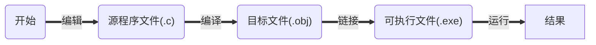
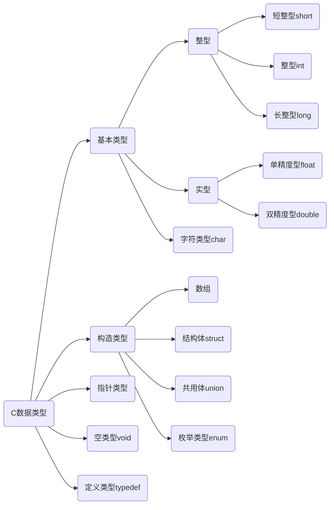

#  32个关键字

|  关键字  | 含义                         |  关键字  | 含义                       |
| :------: | :--------------------------- | :------: | -------------------------- |
|   auto   | 储存类别为自动变量           |   long   | 长整数                     |
|  break   | 终止switch或循环语句         |   main   | 主函数                     |
|   case   | 字符类型                     | register | 寄存器类型                 |
|   char   | 字符类型                     |  return  | 函数返回                   |
|  const   | 常量——“不变的”类型           |  short   | 短整数类型                 |
| continue | 中止循环的当次运行           |  signed  | 有符号的类型               |
| default  | switch语句的默认条件         |  sizeof  | 求类型、变量等的字节数     |
|    do    | 循环语句之一，需要while配合  |  static  | 储存类别为静态的           |
|  double  | 双精度实数类型               |  struct  | 结构体类型                 |
|   else   | if语句的条件为假时执行的部分 |  switch  | 多路分支语句，需要case配合 |
|   enum   | 枚举类型                     | typedef  | 类型别名定义               |
|  extern  | 说明函数、变量为外部的       |  union   | 共用体类型                 |
|  float   | 单精度实数类型               | unsigned | 无符号类型                 |
|   for    | 循环语句之一                 |   void   | “空“（无）类型             |
|   goto   | 转向语句，需要标号配合       | volatile | ”可变的“类型               |
|    if    | 根据条件的分支语句           |  while   | 循环语句之一               |
|   int    | 整数类型                     |          |                            |


# 标识符：（名字）

​	用户标识符：由字母（26个大小写字母）、数字（0-9）和下划线（"_"组成），不能以数字开头，区分大小写。

+ 用户标识符不能含有除字母、数字和下划线外的其他字符
+ 用户标识符不能和关键字重名


# C语言程序的结构

## 结构特点:

+ 函数与主函数
  + 程序由一个或多个函数组成
  + 必须有且只能有一个主函数main()
  + 程序执行从main开始,在main中结束
+ 程序语句
  + C程序由语句组成
  + 用" ; "作为语句终止符
+ 注释
  + /*       */为注释


# C程序运行步骤和方法




# 算法

## 什么是算法

### 一个程序应包括两个方面的内容:

+ 对数据组织的描述:
  + ==数据结构== 顺序存储(数组)和链式存储V

+ 对操作步骤的描述:
  + ==算法== 	穷举、迭代和递归，查找、添加、删除、改写
  + ==数据结构+算法=程序==

`所谓算法，是为解决一个问题而采取的方法和步骤。`

## 算法的特性

+ ==**有穷性**==：包含有限的操作步骤

+ ==**确定性**==：算法中的每一个步骤都应当是确定的

+ ==**有零个或多个输入**==：输入是指在执行算法时需要从外界取得必要的信息

+ ==**有一个或多个输出**==：算法的目的是为了求解, “解”就是输出

+ ==**有效性**==：算法中的每一个步骤都应当能有效地执行,并得到确定的结果,

# 基本数据类型

## C数据类型




# 常量和变量

## 定义：

程序运行时其值不能改变的量（即常量）

## 分类

+ 符号常量：用标识符代表常量
  + 定义格式： ==*#define 符号常量 常量*==

+ 直接常量：
  + 整型常量
  + 实型常量
  + 字符常量
  + 字符串常量

## 整型常量

### 三种形式

+ 十进制整数：由数字0~9和正负号表示。（123）
+ 八进制整数：由数字0开头，只有0~7.（012）
+ 十六进制整数：有0xx开头，有0~9 ,  A~F( a~ f)。(0x12A)

## 实型常量（实数或浮点数）

### 表示形式：

+ 十进制小数形式：0.2
+ 指数形式：1.2E-3

##  字符常量

### 定义：

用*单引号*括起来的单个**普通字符**或**转义字符**

+ 常规字符：例如：'A'、'2'、'#'等

+ 转义字符：由一反斜杠'\\'后跟规定字符构成。

| 转义字符 | 含义                 | 转义字符 | 含义                  |
| -------- | -------------------- | -------- | --------------------- |
| \n       | 换行                 | \t       | 水平制表（八列）      |
| \v       | 垂直制表             | \b       | 退格                  |
| \r       | 回车                 | \f       | 换页                  |
| \a       | 响铃                 | \\       | 反斜杠                |
| \\'      | 单引号               | \\"      | 双引号                |
| \ddd     | 3位8进制数代表的字符 | \xhh     | 2位16进制数代表的字符 |

## 字符串常量

定义：

用*双引号*括起来的字符序列

存储：每个字符串尾**自动**加一个'\0'作为字符串结束标志


输入

```
```


输出

```

%o	八进制

%d 十进制

%x	16进制

%u	无符号十进制

%c	单个字符

%s	字符串

```