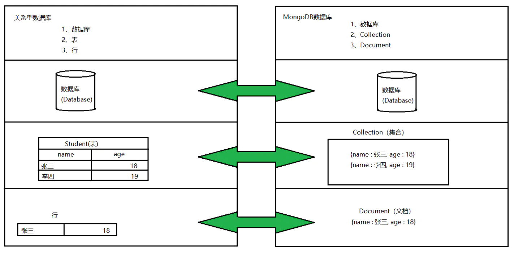

# 一、MongoDB相关概念


## 1.1 业务场景

传统的关系型数据库（如MySQL），在数据操作的“三高”需求以及应对Web2.0的网站需求面前，显得力不从心。 

解释：“三高”需求： 

+ High performance - 对数据库高并发读写的需求。 

+ Huge Storage - 对海量数据的高效率存储和访问的需求。

+ High Scalability && High Availability- 对数据库的高可扩展性和高可用性的需求。

**而MongoDB可应对“三高”需求。**


### 1.1.1 具体应用场景

1. 社交场景，使用 MongoDB 存储存储用户信息，以及用户发表的朋友圈信息，通过地理位置索引实现附近的人、地点等功能。
2. 游戏场景，使用 MongoDB 存储游戏用户信息，用户的装备、积分等直接以内嵌文档的形式存储，方便查询、高效率存储和访问。 
3. 物流场景，使用 MongoDB 存储订单信息，订单状态在运送过程中会不断更新，以 MongoDB 内嵌数组的形式来存储，一次查询就能将 订单所有的变更读取出来。
4. 物联网场景，使用 MongoDB 存储所有接入的智能设备信息，以及设备汇报的日志信息，并对这些信息进行多维度的分析。
5. 视频直播，使用 MongoDB 存储用户信息、点赞互动信息等。

这些应用场景中，数据操作方面的共同特点是： 

1. 数据量大 
2. 写入操作频繁（读写都很频繁） 
3. 价值较低的数据，对事务性要求不高 

对于这样的数据，我们更适合使用MongoDB来实现数据的存储。


### 1.1.2 什么时候选择MongoDB?

在架构选型上，除了上述的三个特点外，如果你还犹豫是否要选择它？

可以考虑以下的一些问题： 

1. 应用不需要事务及复杂 join 支持 
2. 新应用，需求会变，数据模型无法确定，想快速迭代开发 
3. 应用需要2000-3000以上的读写QPS（更高也可以）
4. 应用需要TB甚至 PB 级别数据存储 
5. 应用发展迅速，需要能快速水平扩展 
6. 应用要求存储的数据不丢失 
7. 应用需要99.999%高可用 
8. 应用需要大量的地理位置查询、文本查询

如果上述有1个符合，可以考虑 MongoDB，2个及以上的符合，选择 MongoDB 绝不会后悔。

**相对MySQL，可以以更低的成本解决问题（包括学习、开发、运维等成本）**


## 1.2 MongoDB简介

​    MongoDB是一个开源、高性能、无模式的文档型数据库，当初的设计就是用于简化开发和方便扩展，是NoSQL数据库产品中的一种。是最 像关系型数据库（MySQL）的非关系型数据库。

​    它支持的数据结构非常松散，是一种类似于 JSON 的 格式叫BSON，所以它既可以存储比较复杂的数据类型，又相当的灵活。

​    MongoDB中的记录是一个文档，它是一个由字段和值对（field:value）组成的数据结构。MongoDB文档类似于JSON对象，即一个文档认 为就是一个对象。字段的数据类型是字符型，它的值除了使用基本的一些类型外，还可以包括其他文档、普通数组和文档数组。


## 1.3 体系结构


### 1.3.1 MySQL和MongoDB对比



| SQL术语/概念    | MongoDB术语/概念 | 解释/说明                   |
| ----------- | ------------ | ----------------------- |
| database    | database     | 数据库                     |
| table       | collection   | 数据库表/集合                 |
| row         | document     | 数据记录行/文档                |
| column      | field        | 数据字段/域                  |
| index       | index        | 索引                      |
| table joins |              | 表连接,MongoDB不支持          |
|             | 嵌入文档         | MongoDB通过嵌入式文档来替代多表连接   |
| primary key | primary key  | 主键,MongoDB自动将_id字段设置为主键 |


## 1.4 数据模型

​    MongoDB的最小存储单位就是文档(document)对象。文档(document)对象对应于关系型数据库的行。数据在MongoDB中以 BSON（Binary-JSON）文档的格式存储在磁盘上。 

​    BSON（Binary Serialized Document Format）是一种类json的一种二进制形式的存储格式，简称Binary JSON。BSON和JSON一样，支持 内嵌的文档对象和数组对象，但是BSON有JSON没有的一些数据类型，如Date和BinData类型。

​    BSON采用了类似于 C 语言结构体的名称、对表示方法，支持内嵌的文档对象和数组对象，具有轻量性、可遍历性、高效性的三个特点，可 以有效描述非结构化数据和结构化数据。这种格式的优点是灵活性高，但它的缺点是空间利用率不是很理想。 

​    Bson中，除了基本的JSON类型：string,integer,boolean,double,null,array和object，mongo还使用了特殊的数据类型。这些类型包括 date,object id,binary data,regular expression 和code。每一个驱动都以特定语言的方式实现了这些类型，查看你的驱动的文档来获取详 细信息。

### BSON数据类型参考列表：

| 数据类型      | 描述                                   | 举例                                |
| --------- | ------------------------------------ | --------------------------------- |
| 字符串       | UTF-8字符串都可表示为字符串类型的数据                | {"x" : "foobar"}                  |
| 对象id      | 对象id是文档的12字节的唯一 ID                   | {"X" :ObjectId() }                |
| 布尔值       | 真或者假：true或者false                     | {"x":true}+                       |
| 数组        | 值的集合或者列表可以表示成数组                      | {"x" ： ["a", "b", "c"]}           |
| 64位整数     | 不支持这个类型。shell会使用一个特殊的内嵌文档来显示64位 整数   | shell是不支持该类型的，shell中默认会转换成64 位浮点数 |
| 64位浮点数    | shell中的数字就是这一种类型                     | {"x"：3.14159，"y"：3}               |
| null      | 表示空值或者未定义的对象                         | {"x":null}                        |
| undefined | 文档中也可以使用未定义类型                        | {"x":undefined}                   |
| 符号        | shell不支持，shell会将数据库中的符号类型的数据自动转换成字符串 |                                   |
| 正则表达式     | 文档中可以包含正则表达式，采用JavaScript的正则表达式语法    | {"x" ： /foobar/i}                 |
| 代码        | 文档中还可以包含JavaScript代码                 | {"x" ： function() { /* …… */ }}   |
| 二进制数据     | 二进制数据可以由任意字节的串组成，不过shell中无法使用        |                                   |
| 最大值/最 小值  | BSON包括一个特殊类型，表示可能的最大值。shell中没有这个 类型。 |                                   |

### 提示：

+ shell默认使用64位浮点型数值。{“x”：3.14}或{“x”：3}。

+ 对于整型值，可以使用NumberInt（4字节符号整数）或NumberLong（8字节符 号整数），{“x”:NumberInt(“3”)}{“x”:NumberLong(“3”)}
  
  

## 1.5 MongoDB的特点

### 1.5.1 高性能

​    MongoDB提供高性能的数据持久性。

​    特别是, 对嵌入式数据模型的支持减少了数据库系统上的I/O活动。 

​    索引支持更快的查询，并且可以包含来自嵌入式文档和数组的键。（文本索引解决搜索的需求、TTL索引解决历史数据自动过期的需求、地 理位置索引可用于构建各种 O2O 应用） 

​    mmapv1、wiredtiger、mongorocks（rocksdb）、in-memory 等多引擎支持满足各种场景需求。 

​    Gridfs解决文件存储的需求。 

### 1.5.2 高可用性

​    MongoDB的复制工具称为副本集（replica set），它可提供自动故障转移和数据冗余。 

### 1.5.3 高扩展性

​    MongoDB提供了水平可扩展性作为其核心功能的一部分。 

​    分片将数据分布在一组集群的机器上。（海量数据存储，服务能力水平扩展） 

​    从3.4开始，MongoDB支持基于片键创建数据区域。在一个平衡的集群中，MongoDB将一个区域所覆盖的读写只定向到该区域内的那些片。 

### 1.5.4 丰富的查询支持

​    MongoDB支持丰富的查询语言，支持读和写操作(CRUD)，比如数据聚合、文本搜索和地理空间查询等。 

### 1.5.5 其他特点

​    如无模式（动态模式）、灵活的文档模型


# 二、单机部署


## 2.1 Windows系统中的安装启动


### 2.1.1  第一步：下载安装包

MongoDB 提供了可用于 32 位和 64 位系统的预编译二进制包，你可以从MongoDB官网下载安装，MongoDB 预编译二进制包下载地址： https://www.mongodb.com/download-center#community

MongoDB的版本命名规范如：x.y.z； 

y为奇数时表示当前版本为开发版，如：1.5.2、4.1.13； 

y为偶数时表示当前版本为稳定版，如：1.6.3、4.0.10；

z是修正版本号，数字越大越好。 

详情：http://docs.mongodb.org/manual/release-notes/#release-version-numbers


### 2.1.2 第二步：解压安装启动

> 将压缩包解压到一个目录中。 
> 
> 在解压目录中，手动建立一个目录用于存放数据文件，如 data/db

#### 2.1.2.1 方式1：命令行参数方式启动服务

在 bin 目录中打开命令行提示符，输入如下命令： 

```shell
mongod --dbpath=..\data\db
```

我们在启动信息中可以看到，mongoDB的默认端口是*27017*，如果我们想改变默认的启动端口，可以通过`--port`来指定端口。 

为了方便我们每次启动，可以将安装目录的bin目录设置到环境变量的path中， bin 目录下是一些常用命令，比如 mongod 启动服务用的， mongo 客户端连接服务用的。

#### 2.1.2.2 方式2：配置文件方式启动服务

在解压目录中新建 config 文件夹，该文件夹中新建配置文件 mongod.conf ，内如参考如下：

```yaml
storage:
    #The directory where the mongod instance stores its data.Default Value is "\data\db" on Windows.
    dbPath: D:\02_Server\DBServer\mongodb-win32-x86_64-2008plus-ssl-4.0.1\data
```

详细配置项内容可以参考官方文档：https://docs.mongodb.com/manual/reference/configuration-options/

##### 【注意】

1. 配置文件中如果使用双引号，比如路径地址，自动会将双引号的内容转义。如果不转义，则会报错：

`error-parsing-yaml-config-file-yaml-cpp-error-at-line-3-column-15-unknown-escape-character-d`

解决： 

+ 对 \ 换成 / 或 \\\\

+ 如果路径中没有空格，则无需加引号
2. 配置文件中不能以Tab分割字段

解决： 

+ 将其转换成空格

##### 启动方式

```shell
mongod -f ../config/mongod.conf
或
mongod --config ../config/mongod.conf
```

更多参数配置：

```yaml
systemLog:
    destination: file
    #The path of the log file to which mongod or mongos should send all diagnostic logging information
    path: "D:/02_Server/DBServer/mongodb-win32-x86_64-2008plus-ssl-4.0.1/log/mongod.log"
    logAppend: true
storage:
    journal:
        enabled: true
    #The directory where the mongod instance stores its data.Default Value is "/data/db".
    dbPath: "D:/02_Server/DBServer/mongodb-win32-x86_64-2008plus-ssl-4.0.1/data"
net:
    #bindIp: 127.0.0.1
    port: 27017
setParameter:
    enableLocalhostAuthBypass: false
```


## 2.2 Shell连接(mongo命令)

> 在命令提示符输入以下shell命令即可完成登陆

```shel
mongo
或
mongo --host=127.0.0.1 --port=27017
```

> 查看已经有的数据库

```shell
show databases
```

> 退出mongodb

```shell
exit
```

> 更多参数可以通过帮助查看

```shell
mongo --help
```

### 提示：

​    MongoDB javascript shell是一个基于javascript的解释器，故是支持js程序的。


## 2.3 Compass-图形化界面客户端

到MongoDB官网下载MongoDB Compass，

地址：https://www.mongodb.com/download-center/v2/compass?initial=true 

如果是下载安装版，则按照步骤安装；

如果是下载加压缩版，直接解压，执行里面的 MongoDBCompassCommunity.exe 文件即可。

 在打开的界面中，输入主机地址、端口等相关信息，点击连接


## 2.4  Linux系统中的安装启动和连接

### 2.4.1 官网下载压缩包

### 2.4.2 上传压缩包到Linux中，解压到当前目录

```shell
tar -xvf mongodb-linux-x86_64-4.0.10.tgz
```

### 2.4.3 移动解压后的文件夹到指定的目录中

```shell
mv mongodb-linux-x86_64-4.0.10 /usr/local/mongodb
```

2.4.4 新建目录，分别用来存储数据和日志

```shell
#数据存储目录
mkdir -p /mongodb/single/data/db
#日志存储目录
mkdir -p /mongodb/single/log
```

### 2.4.5 新建并修改配置文件

```shell
vi /mongodb/single/mongod.conf
```

#### 配置文件的内容:

```yaml
systemLog:
    #MongoDB发送所有日志输出的目标指定为文件
    # #The path of the log file to which mongod or mongos should send all diagnostic logging information
    destination: file
    #mongod或mongos应向其发送所有诊断日志记录信息的日志文件的路径
    path: "/mongodb/single/log/mongod.log"
    #当mongos或mongod实例重新启动时，mongos或mongod会将新条目附加到现有日志文件的末尾。
    logAppend: true
storage:
    #mongod实例存储其数据的目录。storage.dbPath设置仅适用于mongod。
    ##The directory where the mongod instance stores its data.Default Value is "/data/db".
    dbPath: "/mongodb/single/data/db"
    journal:
        #启用或禁用持久性日志以确保数据文件保持有效和可恢复。
        enabled: true
processManagement:
    #启用在后台运行mongos或mongod进程的守护进程模式。
    fork: true
net:
    #服务实例绑定的IP，默认是localhost
    bindIp: localhost,192.168.0.2
    #bindIp
    #绑定的端口，默认是27017
    port: 27017

```

### 2.4.6 启动MongoDB服务

```shell
/usr/local/mongodb/bin/mongod -f /mongodb/single/mongod.conf

about to fork child process, waiting until server is ready for connections.
forked process: 90384
child process started successfully, parent exiting
```

#### 注意：

如果启动后不是 successfully ，则是启动失败了。原因基本上就是配置文件有问题。

### 2.4.7 远程连接，连不上的问题

```shell
#查看防火墙状态
systemctl status firewalld
#临时关闭防火墙
systemctl stop firewalld
#开机禁止启动防火墙
systemctl disable firewalld
```

### 2.4.8 停止关闭服务

#### 2.4.8.1 快速关闭方法（快速，简单，数据可能会出错）

> 通过系统的kill命令直接杀死进程： 杀完要检查一下，避免有的没有杀掉。

```shell
# 查看进程
ps -ef
# 查看进程
ps -ef | grep mongod
#通过进程编号关闭节点
kill -2 [pid]
```

##### 【补充】

如果一旦是因为数据损坏，则需要进行如下操作：

1. 删除lock文件

```shell
rm -f /mongodb/single/data/db/*.lock
```

2. 修复数据

```shell
/usr/local/mongdb/bin/mongod --repair --dbpath=/mongodb/single/data/db
```

#### 2.4.8.2 标准的关闭方法（数据不容易出错，但麻烦）

> 通过mongo客户端中的shutdownServer命令来关闭服务

```shell
//客户端登录服务，注意，这里通过localhost登录，如果需要远程登录，必须先登录认证才行。
mongo --port 27017
//#切换到admin库
use admin
//关闭服务
db.shutdownServer()
```


# 三、基本命令


## 3.1 数据操作

### 3.1.1 选择和创建数据库

+ 选择和创建数据库的语法格式，如果数据库不存在则自动创建

```shell
use 数据库名称
```

+ 查看有权限查看的所有的数据库命令

```shell
show dbs
或
show databases
```

#### 注意:

​    在 MongoDB 中，集合只有在内容插入后才会创建! 就是说，创建集合(数据表)后要再插入一个文档(记录)，集合才会真正创建。

#### 查看当前正在使用的数据库命令

`db`

​    MongoDB 中默认的数据库为 test，如果你没有选择数据库，集合将存放在 test 数据库中。

#### 数据库名可以是满足以下条件的任意UTF-8字符串。

+ 不能是空字符串（"")。 
+ 不得含有' '（空格)  .  $  /  \和\0 (空字符)。 
+ 应全部小写。 
+ 最多64字节。

#### 有一些数据库名是保留的，可以直接访问这些有特殊作用的数据库。

+ admin： 从权限的角度来看，这是"root"数据库。要是将一个用户添加到这个数据库，这个用户自动继承所有数据库的权限。一些特 定的服务器端命令也只能从这个数据库运行，比如列出所有的数据库或者关闭服务器。 
+ local: 这个数据永远不会被复制，可以用来存储限于本地单台服务器的任意集合 c
+ onfig: 当Mongo用于分片设置时，config数据库在内部使用，用于保存分片的相关信息。
  
  

### 3.1.2 数据库的删除

`db.dropDatabase()`

提示：主要用来删除已经持久化的数据库


## 3.2 集合操作

> 集合，类似关系型数据库中的表。 
> 
> 可以显示的创建，也可以隐式的创建。

### 3.2.1  集合的显式创建

`db.createCollection(name)`

参数说明： 

+ name: 要创建的集合名称

#### 查看当前库中的表：show tables命令

```sql
show collections
或
show tables
```

#### 集合的命名规范

+ 集合名不能是空字符串""。
+ 集合名不能含有\0字符（空字符)，这个字符表示集合名的结尾。 
+ 集合名不能以"system."开头，这是为系统集合保留的前缀。 
+ 用户创建的集合名字不能含有保留字符。有些驱动程序的确支持在集合名里面包含，这是因为某些系统生成的集合中包含该字符。除非你要访问这种系统创建的集合，否则千万不要在名字里出现$。

3.2.2 集合的隐式创建

> 当向一个集合中插入一个文档的时候，如果集合不存在，则会自动创建集合。
> 
> 通常我们使用隐式创建文档即可。

### 3.2.3 集合的删除

```sql
db.[集合名称].drop()
```

#### 返回值

​    如果成功删除选定集合，则 drop() 方法返回 true，否则返回 false。    


## 3.3 文档基本CRUD

> 文档（document）的数据结构和 JSON 基本一样。 所有存储在集合中的数据都是 BSON 格式。

### 3.3.1 文档的插入

#### 单个文档插入

​    使用insert() 或 save() 方法向集合中插入文档

```sql
db.collection.insertOne(
<document or array of documents>,
{
writeConcern: <document>,
ordered: <boolean>
}
)
```

##### 参数:

| Parameter    | Type              | Description                                                                                                                                                                                                                                                                |
| ------------ | ----------------- | -------------------------------------------------------------------------------------------------------------------------------------------------------------------------------------------------------------------------------------------------------------------------- |
| document     | document or array | 要插入到集合中的文档或文档数组。（(json格式）                                                                                                                                                                                                                                                  |
| writeConcern | document          | Optional. A document expressing the write concern. Omit to use the default write concern. See Write Concern.Do not explicitly set the write concern for the operation if run in a transaction. To use write concern with transactions, see Transactions and Write Concern. |
| ordered      | boolean           | 可选。如果为真，则按顺序插入数组中的文档，如果其中一个文档出现错误，MongoDB将返回而 不处理数组中的其余文档。如果为假，则执行无序插入，如果其中一个文档出现错误，则继续处理 数组中的主文档。在版本2.6+中默认为true                                                                                                                                                          |

##### 【示例】

要向comment的集合(表)中插入一条测试数据：

```sql
db.comment.insertOne({
    "articleid":"100000",
    "content":"今天天气真好，阳光明媚",
    "userid":"1001",
    "nickname":"Rose",
    "createdatetime":new Date(),
    "likenum":NumberInt(10),
    "state":null
})
```

查询

```sql
db.comment.find()
```


##### 提示

1. comment集合如果不存在，则会隐式创建 
2. mongo中的数字，默认情况下是double类型，如果要存整型，必须使用函数NumberInt(整型数字)，否则取出来就有问题了。
3. 插入当前日期使用 new Date() 
4. 插入的数据没有指定 _id ，会自动生成主键值
5. 如果某字段没值，可以赋值为null，或不写该字段。
   
   

#### 批量插入

```sql
db.collection.insertMany(
[ <document 1> , <document 2>, ... ],
{
writeConcern: <document>,
ordered: <boolean>
}
)
```

##### 【示例】

```sql
db.comment.insertMany([
{
        "_id": "1",
        "articleid": "100001",
        "content": "我们不应该把清晨浪费在手机上，健康很重要，一杯温水幸福你我他。",
        "userid": "1002",
        "nickname": "相忘于江湖",
        "createdatetime": new Date("2019-08-05T22:08:15.522Z"),
        "likenum": NumberInt(1000),
        "state": "1"
    },
    {
        "_id": "2",
        "articleid": "100001",
        "content": "我夏天空腹喝凉开水，冬天喝温开水",
        "userid": "1005",
        "nickname": "伊人憔悴",
        "createdatetime": new Date("2019-08-05T23:58:51.485Z"),
        "likenum": NumberInt(888),
        "state": "1"
    },
    {
        "_id": "3",
        "articleid": "100001",
        "content": "我一直喝凉开水，冬天夏天都喝。",
        "userid": "1004",
        "nickname": "杰克船长",
        "createdatetime": new Date("2019-08-06T01:05:06.321Z"),
        "likenum": NumberInt(666),
        "state": "1"
    },
    {
        "_id": "4",
        "articleid": "100001",
        "content": "专家说不能空腹吃饭，影响健康。",
        "userid": "1003",
        "nickname": "凯撒",
        "createdatetime": new Date("2019-08-06T08:18:35.288Z"),
        "likenum": NumberInt(2000),
        "state": "1"
    },
    {
        "_id": "5",
        "articleid": "100001",
        "content": "研究表明，刚烧开的水千万不能喝，因为烫嘴。",
        "userid": "1003",
        "nickname": "凯撒",
        "createdatetime": new Date("2019-08-06T11:01:02.521Z"),
        "likenum": NumberInt(3000),
        "state": "1"
    }
])
```

##### 提示：

+ 插入时指定了 _id ，则主键就是该值。 
+ 如果某条数据插入失败，将会终止插入，但已经插入成功的数据不会回滚掉。

因为批量插入由于数据较多容易出现失败，因此，可以使用try catch进行异常捕捉处理，测试的时候可以不处理。

```sql
try {
    db.comment.insertMany([
        {},
        {}
    ]);
} catch (e) {
    print (e);
}
```


### 3.3.2 文档的基本查询

```sql
db.collection.find(<query>, [projection])
```

参数：
