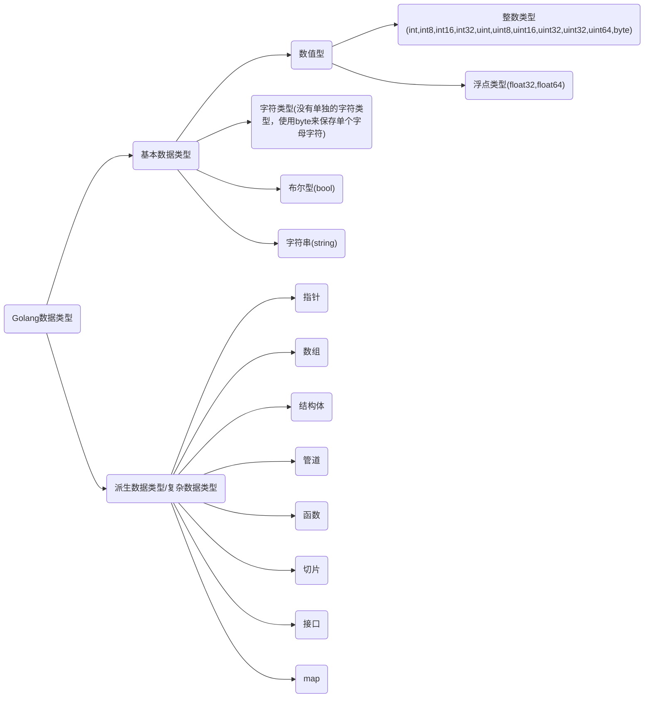

# [Go语言标准库文档中文版 | Go语言中文网 | Golang中文社区 | Golang中国 (studygolang.com)](https://studygolang.com/pkgdoc)

# 一、Hello GoLang

```go
package main

import "fmt" //导入系统包fmt用来输出

func main() { //main主函数 程序入口
   fmt.Println("Hello world")
}
```

# 二、Golang执行流程


或者


# 三、注释

## 3.1 单行注释

```go
// 这是单行注释
```

## 3.2 多行注释

```go
 /*
 这是多行注释
 这是多行注释
 这是多行注释
 */
```


# 四、变量


## 4.1 变量的定义

Go语言是**静态类型**语言，所有的类型都需要明确的去定义

声明一个变量一般是使用**var**关键字

```go
var name type
var 变量名 变量类型
```

* var是声明变量的关键字，是固定的写法
* name，变量的名字
* type，变量的类型
  
  

同时定义多个变量

```go
var(
addr String
phone String
)
```

如果没有显式的给变量赋值，系统自动赋予它该类型的默认值

* 整形和浮点型变量的默认值为0和0.0
* 字符串变量的默认值为空字符串
* 布尔型变量默认为false
* 切片、函数、指针变量的默认为nil

## 4.2 变量的初始化

```go
// 第一种：指定变量类型并赋值
var age int = 18
// 第二种：指定变量类型不赋值，使用默认值
var age int
// 第三种：不写变量类型，go会根据值自动推断
var name = "TX"
// 第四种：省略var，自动推断
gender := "男"
```

### 4.2.1 初始化

```go
var age int
age = 18

var name string = "TX"

var name,age,addr = "TX",18,"china"

var (
        name string = "TX"
        age  int    = 18
        addr string = "china"
    )

name,age,addr := "TX",18,"china"
```

### 4.2.2 短变量声明并初始化

```go
    name := "TX"
    age := 18

    fmt.Println(name, age)
    fmt.Printf("%T,%T", name, age)
```

这是Go语言的推导声明写法，编译器会自动**根据右值的类型推断出左值的类型**

因为简洁和灵活的特点，简短变量声明被广泛用于大部分的**局部变量的声明和初始化**

### 4.2.3 格式化打印占位符

```go
    %v,原样输出
    %T，打印类型
    %t,bool类型
    %s，字符串
    %f，浮点
    %d，10进制的整数
    %b，2进制的整数
    %o，8进制
    %x，%X，16进制
         %x：0-9，a-f
         %X：0-9，A-F
    %c，打印字符
    %p，打印地址
```

### 4.2.4 格式化打印占位符

```go
  var age int
    age = 100
    // &取地址符
    fmt.Printf("age：%d,内存地址：%p\n", age, &age)
    age = 200
    fmt.Printf("age：%d,内存地址：%p", age, &age)
```

## 4.3 变量的交换

在其他语言中需要中间变量

如java:

```java
 int a = 100;
 int b = 200;
 // 交换变量
 int temp = a;
 a = b;
 b = temp;
 System.out.println("a= " + a + ", b = " + b);
```

在go中

```go
  var a int = 100
    var b int = 200

    b, a = a, b
    fmt.Println(a, b)
```

## 4.4 匿名变量

匿名变量的特点是一个下划线 “_”，它本身就是一个特殊的标识符。

它可以像其他标识符那样用于变量的声明或赋值（任何类型都可以赋值给它），**但任何赋给这个标识符的值都将被抛弃**，因此这些值不能在后续的代码中使用。

```go
func test() (int, int) {
    return 100, 200
}

func main() {
    a, _ := test()
    _, b := test()
    fmt.Println(a, b) //100 200
}
```

在编码的过程中，可能会遇到没有名称的变量、类型或者方法。虽然这不是必须的，但有时候这样做可以**极大地增强代码的灵活性**，这些变量被统称为**匿名变量**。 
匿名变量**不占用内存空间**，不会分配内存。匿名变量与匿名变量之间也不会因为多次声明而无法使用。

## 4.5 变量的作用域

**一个变量（常量、类型或函数）在程序中都有一定的作用范围，称之为作用域**

> 局部变量

在函数体内声明的变量称之为局部变量，它们的作用域只在函数体内，函数的参数和返回值变量都属于局部变量

```go
func main() {

    //声明局部变量
    var a int = 3
    var b int = 4

    //声明局部变量
    c := a + b

    fmt.Printf("a = %d,b = %d,c = %d", a, b, c) 
    //a = 3,b = 4,c = 7
}
```

> 全局变量

在**函数体外声明的变量**称之为全局变量，只需要在一个源文件中定义，就可以在所有源文件中使用，当然，不包含这个全局变量的源文件**需要使用 import 关键字** 引入 

全局变量必须以 var 关键字开头，如果想要在外部包中使用全局变量的首字母必须大写

```go
// 声明全局变量
var c int

func main() {

    //声明局部变量
    var a, b int
    a = 3
    b = 4
    c = a + b
    fmt.Printf("a = %d,b = %d,c = %d", a, b, c) //a = 3,b = 4,c = 7
}
```

Go语言程序中**全局变量与局部变量名称可以相同**，但是**函数体内的局部变量**会被优先考虑！

```go
// 声明全局变量
var a float32 = 3.14

func main() {
    //声明局部变量
    var a int = 3
    fmt.Println(a)  //3
}
```

# 五、常量

## 5.1 常量的定义

常量中的数据类型只可以是**布尔型、数字型（整数型、浮点型和复数）和字符串型**

```go
const identifier [type] = value
```

可以省略[说明符][type] ，因为编译器可以根据变量的值来推断其类型
多个相同类型的声明可以简写为： 

```go
const c_name1, c_name2 = value1, value2
```

## 5.2 iota特殊常量

iota是特殊常量，可以认为是一个可以被编译器修改的常量，**iota是Go语言的常量计数器**
**iota在const关键字出现时将被重置为0**

```go
func main() {
	const (
		a = iota
		b
		c
		e = "TX"
		d
		f = "dream"
		g
		h = iota
	)

	const (
		i = iota
		j
	)
	fmt.Println(a, b, c, d, e, f, g, h) //0 1 2 TX TX dream dream 7
	fmt.Println(i, j)                   //0 1
}
```

# 六、数据类型



## 6.1 数值型

### 6.1.1 整数类型

####  有符号整数类型

| 类型  | 有无符号 | 占用储存空间 | 表数范围                                     |
| ----- | -------- | ------------ | -------------------------------------------- |
| int8  | 有       | 1字节        | -2^7^ ~ 2^7^ -1 (-128 ~ 127)                 |
| int16 | 有       | 2字节        | -2^15^ ~ 2^15^ -1 (-32768 ~ 32767)           |
| int32 | 有       | 4字节        | -2^31^ ~ 2^31^ -1 (-2147483648 ~ 2147483647) |
| int64 | 有       | 8字节        | -2^63^ ~ 2^63^ -1                            |

#### 无符号整数类型

| 类型   | 有无符号 | 占用储存空间 | 表数范围     |
| ------ | -------- | ------------ | ------------ |
| uint8  | 无       | 1字节        | 0 ~ 255      |
| uint16 | 无       | 2字节        | 0 ~ 2^16^ -1 |
| uint32 | 无       | 4字节        | 0 ~ 2^32^ -1 |
| uint64 | 无       | 8字节        | 0 ~ 2^64^ -1 |

#### 其他整数类型

| 类型 | 有无符号 | 占用存储空间                       | 表数范围                                 |
| ---- | -------- | ---------------------------------- | ---------------------------------------- |
| int  | 有       | 32位系统 4字节<br />64位系统 8字节 | -2^31^ ~ 2^31^ -1<br />-2^63^ ~ 2^63^ -1 |
| uint | 无       | 32位系统 4字节<br />64位系统 8字节 | 0 ~ 2^32^ -1<br />0 ~ 2^64^ -1           |
| rune | 有       | 等价int32                          | -2^31^ ~ 2^31^ -1                        |
| byte | 无       | 等价uint8                          | 0 ~ 255                                  |

### 6.2.2 浮点类型

| 类型    | 存储空间 | 表数范围               |
| ------- | -------- | ---------------------- |
| float32 | 4字节    | -3.403E38 ~ 3.403E38   |
| float64 | 8字节    | -1.798E308 ~ 1.798E308 |

+ 底层存储空间和操作系统无关

+ 浮点类型底层存储：符号位+指数位+尾数位，所以尾数位只是存了 一个大概，很可能会出现精度的损失。

```go
package main
import "fmt"
func main() {
   //定义浮点类型的数据：
   var num1 float32 = 3.14
   fmt.Println(num1)
   //可以表示正浮点数，也可以表示负的浮点数
   var num2 float32 = -3.14
   fmt.Println(num2)
   //浮点数可以用十进制表示形式，也可以用科学计数法表示形式  E 大写小写都可以的
   var num3 float32 = 314E-2
   fmt.Println(num3)
   var num4 float32 = 314E+2
   fmt.Println(num4)
   var num5 float32 = 314e+2
   fmt.Println(num5)
   var num6 float64 = 314e+2
   fmt.Println(num6)
   //浮点数可能会有精度的损失，所以通常情况下，建议你使用：float64
   var num7 float32 = 256.000000916
   fmt.Println(num7)
   var num8 float64 = 256.000000916
   fmt.Println(num8)
   //golang中默认的浮点类型为：float64
   var num9 = 3.17
   fmt.Printf("num9对应的默认的类型为：%T", num9)
}
3.14
31400
31400
31400
256
256.000000916
num9对应的默认的类型为：float64
```

## 6.2 布尔类型

1. 布尔类型也叫bool类型，bool类型数据只允许取值true和false
2. 布尔类型占1个字节。
3. 布尔类型适于逻辑运算，一般用于程序流程控制

```go
// true 和 false
// 默认值是 false
func main() {
	var isFlag bool = true
	fmt.Println(isFlag) //true
	fmt.Printf("%T,%t\n", isFlag, isFlag)  //bool,true
}
```

## 6.3字符类型

+ Golang中没有专门的字符类型，如果要存储单个字符(字母)，一般使用byte来保存。

+ Golang中字符使用UTF-8编码
+ [查看UTF-8编码表](http://www.mytju.com/classcode/tools/encode_utf8.asp)

```go
func main(){
        //定义字符类型的数据：
        var c1 byte = 'a'
        fmt.Println(c1)//97
        var c2 byte = '6'
        fmt.Println(c2)//54
        var c3 byte = '('
        fmt.Println(c3 + 20)//40
        //字符类型，本质上就是一个整数，也可以直接参与运算，输出字符的时候，会将对应的码值做一个输出
        //字母，数字，标点等字符，底层是按照ASCII进行存储。
        var c4 int = '中'
        fmt.Println(c4)
        //汉字字符，底层对应的是Unicode码值
        //对应的码值为20013，byte类型溢出，能存储的范围：可以用int
        //总结：Golang的字符对应的使用的是UTF-8编码（Unicode是对应的字符集，UTF-8是Unicode的其中的一种编码方案）
        var c5 byte = 'A'
        //想显示对应的字符，必须采用格式化输出
        fmt.Printf("c5对应的具体的字符为：%c",c5)
}
```


### 6.3.1 ASCII 字符编码表


### 6.3.2 转义字符

![转义字符](data:image/png;base64,iVBORw0KGgoAAAANSUhEUgAABHwAAAFbCAIAAAAoew5RAAAAA3NCSVQICAjb4U/gAAAACXBIWXMAABJ0AAASdAHeZh94AAAgAElEQVR4nO3dT4vb+L7n8W9dep8nYLCKqyhOVx5AIFDmGMPVQjC5MMnZpJy5OV54oSYer9IQkwQ3dFYah9bCi+rMxNWbk1w4uSAYHTA+uCDQDyDVcRQdygY/gWxn41lItuU/5XL9kZ2y3y8KYusn26pQ+vn30e+PtkRERPr9vgDrbmtrS/hrB3Aa6goAwKXgCwUAAAAAYtfv9/9l1ccAAAAAAGvr6OhoK3hEnxcAAAAAXKLh8EJ6ugAAAAAgRoQuAAAAAIgRoQsAAAAAYkToAgAAAIAYEboAAAAAIEaELgAAAACIEaELAAAAAGJE6AIAAACAGBG6AAAAACBGhC4AAAAAiBGhCwAAAABiROgCAMTp6MWtrfvvpjfeenF0yqumX3a2Dxnz7v7W1sRHnvEzAAA4L0IXACBOfxwd3bt3b3zb0X++O/r++52pfd/dHwSjnWd/fb7z7sUoJb27Py8g7Tz76/M/7p+4w9GLW/ffiRw9v7UVuvXi6N2L50fB+w4QwAAA8SB0AQBicfTiVphkhsHm/rvg4a3nR9G0Mww73+/sHL37zyBo7Tz763N5/iIsOvrjDxllt/Cto25NJqgwWonIu/u3nsvzj/3+x+c79972+/1+v//x+xf3/3j+sd9/e2/n+cdgW//tvcnfAQCAy0DoAgDEYufZx/7H5zujTNPvv713720QbgbhZzzs7Pz3e6PUJTvPnt179+6dSNA1trPzffTtx95hlvBd392//8fzjx+f7Yjs/Pd7f7wIc9j9d/eePdsRuffs3rs/zx3pCADARW0F//T7/dUeBwBg/Ry9uPVn+etf5c+3jp6NotW7+1svdoIYNG1m4dGLW7fe3Zt6ybsTBxTuPD/h/d/dv/XHs4/fv9h6d294QMG22YcDAMD5bW1tiUi/3yd0AQDicfTi1q2jZ/2334f/3jt6cevW81mdStGMNHhVZKjfu/tb9+XtQqP/3t3fuv/u3sx9T8h6Mz4PAIBLMQxd3636SAAA6+noP98dydH9reDq3v2trWBI4Pcvbv1Z/npyx9LOs2f3tu7ffzeMQUcvXrzbef7x1FB09OLWreffv+33384oDMPYW7qzAAArQE8XACBeY31JR6dkLhEZ69oaRKnTeqLmdFgNRiHee/tx58XsrrbA7B4yAADOadjTxUIaAIAl+uPoKLJy+wkrtd97+/H5H/dvvTgKFx6ciEKTixTOWBBx9N7hQhrPdyRY22PSx+c7g0U5SFwAgHgwvBAAEL9397e2grlbbyNDK97d37r/x/NnM7LOzrO/Pn9369Z9ufe2P9Urdu/t9PCMOT1d/XsiRy+iHxpZRQMAgPjR0wUAiMWw3+nW86OwL+njs51398O+raMXt7buy9v+jJGGRy9ubW3dei7P3z7fGd0v+bLcexb0ol3mewIAMA+hCwAQi+GNtIKhfYGj75/13957d39r69bzo52pTq7BvZO/f9vv9z8+u/fsY7/ff3Z0a3Sn40swfttlAABiR+gCACzPzs5wBtXH5/L81iBJhd1i7+71p2dXhfv/Vf48YwrYoD/t1vOje/cWHTK48+xj/9674QsnbrsMAMAlY/VCAAAAALh8rF4IAAAAAMtA6AIAAACAGBG6AAAAACBGhC4AAAAAiBGhCwAAAABiROgCAAAAgBgRugAAAAAgRoQuAAAAAIgRoQsAAAAAYkToAgAAAAAAAAAAwBXU7/fp6QIAAACAuBwdHW0Fjz58/rraQwGW4M6Na8JfO4DTUFcAAC5F8IVCTxcAAAAAxIvQBQAAAAAxInQBAAAAQIwIXQAAAAAQI0IXAAAAAMSI0AUAAAAAMSJ0AQAAAECMCF0AAAAAECNCFwAAAADEiNAFAAAAADEidAEAAABAjAhdF/Pl5YMbD5vTG42Xx6e86lrZnfvO7sM7N26//hLd9Om1ce3O4/fnPFQA7sM7NxY7iRY5SQFgrXx6bVy7M78Bc2bvy2eoSz+9NsZ3dh9e9vEAK0Pouph/fjrW/z0zvu347++P/zW1PbVv8/G1B/YnEZHrTyo/3Gzao3qk+Xi8Ifjl5YPH70U+/Wpcu3Pj2p0b1+4YL4/dl79+GbQagx8CGLCwY/v2ncef/+L8/pd/nvgtfoaTFAC+Sc3HM4LTzI3fnC//1fxyd9u/PdbO+fLzg+HTG4MqGriCvlv1AVxVx/btB78EZ/77OzdERER/U5GHgys0D8ONIplXXyu6iMj29ZvH7n8dmze3RbbN//0X9/Zr90lFF5FPnX9Kxrw7eO/3ZeNn+eH3D6a8Nl4qzptMsPHG+784Xx/98+ED/8lv5s1l/aLA1ffl5QPj5+PrP/72+cm2iDhflcfXHtx4/xfn90fXx3Zc+CQFgPVz85Hz9dHqPv747+/lh//9yLz5yBxsch/esW/+5jyZvpANXDn0dJ3Ttvn7B+fH7es//vb564fg59XdzKuvHz6/ycjdynDj5zBxicj2v93d/vL+H+GIwZuPzLvN//teJLi0c3P7X8Pdmo8fHv/w+2/mTZGbf9I/v7Y/BRub+pNH10X0Jxn3P8aHHQI4yfvyjWt3jPcZ5+sH58nxoCMr8+rrB+du07h2Z3x48IInKQDgsr1//Ytk/o1rylhbhK7zO/77e9H/m9i3xwYduX9rXr85+5LM9SeP9E/Nvw96xvU3H17dDd7n+PrdPw2uuGdefR12ZG2bT7bd/zqW9/9w71ZeBVfZbz4yb4zeBMAJmo+v3bnxctv5+uFz2KOVefX10ZfbYXf09Se/ff76wbn5OjpSd7GTFACurnCo4Wi2wmgC+eQoxC8vh0P7JqdajYb8Tc5sP7ZH4wNnzOaKvHZsrKD7t6bcUK5LOLVs1vBCxhbiSmN44Xl9eVn+5cajzzfFDjdEBxw+uPHzaM/rPw57xjPmj6+Nl03zTWQa2PvXv3zKvPp95hyw19d//825KyKVz8NxTZ9e2++3zTeX/gsBaybz6mtGgkbDz2MzGdxrYRNBf/Ph1ZPfPj8Ze9VZTlIAuJK+/Pzg/7758PmNyKfXxu1f/+fLP00N4QtaNZlXX3/TRUSa9stjebIdbpe/OF+Di1nH9u0HN253BqO1x0s/vTZu/yqSGXvPG5XPg8rZuP1AgqE978uP34uMhnAPp2YMNR9fex3PfwawHISuczr++/tj+VS+cU1Ewhlc+psPn2+8Nv5D/tfkRJGR608e6dfKj99nwm4rObZfNq//+Js+uWPz8bWye7fyin524GKuT8YqERH34Z3HMug9ntx/wZMUAK6q6z/+Nho+c/fXx+//8eXJ9ljT5f3rXz5t//D7MPlkzCfR7cN2TjD99Vf7/aNXd6dKbz76Xz82jZ+j75l59XuYwa4/eaT/XHb/69i8KfbLpn43E+kWaz6+Nrk0tMg2ww1wlRG6zmnb/P2DKRJctvnyJBiDJF9eNuVuZW6lkHn15h83HpbdrxU96C6bvoL+vhx01uv/vm3fvvPLrM70oDIajH0CcAbBzOzPJ87MXuAkBYC19qV9LDdnzLCasf2m8q8i/2wfi2xPl16PLOb8pX0scjyRpoL+sS83Kq/+/R83/jbcTE8X1g+h61L989Pxl/GxhXK38vnN+JrydyvOjw+M26+dJ8fGzxK5jBQIF9KQ/3jwZRTtIj69Nm4fm5OVEYCZmo9n3iJmcJ5GRv9GnHKSAsDVM+tmNkt3c3rZWBHZfvVG5P0/Ilvo6cL6IXRdBvfhnRtB6+3Nh8/Dre/LNx4e//AkM73/9SeVH94/MB6K/ubD1OLvwUSUY3u44X35xt/+NJncACxqO1wOdIr78I49Y7PIKScpAHyztq/fFPfTsUgkYn3q/FO29Rsnv2jK9dS2fGr+/dOj6zdP2x68+X8bfNyn43+G/VciwfIYgzldJ73nLPR0Yf2weuE5NR8P1tL55ZPobz58/vrBebLtPgzX6vny8sGNhxJZh3Dky8sHN649+EX+8urH7YVutX730Q+fy9/+PQ2BtXHmkxQAvhXb5pOMvI82G5qPb//65e6js10/uvvoh5vHv4xuUTO4Wfzk9mP7P0Zvfv3JI12aj4fLIQbLY4ze80+6jL/29qyRCMExX4sskHjCQojAlUJP1zmFC6OFc7rCjcf/+uTDK7kT9Ilf/3FySJL7MFiZergW0KPPT4K1U0/qcA+M36QVQGzOe5ICwDfjbuXz79vG7dFkh+Gt4c9i2/z9N7n9wLj2q4hEmj3b5u8f1Id3Btsn3jzz6qs8vlYOS+9WPr+RGw8lUrptj95z+4ffT1qjiJ4urJ+t4J8Pn7+u9jiurrGFNEaCZVLD6SLhrJJ56158em3c/vVL5L5AU28bmZpC4++c7ty4Jvy1b5gT5nQNXD//SYo1Rl0BLN378o2//cm5+dr4ed7ggtkTcYFvV/CF0u/3CV3YIDSkNlB4v7sT53Td5Psb06grAACXYhi6GF4IYJ0Nh8TMoL/5wJBdAAAQPxbSAAAAAIAYEboAAAAAIEaELgAAAACIEaELAAAAAGJE6AIAAACAGBG6AAAAACBGhC4AAAAAiBGhCwAAAABiROgCAAAAAAAAAADAFdTv9+npAgAAAIC4HB0dbQWP2r3Gag8FWIJUIiv8tQM4DXUFAOBSBF8o9HQBAAAAQLwIXQAAAAAQI0IXAAAAAMSI0AUAAAAAMSJ0AQAAAECMCF0AAAAAECNCFwAAAADEiNAFAAAAADEidAEAAABAjAhdAAAAABAjQhcAAAAAxIjQtTJuIZvK1P1VHwZwAR07ky06g2dOJZXITv1U3MgLfCtvWJ3Rc69ujO9wPpd7NnFuAgCAy0XoWoJWMRFpmALrQzFrOb+Qt73BBi3n9Brt4U8zp859vWvVfWkVoyFt4bTjW/nUZQS2q2LTfl8AsTlXsyRyWW3ytRcuGrsYB6wpQtcSpM2S4lpcOMc60nJOLWlbrVN3dAvhN6tv5VOJbKrQEqdSdEQt7Q9CWlkXUY3d+Tkt5FQMZ9fplfUL/wZXhVrad0rdYuH0/2oAmOvszRKnkip0zWaj3Wu0a2m3MD7G4exFvpVPFVp6Lbw8JxODIIB1ROhaBtXYVb1D1zt9T+DqMcrtWjp87NWNE7qtgi/XqjFIWTUpFlqqpgRfveE4Q6PslJQFPrJVLHTN2indaOtHLe3pzoFNTQLgYs7YLOnYVkstPTU1ERExylVDXKd1gSLxvU6wRUREy5mG+M4h16ax3ghdS6HlTKMzuzdgTs878G0LOq9SicWHF7ZcR3wrn8rUfefQNcpOc7/da1SlksrU1VpjFN7m8q0D19gLv8ijTjybOnZmGAXzY6ElkhJnnoCjfrkTdg4ngF3iR88bcpPWT6pJAGBxM5olHTszVueMhjR7h64nqqYMi1RNEefw/EWzDym5adfRsGkIXUuiG+kZdY1XN5zdoHnqlJSxTnngm6fXwjGBi3IO3WCYnHFoOLvtmgSzuYpezqml3cJULJmt4zod3ZiKZyefTb51ILUwB1aNjp0JZ0YF8U8dFOne1GAbp2JYHbW0366lRVrFTF0GgyHHdr68j/atfKog1d6JQ250Iy1el+vBAC5odrNkJq/ri6JGrnOpWlKk63vnLRLRa/umVwmrSqdSdNLVxS66AVcXoWtZjD1Ta9lT162HtUzQBT/seQeupJOHF4p0bKurG4oEuUs7SCUqMhjQrxrldq/Rbu66mUG30om6vjf2RT5w4tmklsrDbjG9lFPDb/2WbXXU0n44viUsGv9dCi21tB+OePS6voyu2o7vfFkf3bKtjl4b5NiZQ260pEroAnBxs5slS9P1vcFwCaaqYjN8t+oD2ByKbii2c+iXlFFbzdiN9BIoqjZo2K3g8IDLoOWcZtJOHOrDHjCnkkpUqr2yav1ka3uOdlAUERG1tN8uzXp5L3fKR3hdX5L6dOiaezZNdCP7noh0fVGCEDjLYTHTkWHiEhFtV9fqdiGb0nLOxLDJy/por+uL+IVsKrpx4jfVkqoc+t7UdgA4m1nNkjNIqprI7LEJpxVJx85U3FFd2iomKsVMcrJqBdYLPV3Loxq7qle3GUCINZeuNpN2Ilt0WsVENlWQam9P9cT3xCyNjR4ZTAkb/7n8S57B4sjp6mKr2Ic8EW2il0kxm412M6cGvXkLLW1/jo9WwpW+Fl52HwDOZ9FmiZZUpeNHQpTvdS9U5B26nhJZDCldraWF9caw7ghdS6TlTGN8AOHYMKGW6yy8XjbwDfOdQ9/IqVbF1XJOr6yLomqi1/anl76IrBcfToha7BO6/vR380lnk3PoimI2Bz1vw920pCod1+nM/gRtt9os617dmAhXwUohE+2Dy/ro+Yc0epPkrNGVAHBGU82SUS4a2y2pBusNjnbrhD385ysCNhKha6km56169eJgOLVbqLjzBjsB36TI37PvdYM5XYa3167lzGbDMQ6NhdbGOAttV9c6s0LXCWfT2NXWVuQ+V2mzpPjWT8PDm7prTboa9GsFuSvy/qd9dNosne+j07oh0e2+lZ9cXMfr+qzxBeCSRJolim4oMrwpxViNN15lOZWiowxGLpyrSNvVtY5dGFa5rWKhJTPXpAXWCHO6lsvYM7W8be3pYZssp3v5VCIoS1c36U6vWAdOJRgNaGcqaq+syvg9u4KOLKNuZCrqCX/bvpVPWeObjFn7jVFUTWynJRMLGJ50Nmm5aunQCCdKpavNnJ+pDw/PkbyRydoiIqLXGtWJj9JyTlOMTN1IdKu9su5lB++vmM1Ix52WM+WnVKJz8Y/Waw3HGm1XS/vO+H+I67REKxO6AFyOSLNELT01nbwd1D9arlpSioP6ebzKGqsAz1WkmM2GWsgaiVGV2F50pANwVW0F/7R7jdUex+bwrbzh7DJbdCVSiazw13553ELW1vadkuJPrWw+aRDGfCtflKfBMMLhy4d7+Vbe8PZOv1uXVzcyXfPbuEjhFrJFb2ppjbi0iokDtTljoCYuF3UFNgfNEiBWwRdKv98ndC1fq5ioSK1RPf2KPi4ZDam1sWg8i98yQ9e381uvPeoKbBKaJUCMhqGL4YXLl672aDMBF6KWnpqZfCrT3Zyrs76VN6wktQeAy0azBFgGQheAq0gxmw1z1QexTLPvbAYAAK4CQhcAnJ9ea7RXfQwAAOAbx5LxAAAAABAjQhcAAAAAxIjQBQAAAAAxInQBAAAAQIwIXQAAAAAQI0IXAAAAAMSI0AUAAAAAAAAAAIArqN/v09MFAAAAAHE5OjraCh61e43VHgqwBKlEVvhrB3Aa6goAwKUIvlDo6QIAAACAeBG6AAAAACBGhC4AAAAAiBGhCwAAAABiROgCAAAAgBgRugAAAAAgRoQuAAAAAIgRoQsAAAAAYkToAgAAAIAYEboAAAAAIEaELgCI8OpGpu6v+igAAMA6+W7VBwAA8WkVEwdqc9/UBhucSspKOs2cOnv/jl2oi7GviriFbNGZ3iFd7ZX1uI4WAACsJ0LXErSKiYrUGlVj1QcCbLpWsdASESNRDzdouWgAcwt5Wyu3S4qI6LVGexWHCAAxO1ezxKmkCq3goT7x2vMVARuG4YVLkDZLimsxYAlYKreQTSUqrnTsTDb41ncLB2qz0e4FP2VdFLMWTVzZopTbtfQKjxkA4nf2ZolTSRW6ZlB/1tJjAwHOVwRsHkLXMqjGruodut6qjwPYJHptkKyajXYt7Vt51xiOMwwu9I4NOxwkro6dyducrQDW1xmbJR3baqmlp2GFaZSrhrhO6wJFwCYidC2FljONjm2N1TVuIZvK1H2nkkpkU4lsKkE7D4iNUzGsjlvIDk63iht2hYWdYGKEfVy+9ZOt7Y3CGACsnxnNko6dyRpWZ/jct/JBVSneoeuJqinDIlVTxDk8f9Hg42j/YKMQupZEN9KRumbAqxvObrvXaPf2Ta1jFxiCCMQjyFRazulFur96DaekjO3mVAwrWa2lfSs/aA1M/bC2IYCrb3azZCav64uiRi5FqVpSpOt75y0S8a0DqYWDvatGx85UFjoS4CojdC2LsWdqLTtyDUlERMs54QQSxSylhSGIwOWbvHx7Iq9uFFpi7Ooiaml/MPUrnI0gkq4Gj09c+RAAro6ZzZJlUUvl4YACvZRTB2EMWGOErqVRdEPxnUOukQPLMVhIQzGbUz1a07y6kamLdtpuALAmLtgsSaonDsNeqGg03jtT96VD6MLaI3Qtj2rsql7dZukeYCkGC2mIBN/uhZZ4dSMRWdIwkTWsjjiVVKb+f6y6ynLGADbJos0SLamOhyLf616oSFrFRLboMHwAm4XQtURazmTpHmAV9NporKAzvA3XcPRgM/c/SFwANs1UsySSi6K7JVUR3+tEdusEI7HPWeQcuqKYzcGN5r0ug4CwCQhdS3WGeasA4hAsldFr6A7rZQHYdJFmiaIbijgHYcXo1Yuj6V5ps6T41k9hkVMpOopZSp+/aKwTLLxnPbD2CF3LtdJ5q8BmaxUT2ZSVdHplXUSvPZXCYgtsAMC6ijRL1NJTUxus5F4QMzIVVi3tOyUZFHXN5ugmh+cp0nLVkjKY03WoM7wQm2Er+Kfda6z2ODaHb+UNZ9ehilmFVCIr/LVvDLeQLToikq72dt1ExZV0dTDFa8i38obVidykK294e+1wTdFBaWCwDzYBdQU2B80SIFbBF0q/3yd0LV+rmKgIE0hWgYYUgEVQV2CT0CwBYjQMXd+t+kg2ULra43o5AAD4FtAsAZaBOV0AAAAAECNCFwAAAADEiNAFAAAAADEidAEAAABAjAhdAAAAABAjQhcAAAAAxIjQBQAAAAAxInQBAAAAQIwIXQAAAAAAAAAAALiC+v0+PV0AAAAAEJejo6Ot4FG711jtoQBLkEpkhb92AKehrgAAXIrgC4WeLgAAAACIF6ELAAAAAGJE6AIAAACAGBG6AAAAACBGhC4AAAAAiBGhCwAAAABiROgCAAAAgBgRugAAAAAgRoQuAAAAAIgRoQsAAAAAYkToAgAAAIAYfbfqAwCAmHTsTN72TttLyznNnDr1QtfYd0pKXIcGAAi1iomK1BpVY9UHAsSJ0LU01CnACujzTzqnkrKmNx7YXrpK4gKwhs7VGnEqqUIreDhZqZ6vCNg8DC9cmrRZUlyr7q/6OADM0iomsqngp9Aaezr2U3FXfaAAcAFnb404lVShazYb7V6jXUu7hWzRuVgRsJHo6Voe1dhVrUPXy5naqg8F2DC+lTesztgmo9yupSPP09VeWiTo+0pODTgEgDVxxtZIx7Zaamk/3NkoV41W0WmJkT5vEbCh6OlaIi1nGh3bakW3uYVsKlN3rfzg+jqAWKil/XavEfycPFmrVSy09FKYuHwrz1kJYN3MaI107Ew2emXKt/Jhx7536HqiasqwSNUUcQ7PXzR6/3AEAT1g2BCErqXSjXS00gl5dVueBv3vKzkqAAHfOnCNMhMPAKy32a2RmbyuL4oa6RNTtaRI1/fOWxQOPZBw5GFvX7UYto2NQOhaLmPP1Fr2xDAnSZtM2QdWr+M6HXEqw+uvhjX2NJVhTiaAtTC7NbIcLdvqqKWng8GNilljODc2AnO6lkzRDcV2Dv2SMqpitCTVDfANUMxmw4w896284e3RBQ1g7cxqjZxBUtVEZt+Q49Siri+KbiijzbSCsBno6Vo21dhVvbrNCGZguaJTCCYX1QCADbNoa0RLqtLxIyHK97oXKgI2FaFr6bScaYjrMDsfWKrFFtIAgM0w1RqZnYu0pCrie53Ibh0xdvVzF4nIeB5bdHYZcMURulbgDBNYAVwGtbQfDVpqaX9i0KBbmHFXrsk5XfSSAVgjkdaIohuKOAd2kIW8enFU0aXNkuJbP4VFTqXoKGYpff6iIOwV8mGRtIosEovNwJyuVTD2TC1vW3s6l9uBmLmFbGr+HlpORPRaoz1VwpwuAOss0hpRS09NJ29nsraIaLlqSSla4V5qad+RvBEUiWI294c3+DpfkV5rVAvZYliUrvbKkqgs5RcGVmkr+Kfda6z2ODaNb+UNZ5cbsC5ZKpEV/to3SMfO5P1SY94S8HNvhUzo2ljUFdgQtEaAuAVfKP1+n9C1Kq1ioiK1uc1BXDYaUgAWQV2BjUFrBIjXMHQxvHBV0tUel88BAMAK0RoBloSFNAAAAAAgRoQuAAAAAIgRoQsAAAAAYkToAgAAAIAYEboAAAAAIEaELgAAAACIEaELAAAAAGJE6AIAAACAGBG6AAAAAAAAAAAAcAX1+316ugAAAAAgLkdHR1vBo3avsdpDAZYglcgKf+0ATkNdAQC4FMEXCj1dAAAAABAvQhcAAAAAxIjQBQAAAAAxInQBAAAAQIwIXQAAAAAQI0IXAAAAAMSI0AUAAAAAMSJ0AQAAAECMCF0AAAAAECNCFwAAAADEiNAFAAAAADEidAFYvlYxkbc98a18qtCaUe7VjUTFPfG1JxWJiIhTSSXythfd1LEz2dkfFAO3kE1l6v5yPgwAAFwFhK6laRUT2aKz6qMAvgXOoavt6tp0QRjGzs+rG4VWmLIS2VQim8rUfefA9oIwNti4WADzrXxqfsA7uzjeEwDO4lwNkkgVOvnacxX5Vn5QdLFqH7giCF1LkzZLimtNXf+ecVUeWHOu0xKvbiSyhtUZfSXP7B3y6sYwKYU/FVdaxcmNwUnUKmbqUtpv9/ZNLV3tNdq9RruZtAtds9lo19Jqab8dbKylTz9Kp2I4u06vrA+eXsqpqpb2nVK3uKxuNwCYckKDZA6nkgoq0l6jXUu7hUiCOleRW8gaVjKspWtJO0NDCOuP0LU8qrGreocu1Qo2nFe3nTAROSVFjHIYhJo5dXpnLecEpaOfsi6DQDX62Tc1cQsVv7TvlBQRRTe6ttUREbdQcY09UxMx9nTnp4W/11vFQteszTqkC1NLe3rQ+QYAq3DGBknHtlpq6akZDE8wylVDXKd1/iKvbjui1waXtIxy1ejYFpeisOYIXUuk5czxakDIbeQAABV6SURBVMUtBMOcgqFQXObBhkiazcF37QLcwuk9XYbVERG91nBKSvAqtbSnOoe+tFwnXQ37tRSzlHSdziIf6lsHYVQbHsOMUzUyiHH6/J0z3kbSOi0MACs01SAJKrSgLg2MxkJ7h64nqqYMi1RNEefw/EUiIooaGWGuaop4XabCYr19t+oD2Cy6kZbCoSvpoMWp1xrtsPN935wxvwVYQ65VKTqVyIZKKhE+VUszepb0WqM9tqFVTBzqvXmxzS1kbW3faaZFpNobjiQMLruWFzjGjut09NJoCOLMU9W3DqTWaGvhJxYzFXV4VF7dcMrtXllEfCtvFLLFWqNqRH4pIy1W1xeJoycNAE410SCZx+v6ouhjGSkp0vW98xaJiHR8T2RYnXod8ZJUiVhvhK7lMvZMLW9be/rgejywaaIhyrfyhrcXmWHVKlpjO49ND4huT0x1Exnl4H3cQrbopKs95QLH2PW9sauwM6mlsjl4rJdyqnMYaUMMu9dELT01nbzttMSITCTTkqpH6AKwOitskGi7ula3CxU3uFDl1W2WGcMGIHQtmaIbiu0c+iWFxhY21niUGvR0aTmnmZzYc7Kby6mkrKSp1X1jrONoYLCavLGrWvlUZJzMSCGbklFCm83r+pKctbji/F9ERqHL2I1cPFZULXjPSMTSkqpEQxoALNkFGyRJVROZPS3itCJRzOa+ZPLF4PKZlquWlKKTpF2E9cacrmVTjV2VizrYeMFCgqOFNBZbTjBlJZ1mzqyVpRDOoQpmfBmDNTMGC2nIaKHC8cU29NrCqxeeIlhzebhGYixLbgBAfBZtkGhJNRgNOOB73QsViYgo4aqGvUa7mROvIxqhC2uO0LV0Ws4cre0DYCHBbZRVY1cVEUlXm7tuJptKZF2j0e6FvV7RhTRE5PTbKM/T9ecvbOMcuqKMVgSZmAI+9rTlOjI48ugOyVNHMAJAjKYaJOO5aLhbUg2mXY1264T9+ecrmtRyHdGNi18LA75phK4V0I30aAGfqUtBwAZLV3tTi8p4dSORLcrTsfGEWs4ZLBPvytgCWdF3M0vd4szbf82n7era1Fk5caqOPW1N3nfLqxcHgxvdQsUVRTfGj9Dr+lzWBbBqkQaJohuKDO9mEanEgvt6+dbglhtOpegoZrjU0PmKwqpbREQ6dqbiGuVZI8aBtULoWgVjz9RawU2EwutMBZaMx8bq2plsqtAaG1sy6ClyC9lUQaq9UReWb+UHC8cHo1N23WBl9lm3G1ZLT005x2heRdWmuqMnTlUtVy0pg+XsD/WJ4YVaTvfyg/XiZyRJ12kxlgbA6kUaJGrpqakN7oRREDMycEAt7TslGRSNreN6viK9Nqi6E3nX2L+MId/At24r+Kfda6z2ODaNb+UNZ9dhHshypRJZ4a/9WzK1emHHzoRXH9TB7KyJoqntp75ndLkLZdHbM3h1I9M15y5MfwGtYuJA5UYR3zDqCmwOGiRArIIvlH6/T+halVYxUZHazBXYEBcaUljcdHj79t8Zl4W6ApuEBgkQo2HoYsn4VUlH7tkK4Jujlp6amXwq073cC8C+lTesJKc/gG8GDRJgGQhdADCTYjYb5um7nY1a2m+XLvtNAQDAt42FNAAAAAAgRoQuAAAAAIgRoQsAAAAAYkToAgAAAIAYEboAAAAAIEaELgAAAACIEaELAAAAAGJE6AIAAAAAAAAAAMAV1O/36ekCAAAAgLgcHR1tBY/avcZqDwVYglQiK/y1AzgNdQUA4FIEXyj0dAEAAABAvAhdAAAAABAjQhcAAAAAxIjQBQAAAAAxInQBAAAAQIwIXQAAAAAQI0IXAAAAAMSI0AUAAAAAMSJ0AQAAAECMCF0AAAAAECNCFwAAAADE6LtVHwAAXIhbyBadsS16KedbdX9iPy3nNHOqVzcyU0WimM19Uwset4qJA3X0VHwrb1idEz/eKLdr6QscPgAAWH+Ervi0iomK1BpVY9EX+Fa+KE+dUreYONR7ZT3OgwPWhl5rtEfPOnYm72s506jb2r5TUsLNTiXlJFUR0XJOLzf+Bq1i4uCUzzghWflW3vDOf+QAsApnbp+IiDiVVKEVPNQnXntiUauYqLiDJwsXAeuJ4YXxSZslxZ2+3H6ijut0VE0R59DVkmqcRwasFacS6Ynq+p6iaqJqiu91h7tEHwPAZjtr+ySIVV2z2Wj3Gu1aemx8wclFbqEitUa7d7YiYF0RumKkGruqd+gueCHcO3S9tG6I67RUY5fQBSzK2NOdfPiF7XV9SaqaqFpSvO6wSeF7Hd0YdFU5lVQiG/kZXW090eRLwp95ww4B4Ft1tvaJdGyrpZaehoOujXLVENdpnVY03n9l7JnaQkXAuiJ0xUnLmUbHtharR7yuryVV6fieqJoS74EBa0Uxazm/kLe94XkkoiXVUehquY6iDudoeV0xyuEV1l6jvchQ3rH9Rz+j4YsAcIXMaJ907MzYhSTfyofXpLxDd7xlEo7KmV8EYBxzuuKlG2kpHLqSXqhVZ4iImM1G7IcFrBktVy0dGoW6aC3V2FdFRNvVtbzrlHVDxDl0tV0nDF0d1+moRjLy4nS1N28lDLW03z57EQB8y87QPvG6vii6NtqgakmRru/NLdIm3uTQ9UQvzaps5xQBa4TQFTNjz9TytrWnc0UciJNaemo6edtRzKYiIiKKbiiG0xIj7TqDJCYStAYW60zu2Jm8vejwm3SVxW8AXCHLbJ8Ey8ZquRmrZcwpAtYLoStuim4otnPolxSmaQFxUnRDsa3Rc9XYVTMHttN1nbTZU8KtXtcX8QvZ1PiLZ62dpZjNhiki4SqFeywND2CNXLB9klQ1kdmXpZJqpJsrXCRj1hqwc4qA9cOcrtipxq7q1W2W5QHi1bKtjqrJaJZCMGmhUFdrkT4oLedMTs0q66Ko2uw3HbyzmAx9AbBeFm2fDCacD43Wg51TJBLMEys6otcaU7FqThGwnghd8dNypsGyPEC83ELFNcpOc093KoOlh8OmwEXPPq/rS8fOzFi9cNHFDwHgGzTVPpl9dw0tqYr4XieyW0eMXX1+kYhbyNteutqbcQ+uOUXAuiJ0LYNupFnMB4iRUyk66WotLZKu1tKu0xJpFRN5Wyu3e2V97EZeUwarzJ9oRufY6PYywl31AFxZkfaJohuKOAfhRFavXhxVm2mzpPjWT2GRUyk6yqDzf05Ry3VEr82c7DqnCFhbzOlaCpbTAOLj1Y1CS681wu9vo+x4+VSio9cawYqg1Z4UE/mUN3vagO8c+to574w3vkQHAFw1kfZJuBxRJmtLsCSsUhzMklVL+47kjaBIFLO5b2qnFc2eQJuu9sr6nKL4flNg1baCf9o9limPl2/lDWfXaeZon61QKpEV/trXjlvIusZojIpbyBa93NS51rEzeVsLc1c4ezs01oAQaRUTB+rYlmjR+GBCbfqDsA6oK7A5aJ8AsQq+UPr9PqFraVrFREVmrJCG5aEhBWAR1BXYJLRPgBgNQxfDC5fmlBuwAgAALB3tE2AZWEgDAAAAAGJE6AIAAACAGBG6AAAAACBGhC4AAAAAiBGhCwAAAABiROgCAAAAgBgRugAAAAAgRoQuAAAAAIgRoQsAAAAAAAAAAABXUL/fp6cLAAAAAOJydHS0FTxq9xqrPRRgCVKJrPDXDuA01BUAgEsRfKHQ0wUAAAAA8SJ0AQAAAECMCF0AAAAAECNCFwAAAADEiNAFAAAAADEidAEAAABAjAhdAAAAABAjQhcAAAAAxIjQBQAAAAAxInQBAAAAQIwIXQAAAAAQo+9WfQAAcDl8K1+Up05JiW50C1lb2x9t9OpGpu5PvlQxm/umFjxuFRMH6uip+FbesDonfqpRbtfSFz94AACwxghd8WkVExWpNarGOV54qPfKehwHBawvtfRUz+RTTs5p5lQREXEL2aKUneg5qOWcXm78da1i4uCUtz4hWflW3vAudMwAsHTnap84lVShFTzUJ157YlGrmKi4gyfDohOuZKWrtHyw1hheGJ+0WVJca/qa+mmcQ1dLqnEcEbCunEoqkU0l8rYn4tWNRDaVyKYS2aIj4lSMTD58DAA4R/vEqaQKXbPZaPca7VraLURq1JOL3EJFao12b7JILe2HG8OffVMTtbRH4sJ6o6crRqqxq1qHrpcbjlNahOu0VGOf0AWcjTbq4JrqLu7YmfyoeRG5KDugmPPf3KmkEpXZRWfuygaAFTtj+6RjWy21NBh0bZSrRqvotMRIzy0SvdYY5Shjz9Ra9qBojHNge+nq+MhwYP0QuuKk5UyjXrRa5hmmfLRcR9SaEt9BAevJqxuJenSDmxhLVsPvft/rjg8XZHghgA0zo33SsTN51xjNgPWtvGElq72y7h26nqiaMny1qiliHbqSnle06KG0ioXWWDwD1hShK166kZbCmWqfdLXHpHzg7Bbt6eq4Tkc1kpFXnnLSqaX99tmLAOBbdob2idf1RdEjfWKqlhTp+t7cook+NO/Q9UQvTVa2vnXgajmHIQPYAISumBl7ppa3rT2dfnPgm9D1x6/LnqxjZ/L2oh1ZTAEHcKUss30SLBur5aaW7mjZVkevMaUCG4HQFTdFNxTbOfRLCnUKEKMFhxd6XV/EL2RT46+eXIxLREQxm41grpdv5Q1vj6XhAayRC7ZPkqomMvuyVFKNdHOF62fMGqTtWweupM++yDNwJRG6Yqcau6pVt53pCzwALs+CwwtPWDJenTebvGVbYjZJXADWyqLtEy2pSis6YtD3uiLJU4pEhuMFZl3VkmCwtxgsWohNQeiKXzBddeaKPQAuhVFuz2s0KGazcf4397q+dNxM1p5dzMBCAFfTVPvE97oiytRuSVXE9zrDIt8bhKU5RSJuIW97J9eQJ8zyAtYVoWsZzr6cBoBFjd0xJro90ZrcNHMRQq/rS1Kf09M1o3NswKmkLO6qB+CqirRPFN1QbOvA9tKmJuLVi1Zn0GeVNksHhvWTbeybmohTKTrKoPN/TlHLdUSvnXhNyncOfUmbDALCxiB0LQXLaQCx0WuNqSUEJ4YXzuM7h762e77gxF31AFxtkfaJWnpqOnk76NXXctWSUrTCvdTSviN5I+zwV8zm/vAGXycWzZ5AO+r48r2OnLfuBa4iQtdysJwG8A0Z7xxTzNFksPlaxUTFjW7Qcg531QNwhUXbJ6PVg0REJNcujZ6opf3o06jZRXPGCIjI7OtlwDrbCv5p9y4w4QELaRUTFZk9lxRLkkpkhb92AKehrsAmoX0CxCj4Qun3+/R0LQ13PQYAAN8a2ifAMvzLqg8AAAAAANYZoQsAAAAAYkToAgAAAIAYEboAAAAAIEaELgAAAACIEaELAAAAAGJE6AIAAACAGBG6AAAAACBGhC4AAAAAAAAAAABcQf1+n54uAAAAAIjL0dHRVvCo3Wus9lCAJUglssJfO4DTUFcAAC5F8IVCTxcAAAAAxIvQBQAAAAAxInQBAAAAQIwIXQAAAAAQI0IXAAAAAMSI0AUAAAAAMSJ0AQAAAECMCF0AAAAAECNCFwAAAADEiNAFAAAAADEidAEAAABAjAhdANZYq5jIpoKfQmusxKmkElnD6ky+wqsbiYo7sWem7k+82/hP0YnzlwAAAFfcd6s+gM3RKiYqUmtUjTlbAJxPqziRlELpaq9Rnbl/oWs2y34mb8i+U+oWE4d6r6yf8inpai8dPPKtvOHttWvpCx43ACzduZofTmV46UqfeO1JRV7dCK9YBRSzuW9q5z5s4GojdC1N2iwdGFbdN3LqiVsAnNviX+dhg8PURHpSTOQN2Xdqkkrkzea+GdnPLYy6sIxEnRYDgLVw9uaHU0kVumazYWrB42xxGK7mFHldX9LV069nARuB4YXLoxq7qnfoevO2AIiXVzcSFb+0P7gWm642c+Ic+ka5XUva1tgQRL3WaPcaTkkRLef0Gu0eiQvAOjhj86NjWy219DSsAI1y1RDXaZ1WBGAMoWuJtJxpdMZaddNbAJxTx87MnnAVnXblWnXRFN/Kj4oyXbPUNQotMcozhwv6XmfJvwkAxGtG86NjZ8amufpWPhUM2/YOXU9UTRkWqZoizuEpRSK+1513DF7dYFosNgmha6l0Iz2sjE7aAuBcFLPZqBqilvbbvcbYTy0tktYNERG91nCa++HGsP+qrBtlRztIjc09GPDqtjNrdQ0AuMrO0Pzwur4oaqSfX9WSIl3fm1sUGq4/lLcjHWu+lU9l6motrKV1b1b1C6wXQtdyGXum1rKjC6ZNbwFwXrqR9q2D8WZEMPplb/6kArW07xiH9tTVVt85FE0RLVctdYszUxkAXEXxNz+il8CqRsfODHu0WrbVUUfDvEUvMbkd64/QtWSKbii+c+jP2wLgvIxy1WgVI6vD+9ZPtuSqJWXwND9aQX4wuCVoB0RbAAMt20qapWRYqtWnUxkAXE0XbH4k1RPnuM4o0mv7pjaY7uV1fVF0QznnJwNXE6Fr2VRjV/XGmm7TWwCcjdf1B1/zeq2sD9cvdiqGlaw2R9dQR1deR8MLx2/kkKn7wXiYTL1pHbjG7rCLbHKVZAC4yhZtfmhJVTp+dHDgcLLWnKJJyskhDdgIhK6l03LmxNo+01sAnInX9UfpKF3tlXWnkkpkUwWZXq3YLYwmi7uFbNGJrsBxoNZyqqSrvUa7mft/XrLKnbgArKup5sfsyKQl1fElhXyvI0GVO6doUiSbaUlVOq7TmbEXsL4IXSvAchrAperYVkvVkrOKpmYseHXbSZuD0YZ6rSyFn6Q2XHVjbFF4vcbtZQCss0jzQ9ENRZyDcLkLr14cVZ5ps6T41k9hkVMpOopZSp9WJG5htHiGW8jb3gmvEnEtZsxi/RG6VoHlNIBL5BzY3iBHhdO0KoMcVVatfGQ94o5dqKtjUSpdnbo9FwBsikjzQy09NbVBz39BhhenJFhqqCSDom70NvFzivTaUykMF4VPV3snvCqRdTUW0sD62wr+afcaqz2OTeNbecPZdSJTTaa34NKlElnhr33tuIWsazSqEszjSk+PJ5RwGKEEd+IKH4ff+srkrl7dyHTN6Js4lZSVdJq7bmZsyeMxWo6Td51QV2Bz0PwAYhV8ofT7fULXqrSKiYrUxmfwT27BJaMhBWAR1BXYJDQ/gBgNQ9d3qz6SjZWu9tKnbQEAAIgVzQ9gGZjTBQAAAAAxInQBAAAAQIwIXQAAAAAQI0IXAAAAAMSI0AUAAAAAMSJ0AQAAAECMCF0AAAAAECNCFwAAAADEiNAFAAAAAAAAAACAK6jf79PTBQAAAABxOTo62ur3+0dHRzs7O6s+GGAZ+GsHsAjqCgDApQi+UOjpAgAAAIAY/X9MXhnP8WOV0QAAAABJRU5ErkJggg==)


## 6.4 字符串类型

字符串就是一串固定长度的字符连接起来的字符序列

Go语言的字符串的字节使用UTF-8编码表示Unicode文本

```go
  var str string = "饮梦"
	fmt.Printf("%T,%s\n", str, str) //string,饮梦

	//单引号 字符，整型——ASCII字符码
	v1 := '中'
	v2 := 'A'

	//编码表 ASCII字符码
	//扩展：
	//所有的中国字的编码表：GBK
	//全世界的编码表：Unicode编码表
	fmt.Printf("%T,%d\n", v1, v1) //int32,20013
	fmt.Printf("%T,%d\n", v2, v2) //int32,65	 
```

Go语言的字符串的字节使用UTF-8编码表示Unicode文本

```go
//字符串连接 +
//字符过长时，加号放在每行最后
	fmt.Println("hello," + "dream")
```

```go
//3.字符串的表示形式：
//（1）如果字符串中没有特殊字符，字符串的表示形式用双引号
var s1 string = "tx"
//（2）如果字符串中有特殊字符，字符串的表示形式用反引号 ``
var s2 string = `
	{
		//如果字符串中有特殊字符
		字符串的表示形式用
		“反引号”
	}
`
```

## 6.5 数据类型的转换

### 6.5.1 基本数据类型之间的转换

+ Go在不同类型的变量之间赋值时需要显式转换，并且只有显式转换(强制转换)。

+ 语法：

  表达式**T(v)**将值v转换为类型T

  T : 就是数据类型

  v : 就是需要转换的变量

**由于Go语言不存在隐式类型转换，因此所有的类型转换都必须显式的声明**

```go
// 类型B的值 = 类型B（类型A的值）
valueOfTypeB = typeB(valueOfTypeA)
```

```go
a := 5.0    //float
b := int(a) //转换为int
fmt.Printf("%T,%f\n", a, a) //float64,5.000000
fmt.Printf("%T,%d\n", b, b) //int,5

//整型不能转换为bool类型
//e := bool(a)
```


### 6.5.2 基本数据类型和string之间的转换

#### 基本类型转string类型

1. fmt.Sprintf("%参数",表达式) 

    func Sprintf

    ```go
    func Sprintf(format string, a ...interface{}) string
    ```
     **Sprintf**根据format参数生成格式化的字符串并返回该字符串。

2. 使用strconv包的函数 

    + func ParseInt
      ```go
      func ParseInt(s string, base int, bitSize int) (i int64, err error)
      ```

      返回字符串表示的整数值，接受正负号。

      base指定进制（2到36），如果base为0，则会从字符串前置判断，"0x"是16进制，"0"是8进制，否则是10进制；

      bitSize指定结果必须能无溢出赋值的整数类型，0、8、16、32、64 分别代表 int、int8、int16、int32、int64；返回的err是*NumErr类型的，如果语法有误，err.Error = ErrSyntax；如果结果超出类型范围err.Error = ErrRange。

    + func ParseFloat
      ```go
      func ParseFloat(s string, bitSize int) (f float64, err error)
      ```

      解析一个表示浮点数的字符串并返回其值。

      如果s合乎语法规则，函数会返回最为接近s表示值的一个浮点数（使用IEEE754规范舍入）。bitSize指定了期望的接收类型，32是float32（返回值可以不改变精确值的赋值给float32），64是float64；返回值err是*NumErr类型的，语法有误的，err.Error=ErrSyntax；结果超出表示范围的，返回值f为±Inf，err.Error= ErrRange。

    + func FormatBool
      ```go
      func FormatBool(b bool) string
      ```

      根据b的值返回"true"或"false"。

    

```go
func main(){
    var n1 int = 19
    var n2 float32 = 4.78
    var n3 bool = false
    var n4 byte = 'a'
    var s1 string = fmt.Sprintf("%d",n1)
    fmt.Printf("s1对应的类型是：%T ，s1 = %q \n",s1, s1)
    var s2 string = fmt.Sprintf("%f",n2)
    fmt.Printf("s2对应的类型是：%T ，s2 = %q \n",s2, s2)
    var s3 string = fmt.Sprintf("%t",n3)
    fmt.Printf("s3对应的类型是：%T ，s3 = %q \n",s3, s3)
    var s4 string = fmt.Sprintf("%c",n4)
    fmt.Printf("s4对应的类型是：%T ，s4 = %q \n",s4, s4)
}
```

```go
import(
        "fmt"
        "strconv"
)
func main(){
        var n1 int = 18
        var s1 string = strconv.FormatInt(int64(n1),10)  //参数：第一个参数必须转为int64类型 ，第二个参数指定字面值的进制形式为十进制
        fmt.Printf("s1对应的类型是：%T ，s1 = %q \n",s1, s1)
        var n2 float64 = 4.29
        var s2 string = strconv.FormatFloat(n2,'f',9,64)
        //第二个参数：'f'（-ddd.dddd）  第三个参数：9 保留小数点后面9位  第四个参数：表示这个小数是float64类型
        fmt.Printf("s2对应的类型是：%T ，s2 = %q \n",s2, s2)
        var n3 bool = true
        var s3 string = strconv.FormatBool(n3)
        fmt.Printf("s3对应的类型是：%T ，s3 = %q \n",s3, s3)
}

```


#### String类型转基本类型

##### func ParseBool

```go
func ParseBool(str string) (value bool, err error)
```

返回字符串表示的bool值。它接受1、0、t、f、T、F、true、false、True、False、TRUE、FALSE；否则返回错误。

##### func ParseInt

```go
func ParseInt(s string, base int, bitSize int) (i int64, err error)
```

返回字符串表示的整数值，接受正负号。

base指定进制（2到36），如果base为0，则会从字符串前置判断，"0x"是16进制，"0"是8进制，否则是10进制；

bitSize指定结果必须能无溢出赋值的整数类型，0、8、16、32、64 分别代表 int、int8、int16、int32、int64；返回的err是*NumErr类型的，如果语法有误，err.Error = ErrSyntax；如果结果超出类型范围err.Error = ErrRange。

##### func ParseFloat

```go
func ParseFloat(s string, bitSize int) (f float64, err error)
```

解析一个表示浮点数的字符串并返回其值。

如果s合乎语法规则，函数会返回最为接近s表示值的一个浮点数（使用IEEE754规范舍入）。bitSize指定了期望的接收类型，32是float32（返回值可以不改变精确值的赋值给float32），64是float64；返回值err是*NumErr类型的，语法有误的，err.Error=ErrSyntax；结果超出表示范围的，返回值f为±Inf，err.Error= ErrRange。


```go
package main
import(
        "fmt"
        "strconv"
)
func main(){
        //string-->bool
        var s1 string = "true"
        var b bool
        //ParseBool这个函数的返回值有两个：(value bool, err error)
        //value就是我们得到的布尔类型的数据，err出现的错误
        //我们只关注得到的布尔类型的数据，err可以用_直接忽略
        b , _ = strconv.ParseBool(s1)
        fmt.Printf("b的类型是：%T,b=%v \n",b,b)
        //string---》int64
        var s2 string = "19"
        var num1 int64
        num1,_ = strconv.ParseInt(s2,10,64)
        fmt.Printf("num1的类型是：%T,num1=%v \n",num1,num1)
        //string-->float32/float64
        var s3 string = "3.14"
        var f1 float64
        f1,_ = strconv.ParseFloat(s3,64)
        fmt.Printf("f1的类型是：%T,f1=%v \n",f1,f1)
        //注意：string向基本数据类型转换的时候，一定要确保string类型能够转成有效的数据类型，否则最后得到的结果就是按照对应类型的默认值输出
        var s4 string = "golang"
        var b1 bool
        b1 , _ = strconv.ParseBool(s4)
        fmt.Printf("b1的类型是：%T,b1=%v \n",b1,b1)
        var s5 string = "golang"
        var num2 int64
        num2,_ = strconv.ParseInt(s5,10,64)
        fmt.Printf("num2的类型是：%T,num2=%v \n",num2,num2)
}
```


## 6.6 指针

