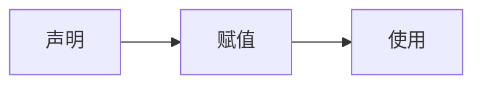

# [Go语言标准库文档中文版 | Go语言中文网 | Golang中文社区 | Golang中国 (studygolang.com)](https://studygolang.com/pkgdoc)

# 一、Hello GoLang

```go
package main

import "fmt" //导入系统包fmt用来输出

func main() { //main主函数 程序入口
   fmt.Println("Hello world")
}
```

# 二、Golang执行流程


或者


# 三、注释

## 3.1 单行注释

```go
// 这是单行注释
```

## 3.2 多行注释

```go
 /*
 这是多行注释
 这是多行注释
 这是多行注释
 */
```


# 四、变量



## 4.1 变量的定义

Go语言是**静态类型**语言，所有的类型都需要明确的去定义

声明一个变量一般是使用**var**关键字

```go
var name type
var 变量名 变量类型
```

* var是声明变量的关键字，是固定的写法
* name，变量的名字
* type，变量的类型
  
  

同时定义多个变量

```go
var(
addr String
phone String
)
```

如果没有显式的给变量赋值，系统自动赋予它该类型的默认值

* 整形和浮点型变量的默认值为0和0.0
* 字符串变量的默认值为空字符串
* 布尔型变量默认为false
* 切片、函数、指针变量的默认为nil

## 4.2 变量的初始化

```go
// 第一种：指定变量类型并赋值
var age int = 18
// 第二种：指定变量类型不赋值，使用默认值
var age int
// 第三种：不写变量类型，go会根据值自动推断
var name = "TX"
// 第四种：省略var，自动推断
gender := "男"
```

### 4.2.1 初始化

```go
var age int
age = 18

var name string = "TX"

var name,age,addr = "TX",18,"china"

var (
        name string = "TX"
        age  int    = 18
        addr string = "china"
    )

name,age,addr := "TX",18,"china"
```

### 4.2.2 短变量声明并初始化

```go
    name := "TX"
    age := 18

    fmt.Println(name, age)
    fmt.Printf("%T,%T", name, age)
```

这是Go语言的推导声明写法，编译器会自动**根据右值的类型推断出左值的类型**

因为简洁和灵活的特点，简短变量声明被广泛用于大部分的**局部变量的声明和初始化**

### 4.2.3 格式化打印占位符

```go
    %v,原样输出
    %T，打印类型
    %t,bool类型
    %s，字符串
    %f，浮点
    %d，10进制的整数
    %b，2进制的整数
    %o，8进制
    %x，%X，16进制
         %x：0-9，a-f
         %X：0-9，A-F
    %c，打印字符
    %p，打印地址
```

### 4.2.4 格式化打印占位符

```go
  var age int
    age = 100
    // &取地址符
    fmt.Printf("age：%d,内存地址：%p\n", age, &age)
    age = 200
    fmt.Printf("age：%d,内存地址：%p", age, &age)
```

## 4.3 变量的交换

在其他语言中需要中间变量

如java:

```java
 int a = 100;
 int b = 200;
 // 交换变量
 int temp = a;
 a = b;
 b = temp;
 System.out.println("a= " + a + ", b = " + b);
```

在go中

```go
  var a int = 100
    var b int = 200

    b, a = a, b
    fmt.Println(a, b)
```

## 4.4 匿名变量

匿名变量的特点是一个下划线 “_”，它本身就是一个特殊的标识符。

它可以像其他标识符那样用于变量的声明或赋值（任何类型都可以赋值给它），**但任何赋给这个标识符的值都将被抛弃**，因此这些值不能在后续的代码中使用。

```go
func test() (int, int) {
    return 100, 200
}

func main() {
    a, _ := test()
    _, b := test()
    fmt.Println(a, b) //100 200
}
```

在编码的过程中，可能会遇到没有名称的变量、类型或者方法。虽然这不是必须的，但有时候这样做可以**极大地增强代码的灵活性**，这些变量被统称为**匿名变量**。 
匿名变量**不占用内存空间**，不会分配内存。匿名变量与匿名变量之间也不会因为多次声明而无法使用。

## 4.5 变量的作用域

**一个变量（常量、类型或函数）在程序中都有一定的作用范围，称之为作用域**

> 局部变量

在函数体内声明的变量称之为局部变量，它们的作用域只在函数体内，函数的参数和返回值变量都属于局部变量

```go
func main() {

    //声明局部变量
    var a int = 3
    var b int = 4

    //声明局部变量
    c := a + b

    fmt.Printf("a = %d,b = %d,c = %d", a, b, c) 
    //a = 3,b = 4,c = 7
}
```

> 全局变量

在**函数体外声明的变量**称之为全局变量，只需要在一个源文件中定义，就可以在所有源文件中使用，当然，不包含这个全局变量的源文件**需要使用 import 关键字** 引入 

全局变量必须以 var 关键字开头，如果想要在外部包中使用全局变量的首字母必须大写

```go
// 声明全局变量
var c int

func main() {

    //声明局部变量
    var a, b int
    a = 3
    b = 4
    c = a + b
    fmt.Printf("a = %d,b = %d,c = %d", a, b, c) //a = 3,b = 4,c = 7
}
```

Go语言程序中**全局变量与局部变量名称可以相同**，但是**函数体内的局部变量**会被优先考虑！

```go
// 声明全局变量
var a float32 = 3.14

func main() {
    //声明局部变量
    var a int = 3
    fmt.Println(a)  //3
}
```

# 五、常量

## 5.1 常量的定义

常量中的数据类型只可以是**布尔型、数字型（整数型、浮点型和复数）和字符串型**

```go
const identifier [type] = value
```

可以省略[说明符][type] ，因为编译器可以根据变量的值来推断其类型
多个相同类型的声明可以简写为： 

```go
const c_name1, c_name2 = value1, value2
```

## 5.2 iota特殊常量

iota是特殊常量，可以认为是一个可以被编译器修改的常量，**iota是Go语言的常量计数器**
**iota在const关键字出现时将被重置为0**

```go
func main() {
	const (
		a = iota
		b
		c
		e = "TX"
		d
		f = "dream"
		g
		h = iota
	)

	const (
		i = iota
		j
	)
	fmt.Println(a, b, c, d, e, f, g, h) //0 1 2 TX TX dream dream 7
	fmt.Println(i, j)                   //0 1
}
```

# 六、数据类型


## 6.1 数值型

### 6.1.1 整数类型

####  有符号整数类型

| 类型  | 有无符号 | 占用储存空间 | 表数范围                                     |
| ----- | -------- | ------------ | -------------------------------------------- |
| int8  | 有       | 1字节        | -2^7^ ~ 2^7^ -1 (-128 ~ 127)                 |
| int16 | 有       | 2字节        | -2^15^ ~ 2^15^ -1 (-32768 ~ 32767)           |
| int32 | 有       | 4字节        | -2^31^ ~ 2^31^ -1 (-2147483648 ~ 2147483647) |
| int64 | 有       | 8字节        | -2^63^ ~ 2^63^ -1                            |

#### 无符号整数类型

| 类型   | 有无符号 | 占用储存空间 | 表数范围     |
| ------ | -------- | ------------ | ------------ |
| uint8  | 无       | 1字节        | 0 ~ 255      |
| uint16 | 无       | 2字节        | 0 ~ 2^16^ -1 |
| uint32 | 无       | 4字节        | 0 ~ 2^32^ -1 |
| uint64 | 无       | 8字节        | 0 ~ 2^64^ -1 |

#### 其他整数类型

| 类型 | 有无符号 | 占用存储空间                       | 表数范围                                 |
| ---- | -------- | ---------------------------------- | ---------------------------------------- |
| int  | 有       | 32位系统 4字节<br />64位系统 8字节 | -2^31^ ~ 2^31^ -1<br />-2^63^ ~ 2^63^ -1 |
| uint | 无       | 32位系统 4字节<br />64位系统 8字节 | 0 ~ 2^32^ -1<br />0 ~ 2^64^ -1           |
| rune | 有       | 等价int32                          | -2^31^ ~ 2^31^ -1                        |
| byte | 无       | 等价uint8                          | 0 ~ 255                                  |

### 6.2.2 浮点类型

| 类型    | 存储空间 | 表数范围               |
| ------- | -------- | ---------------------- |
| float32 | 4字节    | -3.403E38 ~ 3.403E38   |
| float64 | 8字节    | -1.798E308 ~ 1.798E308 |

+ 底层存储空间和操作系统无关

+ 浮点类型底层存储：符号位+指数位+尾数位，所以尾数位只是存了 一个大概，很可能会出现精度的损失。

```go
package main
import "fmt"
func main() {
   //定义浮点类型的数据：
   var num1 float32 = 3.14
   fmt.Println(num1)
   //可以表示正浮点数，也可以表示负的浮点数
   var num2 float32 = -3.14
   fmt.Println(num2)
   //浮点数可以用十进制表示形式，也可以用科学计数法表示形式  E 大写小写都可以的
   var num3 float32 = 314E-2
   fmt.Println(num3)
   var num4 float32 = 314E+2
   fmt.Println(num4)
   var num5 float32 = 314e+2
   fmt.Println(num5)
   var num6 float64 = 314e+2
   fmt.Println(num6)
   //浮点数可能会有精度的损失，所以通常情况下，建议你使用：float64
   var num7 float32 = 256.000000916
   fmt.Println(num7)
   var num8 float64 = 256.000000916
   fmt.Println(num8)
   //golang中默认的浮点类型为：float64
   var num9 = 3.17
   fmt.Printf("num9对应的默认的类型为：%T", num9)
}
3.14
31400
31400
31400
256
256.000000916
num9对应的默认的类型为：float64
```

## 6.2 布尔类型

```go
// true 和 false
// 默认值是 false
func main() {
	var isFlag bool = true
	fmt.Println(isFlag) //true
	fmt.Printf("%T,%t\n", isFlag, isFlag)  //bool,true
}
```

## 6.3字符串类型

