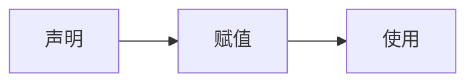

# 一、Hello GoLang

```go
package main

import "fmt" //导入系统包fmt用来输出

func main() { //main主函数 程序入口
   fmt.Println("Hello world")
}
```

# 二、Golang执行流程


 或者


# 二、注释

## 2.1 单行注释

```go
// 这是单行注释
```

## 2.2 多行注释

```go
 /*
 这是多行注释
 这是多行注释
 这是多行注释
 */
```


# 三、变量

Go语言是**静态类型**语言，所有的类型都需要明确的去定义

声明一个变量一般是使用**var**关键字

```go
var name type
```

* var是声明变量的关键字，是固定的写法
* name，变量的名字
* type，变量的类型


显示




