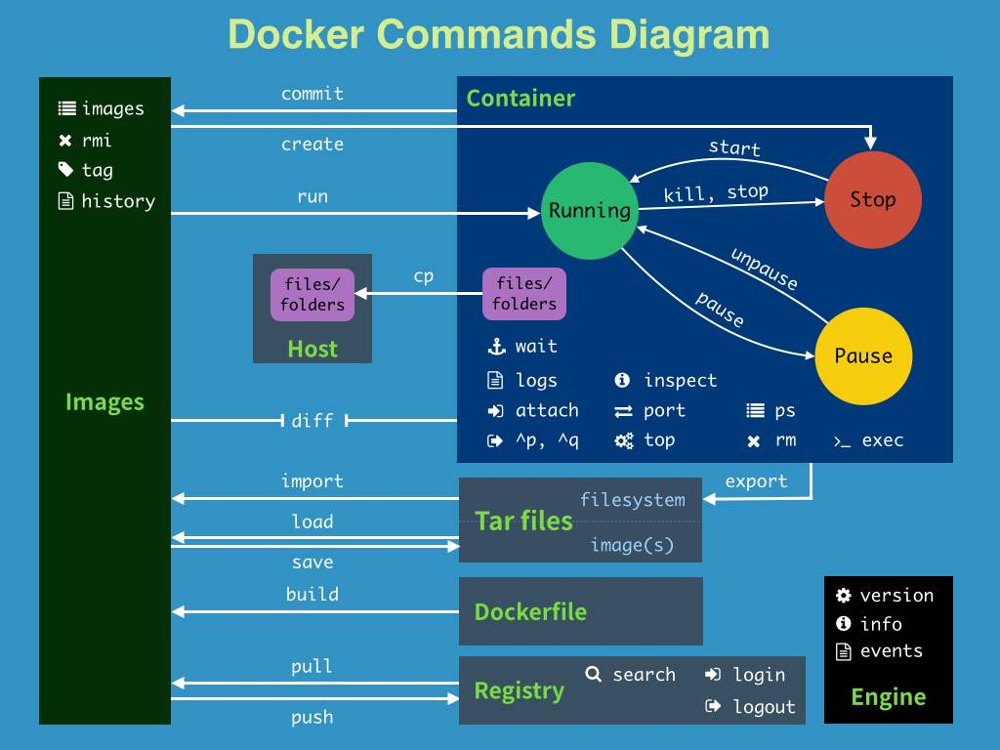

[toc]

官网 : [Home - Docker](https://www.docker.com/)

# 一、安装与拆卸

[帮助文档](https://docs.docker.com/engine/install/centos/)

## 安装

```shell
# 1. 卸载旧的版本
 sudo yum remove docker \
                  docker-client \
                  docker-client-latest \
                  docker-common \
                  docker-latest \
                  docker-latest-logrotate \
                  docker-logrotate \
                  docker-engine
                  
# 2. 需要的安装包
sudo yum install -y yum-utils

# 3. 设置镜像仓库
# 国外镜像
sudo yum-config-manager \
    --add-repo \
    https://download.docker.com/linux/centos/docker-ce.repo
# 阿里云镜像
sudo yum-config-manager \
     --add-repo \
     https://mirrors.aliyun.com/docker-ce/linux/centos/docker-ce.repo
   
# 更新域名软件包索引
yum makecache fast

# 4. 安装docker相关 docker-ce社区版 ee企业版
sudo yum install docker-ce docker-ce-cli containerd.io docker-compose-plugin

# 5.启动docker
sudo systemctl start docker

# 6. 看是否安装成功
docker version

# 7. hello-world 验证Docker引擎是否正确安装
sudo docker run hello-world

```


## 卸载

```shell
# 1. 卸载依赖
sudo yum remove docker-ce docker-ce-cli containerd.io docker-compose-plugin

# 2. 删除资源
sudo rm -rf /var/lib/docker
sudo rm -rf /var/lib/containerd

# /var/lib/docker docker的默认工作路径
```


# 二、Docker的常用命令


## 2.1、帮助命令

```shell
docker version          #查看docker的版本信息
docker info             #查看docker的系统信息,包括镜像和容器的数量
docker 命令 --help       #帮助命令(可查看可选的参数)
docker COMMAND --help
```

命令行帮助文档地址（Command-line reference）：https://docs.docker.com/reference/


## 2.2、镜像命令

Docker hub : https://hub.docker.com/

```shell
[root@tan00xu ~]# docker images
REPOSITORY    TAG       IMAGE ID       CREATED         SIZE
hello-world   latest    feb5d9fea6a5   12 months ago   13.3kB

#解释:
1.REPOSITORY  镜像的仓库源

2.TAG  镜像的标签

3.IMAGE ID 镜像的id

4.CREATED 镜像的创建时间

5.SIZE 镜像的大小


# 可选参数

-a , --all 列出所有镜像

-q , --quiet 只显示镜像的id
```


### 2.2.1、**docker search** 搜索镜像

```shell
[root@tan00xu ~]# docker search mysql

[root@linuxlearn ~]# docker search mysql
NAME                            DESCRIPTION                                     STARS     OFFICIAL   AUTOMATED
mysql                           MySQL is a widely used, open-source relation…   13206     [OK]
mariadb                         MariaDB Server is a high performing open sou…   5048      [OK]
phpmyadmin                      phpMyAdmin - A web interface for MySQL and M…   629       [OK]
percona                         Percona Server is a fork of the MySQL relati…   586       [OK]
bitnami/mysql                   Bitnami MySQL Docker Image                      77                   [OK]


```

```shell
Search the Docker Hub for images

Options:
  -f, --filter filter   Filter output based on conditions provided
      --format string   Pretty-print search using a Go template
      --limit int       Max number of search results (default 25)
      --no-trunc        Don't truncate output
      
# 搜索收藏数大于3000的镜像
docker search mysql --filter=STARS=3000
```


### 2.2.2、**docker pull 镜像名[:tag]** 下载镜像

```shell
# 下载镜像 docker pull 镜像名[:tag] 
[root@tan00xu ~]# docker pull mysql
Using default tag: latest  		#如果不写tag默认就是latest
latest: Pulling from library/mysql
051f419db9dd: Pull complete		#分层下载,docker image的核心-联合文件系统
7627573fa82a: Pull complete
a44b358d7796: Pull complete
95753aff4b95: Pull complete
a1fa3bee53f4: Pull complete
f5227e0d612c: Pull complete
b4b4368b1983: Pull complete
f26212810c32: Pull complete
d803d4215f95: Pull complete
d5358a7f7d07: Pull complete
435e8908cd69: Pull complete
Digest: sha256:b9532b1edea72b6cee12d9f5a78547bd3812ea5db842566e17f8b33291ed2921	#签名
Status: Downloaded newer image for mysql:latest
docker.io/library/mysql:latest	#下载来源的真实地址

# 这两个命令一样
docker pull mysql
docker pull docker.io/library/mysql:latest

# 指定版本下载
docker pull mysql:5.7
```


2.5、**docker rmi** 删除镜像

```shell
# 1. 删除指定的镜像id
docker rmi -f  镜像id

# 2. 删除多个镜像id
docker rmi -f  镜像id 镜像id 镜像id

# 3. 删除全部的镜像id
docker rmi -f  $(docker images -aq)
```


## 2.3、容器命令


### 2.3.1、拉取一个centos镜像

```shell
docker pull centos
```


### 2.3.2、运行容器的命令说明

```shell
docker run [可选参数] image

#参数说明
--name="名字"           指定容器名字
-d                     后台方式运行
-it                    使用交互方式运行,进入容器查看内容
-p                     指定容器的端口 -p 8080:8080
    (
    -p ip:主机端口:容器端口  配置主机端口映射到容器端口
    -p 主机端口:容器端口 (常用) 
    -p 容器端口
    )
-P                     随机指定端口(大写的P)
```


### 2.3.3、测试，启动并进入容器

```shell
docker run -it centos /bin/bash
# 查看容器内的centos，基础版本，很多命令都是不完善的
ls      
bin  dev  etc  home  lib  lib64  lost+found  media  mnt  opt  proc  root  run  sbin  srv  sys  tmp  usr  var
```


### 2.3.4、退出容器

```shell
#  停止并退出容器（后台方式运行则仅退出）
exit
# Ctrl+P+Q  不停止容器退出
```


### 2.3.5、列出运行过的容器

```shell
# 列出当前正在运行的容器 
docker ps 
    -a   # 列出当前正在运行的容器 + 历史运行过的容器
    -n=? # 显示最近创建的n个容器
    -q   # 只显示容器的编号
# 列出当前正在运行的容器
docker container list
```


### 2.3.6、删除容器

```shell
# 删除指定的容器,不能删除正在运行的容器,强制删除使用 rm -f
docker rm 容器id
# 删除所有的容器
docker rm -f $(docker ps -aq)   
# 删除所有的容器
docker ps -a -q | xargs docker rm 
```


### 2.3.6、启动和停止容器

```shell
# 启动容器
docker start 容器id      
# 重启容器
docker restart 容器id      
# 停止当前运行的容器
docker stop 容器id    
# 强制停止当前容器
docker kill 容器id           
```


## 2.4、其他常用命令


### 2.4.1、后台启动命令

```shell
# 命令 docker run -d 镜像名
docker run -d centos
# 问题: 使用docker ps. 发现centos 停止了
# 常见的坑，docker容器使用后台运行，就必须要有要一个前台进程，docker发现没有应用，就会自动停止
# nginx，容器启动后，发现自己没有提供服务，就会立刻停止，就是没有程序了
```


### 2.4.2、查看日志

```shell
docker logs --help

Usage:  docker logs [OPTIONS] CONTAINER
Fetch the logs of a container
Options:
      --details        Show extra details provided to logs
  -f, --follow         Follow log output
      --since string   Show logs since timestamp (e.g. 2013-01-02T13:23:37Z) or relative (e.g. 42m for 42 minutes)
  -n, --tail string    Number of lines to show from the end of the logs (default "all")
  -t, --timestamps     Show timestamps
      --until string   Show logs before a timestamp (e.g. 2013-01-02T13:23:37Z) or relative (e.g. 42m for 42 minutes)

常用：
docker logs -tf 容器id
docker logs --tail number 容器id #num为要显示的日志条数

docker logs 
	-tf # 显示日志
	-tail number # 要显示的日志条数
```


### 2.4.3、查看容器中进程信息

```shell
docker top 容器id
```


### 2.4.3、查看容器的元数据

```shell
docker inspect 容器id
```


### 2.4.4、进入当前正在运行的容器

> 通常我们的容器都是使用后台方式来运行的，有时需要进入容器修改配置

#### 方式一

```shell
docker exec -it 容器id /bin/bash
```

#### 方式二

```shell
docker attach 容器id
```

#### 区别

```shell
# 进入容器后开启一个新的终端，可以在里面操作
docker exec 

# 进入容器正在执行的终端，不会启动新的进程
docker attach 
```


### 2.4.5、拷贝操作

```shell
#拷贝容器的文件到主机中
docker cp 容器id:容器内路径  目的主机路径

#拷贝宿主机的文件到容器中
docker cp 目的主机路径 容器id:容器内路径
```


### 2.4.6、总结


