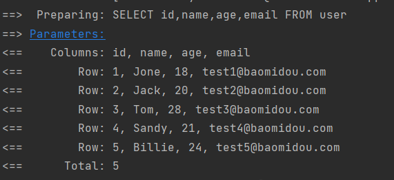
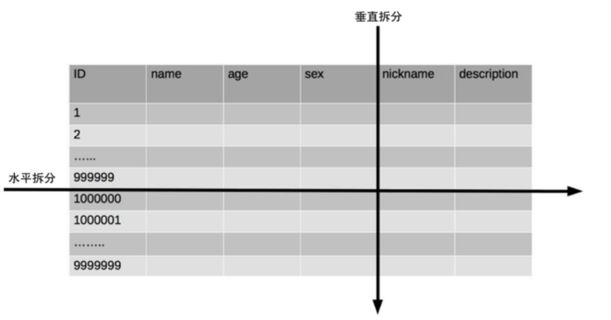
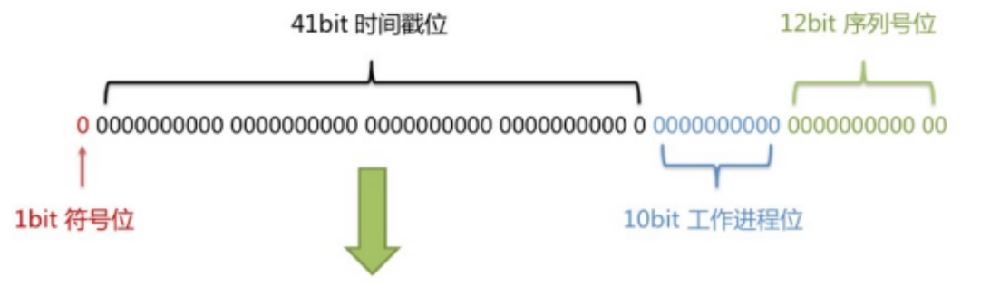
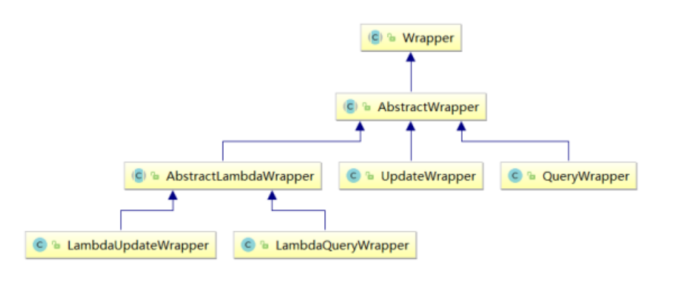

[TOC]

# 一、MyBatis-Plus简介

## 1.1、简介

MyBatis-Plus（简称 MP）是一个 MyBatis的增强工具，在 MyBatis 的基础上只做增强不做改变，为 简化开发、提高效率而生。

> 愿景
> 我们的愿景是成为 MyBatis 最好的搭档，就像 [魂斗罗](https://baomidou.com/img/contra.jpg) 中的 1P、2P，基友搭配，效率翻倍。


## 1.2、特性

- **无侵入**：只做增强不做改变，引入它不会对现有工程产生影响，如丝般顺滑
- **损耗小**：启动即会自动注入基本 CURD，性能基本无损耗，直接面向对象操作
- **强大的 CRUD 操作**：内置通用 Mapper、通用 Service，仅仅通过少量配置即可实现单表大部分 CRUD 操作，更有强大的条件构造器，满足各类使用需求
- **支持 Lambda 形式调用**：通过 Lambda 表达式，方便的编写各类查询条件，无需再担心字段写错
- **支持主键自动生成**：支持多达 4 种主键策略（内含分布式唯一 ID 生成器 - Sequence），可自由配置，完美解决主键问题
- **支持 ActiveRecord 模式**：支持 ActiveRecord 形式调用，实体类只需继承 Model 类即可进行强大的 CRUD 操作
- **支持自定义全局通用操作**：支持全局通用方法注入（ Write once, use anywhere ）
- **内置代码生成器**：采用代码或者 Maven 插件可快速生成 Mapper 、 Model 、 Service 、 Controller 层代码，支持模板引擎，更有超多自定义配置等您来使用
- **内置分页插件**：基于 MyBatis 物理分页，开发者无需关心具体操作，配置好插件之后，写分页等同于普通 List 查询
- **分页插件支持多种数据库**：支持 MySQL、MariaDB、Oracle、DB2、H2、HSQL、SQLite、Postgre、SQLServer 等多种数据库
- **内置性能分析插件**：可输出 SQL 语句以及其执行时间，建议开发测试时启用该功能，能快速揪出慢查询
- **内置全局拦截插件**：提供全表 delete 、 update 操作智能分析阻断，也可自定义拦截规则，预防误操作


## 1.3、支持数据库

> 任何能使用 `MyBatis` 进行 CRUD, 并且支持标准 SQL 的数据库，具体支持情况如下，如果不在下列表查看分页部分教程 PR 您的支持。

- MySQL，Oracle，DB2，H2，HSQL，SQLite，PostgreSQL，SQLServer，Phoenix，Gauss ，ClickHouse，Sybase，OceanBase，Firebird，Cubrid，Goldilocks，csiidb
- 达梦数据库，虚谷数据库，人大金仓数据库，南大通用(华库)数据库，南大通用数据库，神通数据库，瀚高数据库


## 1.4、框架结构


## 1.5、代码及文档地址

官方地址: http://mp.baomidou.com

代码发布地址: 

Github: https://github.com/baomidou/mybatis-plus 

Gitee: https://gitee.com/baomidou/mybatis-plus 

文档发布地址: https://baomidou.com/pages/24112f


# 二、入门案例

## 2.1、 创建数据库及表

```mysql
CREATE DATABASE `mybatis_plus_springboot`;

use `mybatis_plus_springboot`;

CREATE TABLE `user`
(
    `id`    bigint(20) NOT NULL COMMENT '主键ID',
    `name`  varchar(30) DEFAULT NULL COMMENT '姓名',
    `age`   int(11)     DEFAULT NULL COMMENT '年龄',
    `email` varchar(50) DEFAULT NULL COMMENT '邮箱',
    PRIMARY KEY (`id`)
) ENGINE = InnoDB
  DEFAULT CHARSET = utf8;

INSERT INTO user (id, name, age, email)
VALUES (1, 'Jone', 18, 'test1@baomidou.com'),
       (2, 'Jack', 20, 'test2@baomidou.com'),
       (3, 'Tom', 28, 'test3@baomidou.com'),
       (4, 'Sandy', 21, 'test4@baomidou.com'),
       (5, 'Billie', 24, 'test5@baomidou.com');
```


## 2.2、创建Springboot项目机导入依赖

```xml
<dependencies>
    <dependency>
        <groupId>org.springframework.boot</groupId>
        <artifactId>spring-boot-starter</artifactId>
    </dependency>

    <dependency>
        <groupId>org.springframework.boot</groupId>
        <artifactId>spring-boot-starter-test</artifactId>
        <scope>test</scope>
    </dependency>

    <dependency>
        <groupId>com.baomidou</groupId>
        <artifactId>mybatis-plus-boot-starter</artifactId>
        <version>3.5.1</version>
    </dependency>

    <dependency>
        <groupId>org.projectlombok</groupId>
        <artifactId>lombok</artifactId>
        <optional>true</optional>
    </dependency>

    <dependency>
        <groupId>mysql</groupId>
        <artifactId>mysql-connector-java</artifactId>
    </dependency>
</dependencies>
```


## 3.2、编写代码

### 3.2.1、配置application.yaml

```yaml
spring:
  #配置数据源信息
  datasource:
    type: com.zaxxer.hikari.HikariDataSource
    url: jdbc:mysql://localhost:3306/mybatis_plus_springboot?serverTimezone=GMT%2B8&characterEncoding=utf-8&&useUnicode=true
    driver-class-name: com.mysql.cj.jdbc.Driver
    username: root
    password: 123123
```


### 3.2.2、实体类

```java
@Data
@AllArgsConstructor
@NoArgsConstructor
public class User {
    /**
     * id
     */
    private Long id;
    /**
     * 名字
     */
    private String name;
    /**
     * 年龄
     */
    private Integer age;
    /**
     * 电子邮件
     */
    private String email;

}
```


### 3.3.3、启动类配置扫描包

> 在Spring Boot启动类中添加`@MapperScan`注解，扫描mapper包

```java
@SpringBootApplication
@MapperScan(basePackages = "com.tan00xu.mapper")
public class MyBatisPlusApplication {
    public static void main(String[] args) {
        SpringApplication.run(MyBatisPlusApplication.class, args);
    }
}
```


### 3.3.4、添加mapper

> BaseMapper是MyBatis-Plus提供的模板mapper，其中包含了基本的CRUD方法，泛型为操作的 实体类型

```java
public interface UserMapper extends BaseMapper<User> {
}
```


### 3.3.5、测试

```java
@SpringBootTest
public class MyBatisPlusTests {

    @Autowired
    private UserMapper userMapper;

    @Test
    public void testSelectList() {
        //selectList()根据MyBatis-Plus内置的条件构造器查询一个list集合，null表示没有条件，即查询所有
        List<User> users = userMapper.selectList(null);
        users.forEach(System.out::println);
    }
}
```


### 3.3.6、添加日志

> 在application.yml中配置日志输出

```yaml
mybatis-plus:
  configuration:
    # 配置MyBatis日志
    log-impl: org.apache.ibatis.logging.stdout.StdOutImpl
```




# 三、基本CRUD

## 3.1、BaseMapper

> MyBatis-Plus中的基本CRUD在内置的BaseMapper中都已得到了实现，我们可以直接使用


```java
package com.baomidou.mybatisplus.core.mapper;

public interface BaseMapper<T> extends Mapper<T> {

    /**
     * 插入一条记录
     *
     * @param entity 实体对象
     */
    int insert(T entity);

    /**
     * 根据 ID 删除
     *
     * @param id 主键ID
     */
    int deleteById(Serializable id);

    /**
     * 根据实体(ID)删除
     *
     * @param entity 实体对象
     * @since 3.4.4
     */
    int deleteById(T entity);

    /**
     * 根据 columnMap 条件，删除记录
     *
     * @param columnMap 表字段 map 对象
     */
    int deleteByMap(@Param(Constants.COLUMN_MAP) Map<String, Object> columnMap);

    /**
     * 根据 entity 条件，删除记录
     *
     * @param queryWrapper 实体对象封装操作类（可以为 null,里面的 entity 用于生成 where 语句）
     */
    int delete(@Param(Constants.WRAPPER) Wrapper<T> queryWrapper);

    /**
     * 删除（根据ID或实体 批量删除）
     *
     * @param idList 主键ID列表或实体列表(不能为 null 以及 empty)
     */
    int deleteBatchIds(@Param(Constants.COLLECTION) Collection<?> idList);

    /**
     * 根据 ID 修改
     *
     * @param entity 实体对象
     */
    int updateById(@Param(Constants.ENTITY) T entity);

    /**
     * 根据 whereEntity 条件，更新记录
     *
     * @param entity        实体对象 (set 条件值,可以为 null)
     * @param updateWrapper 实体对象封装操作类（可以为 null,里面的 entity 用于生成 where 语句）
     */
    int update(@Param(Constants.ENTITY) T entity, @Param(Constants.WRAPPER) Wrapper<T> updateWrapper);

    /**
     * 根据 ID 查询
     *
     * @param id 主键ID
     */
    T selectById(Serializable id);

    /**
     * 查询（根据ID 批量查询）
     *
     * @param idList 主键ID列表(不能为 null 以及 empty)
     */
    List<T> selectBatchIds(@Param(Constants.COLLECTION) Collection<? extends Serializable> idList);

    /**
     * 查询（根据 columnMap 条件）
     *
     * @param columnMap 表字段 map 对象
     */
    List<T> selectByMap(@Param(Constants.COLUMN_MAP) Map<String, Object> columnMap);

    /**
     * 根据 entity 条件，查询一条记录
     * <p>查询一条记录，例如 qw.last("limit 1") 限制取一条记录, 注意：多条数据会报异常</p>
     *
     * @param queryWrapper 实体对象封装操作类（可以为 null）
     */
    default T selectOne(@Param(Constants.WRAPPER) Wrapper<T> queryWrapper) {
        List<T> ts = this.selectList(queryWrapper);
        if (CollectionUtils.isNotEmpty(ts)) {
            if (ts.size() != 1) {
                throw ExceptionUtils.mpe("One record is expected, but the query result is multiple records");
            }
            return ts.get(0);
        }
        return null;
    }

    /**
     * 根据 Wrapper 条件，判断是否存在记录
     *
     * @param queryWrapper 实体对象封装操作类
     * @return
     */
    default boolean exists(Wrapper<T> queryWrapper) {
        Long count = this.selectCount(queryWrapper);
        return null != count && count > 0;
    }

    /**
     * 根据 Wrapper 条件，查询总记录数
     *
     * @param queryWrapper 实体对象封装操作类（可以为 null）
     */
    Long selectCount(@Param(Constants.WRAPPER) Wrapper<T> queryWrapper);

    /**
     * 根据 entity 条件，查询全部记录
     *
     * @param queryWrapper 实体对象封装操作类（可以为 null）
     */
    List<T> selectList(@Param(Constants.WRAPPER) Wrapper<T> queryWrapper);

    /**
     * 根据 Wrapper 条件，查询全部记录
     *
     * @param queryWrapper 实体对象封装操作类（可以为 null）
     */
    List<Map<String, Object>> selectMaps(@Param(Constants.WRAPPER) Wrapper<T> queryWrapper);

    /**
     * 根据 Wrapper 条件，查询全部记录
     * <p>注意： 只返回第一个字段的值</p>
     *
     * @param queryWrapper 实体对象封装操作类（可以为 null）
     */
    List<Object> selectObjs(@Param(Constants.WRAPPER) Wrapper<T> queryWrapper);

    /**
     * 根据 entity 条件，查询全部记录（并翻页）
     *
     * @param page         分页查询条件（可以为 RowBounds.DEFAULT）
     * @param queryWrapper 实体对象封装操作类（可以为 null）
     */
    <P extends IPage<T>> P selectPage(P page, @Param(Constants.WRAPPER) Wrapper<T> queryWrapper);

    /**
     * 根据 Wrapper 条件，查询全部记录（并翻页）
     *
     * @param page         分页查询条件
     * @param queryWrapper 实体对象封装操作类
     */
    <P extends IPage<Map<String, Object>>> P selectMapsPage(P page, @Param(Constants.WRAPPER) Wrapper<T> queryWrapper);
}
```


## 3.2、增删改查

```java
  /**
     * 测试插入
     */
    @Test
    public void testInsert() {
        User user = new User();
        user.setName("张三");
        user.setAge(18);
        user.setEmail("zhangsan@66.com");
        int insert = userMapper.insert(user);
        System.out.println("insert=>" + insert);
        System.out.println("userId=>" + user.getId());
    }

    /**
     * 测试删除
     */
    @Test
    public void testDelete() {
        //通过id删除用户信息
//        int i = userMapper.deleteById(1572025049776680962L);
//        System.out.println("result=>" + i);

        //根据map集合中设置的条件删除用户信息
//        HashMap<String, Object> map = new HashMap<>();
//        map.put("name", "张三");
//        map.put("age", 18);
//        userMapper.deleteByMap(map);

        //通过多个id实现批量删除
//        List<Long> list = Arrays.asList(1L, 2L, 3L);
//        userMapper.deleteBatchIds(list);
    }

    /**
     * 测试更新
     */
    @Test
    public void testUpdate() {
        User user = new User();
        user.setId(4L);
        user.setName("李四");
        user.setEmail("lisi@66.com");
        userMapper.updateById(user);
    }

    /**
     * 测试选择
     */
    @Test
    public void testSelect() {
        //通过id查询用户信息 SELECT id,name,age,email FROM user WHERE id=?
//        User user = userMapper.selectById(1L);
//        System.out.println(user);

        //根据多个id查询多个用户信息
//        List<Long> list = Arrays.asList(1L, 2L, 3L);
//        userMapper.selectBatchIds(list).forEach(System.out::println);

        //根据map集合中的条件查询
//        HashMap<String, Object> map = new HashMap<>();
//        map.put("age", 21);
//        List<User> users = userMapper.selectByMap(map);
//        users.forEach(System.out::println);

        //查所有
        List<User> users = userMapper.selectList(null);
        users.forEach(System.out::println);
    }
```


## 3.3、通用Service

> MyBatis-Plus中有一个接口 IService和其实现类 ServiceImpl，封装了常见的业务层逻辑


### 3.3.1、创建Service接口和实现类

```java
/**
 * UserService继承IService模板提供的基础功能
 */
public interface UserService extends IService<User> {
}
```

```java
/**
 * ServiceImpl实现了IService，提供了IService中基础功能的实现
 * 若ServiceImpl无法满足业务需求，则可以使用自定的UserService定义方法，并在实现类中实现
 */
@Service
public class UserServiceImpl extends ServiceImpl<UserMapper, User> implements UserService {
}
```


### 3.3.2、测试

```java
@SpringBootTest
public class MyBatisPlusServiceTest {
    @Autowired
    private UserService userService;

    @Test
    public void testGetCount() {
        long count = userService.count();
        System.out.println("count => " + count);
    }

    @Test
    public void testInsertBatch() {
        //批量添加
        ArrayList<User> users = new ArrayList<>();
        for (int i = 0; i < 10; i++) {
            User user = new User();
            user.setName("ym" + i);
            user.setAge(i);
            users.add(user);
        }
        boolean b = userService.saveBatch(users);
        System.out.println(b);
    }
}
```


# 四、常用注解


## 4.1、@TableName

> 经过以上的测试，在使用MyBatis-Plus实现基本的CRUD时，我们并没有指定要操作的表，只是在 Mapper接口继承BaseMapper时，设置了泛型User，而操作的表为user表 由此得出结论，MyBatis-Plus在确定操作的表时，由BaseMapper的泛型决定，即实体类型决 定，且默认操作的表名和实体类型的类名一致


### 4.1.1、通过注解解决表名和实体类名不一致的问题

> 在实体类类型上添加@TableName("t_user")，标识实体类对应的表

```java
@TableName("t_user")
public class User {
}
```


### 4.1.2、通过全局配置解决问题

> 在开发的过程中，我们经常遇到以上的问题，即实体类所对应的表都有固定的前缀，例如t_或tbl_ 此时，可以使用MyBatis-Plus提供的**全局配置**，为*实体类所对应的表名设置默认的前缀*，那么就 不需要在每个实体类上通过@TableName标识实体类对应的表

```yaml
mybatis-plus:
  configuration:
    # 配置MyBatis日志
    log-impl: org.apache.ibatis.logging.stdout.StdOutImpl
  #设置MyBatis-Plus的全局配置
  global-config:
    db-config:
      #设置实体类锁对应的表统一前缀
      table-prefix: t_
```


## 4.2、@TableId

>MyBatis-Plus在实现CRUD时，会默认将id作为主键列，并在插入数据时，默认 基于**雪花算法**的策略生成id

==**若实体类和表中表示主键的不是id，而是其他字段，例如uid，MyBatis-Plus就不能自动识别uid为主 键列**==


### 4.2.1、通过@TableId解决问题

> 在实体类中uid属性上通过`@TableId`将其标识为*主键*


### 4.2.2、@TableId的value属性

> 若实体类中主键对应的属性为*id*，而表中表示主键的字段为*uid*，
>
> 此时若只在属性*id*上添加注解` @TableId`，则抛出异常Unknown column 'id' in 'field list'，
>
> 即MyBatis-Plus仍然会将id作为表的 主键操作，而表中表示主键的是字段uid 
>
> 此时需要通过`@TableId`注解的value属性，指定表中的主键字段，
>
> `@TableId("uid")` 或 `@TableId(value="uid")`


### 4.2.3、@TableId的type属性

> type属性用来定义主键策略


#### 常用的主键策略：

| 值                        | 描述                                                         |
| ------------------------- | ------------------------------------------------------------ |
| IdType.ASSIGN_ID（默 认） | 基于雪花算法的策略生成数据id，与数据库id是否设置自增无关     |
| IdType.AUTO               | 使用数据库的自增策略，注意，该类型请确保数据库设置了id自增， 否则无效 |


#### 配置全局主键策略：

```yaml
#设置MyBatis-Plus的全局配置
global-config:
  db-config:
    #设置实体类锁对应的表统一前缀
    table-prefix: t_
    # 配置MyBatis-Plus的主键策略
    id-type: auto
```


### 4.2.4、雪花算法


#### 4.2.4.1、背景

 需要选择合适的方案去应对数据规模的增长，以应对逐渐增长的访问压力和数据量。 数据库的扩展方式主要包括：业务分库、主从复制，数据库分表。


#### 4.2.4.2、数据库分表 

将不同业务数据分散存储到不同的数据库服务器，能够支撑百万甚至千万用户规模的业务，但如果业务 继续发展，同一业务的单表数据也会达到单台数据库服务器的处理瓶颈。例如，淘宝的几亿用户数据， 如果全部存放在一台数据库服务器的一张表中，肯定是无法满足性能要求的，此时就需要对单表数据进 行拆分。

 单表数据拆分有两种方式：垂直分表和水平分表。示意图如下：




#### 4.2.4.3、垂直分表 

垂直分表适合将表中某些不常用且占了大量空间的列拆分出去。

 例如，前面示意图中的 nickname 和 description 字段，假设我们是一个婚恋网站，用户在筛选其他用 户的时候，主要是用 age 和 sex 两个字段进行查询，而 nickname 和 description 两个字段主要用于展 示，一般不会在业务查询中用到。description 本身又比较长，因此我们可以将这两个字段独立到另外 一张表中，这样在查询 age 和 sex 时，就能带来一定的性能提升。


#### 4.2.4.4、水平分表

水平分表适合表行数特别大的表，有的公司要求单表行数超过 5000 万就必须进行分表，这个数字可以 作为参考，但并不是绝对标准，关键还是要看表的访问性能。

对于一些比较复杂的表，可能超过 1000 万就要分表了；而对于一些简单的表，即使存储数据超过 1 亿行，也可以不分表。

 但不管怎样，当看到表的数据量达到千万级别时，作为架构师就要警觉起来，因为这很可能是架构的性 能瓶颈或者隐患。 

水平分表相比垂直分表，会引入更多的复杂性，例如要求全局唯一的数据id该如何处理


#### 4.2.4.5、主键自增

1. 以最常见的用户 ID 为例，可以按照 1000000 的范围大小进行分段，1 ~ 999999 放到表 1中， 1000000 ~ 1999999 放到表2中，以此类推。 
2. 复杂点：分段大小的选取。分段太小会导致切分后子表数量过多，增加维护复杂度；分段太大可能会导致单表依然存在性能问题，一般建议分段大小在 100 万至 2000 万之间，具体需要根据业务选取合适 的分段大小。 
3. 优点：可以随着数据的增加平滑地扩充新的表。例如，现在的用户是 100 万，如果增加到 1000 万， 只需要增加新的表就可以了，原有的数据不需要动。 
4. 缺点：分布不均匀。假如按照 1000 万来进行分表，有可能某个分段实际存储的数据量只有 1 条，而 另外一个分段实际存储的数据量有 1000 万条。


#### 4.2.4.6、取模

1. 同样以用户 ID 为例，假如我们一开始就规划了 10 个数据库表，可以简单地用 user_id % 10 的值来 表示数据所属的数据库表编号，ID 为 985 的用户放到编号为 5 的子表中，ID 为 10086 的用户放到编号 为 6 的子表中。 
2. 复杂点：初始表数量的确定。表数量太多维护比较麻烦，表数量太少又可能导致单表性能存在问题。 
3. 优点：表分布比较均匀。 
4. 缺点：扩充新的表很麻烦，所有数据都要重分布。


#### 4.2.4.7、雪花算法


> 雪花算法是由Twitter公布的分布式主键生成算法，它能够保证不同表的主键的不重复性，以及相同表的 主键的有序性。


1. 核心思想： 
   + 长度共64bit（一个long型）。 
   + 首先是一个符号位，1bit标识，由于long基本类型在Java中是带符号的，最高位是符号位，正数是0，负 数是1，所以id一般是正数，最高位是0。
   + 41bit时间截(毫秒级)，存储的是时间截的差值（当前时间截 - 开始时间截)，结果约等于69.73年。 
   + 10bit作为机器的ID（5个bit是数据中心，5个bit的机器ID，可以部署在1024个节点）。 
   + 12bit作为毫秒内的流水号（意味着每个节点在每毫秒可以产生 4096 个 ID）。




2. 优点：整体上按照时间自增排序，并且整个分布式系统内不会产生ID碰撞，并且效率较高。


## 4.3、@TableField

> MyBatis-Plus在执行SQL语句时，要保证实体类中的属性名和 表中的字段名一致 
>
> 如果实体类中的属性名和字段名不一致的情况，会出现什么问题呢？


### 4.3.1、情况1 驼峰与下划线命名风格

> 若实体类中的属性使用的是驼峰命名风格，而表中的字段使用的是下划线命名风格 
>
> 例如实体类属性userName，表中字段user_name 
>
> 此时MyBatis-Plus会自动将下划线命名风格转化为驼峰命名风格 
>
> 相当于在MyBatis中配置


4.3.2、情况2 不一致的命名

> 若实体类中的属性和表中的字段不满足情况1 
>
> 例如实体类属性name，表中字段username 
>
> 此时需要在实体类属性上使用`@TableField("username")`设置属性所对应的字段名


## 4.4、@TableLogic


### 4.4.1、逻辑删除

+ 物理删除：真实删除，将对应数据从数据库中删除，之后查询不到此条被删除的数据 
+ 逻辑删除：假删除，将对应数据中代表是否被删除字段的状态修改为“被删除状态”，之后在数据库 中仍旧能看到此条数据记录 
+ 使用场景：可以进行数据恢复


### 4.4.2、实现逻辑删除

```java
public class User {
    /**
     * id
     */
    private Long id;
    /**
     * 名字
     */
    private String name;
    /**
     * 年龄
     */
    private Integer age;
    /**
     * 电子邮件
     */
    private String email;

    /**
     * 是否被删除 逻辑删除字段 0为正常 1为被删除
     */
    @TableLogic
    private Integer isDeleted;

}
```


### 4.4.3、测试


#### 删除

执行 `userMapper.deleteById(1L);`

实际执行的是更新操作`UPDATE user SET is_deleted=1 WHERE id=? AND is_deleted=0`


#### 查询

执行 `userMapper.selectById(1L);`

实际执行的是 `SELECT id,name,age,email,is_deleted FROM user WHERE id=? AND is_deleted=0`


# 五、条件构造器和常用接口


## 5.1、wapper介绍



> Wrapper ： 条件构造抽象类，最顶端父类 
>
> > AbstractWrapper ： 用于查询条件封装，生成 sql 的 where 条件
> >
> > > QueryWrapper ： 查询条件封装 
> > >
> > > UpdateWrapper ： Update 条件封装 
> > >
> > > AbstractLambdaWrapper ： 使用Lambda 语法 
> > >
> > > > LambdaQueryWrapper ：用于Lambda语法使用的查询Wrapper LambdaUpdateWrapper ： Lambda 更新封装Wrapper


## 5.2、QueryWrapper


### 5.2.1、查询

```java
@Test
public void testSelect() {
    //查询用户名包含a，年龄在20到30之间，并且邮箱不为null的用户信息
    //SELECT id,name,age,email,is_deleted 
    // FROM user WHERE is_deleted=0 
    // AND (name LIKE ? AND age BETWEEN ? AND ? AND email IS NOT NULL)
    QueryWrapper<User> queryWrapper = new QueryWrapper<>();
    queryWrapper.like("name", "a")
            .between("age", 20, 30)
            .isNotNull("email");

    userMapper.selectList(queryWrapper).forEach(System.out::println);
}
```


### 5.2.2、查询并排序

```java
@Test
public void testSelectSort() {
    //按年龄降序查询用户，如果年龄相同则按id升序排列
    //SELECT id,name,age,email,is_deleted 
    // FROM user WHERE is_deleted=0 
    // ORDER BY age DESC,id ASC
    QueryWrapper<User> queryWrapper = new QueryWrapper<>();
    queryWrapper.orderByDesc("age")
            .orderByAsc("id");
    userMapper.selectList(queryWrapper).forEach(System.out::println);
}
```


### 5.2.3、删除

```java
@Test
public void testDelete() {
    //删除邮箱地址为null的用户信息
    //UPDATE user SET is_deleted=1
    // WHERE is_deleted=0 AND (email IS NULL)
    QueryWrapper<User> queryWrapper = new QueryWrapper<>();
    queryWrapper.isNull("email");
    System.out.println(userMapper.delete(queryWrapper));
}
```


### 5.2.4、更新

```java
@Test
public void testUpdate() {
    //将（年龄大于20并且用户名中包含有a）或邮箱为null的用户信息修改
    //UPDATE user SET name=?, age=?, email=? WHERE is_deleted=0
    // AND (age > ? AND name LIKE ? OR email IS NULL)
    QueryWrapper<User> queryWrapper = new QueryWrapper<>();
    queryWrapper.gt("age", 20)
            .like("name", "a")
            .or()
            .isNull("email");
    User user = new User();
    user.setName("小菜");
    user.setAge(18);
    user.setEmail("xiaocai@tx.com");
    userMapper.update(user, queryWrapper);
}
```


### 5.2.5、条件优先级Lambda

```java
@Test
public void testLambda() {
    //将用户名中包含有a并且（年龄大于20或邮箱为null）的用户信息修改
    //lambda中的条件优先执行
    //UPDATE user SET name=?, email=? WHERE is_deleted=0
    // AND (name LIKE ? AND (age > ? OR email IS NULL))
    QueryWrapper<User> queryWrapper = new QueryWrapper<>();
    queryWrapper.like("name", "a")
            .and(i -> i.gt("age", 20).or().isNull("email"));
    User user = new User();
    user.setName("芜湖");
    user.setEmail("wuhu@tx.com");
    userMapper.update(user, queryWrapper);
}
```


### 5.2.5、组装select子句

```java
@Test
public void testSelectField() {
    QueryWrapper<User> queryWrapper = new QueryWrapper<>();
    queryWrapper.select("name", "age", "email");
    List<Map<String, Object>> maps = userMapper.selectMaps(queryWrapper);
    maps.forEach(System.out::println);
}
```


### 5.2.6、实现子查询

```java
@Test
public void testSubQuery() {
    //SELECT id,name,age,email,is_deleted FROM user WHERE is_deleted=0
    // AND (id IN (select id from user where id<=100))
    QueryWrapper<User> queryWrapper = new QueryWrapper<>();
    queryWrapper.inSql("id", "select id from user where id<=100");
    userMapper.selectList(queryWrapper).forEach(System.out::println);

}
```


## 5.3、UpdateWrapper

```java
@Test
public void testUpdateWrapper() {
    //将用户名中包含有a并且（年龄大于20或邮箱为null）的用户信息修改
    //组装set子句以及修改条件
    //UPDATE user SET name=?,age=? WHERE is_deleted=0
    // AND (name LIKE ? AND (age > ? OR email IS NULL))
    UpdateWrapper<User> updateWrapper = new UpdateWrapper<>();
    updateWrapper
            .set("name", "呵呵")
            .set("age", 18)
            .like("name", "a")
            .and(i -> i.gt("age", 20).or().isNull("email"));

    userMapper.update(null, updateWrapper);
}
```


## 5.4、condition


> 在真正开发的过程中，组装条件是常见的功能，而这些条件数据来源于用户输入，是可选的，因 此我们在组装这些条件时，必须先判断用户是否选择了这些条件，若选择则需要组装该条件，若 没有选择则一定不能组装，以免影响SQL执行的结果


### 5.4.1、思路1 手动if


```java
@Test
public void testNoCondition() {
    String username = "";
    Integer ageBegin = 20;
    Integer ageEnd = 30;
    QueryWrapper<User> queryWrapper = new QueryWrapper<>();

    if (StringUtils.isNotBlank(username)) {
        //isNotBlank 判断字符串中是否不全是空白字符
        queryWrapper.like("name", username);
    }
    if (ageEnd != null) {
        queryWrapper.ge("age", ageBegin);
    }
    if (ageEnd != null) {
        queryWrapper.ge("age", ageEnd);
    }
    userMapper.selectList(queryWrapper).forEach(System.out::println);
}
```


### 5.4.2、思路2 使用Condition参数


> 上面的实现方案没有问题，但是代码比较复杂，我们可以使用带condition参数的重载方法构建查 询条件，简化代码的编写

```java
@Test
public void testCondition() {
    String username = "";
    Integer ageBegin = 20;
    Integer ageEnd = 30;
    QueryWrapper<User> queryWrapper = new QueryWrapper<>();
    queryWrapper
            .like(StringUtils.isNotBlank(username), "name", username)
            .ge(ageEnd != null, "age", ageBegin)
            .le(ageEnd != null, "age", ageEnd);
    userMapper.selectList(queryWrapper).forEach(System.out::println);

}
```


## 5.5、LambdaQueryWrapper


```java
@Test
public void testLambdaQueryWrapper() {
    String username = "";
    Integer ageBegin = 20;
    Integer ageEnd = 30;
    LambdaQueryWrapper<User> lambdaQueryWrapper = new LambdaQueryWrapper<>();
    lambdaQueryWrapper
            .like(StringUtils.isNotBlank(username), User::getName, username)
            .ge(ageEnd != null, User::getAge, ageBegin)
            .le(ageEnd != null, User::getAge, ageEnd);
    userMapper.selectList(lambdaQueryWrapper).forEach(System.out::println);
}
```


## 5.6、LambdaUpdateWrapper

 

```java
public void testLambdaUpdateWrapper() {
    LambdaUpdateWrapper<User> lambdaUpdateWrapper = new LambdaUpdateWrapper<>();
    lambdaUpdateWrapper
            .set(User::getName, "啊哈")
            .set(User::getAge, 18)
            .like(User::getName, "a")
            .and(i -> i.gt(User::getAge, 20).or().isNull(User::getEmail));
    userMapper.update(null, lambdaUpdateWrapper);
}
```


# 六、插件


## 6.1、分页插件


> MyBatis Plus自带分页插件，只要简单的配置即可实现分页功能


### 6.1.1、添加配置类


```java
@Configuration
@MapperScan(basePackages = "com.tan00xu.mapper")
public class MyBatisPlusConfig {
    @Bean
    public MybatisPlusInterceptor myBatisPlusInterceptor() {
        MybatisPlusInterceptor mybatisPlusInterceptor = new MybatisPlusInterceptor();
        //添加分页拦截器
        mybatisPlusInterceptor.addInnerInterceptor(new PaginationInnerInterceptor(DbType.MYSQL));
        return mybatisPlusInterceptor;
    }

}
```


### 6.1.2、测试


```java
@Autowired
private UserMapper userMapper;

@Test
public void testPage() {
    //设置分页参数
    Page<User> page = new Page<>(1, 3);
    userMapper.selectPage(page, null);
    //获取分页数据
    List<User> list = page.getRecords();
    list.forEach(System.out::println);
    System.out.println("当前页=>" + page.getCurrent());
    System.out.println("每页显示的条数=>" + page.getSize());
    System.out.println("总记录数=>" + page.getTotal());
    System.out.println("总页数=>" + page.getPages());
    System.out.println("是否有上一页=>" + page.hasPrevious());
    System.out.println("是否有下一页=>" + page.hasNext());
}
```


## 6.2、xml自定义分页

 

### 6.2.1、UserMapper中定义接口方法


```java
/**
 * 通过年龄查询用户信息并分页
 *
 * @param page MyBatis-Plus所提供的分页对象，必须位于第一个参数的位置
 * @param age  年龄
 * @return {@link Page}<{@link User}>
 */
Page<User> selectPageVo(@Param("page") Page<User> page, @Param("age") Integer age);
```


### 6.2.2、UserMapper.xml中编写SQL


```xml
<select id="selectPageVo" resultType="User">
    select id, name, age, email
    from `user`
    where age > #{age}
</select>
```


### 6.3.3、测试

```java
@Test
public void testPageVo() {
    Page<User> page = new Page<>(1, 3);
    userMapper.selectPageVo(page, 20);
    //获取分页数据
    List<User> list = page.getRecords();
    list.forEach(System.out::println);
    System.out.println("当前页=>" + page.getCurrent());
    System.out.println("每页显示的条数=>" + page.getSize());
    System.out.println("总记录数=>" + page.getTotal());
    System.out.println("总页数=>" + page.getPages());
    System.out.println("是否有上一页=>" + page.hasPrevious());
    System.out.println("是否有下一页=>" + page.hasNext());
}
```


## 6.3、乐观锁


### 6.3.1、场景


> 一件商品，成本价是80元，售价是100元。老板先是通知小李，说你去把商品价格增加50元。小 李正在玩游戏，耽搁了一个小时。正好一个小时后，老板觉得商品价格增加到150元，价格太 高，可能会影响销量。又通知小王，你把商品价格降低30元。 此时，小李和小王同时操作商品后台系统。小李操作的时候，系统先取出商品价格100元；小王 也在操作，取出的商品价格也是100元。小李将价格加了50元，并将100+50=150元存入了数据 库；小王将商品减了30元，并将100-30=70元存入了数据库。是的，如果没有锁，小李的操作就 完全被小王的覆盖了。 现在商品价格是70元，比成本价低10元。几分钟后，这个商品很快出售了1千多件商品，老板亏1 万多。


### 6.3.2、乐观锁与悲观锁

> 上面的故事，如果是乐观锁，小王保存价格前，会检查下价格是否被人修改过了。如果被修改过 了，则重新取出的被修改后的价格，150元，这样他会将120元存入数据库。 如果是悲观锁，小李取出数据后，小王只能等小李操作完之后，才能对价格进行操作，也会保证 最终的价格是120元。


### 6.3.3、模拟修改冲突


#### 6.3.3.1、数据库中增加商品表


```mysql
CREATE TABLE `product`
(
    id      BIGINT(20)  NOT NULL auto_increment COMMENT '主键ID',
    NAME    VARCHAR(30) NULL DEFAULT NULL COMMENT '商品名称',
    price   INT(11)          DEFAULT 0 COMMENT '价格',
    VERSION INT(11)          DEFAULT 0 COMMENT '乐观锁版本号',
    PRIMARY KEY (id)
);
```


#### 6.3.3.2、添加数据

```mysql
INSERT INTO product (id, NAME, price)
VALUES (1, '外星人笔记本', 100);
```


#### 6.3.3.3、添加实体

```java
@Data
public class Product {
    /**
     * id
     */
    private Long id;
    /**
     * 名字
     */
    private String name;
    /**
     * 价格
     */
    private Integer price;
    /**
     * 版本
     */
    private Integer version;
}
```


#### 6.3.3.4 ProductMapper

```java
@Mapper
public interface ProductMapper extends BaseMapper<Product> {
}
```


#### 6.3.3.5、测试

```java
@Autowired
private ProductMapper productMapper;

@Test
public void testProduct() {
    //小李查询商品价格
    Product productLi = productMapper.selectById(1);
    System.out.println("小李查询商品价格=>" + productLi.getPrice());

    //小王查询商品价格
    Product productWang = productMapper.selectById(1);
    System.out.println("小王查询商品价格=>" + productWang.getPrice());

    //小李将商品价格+50
    productLi.setPrice(productLi.getPrice() + 50);
    productMapper.updateById(productLi);

    //小王将商品价格-30
    productWang.setPrice(productWang.getPrice() - 30);
    productMapper.updateById(productWang);

    //老板查询商品价格
    Product product = productMapper.selectById(1L);
    System.out.println("老板查询商品价格=>" + product.getPrice());
}
```


### 6.3.4、乐观锁实现流程

> 数据库中添加version字段 
>
> 取出记录时，获取当前version
>
> ```mysql
> SELECT id,`name`,price,`version` FROM product WHERE id=1
> ```
>
> 更新时，version + 1，如果where语句中的version版本不对，则更新失败
>
> ```mysql
> UPDATE product
> SET price=price + 50,
>     `version`=`version` + 1
> WHERE id = 1
>   AND `version` = 1
> ```


### 6.3.5、Mybatis-Plus实现乐观锁


#### 6.3.5.1、修改实体类

```java
/**
 * 版本 
 */
@Version //标识乐观锁版本号字段
private Integer version;
```


#### 6.3.5.2、添加乐观锁插件配置


```java
@Configuration
@MapperScan(basePackages = "com.tan00xu.mapper")
public class MyBatisPlusConfig {
    @Bean
    public MybatisPlusInterceptor myBatisPlusInterceptor() {
        MybatisPlusInterceptor mybatisPlusInterceptor = new MybatisPlusInterceptor();
        //添加分页拦截器
        mybatisPlusInterceptor.addInnerInterceptor(new PaginationInnerInterceptor(DbType.MYSQL));
        //添加乐观锁插件
        mybatisPlusInterceptor.addInnerInterceptor(new OptimisticLockerInnerInterceptor());
        return mybatisPlusInterceptor;
    }

}
```


#### 6.3.5.3、测试修改冲突

> 小李查询商品信息： 
>
> SELECT id,name,price,version FROM product WHERE id=? 
>
> 小王查询商品信息： SELECT id,name,price,version FROM product WHERE id=? 
>
> 小李修改商品价格，自动将version+1 
>
> UPDATE product SET name=?, price=?, version=? WHERE id=? AND version=? 
>
> Parameters: 外星人笔记本(String), 150(Integer), 1(Integer), 1(Long), 0(Integer) 
>
> 小王修改商品价格，此时version已更新，条件不成立，修改失败 
>
> UPDATE t_product SET name=?, price=?, version=? WHERE id=? AND version=? 
>
> Parameters: 外星人笔记本(String), 70(Integer), 1(Integer), 1(Long), 0(Integer) 
>
> 最终，小王修改失败，查询价格：150 
>
> SELECT id,name,price,version FROM t_product WHERE id=?


#### 6.3.5.4、优化流程


```java
@Test
public void testProduct() {
    //小李查询商品价格
    Product productLi = productMapper.selectById(1);
    System.out.println("小李查询商品价格=>" + productLi.getPrice());

    //小王查询商品价格
    Product productWang = productMapper.selectById(1);
    System.out.println("小王查询商品价格=>" + productWang.getPrice());

    //小李将商品价格+50
    productLi.setPrice(productLi.getPrice() + 50);
    productMapper.updateById(productLi);

    //小王将商品价格-30
    productWang.setPrice(productWang.getPrice() - 30);
    int result = productMapper.updateById(productWang);
    if (result == 0) {
        //操作失败重试
        Product product = productMapper.selectById(1);
        product.setPrice(product.getPrice() - 30);
        productMapper.updateById(product);
    }

    //老板查询商品价格
    Product product = productMapper.selectById(1L);
    System.out.println("老板查询商品价格=>" + product.getPrice());
}
```


# 七、通用枚举


> 表中的有些字段值是固定的，例如性别（男或女），此时我们可以使用MyBatis-Plus的通用枚举 来实现


## 7.1、数据库表添加字段gender

```java
/**
 * 性别
 */
private GenderEnum gender;
```


## 7.2、创建通用枚举类型

```java
@Getter
public enum GenderEnum {
    /**
     * 男性
     */
    MALE(1, "男"),
    /**
     * 女
     */
    FEMALE(0, "女");
    @EnumValue //将注解所标识的属性的值存储到数据库中
    private Integer gender;
    private String genderName;

    GenderEnum(Integer gender, String genderName) {
        this.gender = gender;
        this.genderName = genderName;
    }
}
```


## 7.3、配置扫描通用枚举

```yaml
mybatis-plus:
  configuration:
    # 配置MyBatis日志
    log-impl: org.apache.ibatis.logging.stdout.StdOutImpl
  #设置MyBatis-Plus的全局配置
  global-config:
    db-config:
      #设置实体类锁对应的表统一前缀
      #      table-prefix: t_
      # 配置MyBatis-Plus的主键策略
      id-type: assign_id
  #配置类型别名所对应的包
  type-aliases-package: com.tan00xu.entity
  #扫描通用枚举包
  type-enums-package: com.tan00xu.enums
```


## 7.4、测试


```java
@Autowired
private UserMapper userMapper;

@Test
public void testEnum() {
    User user = new User();
    user.setName("user");
    user.setAge(11);
    //设置性别信息为枚举项，会将@EnumValue注解所标识的属性值存储到数据库
    user.setGender(GenderEnum.FEMALE);
    userMapper.insert(user);
}
```


# 八、代码生成器


## 8.1、导入依赖

```xml
<dependency>
    <groupId>com.baomidou</groupId>
    <artifactId>mybatis-plus-generator</artifactId>
    <version>3.5.1</version>
</dependency>
<dependency>
    <groupId>org.freemarker</groupId>
    <artifactId>freemarker</artifactId>
    <version>2.3.31</version>
</dependency>
```


## 8.2、快速生成

```java
public class FastAutoGeneratorTest {
    private static final String URL = "jdbc:mysql://localhost:3306/mybatis_plus_springboot?serverTimezone=GMT%2B8&characterEncoding=utf-8&&useUnicode=true";
    private static final String USERNAME = "root";
    private static final String PASSWORD = "123123";
    
    public static void main(String[] args) {
        FastAutoGenerator.create(URL, USERNAME, PASSWORD)
                .globalConfig(builder -> {
                    builder.author("tan00xu") // 设置作者
                            .enableSwagger() // 开启 swagger 模式
                            .fileOverride() // 覆盖已生成文件
                            .outputDir("D://mybatis_plus"); // 指定输出目录
                })
                .packageConfig(builder -> {
                    builder.parent("com.tan00xu") // 设置父包名
                            .moduleName("") // 设置父包模块名
                            .pathInfo(Collections.singletonMap(OutputFile.mapperXml, "D://mybatis_plus")); // 设置mapperXml生成路径
                })
                .strategyConfig(builder -> {
                    builder.addInclude("user") // 设置需要生成的表名
                            .addTablePrefix("t_", "c_"); // 设置过滤表前缀
                })
                .templateEngine(new FreemarkerTemplateEngine()) // 使用Freemarker引擎模板，默认的是Velocity引擎模板
                .execute();
    }
}
```


# 九、多数据源

> 适用于多种场景：纯粹多库、 读写分离、 一主多从、 混合模式等 
>
> 目前我们就来模拟一个纯粹多库的一个场景，其他场景类似
>
>  场景说明： 
>
> 我们创建两个库，分别为：mybatis_plus（以前的库不动）与mybatis_plus_1（新建），将 mybatis_plus库的product表移动到mybatis_plus_1库，这样每个库一张表，通过一个测试用例 分别获取用户数据与商品数据，如果获取到说明多库模拟成功


## 9.1、导入依赖


```xml
<dependency>
    <groupId>com.baomidou</groupId>
    <artifactId>dynamic-datasource-spring-boot-starter</artifactId>
    <version>3.5.0</version>
</dependency>
```


## 9.2、配置多数据源

```yaml
spring:
  # 配置数据源信息
  datasource:
    dynamic:
    # 设置默认的数据源或者数据源组,默认值即为master
    primary: master
    # 严格匹配数据源,默认false.true未匹配到指定数据源时抛异常,false使用默认数据源
    strict: false
    datasource:
      master:
        url: jdbc:mysql://localhost:3306/mybatis_plus?characterEncoding=utf-8&useSSL=false
        driver-class-name: com.mysql.cj.jdbc.Driver
        username: root
        password: 123456
      slave_1:
        url: jdbc:mysql://localhost:3306/mybatis_plus_1?characterEncoding=utf-8&useSSL=false
        driver-class-name: com.mysql.cj.jdbc.Driver
        username: root
        password: 123456
```


## 9.3、创建用户UserService

```java
public interface UserService extends IService<User> {
}
```

```java
@DS("master") //指定所操作的数据源
@Service
public class UserServiceImpl extends ServiceImpl<UserMapper, User> implements
UserService {
}
```


## 9.4、创建商品ProductService

```java
public interface ProductService extends IService<Product> {
}
```

```java
@DS("slave_1")
@Service
public class ProductServiceImpl extends ServiceImpl<ProductMapper, Product>
implements ProductService {
}
```


## 9.5、测试

```java
@Autowired
private UserService userService;
@Autowired
private ProductService productService;
@Test
public void testDynamicDataSource(){
System.out.println(userService.getById(1L));
System.out.println(productService.getById(1L));
}
```

