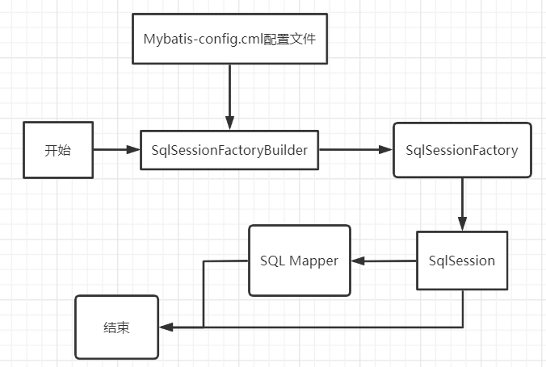
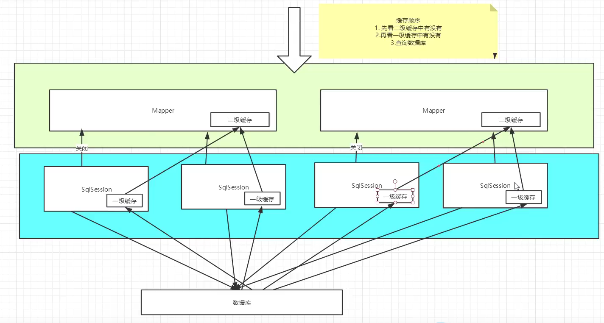

[toc]

# Mybatis


## 一、简介

### 什么是 MyBatis？

+ MyBatis 是一款优秀的持久层框架
+ 它支持自定义 SQL、存储过程以及高级映射。
+ MyBatis 免除了几乎所有的 JDBC 代码以及设置参数和获取结果集的工作。
+ MyBatis 可以通过简单的 XML 或注解来配置和映射原始类型、接口和 Java POJO（Plain Old Java Objects，普通老式 Java 对象）为数据库中的记录

### Github: [https://github.com/mybatis](https://github.com/mybatis)

### 中文文档：[mybatis中文文档 - MyBatis中文官网](http://www.mybatis.cn/archives/789.html)

---


## 二、Mybatis程序

### 2.1 resources下配置mybatis-config.xml文件

```xml
<?xml version="1.0" encoding="UTF8" ?>
<!DOCTYPE configuration
        PUBLIC "-//mybatis.org//DTD Config 3.0//EN"
        "http://mybatis.org/dtd/mybatis-3-config.dtd">
<!--configuration核心配置文件-->
<configuration>
    <properties resource="db.properties"></properties>
    <environments default="development">
        <environment id="development">
            <transactionManager type="JDBC"/>
            <dataSource type="POOLED">
                <property name="driver" value="${driver}"/>
                <property name="url" value="${url}"/>
                <property name="username" value="${user}"/>
                <property name="password" value="${password}"/>
            </dataSource>
        </environment>
    </environments>

    <!--每一个Mapper.xml 都需要在Mybatis核心配置文件中注册-->
    <!-- 在全局配置文件中注册sql映射文件 -->
    <mappers>
        <mapper resource="UserDaoMapper.xml"/>
    </mappers>
</configuration>
```

#### db.properties

```properties
user = root
password = 123123
driver = com.mysql.cj.jdbc.Driver
#url = jdbc:mysql://localhost:3306/mybatis
url = jdbc:mysql://localhost:3306/mybatis?serverTimezone=UTC&useSSL=true&useUnicode=true&characterEncoding=UTF8

initsize = 5
maxsize = 50
```


### 2.2 编写Mybatis工具类

```java
package com.tan00xu.utils;


import org.apache.ibatis.io.Resources;
import org.apache.ibatis.session.SqlSession;
import org.apache.ibatis.session.SqlSessionFactory;
import org.apache.ibatis.session.SqlSessionFactoryBuilder;

import java.io.IOException;
import java.io.InputStream;

public class MybatisUtils {
    private static SqlSessionFactory sqlSessionFactory;
    static {
        try {
            //使用Mybatis第一步：获取sqlSessionFactory对象
            String resource = "mybatis-config.xml";
            InputStream inputStream = Resources.getResourceAsStream(resource);
            sqlSessionFactory = new SqlSessionFactoryBuilder().build(inputStream);
        } catch (IOException e) {
            e.printStackTrace();
        }
    }

    /**
     * 既然在了 SqiSessionFactory，顾名思义,我们就可以从中获得SqlSession的实例了。
     * SqlSession 完全包含了面向数据库执行5QL命令所击的所有方法。
     * 可以通过 SqlSession 实例来直接执行已映射的 SQL 语句。
     */
    public static SqlSession getSqlSession(){
        return sqlSessionFactory.openSession();
    }

}

```


### 2.3 实体类

```java
package com.tan00xu.pojo;

public class User {
    private int id;
    private String name;
    private String account;
    private String password;

    public int getId() {
        return id;
    }

    public void setId(int id) {
        this.id = id;
    }

    public String getName() {
        return name;
    }

    public void setName(String name) {
        this.name = name;
    }
    
    public String getAccount() {
        return account;
    }

    public void setAccount(String account) {
        this.account = account;
    }

    public String getPassword() {
        return password;
    }

    public void setPassword(String password) {
        this.password = password;
    }

    public User() {
    }

    public User(int id, String name, String account, String password) {
        this.id = id;
        this.name = name;
        this.account = account;
        this.password = password;
    }

    @Override
    public String toString() {
        return "Student{" +
                "id=" + id +
                ", name='" + name + '\'' +
                ", account='" + account + '\'' +
                ", password='" + password + '\'' +
                '}';
    }
}

```

### 2.4 Dao接口

```java
package com.tan00xu.dao;

import com.tan00xu.pojo.User;

import java.util.List;

public interface UserDao {
    public List<User> listUsers();
}

```

### 2.5 接口实现类，由原来的UserDaoImpl转化为一个Mapper配置文件

```xml
<?xml version="1.0" encoding="UTF8" ?>
<!DOCTYPE mapper
 PUBLIC "-//mybatis.org//DTD Mapper 3.0//EN"
 "http://mybatis.org/dtd/mybatis-3-mapper.dtd">
 
 <!-- 接口式：namespace是接口的全类名 ，绑定一个对应的Dao/Mapper接口-->
<mapper namespace="com.tan00xu.dao.UserDao">

	<select id="listUsers" resultType="com.tan00xu.pojo.User">
		select * from user
	</select>
</mapper>
```

### maven中的配置文件不生效的解决方法(静态资源过滤问题)

maven由于他的约定大于配置,我们之后可以能遇到我们写的配置文件,无法被导出或者生效的问题,解决方案:

```xml
  <!--在build中配置resource，来防止资源导出失败-->
    <build>
        <resources>
            <resource>
                <directory>src/main/resources</directory>
                <includes>
                    <include>**/*.properties</include>
                    <include>**/*.xml</include>
                </includes>
                <filtering>true</filtering>
            </resource>
            <resource>
                <directory>src/main/java</directory>
                <includes>
                    <include>**/*.properties</include>
                    <include>**/*.xml</include>
                </includes>
                <filtering>true</filtering>
            </resource>
        </resources>
    </build>
```

### 2.6  junit测试

```java
package com.tan00xu.dao;


import com.tan00xu.pojo.User;
import com.tan00xu.utils.MybatisUtils;
import org.apache.ibatis.session.SqlSession;
import org.junit.Test;

import java.util.List;

public class UserDaoTest {

    @Test
    public void Test(){
        //第一步：获得SqlSession对象
        SqlSession sqlSession = MybatisUtils.getSqlSession();
        //执行SQL
        UserDao userDao = sqlSession.getMapper(UserDao.class);
        List<User> userList = userDao.listUsers();
        //不推荐使用
        //List<User> userList = sqlSession.selectList("com.tan00xu.dao.UserDao.listUsers");

        for (User user : userList) {
            System.out.println(user);
        }

        //关闭SqlSession
        sqlSession.close();

    }

}
```

---


## 三、增删改查

### 3.1、namespace

namespace中的包名要和Dao/Mapper接口的包名一致！

### 3.2、select

选择、查询语句

+ id：就是对应的namespace中的方法名
+ resultType：Sql句执行的返回值
+ parameterType：参数类型


1. 编写接口

   ```java
    /**
        * 根据id查询
        * @param id
        * @return User
        */
       User getUserById(int id);
   ```

2. 编写对应的Mapper中的sql语句

   ```xml
   <select id="getUserById" parameterType="int" resultType="com.tan00xu.pojo.User">
           select *
           from mybatis.user
           where id = #{id}
       </select>
   ```

3. 测试

   ```java
   @Test
       public void testGetUserById() {
           SqlSession sqlSession = MybatisUtils.getSqlSession();
   
           UserMapper mapper = sqlSession.getMapper(UserMapper.class);
   
           User user = mapper.getUserById(1);
   
           System.out.println(user);
   
   
           sqlSession.close();
       }
   ```

### 3.3、 insert

### 3.4、update

### 3.5、 delete

### 	==代码==

#### UserMapper.java 

```java 
package com.tan00xu.dao;

import com.tan00xu.pojo.User;

import java.util.List;

public interface UserMapper {
    /**
     * 查询全部用户
     * @return
     */
    public List<User> listUsers();

    /**
     * 根据id查询
     * @param id
     * @return User
     */
    User getUserById(int id);

    /**
     * 插入一个用户
     * @param user
     * @return
     */
    int insertUser(User user);

    /**
     * 修改用户
     * @param user
     * @return
     */
    int updateUser(User user);

    /**
     * 删除一个用户
     * @param id
     * @return
     */
    int deleteUser(int id);
}

```

#### UserMapper.XML 

```xml
<?xml version="1.0" encoding="UTF8" ?>
<!DOCTYPE mapper
        PUBLIC "-//mybatis.org//DTD Mapper 3.0//EN"
        "http://mybatis.org/dtd/mybatis-3-mapper.dtd">

<!-- 接口式：namespace是接口的全类名 ，绑定一个对应的Dao/Mapper接口-->
<mapper namespace="com.tan00xu.dao.UserMapper">

    <select id="listUsers" resultType="com.tan00xu.pojo.User">
        select *
        from user;
    </select>

    <select id="getUserById" parameterType="int" resultType="com.tan00xu.pojo.User">
        select *
        from mybatis.user
        where id = #{id};
    </select>

    <!--对象中的属性可以直接取出来！-->
    <insert id="insertUser" parameterType="com.tan00xu.pojo.User">
        insert into mybatis.user (id, account, password)
        VALUES (#{id}, #{account}, #{password});
    </insert>

    <update id="updateUser" parameterType="com.tan00xu.pojo.User">
        update mybatis.user
        set account = #{account},
            password = #{password}
        where id = #{id};
    </update>

    <delete id="deleteUser" parameterType="int">
        delete
        from mybatis.user
        where id = #{id};
    </delete>

</mapper>
```

#### UserMapperTest.java 

```java 
package com.tan00xu.dao;


import com.tan00xu.pojo.User;
import com.tan00xu.utils.MybatisUtils;
import org.apache.ibatis.session.SqlSession;
import org.junit.Test;

import java.util.List;

public class UserMapperTest {

    @Test
    public void testListUsers(){
        //第一步：获得SqlSession对象
        SqlSession sqlSession = MybatisUtils.getSqlSession();
        //执行SQL
        UserMapper userMapper = sqlSession.getMapper(UserMapper.class);
        List<User> userList = userMapper.listUsers();
        //不推荐使用
        //List<User> userList = sqlSession.selectList("com.tan00xu.dao.UserDao.listUsers");

        for (User user : userList) {
            System.out.println(user);
        }

        //关闭SqlSession
        sqlSession.close();
    }


    @Test
    public void testGetUserById() {
        SqlSession sqlSession = MybatisUtils.getSqlSession();

        UserMapper mapper = sqlSession.getMapper(UserMapper.class);

        User user = mapper.getUserById(1);

        System.out.println(user);


        sqlSession.close();
    }

    //增删改需要提交事务
    @Test
    public void testInsertUser() {
        SqlSession sqlSession = MybatisUtils.getSqlSession();

        UserMapper mapper = sqlSession.getMapper(UserMapper.class);

        mapper.insertUser(new User(null,"嘿嘿","123123"));

        //提交事务
        sqlSession.commit();
        sqlSession.close();
    }

    @Test
    public void testUpdateUser() {
        SqlSession sqlSession = MybatisUtils.getSqlSession();

        UserMapper mapper = sqlSession.getMapper(UserMapper.class);

        mapper.updateUser(new User(8,"呵呵","666666"));

        sqlSession.commit();
        sqlSession.close();
    }

    @Test
    public void testDeleteUser() {
        SqlSession sqlSession = MybatisUtils.getSqlSession();

        UserMapper mapper = sqlSession.getMapper(UserMapper.class);

        mapper.deleteUser(8);

        sqlSession.commit();
        sqlSession.close();
    }
}

```

### 注意点：

#### 1. 增删改需要提交事务

#### 2. 对象中的属性可以直接取出来


### 使用Map

```java
//map传参
    int insertUser2(Map<String,Object> map);
```

```xml
<insert id="insertUser2" parameterType="map">
        insert into mybatis.user (id, account, password)
        VALUES (#{userId},#{userName},#{userPassword});
    </insert>
```

```java
@Test
    public void testInsertUser2() {
        SqlSession sqlSession = MybatisUtils.getSqlSession();

        UserMapper mapper = sqlSession.getMapper(UserMapper.class);

        Map<String, Object> map = new HashMap<String, Object>();

        map.put("userId",5);
        map.put("userPassword","55555");

        mapper.insertUser2(map);

        //提交事务
        sqlSession.commit();
        sqlSession.close();
    }
```

### 模糊查询

1. Java代码执行时传递通配符

   ```java
   List<User> userList = mapper.getUserLike("%李%");
   ```

   

2. 在SQL拼接时使用通配符

```java
select * from mybatis.user where name like "%"#{value}"%";
```

---


## 四、配置解析

### 4.1、核心配置文件

+ Mybatis-config.xml
+ MyBatis的配置文件包含了会深深影响MyBatis行为的设置和属性信息
  + [configuration（配置）](https://mybatis.org/mybatis-3/zh/configuration.html#)
    - [properties（属性）](https://mybatis.org/mybatis-3/zh/configuration.html#properties)
    - [settings（设置）](https://mybatis.org/mybatis-3/zh/configuration.html#settings)
    - [typeAliases（类型别名）](https://mybatis.org/mybatis-3/zh/configuration.html#typeAliases)
    - [typeHandlers（类型处理器）](https://mybatis.org/mybatis-3/zh/configuration.html#typeHandlers)
    - [objectFactory（对象工厂）](https://mybatis.org/mybatis-3/zh/configuration.html#objectFactory)
    - [plugins（插件）](https://mybatis.org/mybatis-3/zh/configuration.html#plugins)
    - environments（环境配置）
      - environment（环境变量）
        - transactionManager（事务管理器）
        - dataSource（数据源）
    - [databaseIdProvider（数据库厂商标识）](https://mybatis.org/mybatis-3/zh/configuration.html#databaseIdProvider)
    - [mappers（映射器）](https://mybatis.org/mybatis-3/zh/configuration.html#mappers)

### 4.2、环境配置（environments）

MyBatis可以配置成适应多种环境

**不过要记住:尽管可以配置多个环境,但每个SqlSessionFactory实例只能选择一种环境。 **

#### [拓展：](https://mybatis.org/mybatis-3/zh/configuration.html#environments)

1. **事务管理器（transactionManager）**：

   在 MyBatis 中有两种类型的事务管理器（也就是 type="[`JDBC ` | `MANAGED`]"）：

   - JDBC – 这个配置直接使用了 JDBC 的提交和回滚设施，它依赖从数据源获得的连接来管理事务作用域。

   - MANAGED – 这个配置几乎没做什么。它从不提交或回滚一个连接，而是让容器来管理事务的整个生命周期（比如 JEE 应用服务器的上下文）。 默认情况下它会关闭连接。然而一些容器并不希望连接被关闭，因此需要将 closeConnection 属性设置为 false 来阻止默认的关闭行为。例如:

     ```xml
     <transactionManager type="MANAGED">
       <property name="closeConnection" value="false"/>
     </transactionManager>
     ```

2. **数据源（dataSource）**：

   dataSource 元素使用标准的 JDBC 数据源接口来配置 JDBC 连接对象的资源。

   - 大多数 MyBatis 应用程序会按示例中的例子来配置数据源。虽然数据源配置是可选的，但如果要启用延迟加载特性，就必须配置数据源。

   有三种内建的数据源类型（也就是 type="[`UNPOOLED` | `POOLED ` | `JNDI`]"）：

   + ==**UNPOOLED **==– 这个数据源的实现会每次请求时打开和关闭连接。虽然有点慢，但对那些数据库连接可用性要求不高的简单应用程序来说，是一个很好的选择。 性能表现则依赖于使用的数据库，对某些数据库来说，使用连接池并不重要，这个配置就很适合这种情形。
   + ==**POOLED**== – 这种数据源的实现利用“池”的概念将 JDBC 连接对象组织起来，避免了创建新的连接实例时所必需的初始化和认证时间。 这种处理方式很流行，能使并发 Web 应用快速响应请求。
   + ==**JNDI**== – 这个数据源实现是为了能在如 EJB 或应用服务器这类容器中使用，容器可以集中或在外部配置数据源，然后放置一个 JNDI 上下文的数据源引用。


***Mybatis默认的事务管理器就是JDBC，默认连接池: POOLED***

### 4.3、属性（properties）

我们可以通过properties属性类实现引用配置文件

这些属性可以在外部进行配置，并可以进行动态替换。你既可以在典型的 Java 属性文件中配置这些属性，也可以在 properties 元素的子元素中设置。【db.properties】

1. 编写一个配置文件

```properties
username=root
password=123123
driver=com.mysql.cj.jdbc.Driver
#url = jdbc:mysql://localhost:3306/mybatis
url=jdbc:mysql://localhost:3306/mybatis?serverTimezone=UTC&amp;useSSL=true&amp;useUnicode=true&amp;characterEncoding=UTF8

initsize=5
maxsize=50
```

2. 在核心配置文件中引入

```xml
<properties resource="db.properties"></properties>
```

==或==

```xml
   <properties resource="db.properties">
        <property name="driver" value="com.mysql.cj.jdbc.Driver"/>
        <property name="url" value="jdbc:mysql://localhost:3306/mybatis"/>
        <property name="username" value="root"/>
        <property name="password" value="123123"/>
    </properties>
```

+ 可以直接引入外部文件
+ 可以在其中增加一些属性配置
+ 如果两个文件有同一个字段，优先使用外部配置文件

### 4.4、[类型别名（typeAliases）](https://mybatis.org/mybatis-3/zh/configuration.html#typeAliases)

+ **类型别名可为 Java 类型设置一个缩写名字。 **

+ **它仅用于 XML 配置，意在降低冗余的全限定类名书写。**

```xml
<!--给实体类起别名-->
    <typeAliases>
        <typeAlias type="com.tan00xu.pojo.User" alias="User"></typeAlias>
    </typeAliases>
```

扫描实体类的包，在没有注解的情况下，会使用 这个类的类名的首字母小写的非限定类名来作为它的别名。

```xml
<!--给实体类起别名-->
    <typeAliases>
        <package name="com.tan00xu.pojo.User"/>
    </typeAliases>
```


比如`com.tan00xu.User`的别名为`user`。

若有注解，则别名为其注解值：

```java
@Alias("author")
public class Author {
    ...
}
```

### 4.5、[设置（settings）](https://mybatis.org/mybatis-3/zh/configuration.html#settings)

**这是 MyBatis 中极为重要的调整设置，它们会改变 MyBatis 的运行时行为。**

部分设置：

|        **设置名**        |                           **描述**                           |                          **有效值**                          | **默认值** |
| :----------------------: | :----------------------------------------------------------: | :----------------------------------------------------------: | :--------: |
|       cacheEnabled       |   全局性地开启或关闭所有映射器配置文件中已配置的任何缓存。   |                        true \| false                         |    true    |
|    lazyLoadingEnabled    | 延迟加载的全局开关。当开启时，所有关联对象都会延迟加载。 特定关联关系中可通过设置 `fetchType` 属性来覆盖该项的开关状态。 |                        true \| false                         |   false    |
|      useColumnLabel      | 使用列标签代替列名。实际表现依赖于数据库驱动，具体可参考数据库驱动的相关文档，或通过对比测试来观察。 |                        true \| false                         |    true    |
|     useGeneratedKeys     | 允许 JDBC 支持自动生成主键，需要数据库驱动支持。如果设置为 true，将强制使用自动生成主键。尽管一些数据库驱动不支持此特性，但仍可正常工作（如 Derby）。 |                        true \| false                         |   false    |
| mapUnderscoreToCamelCase | 是否开启驼峰命名自动映射，即从经典数据库列名 A_COLUMN 映射到经典 Java 属性名 aColumn。 |                        true \| false                         |   false    |
|         logImpl          |    指定 MyBatis 所用日志的具体实现，未指定时将自动查找。     | SLF4J \| LOG4J(deprecated since 3.5.9) \| LOG4J2 \| JDK_LOGGING \| COMMONS_LOGGING \| STDOUT_LOGGING \| NO_LOGGING |   未设置   |

一个配置完整的 settings 元素的示例如下：

```xml
<settings>
  <setting name="cacheEnabled" value="true"/>
  <setting name="lazyLoadingEnabled" value="true"/>
  <setting name="multipleResultSetsEnabled" value="true"/>
  <setting name="useColumnLabel" value="true"/>
  <setting name="useGeneratedKeys" value="false"/>
  <setting name="autoMappingBehavior" value="PARTIAL"/>
  <setting name="autoMappingUnknownColumnBehavior" value="WARNING"/>
  <setting name="defaultExecutorType" value="SIMPLE"/>
  <setting name="defaultStatementTimeout" value="25"/>
  <setting name="defaultFetchSize" value="100"/>
  <setting name="safeRowBoundsEnabled" value="false"/>
  <setting name="mapUnderscoreToCamelCase" value="false"/>
  <setting name="localCacheScope" value="SESSION"/>
  <setting name="jdbcTypeForNull" value="OTHER"/>
  <setting name="lazyLoadTriggerMethods" value="equals,clone,hashCode,toString"/>
</settings>
```

### 4.6、[mappers（映射器）](https://mybatis.org/mybatis-3/zh/configuration.html#mappers)

MapperRegistry：注册绑定Mapper文件

#### 方式一：【推荐使用】

```xml
 <!--每一个Mapper.xml 都需要在Mybatis核心配置文件中注册-->
    <!-- 在全局配置文件中注册sql映射文件 -->
    <mappers>
        <mapper resource="com/tan00xu/dao/UserMapper.xml"/>
    </mappers>
```

#### 方式二：使用class文件绑定注册

```xml
 <!--每一个Mapper.xml 都需要在Mybatis核心配置文件中注册-->
    <!-- 在全局配置文件中注册sql映射文件 -->
    <mappers>
        <mapper class="com.tan00xu.dao.UserMapper"></mapper>
    </mappers>
```

==**注意点**：==

+ 接口和它的Mapper配置文件必须同名！
+ 接口和它的Mapper配置文件必须在同一个包下！

#### 方式三：使用扫描包进行注入绑定

```xml
 <!--每一个Mapper.xml 都需要在Mybatis核心配置文件中注册-->
    <!-- 在全局配置文件中注册sql映射文件 -->
    <mappers>
        <package name="com.tan00xu.dao"/>
    </mappers>
```

==**注意点**：==

+ 接口和它的Mapper配置文件必须同名！
+ 接口和它的Mapper配置文件必须在同一个包下！

### 4.7、[作用域（Scope）和生命周期](https://mybatis.org/mybatis-3/zh/getting-started.html#)

**生命周期,和作用域,是至关重要的,因为错识的使用会导致非常严重的==并发问题==。**



**SqlSessionFactoryBuilder**

+ 这个类可以被实例化、使用和丢弃，**一旦创建了 SqlSessionFactory，就不再需要它了**。
+ 局部变量

**SqlSessionFactory**

+ SqlSessionFactory 一旦被创建就应该在应用的运行期间一直存在
+ **没有任何理由丢弃它或重新创建另一个实例**
+  因此SqlSessionFactory 的最佳作用域是应用作用域
+ 最简单的就是使用**单例模式**或者静态单例模式

**SqlSession**

+ 连接到连接池的一个请求
+ SqlSession 的实例不是线程安全的，因此是不能被共享的，所以它的最佳的作用域是请求或方法作用域
+ 用完就关闭，否则资源被占用

---


## 五、解决属性名和字段名不一致的问题

### 解决方法：

+ 起别名

```xml
select id, name, pwd as password
from mybatis.user
where id = #{id};
```


+ resultMap结果集映射

  ```xml
  <!--结果集映射-->
  <resultMap id="UserMap" type="user">
      <!--column数据库中的字段,property实体类中的属性-->
      <result column="id" property="id"/>
      <result column="account" property="account"/>
      <result column="pwd" property="password"/>
  </resultMap>
  <select id="getuserById" resultMap="UserMap">
      select *
      from mybatis.user
      where id = #{id}
  </select>
  ```

  

### [结果映射](https://mybatis.org/mybatis-3/zh/sqlmap-xml.html#Result_Maps)

+ `resultMap` 元素是 MyBatis 中最重要最强大的元素
+ ResultMap 的设计思想是，对简单的语句做到零配置，对于复杂一点的语句，只需要描述语句之间的关系就行了

---


## 六、日志

### 6.1、日志工厂

如果一个数据库操作,出现了异常,我们需要排错。日志就是最好的助手!

曾经: sout,debug

现在:日志工厂! 

| logImpl | 指定 MyBatis 所用日志的具体实现，未指定时将自动查找。 | SLF4J \| LOG4J(deprecated since 3.5.9) \| LOG4J2 \| JDK_LOGGING \| COMMONS_LOGGING \| STDOUT_LOGGING \| NO_LOGGING | 未设置 |
| ------- | ----------------------------------------------------- | ------------------------------------------------------------ | ------ |

+ SLF4J 

+ LOG4J【掌握】
+ LOG4J2 
+ JDK_LOGGING 
+ COMMONS_LOGGING 
+ STDOUT_LOGGING【掌握】 
+ NO_LOGGING

#### STDOUT_LOGGING标准日志输出

在Mybatis核心配置文件中，配置日志

```xml
<settings>
    <!--标准的日志工厂实现-->
    <setting name="logImpl" value="STDOUT_LOGGING"/>
</settings>
```

### 6.2、Log4j

什么是Log4j？

+ Log4j是Apache的一个开源项目，通过使用Log4j，我们可以控制日志信息输送的目的地是控制台、文件、GUI组件

+ 我们可以控制每一条日志的输出格式

+ 通过定义每一条日志信息的级别，我们能够更加细致地控制日志的生成过程

+ 可以通过一个配置文件来灵活地进行配置，而不需要修改应用的代码

  

#### 1. 导入Log4j的包

```xml
<!-- https://mvnrepository.com/artifact/log4j/log4j -->
<dependency>
    <groupId>log4j</groupId>
    <artifactId>log4j</artifactId>
    <version>1.2.17</version>
</dependency>
```

#### 2. log4j.properties

```properties
#将等级为DEBUG的日志信息输出到console和file这两个目的地，console和file的定义在下面的代码
log4j.rootLogger=DEBUG,console,file

#控制台输出的相关设置
log4j.appender.console = org.apache.log4j.ConsoleAppender
log4j.appender.console.Target = System.out
log4j.appender.console.Threshold=DEBUG
log4j.appender.console.layout = org.apache.log4j.PatternLayout
log4j.appender.console.layout.ConversionPattern=[%c]-%m%n

#文件输出的相关设置
log4j.appender.file = org.apache.log4j.RollingFileAppender
log4j.appender.file.File=./log/log.log
log4j.appender.file.MaxFileSize=10mb
log4j.appender.file.Threshold=DEBUG
log4j.appender.file.layout=org.apache.log4j.PatternLayout
log4j.appender.file.layout.ConversionPattern=[%p][%d{yy-MM-dd HH:mm:ss}][%c]%m%n

#日志输出级别
log4j.logger.org.mybatis=DEBUG
log4j.logger.java.sql=DEBUG
log4j.logger.java.sql.Statement=DEBUG
log4j.logger.java.sql.ResultSet=DEBUG
log4j.logger.java.sql.PreparedStatement=DEBUG
```

#### 3. 配置log4j为日志的实现

```xml
<settings>
    <setting name="logImpl" value="LOG4J"/>
</settings>
```

#### 4. 使用

1. 在要使用Log4j的类中，导入包`import org.apache.log4j.Logger;`

2. 日志对象，参数为当前类的class

   ```java
   static Logger logger = Logger.getLogger(Class.class);
   ```

3. 日志级别

   ```java
   logger.info("");
   logger.debug("");
   logger.error("");
   ```

---


## 七、分页

**目的**：减少数据量的处理

### 7.1、使用Limit分页

```sql
-- 语法：
select * from table_name limit startIndex,pageSize;
```

### 7.2、使用Mybatis实现分页

1. 接口

   ```java
    //分页
       List<User> listUsersByLimit(Map<String,Integer> map);
   ```

2. Mapper.xml

   ```xml
   <!--分页-->
   <select id="listUsersByLimit" parameterType="map" resultType="user">
           select *
           from mybatis.user
           limit #{startIndex},#{pageSize}
       </select>
   ```

   

3. 测试

   ```java
    @Test
       public void testListUsersByLimit() {
           SqlSession sqlSession = MybatisUtils.getSqlSession();
           UserMapper mapper = sqlSession.getMapper(UserMapper.class);
   
           HashMap<String, Integer> map = new HashMap<>();
           map.put("startIndex",0);
           map.put("pageSize",3);
   
           List<User> userList = mapper.listUsersByLimit(map);
           for (User user : userList) {
               System.out.println(user);
           }
   
           sqlSession.close();
       }
   ```

   


### 7.3、RowBounds分页

不使用SQL实现分页

1. 接口

   ```java
   //分页
       List<User> listUsersByRowBounds(Map<String,Integer> map);
   ```

2. Mapper.xml

   ```xml
   <!--分页-->
   <select id="listUsersByRowBounds" resultType="user">
       select * from user
   </select>
   ```

3. 测试

   ```java
   @Test
   public void testListUsersByRowBounds() {
       SqlSession sqlSession = MybatisUtils.getSqlSession();
       //RowBounds实现
       RowBounds rowBounds = new RowBounds(1, 2);
   
       //通过JAVA代码层面实现分页
       List<User> userList = sqlSession.selectList("com.tan00xu.dao.UserMapper.listUsersByRowBounds",null,rowBounds);
   
       for (User user : userList) {
           System.out.println(user);
       }
       sqlSession.close();
   }
   ```


### 7.4、分页插件

[MyBatis 分页插件 PageHelper](https://pagehelper.github.io/)

---


## 八、使用注解开发

### 8.1、面向接口开发

+ 大家之前都学过面向对象编程，也学习过接口，但在真正的开发中，很多时候我们会选择面向接口编程。

+ **根本原因：==解耦合==、可拓展、提高复用，分层开发中，上层不用管具体的实现，大家都道守共同的标准，使得开发变得容易,规范性更好。**
+ 在一个面向对象的系统中，系统的各种功能是由许许多多的不同对象协作完成的。在这种情况下，各个对象内部是如何实现自己的，对系统设计人员来讲就不那么重要了。
+ 而各个对象之间的协作关系则成为系统设计的关键。小到不同类之间的通信，大到各模块之间的交互，在系统设计之初都是要着重考虑的，这也是系统设计的主要工作内容。面向接口编程就是指按照这种思想来编程。

#### 关于接口的理解

+ 接口从更深层次的理解，应是定义（规范、约束）与实现（名实分离的原则）的分离。
+ 接口的本身反映了系统设计人员对系统的抽象理解。
+ 接口应有两类：
  + 第一类是对一个个体的抽象，它可对应为一个抽象体(abstract class)；
  + 第二类是对一个个体某一方面的抽象，即形成一个抽象面（interface）。
+ 一个体有可能有多个抽象面。抽象体与抽象面是有区别的。 

#### 三个面向的区别

+ 面向对象是指，我们考虑问题时，以对象为单位，考虑它的属性及方法。
+ 面向过程是指，我们考虑问题时，以一个具体的流程（事务过程）为单位，考虑它的实现。
+ 接口设计与非接口设计是针对复用技术而言的，与面向对象（过程）不是一个问题，更多的体现就是对系统整体的架构 

### 8.2、使用注解开发

#### 8.2.1、注解在接口上实现

```java
@Select("select * from mybatis.user")
public List<User> listUsers();
```

#### 8.2.2、需要在核心配置文件中绑定接口

```xml
<!--绑定接口-->
<mappers>
    <mapper class="com.tan00xu.dao.UserMapper"/>
</mappers>
```

#### 8.2.3、@Results的用法

当数据库字段名与实体类对应的属性名不一致时，可以使用@Results映射来将其对应起来。column为数据库字段名，porperty为实体类属性名，jdbcType为数据库字段数据类型，id为是否为主键。

##### @One返回单个关系的映射定义

###### 实体类

```java
@Data
public class Student {
    private int id;
    private String name;
	private Teacher teacher;
}
```

```java
@Data
public class Teacher {
    private int id;
    private String name;
}
```

###### StudentMapper

```java
@Select("select * from student")
@Results({
    @Result(id = true, property = "id", column = "id"),
    @Result(property="name", column="name"),
    @Result(property="tid", column="tid"),
    @Result(property = "teacher", column = "tid",one = @One(select = "com.tan00xu.dao.TeacherMapper.getTeacherById")),
})
List<Student> listStudents();
```

###### TeacherMapper

```java
@Select("select * from teacher where id = #{id}")
Teacher getTeacherById(Integer id);
```

##### @Many返回集合关系的映射定义

###### 实体类

```java
@Data
public class Student {

    private int id;
    private String name;
    private int tid;
}

```

```java
@Data
public class Teacher {
    private int id;
    private String name;

    //一个老师多个学生
    private List<Student> students;
}
```

###### StudentMapper

```java
//根据tid查询学生信息
    @Select("select * from student where tid = #{tid}")
    List<Student> listStudentsByTeacherId(Integer tid);
```

###### TeacherMapper

```java
@Select("select * from teacher where id = #{id}")
@Results({
    @Result(id= true, property = "id", column = "id"),
    @Result(property = "name", column = "name"),
    @Result(property = "students",column = "id",javaType = List.class,many = @Many(select = "com.tan00xu.dao.StudentMapper.listStudentsByTeacherId"))
})
Teacher getTeacherById(Integer id);
```


##### 本质：反射机制实现

##### 底层：动态代理


### 8.3、CRUD

#### 我们可以在工具类创建的时候实现自动提交事务！

```java
sqlSessionFactory.openSession(true);
```

编写接口

```java
@Select("select * from mybatis.user")
public List<User> listUsers();

//方法存在多个参数，所有的参数前面必须加上@Param()注解
@Select("select * from user where id = #{id}")
User getUserById(@Param("id") int id);

@Insert("insert into user(id, account, password) values (#{id},#{account},#{password})")
int insertUser(User user);

@Update("update user set account=#{account},password=#{password} where id=#{id}")
int updateUser(User user);

@Delete("delete from user where id=#{id}")
int deleteUser(int id);
```

**==注意：==必须将接口绑定到核心配置文件中**

```xml
<!--绑定接口-->
<mappers>
    <mapper class="com.tan00xu.dao.UserMapper"/>
</mappers>
```

#### 关于@Param()注解

+ 基本类型的参数或String类型，需要加上
+ 引用类型不需要加
+ 如果只有一个基本类型的话，可以忽略，但建议都加上
+ 在SQL中引用的就是这里的@Param("test")中设置的属性名

#### #{}与${}的区别

+ #{}表示一个占位符号

+ ${}表示拼接 sql 串
+ \#{}是预编译处理，${}是字符串替换。
+ Mybatis 在处理#{}时，会将 sql 中的#{}替换为?号，调用 PreparedStatement 的 set 方法来赋值
+ Mybatis 在处理${}时，就是把${}替换成变量的值
+ **使用#{}可以有效的防止 SQL 注入，提高系统安全性。**

---


## 九、多对一处理

### 9.1、按照查询嵌套处理

```xml
<select id="getStudent" resultMap="StudentTeacher">
    select * from student;
</select>

<resultMap id="StudentTeacher" type="Student">
    <result property="id" column="id"/>
    <result property="name" column="name"/>
    <!--复杂的属性需要单独处理
            对象：association
            集合：collection
        -->
    <association property="teacher" column="tid" javaType="Teacher" select="getTeacher"/>
</resultMap>

<select id="getTeacher" resultType="Teacher">
    select * from teacher where id = #{id};
</select>
```

### 9.1、按照结果嵌套处理

```xml
<!--    按照结果嵌套处理-->
<select id="getStudent2" resultMap="StudentTeacher2">
    select s.id sid, s.name sname, t.id tid, t.name tname
    from student s,
    teacher t
    where s.tid = t.id;
</select>

<resultMap id="StudentTeacher2" type="Student">
    <result property="id" column="sid"/>
    <result property="name" column="sname"/>
    <association property="teacher" javaType="Teacher">
        <result property="id" column="tid"/>
        <result property="name" column="tname"/>
    </association>
</resultMap>
```

---


## 十、一对多处理

实体类

```java
public class Teacher {
    private int id;
    private String name;

    //一个老师等多个学生
    private List<Student> students;
}

```

```java
public class Student {

    private int id;
    private String name;
    private int tid;

}
```


### 按结果嵌套查询

```xml
<!--按结果嵌套查询-->
<select id="getTeacher" resultMap="TeacherStudent">
    select s.id sid, s.name sname,t.name tname, t.id tid
    from student s,
    teacher t
    where s.tid = t.id and t.id = #{tid};
</select>

<resultMap id="TeacherStudent" type="teacher">
    <result property="id" column="tid"/>
    <result property="name" column="tname"/>
    <!--复杂的属性需要单独处理
        对象：association
        集合：collection
        javaType=""指定属性的类型
        集合中的泛型信息，需要使用ofType获取
        -->
    <collection property="students" ofType="student">
        <result property="id" column="sid"/>
        <result property="name" column="sname"/>
        <result property="tid" column="tid"/>
    </collection>
</resultMap>

```

### 按查询嵌套处理

```xml
<!--按查询嵌套查询-->
<select id="getTeacher" resultMap="TeacherStudent">
    select * from teacher where id = #{tid}
</select>

<resultMap id="TeacherStudent" type="teacher">
    <result property="id" column="id"/>
    <result property="name" column="name"/>
    <!--复杂的属性需要单独处理
    对象：association
    集合：collection
    javaType=""指定属性的类型
    集合中的泛型信息，需要使用ofType获取
    -->
    <collection property="students" javaType="ArrayList" ofType="student" select="getStudentByTeacherId" column="id"/>
</resultMap>

<select id="getStudentByTeacherId" resultType="student">
    select * from student where tid = #{tid}
</select>
```


### 小结：

1. 关联 - association 
2. 集合 - collection
3. javaType  &  ofType
   + javaType用来指定实体类中属性的类型
   + ofType用来指定映射到List或者集合中的pojo类型，泛型中的约束类型

---


## 十一、[动态SQL](https://mybatis.org/mybatis-3/zh/dynamic-sql.html#)

### 什么是动态SQL：

+ 动态SQL就是指根据不同的条件生成不同的SQL语句

+ 动态SQL元素和JSTL或基于类似XML的文本处理器相似。在MyBatis之前的版本中,有很多元素需要花时间,了解。MyBatis 3大大精简了元素种类,现在只需学习原来一半的元素便可。MyBatis采用功能强大的基于OGNL的表达式来淘汰其它大部分元素。

  ```xml
  if
  choose (when, otherwise)
  trim (where, set)
  foreach
  ```

  

### 11.1、搭建环境

#### 11.1.1、表

```sql
CREATE TABLE `blog`
(
    `id`          VARCHAR(50)  NOT NULL COMMENT '博客id',
    `title`       VARCHAR(100) NOT NULL COMMENT '博客标题',
    `author`      VARCHAR(30)  NOT NULL COMMENT '博客作者',
    `create_time` DATETIME     NOT NULL COMMENT '创建时间',
    `views`       INT(30)      NOT NULL COMMENT '浏览量'
) ENGINE = INNODB
  DEFAULT CHARSET = utf8
```


#### 11.1.2、实体类

```java
@Data
public class Blog {
    private int id;
    private String title;
    private String author;
    private Date createTime;
    private int views;
}
```

### 11.2、IF

这条语句提供了可选的查找文本功能。

```java
 List<Blog> selectBlogIF(Map map);
```

```xml
<select id="selectBlogIF" parameterType="map" resultType="com.tan00xu.pojo.Blog">
    select * from mybatis.blog where 1=1
    <if test="title!=null">
        and title =#{title}
    </if>
    <if test="author!=null">
        and author=#{author}
    </if>
</select>
```

```java
@Test
public void testSelectBlogIF() {
    SqlSession sqlSession = MybatisUtils.getSqlSession();

    BlogMapper mapper = sqlSession.getMapper(BlogMapper.class);

    HashMap map = new HashMap();
    map.put("title","Java");
    map.put("author","狂神说");
    mapper.selectBlogIF(map).forEach(System.out::println);
    sqlSession.close();
}
```

### 11.3、choose、when、otherwise

有时候，我们不想使用所有的条件，而只是想从多个条件中选择一个使用。针对这种情况，MyBatis 提供了 choose 元素，它有点像 Java 中的 switch 语句

`when == case : beark;`

`otherwise == default`


```xml
<select id="selectBlogChoose" resultType="blog">
    select * from blog
    <where>
        <choose>
            <when test="title !=null">
                title=#{title}
            </when>
            <when test="author!=null">
                and author=#{author}
            </when>
            <otherwise>
                and views=#{views}
            </otherwise>
        </choose>
    </where>
</select>
```

### 11.4、trim（where、set）

#### where

*where* 元素只会在子元素返回任何内容的情况下才插入 “WHERE” 子句。而且，若子句的开头为 “AND” 或 “OR”，*where* 元素也会将它们去除。

#### set

*set* 元素会动态地在行首插入 SET 关键字，并会删掉额外的逗号（这些逗号是在使用条件语句给列赋值时引入的）。

```xml
<update id="updateBlog" parameterType="map">
    update mybatis.blog
    <set>
        <if test="title!=null">
            title =#{title},
        </if>
        <if test="author!=null">
            and author=#{author}
        </if>
    </set>
    where id=#{id}
</update>
```

#### trim

```xml
        <trim prefix="" prefixOverrides="" suffix="" suffixOverrides=""></trim>
```


*where* 元素只会在子元素返回任何内容的情况下才插入 “WHERE” 子句。而且，若子句的开头为 “AND” 或 “OR”，*where* 元素也会将它们去除。如果 *where* 元素与你期望的不太一样，你也可以通过自定义 trim 元素来定制 *where* 元素的功能。比如，和 *where* 元素等价的自定义 trim 元素为：

```xml
<trim prefix="WHERE" prefixOverrides="AND |OR ">
  ...
</trim>
```

*prefixOverrides* 属性会忽略通过管道符分隔的文本序列（注意此例中的空格是必要的）。上述例子会移除所有 *prefixOverrides* 属性中指定的内容，并且插入 *prefix* 属性中指定的内容。

用于动态更新语句的类似解决方案叫做 *set*。*set* 元素可以用于动态包含需要更新的列，忽略其它不更新的列。比如：

```xml
<update id="updateAuthorIfNecessary">
  update Author
    <set>
      <if test="username != null">username=#{username},</if>
      <if test="password != null">password=#{password},</if>
      <if test="email != null">email=#{email},</if>
      <if test="bio != null">bio=#{bio}</if>
    </set>
  where id=#{id}
</update>
```

这个例子中，*set* 元素会动态地在行首插入 SET 关键字，并会删掉额外的逗号（这些逗号是在使用条件语句给列赋值时引入的）。

来看看与 *set* 元素等价的自定义 *trim* 元素吧：

```xml
<trim prefix="SET" suffixOverrides=",">
  ...
</trim>
```

注意，我们覆盖了后缀值设置，并且自定义了前缀值。


==**所谓的动态SQL,本质还是SQL语句,只是我们可以在SQL层面,去执行一个逻辑代码**==


### 11.5、SQL片段

有的时候,我们可能会将一些功能的部分抽取出来,方便复用！

1. 使用SQL标签抽取公共的部分

   ```xml
   <sql id="if-title-author">
           <if test="title!=null">
               and title =#{title}
           </if>
           <if test="author!=null">
               and author=#{author}
           </if>
       </sql>
   ```

2. 在需要使用的地方使用Include标签引用即可 

   ```xml
   <select id="selectBlogIF" parameterType="map" resultType="com.tan00xu.pojo.Blog">
       select * from mybatis.blog
       <where>
           <include refid="if-title-author"></include>
       </where>
   </select>
   ```

#### 注意事项：

+ 最好基于单表来定义SQL片段
+ 不要存在where标签

### 11.6、Foreach

动态 SQL 的另一个常见使用场景是对集合进行遍历（尤其是在构建 IN 条件语句的时候）。

*foreach* 元素的功能非常强大，它允许你指定一个集合，声明可以在元素体内使用的集合项（item）和索引（index）变量。它也允许你指定开头与结尾的字符串以及集合项迭代之间的分隔符，这个元素也不会错误地添加多余的分隔符。

==**提示**== ：

+ 你可以将任何可迭代对象（如 List、Set 等）、Map 对象或者数组对象作为集合参数传递给 *foreach*。
+ 当使用可迭代对象或者数组时，index 是当前迭代的序号，item 的值是本次迭代获取到的元素。
+ 当使用 Map 对象（或者 Map.Entry 对象的集合）时，index 是键，item 是值。


迭代对象：`collection=""`	开始：`open=""`	结束：`close=""`	分隔符：`separator=""`


```java
 //查询1,2,3号博客
    List<Blog> selectBlogForEach(Map map);
```

```xml
<select id="selectBlogForEach" parameterType="map" resultType="com.tan00xu.pojo.Blog">
    select * from blog
    <where>
        <foreach collection="ids" item="id" open="and (" close=")" separator="or">
            id = #{id}
        </foreach>
    </where>
</select>
```

```java
  @Test
    public void testSelectBlogForEach() {
        SqlSession sqlSession = MybatisUtils.getSqlSession();
        BlogMapper mapper = sqlSession.getMapper(BlogMapper.class);

        HashMap map = new HashMap();
        ArrayList<Integer> ids = new ArrayList<>();
        ids.add(1);
        ids.add(2);

        map.put("ids",ids);

        mapper.selectBlogForEach(map).forEach(System.out::println);

        sqlSession.close();
    }
```


==动态SQL就是在拼接SQL语句,我们只要保证SQL的正确性,按照SQL的格式,去排列组合就可以了==

---


## 十二、[缓存](https://mybatis.org/mybatis-3/zh/sqlmap-xml.html#cache)

### 12.1、简介

1. 1.什么是缓存[Cache ]？
   + 存在内存中的临时数据。
   + 将用户经常查询的数据放在缓存（内存）中，用户去查询数据就不用从磁盘上（关系型数据库数据文件）查询，从缓存中查询，从而提高查询效率，解决了高并发系统的性能问题。
2. 为什么使用缓存？
   + 减少和数据库的交互次数，减少系统开销，提高系统效率。
3. 什么样的数据能使用缓存？
   + 经常查询并且不经常改变的数据。 

### 12.2、Mybatis缓存

+ MyBatis包含一个非常强大的查询缓存特性，它可以非常方便地定制和配置缓存。缓存可以极大的提升查询效率。
+ MyBatis系统中默认定义了两级缓存：一级缓存和二级缓存。
  + 默认情况下，只有一级缓存开启。（SqlSession级别的缓存，也称为本地缓存)
  + 二级缓存需要手动开启和配置，它是基于namespace级别的缓存。
  + 为了提高扩展性，MyBatis定义了缓存接口Cache。我们可以通过实现Cache接口来自定义二级缓存 

### 12.3、一级缓存

一级缓存也叫本地缓存：

+ 与数据库同一次会话期间查询到的数据会放在本地缓存中。
+ 以后如果需要获取相同的数据，直接从缓存中拿，没必须再去查询数据库; 

==一级缓存默认是开启的，只在一次SqlSession中有效，也就是拿到连接到关闭连接这个区间==

#### 缓存失效的情况：

1. 查询不同的东西

2. 增删改操作,可能会改变原来的数据,所以必定会刷新缓存！

3. 查询不同的Mapper.xml

4. 手动清理缓存。`sqlSession.clearCache();`

   

### 12.4、二级缓存

+ 二级缓存也叫全局缓存，一级缓存作用域太低了，所以诞生了二级缓存
+ 基于namespace级别的缓存，一个名称空间，对应一个二级缓存
+ 工作机制
  + 一个会话查询一条数据，这个数据就会被放在当前会话的一级缓存中
  + 如果当前会话关闭了，这个会话对应的一级缓存就没了；但是我们想要的是，会话关闭了，一级缓存中的数据被保存到二级缓存中
  + 新的会话查询信息，就可以从二级缓存中获取内容
  + 不同的mapper查出的数据会放在自己对应的缓存（map）中 

步骤：

1. 开启全局缓存

```xml
 <!--显示的开启全局缓存-->
<setting name="cacheEnabled" value="true"/>
```

2. 在要使用二级缓存的Mapper中开启

   ```xml
   <!--在当前Mapper.xml中使用二级缓存-->
       <cache/>
   ```

   也可以自定义一些参数

   ```xml
   <cache eviction="FIFO"
          flushInterval="60000"
          size="512"
          readOnly="true"/>
   ```

   

3. 测试

   1. 问题：我们需要将实体类序列化！`class implements Serializable` 否则就会报错！

      ```java
      Caused by : java.io.NotserializableException
      ```


小结：

+ 只要开启了二级缓存，在同一个Mapper下就有效
+ 所有的数据都会先放在一级缓存中
+ 只有当会话提交，或者关闭的时候，才会提交到二级缓存中

### 12.5、缓存原理



12.6、自定义缓存 ehcache

**Ehcache是一种广泛使用的开源Java分布式缓存。主要面向通用缓存 **


## [学习资料来源](https://www.bilibili.com/video/BV1NE411Q7Nx?share_source=copy_web)


## Mybatis核心配置文件模板

```xml
<?xml version="1.0" encoding="utf-8" ?>
<!DOCTYPE configuration
        PUBLIC "-//mybatis.org//DTD Config 3.0//EN"
        "http://mybatis.org/dtd/mybatis-3-config.dtd">

<!--configuration核心配置文件-->
<configuration>

    <!--引入外部配置文件-->
    <!--优先使用外部配置文件-->
    <properties resource="db.properties">
        <property name="driver" value="com.mysql.cj.jdbc.Driver"/>
        <property name="url" value="jdbc:mysql://localhost:3306/mybatis"/>
        <property name="username" value="root"/>
        <property name="password" value="123123"/>
    </properties>
    
    <settings>
        <!--显示的开启全局缓存-->
        <!--        <setting name="cacheEnabled" value="true"/>-->
        <!--日志-->
        <!--        <setting name="logImpl" value="STDOUT_LOGGING"/>-->
        <setting name="logImpl" value="LOG4J"/>
        <!--是否开启驼峰命名自动映射，即从经典数据库列名 A_COLUMN 映射到经典 Java 属性名 aColumn。-->
        <setting name="mapUnderscoreToCamelCase" value="true"/>
    </settings>

    <!--别名-->
    <typeAliases>
        <package name="com.tan00xu.pojo"/>
    </typeAliases>
    
    <!--环境配置-->
    <environments default="development">
        <environment id="development">
            <transactionManager type="JDBC"/>
            <dataSource type="POOLED">
                <property name="driver" value="${driver}"/>
                <property name="url" value="${url}"/>
                <property name="username" value="${username}"/>
                <property name="password" value="${password}"/>
            </dataSource>
        </environment>
    </environments>

    <!--mapper文件配置-->
    <mappers>
        <mapper class="com.tan00xu.dao.UserMapper"/>
    </mappers>

</configuration>
```


