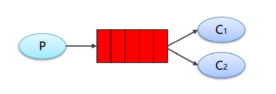

# 一、RabbitMQ安装

## 1.1 Redis安装

参考网站：
1：https://www.rabbitmq.com/download.html
2：https://registry.hub.docker.com/_/rabbitmq/

### 1 获取rabbit镜像

```shell
docker pull rabbitmq:management
```

### 2 创建并运行容器

```shell
docker run -di --name=myrabbit -p 15672:15672 rabbitmq:management
```

### 3 推荐方式

—hostname：指定容器主机名称
—name:指定容器名称
-p:将mq端口号映射到本地
或者运行时设置用户和密码

```shell
docker run -di --name myrabbit -e RABBITMQ_DEFAULT_USER=admin -e RABBITMQ_DEFAULT_PASS=admin -p 15672:15672 -p 5672:5672 -p 25672:25672 -p 61613:61613 -p 1883:1883 rabbitmq:management
```


# 二、RabbitMQ角色分类

## 1 none

- 不能访问management plugin

## 2 management：查看自己相关节点信息

- 列出自己可以通过AMQP登入的虚拟机
- 查看自己的虚拟机节点 virtual hosts的queues,exchanges和bindings信息
- 查看和关闭自己的channels和connections
- 查看有关自己的虚拟机节点virtual hosts的统计信息。包括其他用户在这个节点virtual hosts中的活动信息。

## 3 Policymaker

- 包含management所有权限
- 查看和创建和删除自己的virtual hosts所属的policies和parameters信息。

## 4 Monitoring

- 包含management所有权限
- 罗列出所有的virtual hosts，包括不能登录的virtual hosts。
- 查看其他用户的connections和channels信息
- 查看节点级别的数据如clustering和memory使用情况
- 查看所有的virtual hosts的全局统计信息。

## 5 Administrator

- 最高权限
- 可以创建和删除virtual hosts
- 可以查看，创建和删除users
- 查看创建permisssions
- 关闭所有用户的connections

# 三、快速入门程序

## 3.1 依赖

```xml
<dependencies>
    <dependency>
        <groupId>com.rabbitmq</groupId>
        <artifactId>amqp-client</artifactId>
        <version>5.10.0</version>
    </dependency>
</dependencies>
```

## 3.2 producer 生产者

```java
public class ProducerHelloWorld {
    public static void main(String[] args) throws IOException, TimeoutException {
        // 1. 创建连接工厂
        ConnectionFactory connectionFactory = new ConnectionFactory();
        // 2. 设置参数
        //ip 默认localhost
        connectionFactory.setHost("");
        //端口 默认5672
        connectionFactory.setPort(5672);
        //用户名 默认guest
        connectionFactory.setUsername("admin");
        //密码 默认guest
        connectionFactory.setPassword("admin");
        // 3. 创建连接
        Connection connection = connectionFactory.newConnection();
        // 4. 创建通道 channel
        Channel channel = connection.createChannel();
        // 5. 创建队列
        /**
         * queue -队列的名称
         * durable- true如果我们声明一个持久队列 (队列将在服务器重启后存活)
         * exclusive- true如果我们声明一个排他队列 (仅限于此连接)
         *   * 是否独占
         *   * 当Connection被关闭时，是否删除队列
         * autoDelete- true 如果我们声明了一个autoDelete队列(服务器将在不再使用时删除它)
         * arguments -队列的其他属性 (构造参数)
         */
        //如果没有一个名字叫HELLO_WORLD的队列，则会创建该队列，如果有则不会创建
        channel.queueDeclare("HELLO_WORLD", true, false, false, null);
        // 6. 发送消息
        /**
         * exchange -将消息发布到
         *  * 交换机的名称。简单模式下回使用默认的""
         * routingKey -路由密钥 及名称
         * props -消息的其他属性-路由头等
         *  * 配置信息
         * body -消息正文
         */
        String body = "hello 饮梦";
        channel.basicPublish("", "HELLO_WORLD", null, body.getBytes());

        // 7. 释放资源
        channel.close();
        connection.close();
    }
}
```


## 3.2 consumer 消费者

```java
public class ConsumerHelloWorld {
    public static void main(String[] args) throws IOException, TimeoutException {
        {
            // 1. 创建连接工厂
            ConnectionFactory connectionFactory = new ConnectionFactory();
            // 2. 设置参数
            //ip 默认localhost
            connectionFactory.setHost("");
            //端口 默认5672
            connectionFactory.setPort(5672);
            //用户名 默认guest
            connectionFactory.setUsername("admin");
            //密码 默认guest
            connectionFactory.setPassword("admin");
            // 3. 创建连接
            Connection connection = connectionFactory.newConnection();
            // 4. 创建通道 channel
            Channel channel = connection.createChannel();
            // 5. 创建队列
            /**
             * queue -队列的名称
             * durable- true如果我们声明一个持久队列 (队列将在服务器重启后存活)
             * exclusive- true如果我们声明一个排他队列 (仅限于此连接)
             *   * 是否独占
             *   * 当Connection被关闭时，是否删除队列
             * autoDelete- true 如果我们声明了一个autoDelete队列(服务器将在不再使用时删除它)
             * arguments -队列的其他属性 (构造参数)
             */
            //如果没有一个名字叫HELLO_WORLD的队列，则会创建该队列，如果有则不会创建
            channel.queueDeclare("HELLO_WORLD", true, false, false, null);
            // 6. 接收消息
            Consumer consumer = new DefaultConsumer(channel) {
                /**
                 * 回调方法，当收到消息后会自动执行该方法
                 * @param consumerTag 标识
                 * @param envelope 获取一些信息，交换机，路由key
                 * @param properties 消息的内容头数据
                 * @param body 消息体 (不透明的，特定于客户端的字节数组)
                 * @throws IOException
                 */
                @Override
                public void handleDelivery(String consumerTag, Envelope envelope, AMQP.BasicProperties properties, byte[] body) throws IOException {
//                    super.handleDelivery(consumerTag, envelope, properties, body);
                    System.out.println("consumerTag=>" + consumerTag);
                    System.out.println("envelope=>" + envelope.getExchange());
                    System.out.println("envelope=>" + envelope.getRoutingKey());
                    System.out.println("properties=>" + properties);
                    System.out.println("body=>" + new String(body));
                }
            };

            /**
             * queue -队列名称
             * autoAck -如果服务器应考虑消息传递后已确认，则为true; 如果服务器应期望显式确认，则为false
             *   * 是否自动确认
             * callback consumer对象的接口 回调对象
             */
            channel.basicConsume("HELLO_WORLD", true, consumer);

            // 7. 不关闭资源
//            channel.close();
//            connection.close();
        }
    }
}
```

# 四、 RabbitMQ 的工作模式

## 4.1 Work queues 工作队列模式



Work Queues：与入门程序的简单模式相比，多了一个或一些消费端，多个消费端共同消费同一个队列中的消息。 

> 应用场景：对于任务过重或任务较多情况使用工作队列可以提高任务处理的速度。


## 4.2 Pub/Sub 订阅模式


在订阅模型中，多了一个 Exchange 角色，而且过程略有变化： 

+ P：生产者，也就是要发送消息的程序，但是不再发送到队列中，而是发给X（交换机） 
+ C：消费者，消息的接收者，会一直等待消息到来 
+ Queue：消息队列，接收消息、缓存消息 
+  Exchange：交换机（X）。一方面，接收生产者发送的消息。另一方面，知道如何处理消息，例如递交给某个特别队列、 递交给所有队列、或是将消息丢弃。到底如何操作，取决于Exchange的类型。
  Exchange有常见以下3种类型： 
  + ➢ Fanout：广播，将消息交给所有绑定到交换机的队列 
  + ➢ Direct：定向，把消息交给符合指定routing key 的队列 
  + ➢ Topic：通配符，把消息交给符合routing pattern（路由模式） 的队列 

**Exchange（交换机）**只负责转发消息，不具备存储消息的能力，因此如果没有任何队列与 Exchange 绑定，或者没有符合 路由规则的队列，那么消息会丢失！

### 1 生产者

```java
public class Producer_PubSub {
    public static void main(String[] args) throws IOException, TimeoutException {
        // 1. 创建连接工厂
        ConnectionFactory connectionFactory = new ConnectionFactory();
        // 2. 设置参数
        //ip 默认localhost
        connectionFactory.setHost("47.109.33.195");
        //端口 默认5672
        connectionFactory.setPort(5672);
        //用户名 默认guest
        connectionFactory.setUsername("admin");
        //密码 默认guest
        connectionFactory.setPassword("admin");
        // 3. 创建连接
        Connection connection = connectionFactory.newConnection();
        // 4. 创建通道 channel
        Channel channel = connection.createChannel();
        // 5. 创建交换机
        /**
         * exchangeDeclare(String exchange,
         *         BuiltinExchangeType type,
         *         boolean durable,
         *         boolean autoDelete,
         *         boolean internal,
         *         Map<String, Object> arguments)
         * 参数：
         * exchange -交换机的名称
         * type -交换机的类型
         *   *  DIRECT("direct"),  定向
         *   *  FANOUT("fanout"),  扇形（广播），发送消息到没一个与之绑定的队列
         *   *  TOPIC("topic"),  通配符
         *   *  HEADERS("headers");  参数匹配
         * durable -持久化
         * autoDelete -是否自动删除
         * internal- true。内部使用，一般为false
         * arguments -参数
         */
        String exchangeName = "test_fanout";
        channel.exchangeDeclare(exchangeName, BuiltinExchangeType.FANOUT, true, false, null);
        // 6. 创建队列
        String queue1Name = "test_fanout_queue1";
        String queue2Name = "test_fanout_queue2";
        channel.queueDeclare(queue1Name, true, false, false, null);
        channel.queueDeclare(queue2Name, true, false, false, null);
        // 7. 绑定队列和交换机
        /**
         * queueBind(String queue, String exchange, String routingKey)
         * 参数：
         * queue -队列名称
         * exchange -交换机名称
         * routingKey -路由键，绑定规则
         *   *如果交换机的类型为fanout，routingKey设置为""
         */
        channel.queueBind(queue1Name, exchangeName, "");
        channel.queueBind(queue2Name, exchangeName, "");
        // 8. 发送消息
        String body = "日志信息:有人调用了findAll方法...日志级别:info...";
        channel.basicPublish(exchangeName, "", null, body.getBytes());

        // 9. 释放资源
        channel.close();
        connection.close();
    }
}
```

### 2 消费者

```java
public class Consumer_PubSub01 {
    public static void main(String[] args) throws IOException, TimeoutException {
        {
            // 1. 创建连接工厂
            ConnectionFactory connectionFactory = new ConnectionFactory();
            // 2. 设置参数
            //ip 默认localhost
            connectionFactory.setHost("47.109.33.195");
            //端口 默认5672
            connectionFactory.setPort(5672);
            //用户名 默认guest
            connectionFactory.setUsername("admin");
            //密码 默认guest
            connectionFactory.setPassword("admin");
            // 3. 创建连接
            Connection connection = connectionFactory.newConnection();
            // 4. 创建通道 channel
            Channel channel = connection.createChannel();
            // 5. 接收消息
            Consumer consumer = new DefaultConsumer(channel) {
                /**
                 * 回调方法，当收到消息后会自动执行该方法
                 * @param consumerTag 标识
                 * @param envelope 获取一些信息，交换机，路由key
                 * @param properties 消息的内容头数据
                 * @param body 消息体 (不透明的，特定于客户端的字节数组)
                 * @throws IOException
                 */
                @Override
                public void handleDelivery(String consumerTag, Envelope envelope, AMQP.BasicProperties properties, byte[] body) throws IOException {
                    System.out.println("body=>" + new String(body));
                    System.out.println("=====日志信息打印到控制台=====");
                }
            };

            String queue1Name = "test_fanout_queue1";
            String queue2Name = "test_fanout_queue2";
            channel.basicConsume(queue1Name, true, consumer);


        }
    }
}
```

```java
public class Consumer_PubSub02 {
    public static void main(String[] args) throws IOException, TimeoutException {
        {
            ConnectionFactory connectionFactory = new ConnectionFactory();
            connectionFactory.setHost("47.109.33.195");
            connectionFactory.setPort(5672);
            connectionFactory.setUsername("admin");
            connectionFactory.setPassword("admin");
            Connection connection = connectionFactory.newConnection();
            Channel channel = connection.createChannel();
            Consumer consumer = new DefaultConsumer(channel) {
                @Override
                public void handleDelivery(String consumerTag, Envelope envelope, AMQP.BasicProperties properties, byte[] body) throws IOException {
                    System.out.println("body=>" + new String(body));
                    System.out.println("=====日志信息保存到数据库=====");
                }
            };

            String queue1Name = "test_fanout_queue1";
            String queue2Name = "test_fanout_queue2";
            channel.basicConsume(queue2Name, true, consumer);


        }
    }
}
```

### 小结

1. 交换机需要与队列进行绑定，绑定之后；一个消息可以被多个消费者都收到。 
2. 发布订阅模式与工作队列模式的区别： 
   +  工作队列模式不用定义交换机，而发布/订阅模式需要定义交换机 
   + 发布/订阅模式的生产方是面向交换机发送消息，工作队列模式的生产方是面向队列发送消息(底层使用 默认交换机) 
   +  发布/订阅模式需要设置队列和交换机的绑定，工作队列模式不需要设置，实际上工作队列模式会将队列绑定到默认的交换机

## 4.3 Routing 路由模式

+ 队列与交换机的绑定，不能是任意绑定了，而是要指定一个 RoutingKey（路由key） 
+  消息的发送方在向 Exchange 发送消息时，也必须指定消息的 RoutingKey 
+ Exchange 不再把消息交给每一个绑定的队列，而是根据消息的 Routing Key 进行判断，只有队列的 Routingkey 与消息的 Routing key 完全一致，才会接收到消息


+ P：生产者，向 Exchange 发送消息，发送消息时，会指定一个routing key 
+  X：Exchange（交换机），接收生产者的消息，然后把消息递交给与 routing key 完全匹配的队列 
+  C1：消费者，其所在队列指定了需要 routing key 为 error 的消息 
+  C2：消费者，其所在队列指定了需要 routing key 为 info、error、warning 的消息

### 1 生产者

```java
public class Producer_Routing {
    public static void main(String[] args) throws IOException, TimeoutException {
        // 1. 创建连接工厂
        ConnectionFactory connectionFactory = new ConnectionFactory();
        // 2. 设置参数
        //ip 默认localhost
        connectionFactory.setHost("47.109.33.195");
        //端口 默认5672
        connectionFactory.setPort(5672);
        //用户名 默认guest
        connectionFactory.setUsername("admin");
        //密码 默认guest
        connectionFactory.setPassword("admin");
        // 3. 创建连接
        Connection connection = connectionFactory.newConnection();
        // 4. 创建通道 channel
        Channel channel = connection.createChannel();
        // 5. 创建交换机
        /**
         * exchangeDeclare(String exchange,
         *         BuiltinExchangeType type,
         *         boolean durable,
         *         boolean autoDelete,
         *         boolean internal,
         *         Map<String, Object> arguments)
         * 参数：
         * exchange -交换机的名称
         * type -交换机的类型
         *   *  DIRECT("direct"),  定向
         *   *  FANOUT("fanout"),  扇形（广播），发送消息到没一个与之绑定的队列
         *   *  TOPIC("topic"),  通配符
         *   *  HEADERS("headers");  参数匹配
         * durable -持久化
         * autoDelete -是否自动删除
         * internal- true。内部使用，一般为false
         * arguments -参数
         */
        String exchangeName = "test_direct";
        channel.exchangeDeclare(exchangeName, BuiltinExchangeType.DIRECT, true, false, null);
        // 6. 创建队列
        String queue1Name = "test_direct_queue1";
        String queue2Name = "test_direct_queue2";
        channel.queueDeclare(queue1Name, true, false, false, null);
        channel.queueDeclare(queue2Name, true, false, false, null);
        // 7. 绑定队列和交换机
        channel.queueBind(queue1Name, exchangeName, "error");
        channel.queueBind(queue2Name, exchangeName, "info");
        channel.queueBind(queue2Name, exchangeName, "warning");
        channel.queueBind(queue2Name, exchangeName, "error");
        // 8. 发送消息
//        String body = "日志信息:有人调用了findAll方法...日志级别:info...";
        String body = "日志信息:有人调用了delete方法...出错了...日志级别:error...";
        channel.basicPublish(exchangeName, "error", null, body.getBytes());

        // 9. 释放资源
        channel.close();
        connection.close();
    }
}
```

### 2 消费者

```java
public class Consumer_Routing01 {
    public static void main(String[] args) throws IOException, TimeoutException {
        {
            // 1. 创建连接工厂
            ConnectionFactory connectionFactory = new ConnectionFactory();
            // 2. 设置参数
            //ip 默认localhost
            connectionFactory.setHost("47.109.33.195");
            //端口 默认5672
            connectionFactory.setPort(5672);
            //用户名 默认guest
            connectionFactory.setUsername("admin");
            //密码 默认guest
            connectionFactory.setPassword("admin");
            // 3. 创建连接
            Connection connection = connectionFactory.newConnection();
            // 4. 创建通道 channel
            Channel channel = connection.createChannel();
            // 5. 接收消息
            Consumer consumer = new DefaultConsumer(channel) {
                /**
                 * 回调方法，当收到消息后会自动执行该方法
                 * @param consumerTag 标识
                 * @param envelope 获取一些信息，交换机，路由key
                 * @param properties 消息的内容头数据
                 * @param body 消息体 (不透明的，特定于客户端的字节数组)
                 * @throws IOException
                 */
                @Override
                public void handleDelivery(String consumerTag, Envelope envelope, AMQP.BasicProperties properties, byte[] body) throws IOException {
                    System.out.println("body=>" + new String(body));
                    System.out.println("=====日志信息打印到控制台=====");
                }
            };

            String queue1Name = "test_direct_queue1";
            String queue2Name = "test_direct_queue2";
            channel.basicConsume(queue1Name, true, consumer);
        }
    }
```

### 小结

<span style='color:red'>**Routing 模式**</span>要求队列在绑定交换机时要指定<span style='color:red'> **routing key**</span>，消息会转发到符合 routing key 的队列。


## 4.4 Topics 通配符模式


+ 红色 Queue：绑定的是 usa.# ，因此凡是以 usa. 开头的 routing key 都会被匹配到 
+ 黄色 Queue：绑定的是 #.news ，因此凡是以 .news 结尾的 routing key 都会被匹配

### 1 生产者

```java
public class Producer_Topic {
    public static void main(String[] args) throws IOException, TimeoutException {
        // 1. 创建连接工厂
        ConnectionFactory connectionFactory = new ConnectionFactory();
        // 2. 设置参数
        //ip 默认localhost
        connectionFactory.setHost("47.109.33.195");
        //端口 默认5672
        connectionFactory.setPort(5672);
        //用户名 默认guest
        connectionFactory.setUsername("admin");
        //密码 默认guest
        connectionFactory.setPassword("admin");
        // 3. 创建连接
        Connection connection = connectionFactory.newConnection();
        // 4. 创建通道 channel
        Channel channel = connection.createChannel();
        // 5. 创建交换机
        /**
         * exchangeDeclare(String exchange,
         *         BuiltinExchangeType type,
         *         boolean durable,
         *         boolean autoDelete,
         *         boolean internal,
         *         Map<String, Object> arguments)
         * 参数：
         * exchange -交换机的名称
         * type -交换机的类型
         *   *  DIRECT("direct"),  定向
         *   *  FANOUT("fanout"),  扇形（广播），发送消息到没一个与之绑定的队列
         *   *  TOPIC("topic"),  通配符
         *   *  HEADERS("headers");  参数匹配
         * durable -持久化
         * autoDelete -是否自动删除
         * internal- true。内部使用，一般为false
         * arguments -参数
         */
        String exchangeName = "test_topic";
        channel.exchangeDeclare(exchangeName, BuiltinExchangeType.TOPIC, true, false, null);
        // 6. 创建队列
        String queue1Name = "test_topic_queue1";
        String queue2Name = "test_topic_queue2";
        channel.queueDeclare(queue1Name, true, false, false, null);
        channel.queueDeclare(queue2Name, true, false, false, null);
        // 7. 绑定队列和交换机
        //routing ket 系统的名称.日志的级别
        channel.queueBind(queue1Name, exchangeName, "#.error");
        channel.queueBind(queue1Name, exchangeName, "order.*");
        channel.queueBind(queue2Name, exchangeName, "*.*");
        // 8. 发送消息
        String body = "日志信息:有人调用了findAll方法...日志级别:info...";
//        String body = "日志信息:有人调用了delete方法...出错了...日志级别:error...";
//        channel.basicPublish(exchangeName, "order.info", null, body.getBytes());
        channel.basicPublish(exchangeName, "this.info", null, body.getBytes());

        // 9. 释放资源
        channel.close();
        connection.close();
    }
}
```

### 2 消费者

```java
public class Consumer_Topic01 {
    public static void main(String[] args) throws IOException, TimeoutException {
        {
            // 1. 创建连接工厂
            ConnectionFactory connectionFactory = new ConnectionFactory();
            // 2. 设置参数
            //ip 默认localhost
            connectionFactory.setHost("47.109.33.195");
            //端口 默认5672
            connectionFactory.setPort(5672);
            //用户名 默认guest
            connectionFactory.setUsername("admin");
            //密码 默认guest
            connectionFactory.setPassword("admin");
            // 3. 创建连接
            Connection connection = connectionFactory.newConnection();
            // 4. 创建通道 channel
            Channel channel = connection.createChannel();
            // 5. 接收消息
            Consumer consumer = new DefaultConsumer(channel) {
                /**
                 * 回调方法，当收到消息后会自动执行该方法
                 * @param consumerTag 标识
                 * @param envelope 获取一些信息，交换机，路由key
                 * @param properties 消息的内容头数据
                 * @param body 消息体 (不透明的，特定于客户端的字节数组)
                 * @throws IOException
                 */
                @Override
                public void handleDelivery(String consumerTag, Envelope envelope, AMQP.BasicProperties properties, byte[] body) throws IOException {
                    System.out.println("body=>" + new String(body));
                    System.out.println("=====日志信息存入数据库=====");
                }
            };

            String queue1Name = "test_topic_queue1";
            String queue2Name = "test_topic_queue2";
            channel.basicConsume(queue1Name, true, consumer);


        }
    }
}
```


### 小结

Topic 主题模式可以实现 Pub/Sub 发布与订阅模式和 Routing 路由模式的功能，只是 Topic 在配置routing key  的时候可以使用通配符，显得更加灵活。

> \* 匹配一个单词
>
> \# 匹配一个或多个单词
>
> . 作为单词的分割


## 4.5 工作模式总结

1. 简单模式 HelloWorld 

   一个生产者、一个消费者，不需要设置交换机（使用默认的交换机）。 

2.  工作队列模式 Work Queue 

   一个生产者、多个消费者（竞争关系），不需要设置交换机（使用默认的交换机）。 

3. 发布订阅模式 Publish/subscribe 

   需要设置类型为 fanout 的交换机，并且交换机和队列进行绑定，当发送消息到交换机后，交换机会将消 息发送到绑定的队列。 

4. 路由模式 Routing 

   需要设置类型为 direct 的交换机，交换机和队列进行绑定，并且指定 routing key，当发送消息到交换机 后，交换机会根据 routing key 将消息发送到对应的队列。

5. 通配符模式 Topic 

   需要设置类型为 topic 的交换机，交换机和队列进行绑定，并且指定通配符方式的 routing key，当发送 消息到交换机后，交换机会根据 routing key 将消息发送到对应的队列。


# 五、Spring 整合**RabbitMQ**


## 5.1 导包

```xml
<dependencies>
    <dependency>
        <groupId>org.springframework</groupId>
        <artifactId>spring-context</artifactId>
        <version>5.3.23</version>
    </dependency>
    <dependency>
        <groupId>org.springframework.amqp</groupId>
        <artifactId>spring-rabbit</artifactId>
        <version>2.3.10</version>
    </dependency>
    <dependency>
        <groupId>junit</groupId>
        <artifactId>junit</artifactId>
        <version>4.13.2</version>
    </dependency>
    <dependency>
        <groupId>org.springframework</groupId>
        <artifactId>spring-test</artifactId>
        <version>5.3.23</version>
    </dependency>
</dependencies>
```


## 5.2 创建配置文件

### rabbitmq.properties

```properties
rabbitmq.host=
rabbitmq.port=5672
rabbitmq.username=admin
rabbitmq.password=admin
#  virtual-host: /tan00xu
```

### spring-rabbitmq-producer.xml

```xml
<?xml version="1.0" encoding="UTF-8"?>
<beans xmlns="http://www.springframework.org/schema/beans"
       xmlns:xsi="http://www.w3.org/2001/XMLSchema-instance"
       xmlns:context="http://www.springframework.org/schema/context"
       xmlns:rabbit="http://www.springframework.org/schema/rabbit"
       xsi:schemaLocation="http://www.springframework.org/schema/beans
       http://www.springframework.org/schema/beans/spring-beans.xsd
       http://www.springframework.org/schema/context
       https://www.springframework.org/schema/context/spring-context.xsd
       http://www.springframework.org/schema/rabbit
       http://www.springframework.org/schema/rabbit/spring-rabbit.xsd">

    <!--加载配置文件-->
    <context:property-placeholder location="rabbitmq.properties"/>

    <!--定义rabbitmq connectionFactory-->
    <rabbit:connection-factory
            id="connectionFactory"
            host="${rabbitmq.host}"
            username="${rabbitmq.username}"
            password="${rabbitmq.password}"
    />
    <!--            virtual-host="${rabbitmq.virtual-host}"/>-->

    <!--定义管理交换机、队列-->
    <rabbit:admin connection-factory="connectionFactory"/>

    <!--定义持久化队列，不存在则自动创建；不绑定交换机则绑定到默认交换机，默认交换机类型为direct，名字为""，路由键为队列的名字-->
    <rabbit:queue id="spring_queue" name="spring_queue" auto-declare="true"/>

    <!-- ~~~~~~~~~~~~~~~~~~~~~~~~~~~~广播；所有队列都能收到消息~~~~~~~~~~~~~~~~~~~~~~~~~~~~ -->
    <!--定义广播交换机中的持久化队列，不存在则自动创建-->
    <rabbit:queue id="spring_fanout_queue_1" name="spring_fanout_queue_1" auto-declare="true"/>

    <!--定义广播交换机中的持久化队列，不存在则自动创建-->
    <rabbit:queue id="spring_fanout_queue_2" name="spring_fanout_queue_2" auto-declare="true"/>

    <!--定义广播类型交换机；并绑定上述两个队列-->
    <rabbit:fanout-exchange id="spring_fanout_exchange" name="spring_fanout_exchange" auto-declare="true">
        <rabbit:bindings>
            <rabbit:binding queue="spring_fanout_queue_1"/>
            <rabbit:binding queue="spring_fanout_queue_2"/>
        </rabbit:bindings>
    </rabbit:fanout-exchange>

    <!-- ~~~~~~~~~~~~~~~~~~~~~~~~~~~~通配符；*匹配一个单词，#匹配多个单词 ~~~~~~~~~~~~~~~~~~~~~~~~~~~~ -->
    <!--定义广播交换机中的持久化队列，不存在则自动创建-->
    <rabbit:queue id="spring_topic_queue_star" name="spring_topic_queue_star" auto-declare="true"/>
    <!--定义广播交换机中的持久化队列，不存在则自动创建-->
    <rabbit:queue id="spring_topic_queue_well" name="spring_topic_queue_well" auto-declare="true"/>
    <!--定义广播交换机中的持久化队列，不存在则自动创建-->
    <rabbit:queue id="spring_topic_queue_well2" name="spring_topic_queue_well2" auto-declare="true"/>

    <rabbit:topic-exchange id="spring_topic_exchange" name="spring_topic_exchange" auto-declare="true">
        <rabbit:bindings>
            <rabbit:binding pattern="heima.*" queue="spring_topic_queue_star"/>
            <rabbit:binding pattern="heima.#" queue="spring_topic_queue_well"/>
            <rabbit:binding pattern="itcast.#" queue="spring_topic_queue_well2"/>
        </rabbit:bindings>
    </rabbit:topic-exchange>

    <!--定义rabbitTemplate对象操作可以在代码中方便发送消息-->
    <rabbit:template id="rabbitTemplate" connection-factory="connectionFactory"/>
</beans>
```

## 5.3 生产者

```java
@RunWith(SpringJUnit4ClassRunner.class)
@ContextConfiguration(locations = {"classpath:spring-rabbitmq-producer.xml"})
public class ProducerTest {

    @Autowired
    private RabbitTemplate rabbitTemplate;

    @Test
    public void testHelloWorld() {
        //发送消息
        rabbitTemplate.convertAndSend("spring_queue", "hello world spring...");
    }

    /**
     * 发送fanout消息
     */
    @Test
    public void testFanout() {
        //发送消息
        rabbitTemplate.convertAndSend("spring_fanout_exchange", "", "hello world spring fanout...");
    }

    /**
     * 发送Topic消息
     */
    @Test
    public void testTopic() {
        //发送消息
        rabbitTemplate.convertAndSend("spring_topic_exchange", "heima.he.wuhu", "hello world spring Topic...");
    }
}
```

## 5.4 消费者

### rabbitmq.properties

```properties
rabbitmq.host=47.109.33.195
rabbitmq.port=5672
rabbitmq.username=admin
rabbitmq.password=admin
#  virtual-host: /tan00xu
```

### spring-rabbitmq-consumer.xml

```xml
<?xml version="1.0" encoding="UTF-8"?>
<beans xmlns="http://www.springframework.org/schema/beans"
       xmlns:xsi="http://www.w3.org/2001/XMLSchema-instance"
       xmlns:context="http://www.springframework.org/schema/context"
       xmlns:rabbit="http://www.springframework.org/schema/rabbit"
       xsi:schemaLocation="http://www.springframework.org/schema/beans
       http://www.springframework.org/schema/beans/spring-beans.xsd
       http://www.springframework.org/schema/context
       https://www.springframework.org/schema/context/spring-context.xsd
       http://www.springframework.org/schema/rabbit
       http://www.springframework.org/schema/rabbit/spring-rabbit.xsd">
    <!--加载配置文件-->
    <context:property-placeholder location="classpath:rabbitmq.properties"/>

    <!-- 定义rabbitmq connectionFactory -->
    <rabbit:connection-factory
            id="connectionFactory"
            host="${rabbitmq.host}"
            port="${rabbitmq.port}"
            username="${rabbitmq.username}"
            password="${rabbitmq.password}"
    />
    <!--    virtual-host="${rabbitmq.virtual-host}"-->

    <bean id="springQueueListener" class="com.tan00xu.SpringQueueListener"/>
    <!--    <bean id="fanoutListener1" class="com.tan00xu.FanoutListener1"/>-->
    <!--    <bean id="fanoutListener2" class="com.tan00xu.FanoutListener2"/>-->
    <!--    <bean id="topicListenerStar" class="com.tan00xu.TopicListenerStar"/>-->
    <!--    <bean id="topicListenerWell" class="com.tan00xu.TopicListenerWell"/>-->
    <!--    <bean id="topicListenerWell2" class="com.tan00xu.TopicListenerWell2"/>-->

    <!--监听器容器-->
    <rabbit:listener-container connection-factory="connectionFactory" auto-declare="true">
        <rabbit:listener ref="springQueueListener" queue-names="spring_queue"/>
        <!--        <rabbit:listener ref="fanoutListener1" queue-names="spring_fanout_queue_1"/>-->
        <!--        <rabbit:listener ref="fanoutListener2" queue-names="spring_fanout_queue_2"/>-->
        <!--        <rabbit:listener ref="topicListenerStar" queue-names="spring_topic_queue_star"/>-->
        <!--        <rabbit:listener ref="topicListenerWell" queue-names="spring_topic_queue_well"/>-->
        <!--        <rabbit:listener ref="topicListenerWell2" queue-names="spring_topic_queue_well2"/>-->
    </rabbit:listener-container>
</beans>
```

### MessageListener实现类

```java
public class SpringQueueListener implements MessageListener {
    @Override
    public void onMessage(Message message) {
        //打印消息
        System.out.println(new String(message.getBody()));
    }
}
```

### 测试

```java
@RunWith(SpringJUnit4ClassRunner.class)
@ContextConfiguration(locations = {"classpath:spring-rabbitmq-consumer.xml"})
public class ConsumerTest {
    @Test
    public void test1() {
        while (true) {
        }

    }
}
```


# 六、Springboot整合**RabbitMQ**


## 6.1 导包

```xml
<dependencies>
    <dependency>
        <groupId>org.springframework.boot</groupId>
        <artifactId>spring-boot-starter</artifactId>
    </dependency>

    <dependency>
        <groupId>org.springframework.boot</groupId>
        <artifactId>spring-boot-starter-test</artifactId>
        <scope>test</scope>
    </dependency>

    <dependency>
        <groupId>org.springframework.boot</groupId>
        <artifactId>spring-boot-starter-amqp</artifactId>
    </dependency>
    <dependency>
        <groupId>org.springframework.boot</groupId>
        <artifactId>spring-boot-starter-test</artifactId>
    </dependency>
  
    <dependency>
        <groupId>junit</groupId>
        <artifactId>junit</artifactId>
        <scope>test</scope>
    </dependency>
</dependencies>
```

## 6.2 配置文件

```yaml
spring:
  rabbitmq:
    host: 
    port: 5672
    username: admin
    password: admin
```

## 6.3 生产者

### RabbitMQConfig

```java
@Configuration
public class RabbitMQConfig {
    public static final String EXCHANGE_NAME = "springboot_topic_exchange";
    public static final String QUEUE_NAME = "springboot_queue";

    // 1. 交换机
    @Bean("bootExchange")
    public Exchange bootExchange() {
        return ExchangeBuilder
                .topicExchange(EXCHANGE_NAME)
                .durable(true)
                .build();
    }

    // 2. 队列
    @Bean("bootQueue")
    public Queue bootQueue() {
        return QueueBuilder.durable(QUEUE_NAME).build();
    }

    // 3. 队列和交换机绑定
    @Bean
    public Binding bindQueueExchange(@Qualifier("bootQueue") Queue bootQueue, @Qualifier("bootExchange") Exchange bootExchange) {
//        return BindingBuilder.bind(bootQueue()).to(bootExchange()).with("boot.#").noargs();
        return BindingBuilder.bind(bootQueue).to(bootExchange).with("boot.#").noargs();

    }

}
```


## 6.4 消费者

```java
@Component
public class RabbitMQListener {

    @RabbitListener(queues = "springboot_queue")
    public void ListenerQueue(Message message) {
        System.out.println(new String(message.getBody()));
    }
}
```