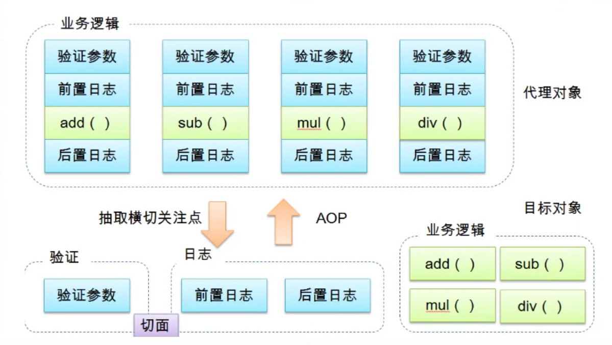

[TOC]


# Spring

## 一、简介

Spring框架是由于软件开发的复杂性而创建的。Spring使用的是基本的JavaBean来完成以前只可能由EJB完成的事情。然而，Spring的用途不仅仅限于服务器端的开发。从简单性、可测试性和松耦合性角度而言，绝大部分Java应用都可以从Spring中受益。

Spring的初衷：

1. JAVA EE开发应该更加简单。

2. 使用接口而不是使用类，是更好的编程习惯。Spring将使用接口的复杂度几乎降低到了零。

3. 为JavaBean提供了一个更好的应用配置框架。

4. 更多地强调面向对象的设计，而不是现行的技术如JAVA EE。

5. 尽量减少不必要的异常捕捉。

6. 使应用程序更加容易测试。

Spring的目标：

1. 可以令人方便愉快的使用Spring。

2. 应用程序代码并不依赖于Spring APIs。

3. Spring不和现有的解决方案竞争，而是致力于将它们融合在一起。

Spring的基本组成：

1. 最完善的轻量级核心框架。

2. 通用的事务管理抽象层。

3. JDBC抽象层。

4. 集成了Toplink, Hibernate, JDO, and iBATIS SQL Maps。

5. AOP功能。

6. 灵活的MVC Web应用框架。


+ SSH : Struct2 + Spring + Hibernate

+ SSM : SpringMVC + Spring + Mybatis

​	

### 优点：

+ Spring是一个开源的免费的框架(容器)！
+ Spring是一个轻量级的、非入侵式的框架！
+ 控制反转(IOC)，面向切面编程(AOP) !
+ 支持事务的处理，对框架整合的支持！

==Spring就是一个轻量级的控制反转(IOC)和面向切面编程(AOP)的框架!！==


### 组成：


### 拓展：

现代Java开发是基于Spring


+ Spring Boot
  + 结果快速的脚手架
  + 基于SpringBoot可以快速开发单个微服务

+ Spring Cloud
  + SpringCloud是基于SpringBoot实现的

​	

因为现在大多数公司都在使用SpringBoot进行快速开发，学习SpringBoot的前提，需要完全掌握Spring及SpringMVC! 承上启下的作用!

弊端：发展了太久之后，违背了原来的理念！配置十分繁琐，人称：“配置地狱！” 

---


## 二、IOC理论推导

1. UserDao 接口
2. UserDaolmpl 实现类
3. UserService 业务接口
4. UserServicelmpl 业务实现类

在我们之前的业务中，用户的需求可能会影响我们原来的代码,我们需要根据用户的需求去修改原代码！如果程序代码量十分大，修改一次的成本代价十分昂贵！

我们使用一个Set接口实现

```java
  private UserDao userDao;
    /**
     * 利用set进行动态实现值的注入
     */
    public void setUserDao(UserDao userDao) {
        this.userDao = userDao;
    }
```

+ 之前，程序是主动创建对象！控制权在程序猿手上！
+ 使用了set注入后，程序不再具有主动性，而是变成了被动的接受对象！

这种思想，从本质上解决了问题，我们程序猿不用再去管理对象的创建了。系统的耦合性大大降低，可以更加专注于实现业务。

这是IOC原型！

---


## 三、IOC本质

**控制反转loC（Inversion of Control），是一种设计思想，DI（依赖注入）是实现loC的一种方法**，也有人认为DI只是loC的另一种说法。没有loC的程序中，我们使用面向对象编程，对象的创建与对象间的依赖关系完全硬编码在程序中，对象的创建由程序自己控制，控制反转后将对象的创建转移给第三方，个人认为所谓控制反转就是：获得依赖对象的方式反转了。

采用XML方式配置Bean的时候，Bean的定义信息是和实现分离的,而采用注解的方式可以把两者合为一体，Bean的定义信息直接以注解的形式定义在实现类中，从而达到了零配置的目的。

**控制反转是一种通过描述（XML或注解）并通过第三方去生产或获取特定对象的方式。在Spring中实现控制反转的是loC容器，其实现方法是依赖注入(DependencyInjection，DI)。**

---


## 四、Hello Spring

### 实体类：

```java
package com.tan00xu.pojo;

public class Hello {
    private String str;

    public String getStr() {
        return str;
    }

    public void setStr(String str) {
        this.str = str;
    }

    @Override
    public String toString() {
        return "Hello{" +
                "str='" + str + '\'' +
                '}';
    }
}
```

### XML配置：

```xml
<?xml version="1.0" encoding="UTF-8"?>
<beans xmlns="http://www.springframework.org/schema/beans"
       xmlns:xsi="http://www.w3.org/2001/XMLSchema-instance"
       xsi:schemaLocation="http://www.springframework.org/schema/beans http://www.springframework.org/schema/beans/spring-beans.xsd">

    <!--使用Spring来创建对象，在Spring这些都称为Bean
        类型 变量名 = new 类型();
        bean = 对象       new Hello();
        id = 变量名
        class = new 的对象;
        property 相当于给对象的属性设置一个值
    -->
    <bean id="hello" class="com.tan00xu.pojo.Hello">
        <property name="str" value="theSpring"/>
    </bean>

</beans>
```

```xml
<property name="" ref="" value=""/>
<!--
	name : 参数名
    ref : 引用Spring容器中创建好的对象
    value : 具体的值,基本数据类型!
-->
```

### 测试：

```java
import com.tan00xu.pojo.Hello;
import org.springframework.context.ApplicationContext;
import org.springframework.context.support.ClassPathXmlApplicationContext;

public class MyTest {
    public static void main(String[] args) {
        //获取Spring的上下文对象
        //获取ApplicationContext 拿到Spring容器
        //解析beans.xml文件，生成管理相应的bean对象
        ApplicationContext context = new ClassPathXmlApplicationContext("beans.xml");
        //我们的对象现在都在Spring中管理了，我们要使用就直接去里面取出来就可以
        //getBean : 参数为Spring配置文件中bean的id
        Hello hello = (Hello) context.getBean("hello");
        System.out.println(hello.toString());
    }
}

```

### 控制反转：

+ 控制：谁来控制对象的创建？传统应用程序的对象是由程序本身控制创建的，使用Spring后，对象是由Spring来创建的
+ 反转：程序本身不创建对象，而变成被动的接收对象

### 依赖注入：

+ 就是利用set方法来进行注入的
+ IOC是一种编程思想，由主动的编程变成被动的接收可以通过

newClassPathXmlApplicationContext去浏览一下底层源码。

**现在，我们彻底不用再程序中去改动了，要实现不同的操作，只需要在xml配置文件中进行修改，所谓的loc，一句话搞定：==对象由Spring来创建、管理、装配！==** 

---


## 五、IOC创建对象的方式

1. 使用无参构造创建对象，默认

   ```xml
   <bean id="user" class="com.tan00xu.pojo.User">
        <property name="name" value="饮梦"/>
   </bean>
   ```

   

2. 使用有参构造创建对象

   1. 下标赋值

      ```xml
      <!--第一种，下标赋值-->
          <bean id="user" class="com.tan00xu.pojo.User">
              <constructor-arg index="0" value="饮梦"/>
          </bean>
      ```

   2. 类型

      ```xml
      <!--第二种，通过类型创建，不建议使用！-->
           <bean id = "user" class="com.tan00xu.pojo.User">
               <constructor-arg type="java.lang.String" value="饮梦"/>
           </bean>
      ```

   3. 参数

      ```xml
      <!--第三种，直接通过参数名设置-->
          <bean id="user" class="com.tan00xu.pojo.User">
              <constructor-arg name="name" value="饮梦"/>
          </bean>
      ```

      

总结：在配置文件加载的时候，容器中管理的对象就已经初始化了!

---


## 六、Spring配置

### 6.1、别名

```xml
<!--别名,如果添加了别名,我们也可以使用别名获取到这个对象-->
    <alias name="user" alias="bieMing"/>
```

```xml
<bean id="user" class="com.tan00xu.pojo.User">
        <property name="name" value="饮梦"/>
</bean>
```

设置了别名可以这样取出

```java
 User user = (User) context.getBean("bieMing");
```


### 6.2、Bean的配置

```xml
<!--
    id : bean的唯一标识符，相当于对象名
    class : bean对象所对应的全限定名 : 包名 + 类型
    name : 也是别名，且可以同时取多个别名
    -->
    <bean id="user" class="com.tan00xu.pojo.User" name="u1 u2,u3;u4">
        <constructor-arg name="name" value="饮梦"/>
    </bean>
```


### 6.3、import

这个import，一般用于团队开发使用,他可以将多个配置文件，导入合并为一个

+ applicationContext.xml

  ```xml
  <import resource="beans1.xml"/>
  <import resource="beans2.xml"/>
  <import resource="beans3.xml"/>
  ```

  使用的时候导入总配置就可以了

---


## 七、DI依赖注入

### 7.1、构造器注入

### 7.2、Set方式注入

+ 依赖注入 : Set注入
  + 依赖 : bean对象的创建依赖于容器！
  + 注入 : bean对象中的所有属性，由容器来注入！


#### 【环境搭建】

1. 复杂类型

   ```java
   package com.tan00xu.pojo;
   
   public class Address {
       private String address;
   
       public String getAddress() {
           return address;
       }
   
       public void setAddress(String address) {
           this.address = address;
       }
   
       @Override
       public String toString() {
           return "Address{" +
                   "address='" + address + '\'' +
                   '}';
       }
   }
   ```

2. 真实测试对象

   ```java
   package com.tan00xu.pojo;
   
   import java.util.*;
   
   public class Student {
       private String name;
       private Address address;
       private String[] books;
       private List<String> hobbys;
       private Map<String, String> card;
       private Set<String> games;
       private String wife;
       private Properties info;
   
       @Override
       public String toString() {
           return "Student{" +
                   "name='" + name + '\'' +
                   ", address=" + address +
                   ", books=" + Arrays.toString(books) +
                   ", hobbys=" + hobbys +
                   ", card=" + card +
                   ", games=" + games +
                   ", wife='" + wife + '\'' +
                   ", info=" + info +
                   '}';
       }
   
       public String getName() {
           return name;
       }
   
       public void setName(String name) {
           this.name = name;
       }
   
       public Address getAddress() {
           return address;
       }
   
       public void setAddress(Address address) {
           this.address = address;
       }
   
       public String[] getBooks() {
           return books;
       }
   
       public void setBooks(String[] books) {
           this.books = books;
       }
   
       public List<String> getHobbys() {
           return hobbys;
       }
   
       public void setHobbys(List<String> hobbys) {
           this.hobbys = hobbys;
       }
   
       public Map<String, String> getCard() {
           return card;
       }
   
       public void setCard(Map<String, String> card) {
           this.card = card;
       }
   
       public Set<String> getGames() {
           return games;
       }
   
       public void setGames(Set<String> games) {
           this.games = games;
       }
   
       public String getWife() {
           return wife;
       }
   
       public void setWife(String wife) {
           this.wife = wife;
       }
   
       public Properties getInfo() {
           return info;
       }
   
       public void setInfo(Properties info) {
           this.info = info;
       }
   }
   
   ```

3. beans.xml

   ```xml
   <?xml version="1.0" encoding="UTF-8"?>
   <beans xmlns="http://www.springframework.org/schema/beans"
          xmlns:xsi="http://www.w3.org/2001/XMLSchema-instance"
          xsi:schemaLocation="http://www.springframework.org/schema/beans http://www.springframework.org/schema/beans/spring-beans.xsd">
   
       <bean id="address" class="com.tan00xu.pojo.Address">
           <property name="address" value="中国"/>
       </bean>
   
       <bean id="student" class="com.tan00xu.pojo.Student">
           <!--第一种，普通值注入，value-->
           <property name="name" value="饮梦"/>
           <!--第二种，bean注入，ref-->
           <property name="address" ref="address"/>
           <!--第三种，数组注入-->
           <property name="books">
               <array>
                   <value>西游记</value>
                   <value>红楼梦</value>
                   <value>水浒传</value>
                   <value>三国演义</value>
               </array>
           </property>
           <!--第四种，List-->
           <property name="hobbys">
               <list>
                   <value>听歌</value>
                   <value>游戏</value>
                   <value>敲代码</value>
               </list>
           </property>
           <!--第四种，Map-->
           <property name="card">
               <map>
                   <entry key="姓名" value="饮梦"/>
                   <entry key="性别" value="男"/>
               </map>
           </property>
           <!--第五种，set-->
           <property name="games">
               <set>
                   <value>JAVA</value>
                   <value>Python</value>
                   <value>C</value>
               </set>
           </property>
           <!--第六种，null-->
           <property name="wife">
               <null></null>
           </property>
           <!--第七种，Properties-->
           <property name="info">
               <props>
                   <prop key="学号">2022</prop>
                   <prop key="地址">四川</prop>
               </props>
           </property>
       </bean>
   </beans>
   ```
   
   4. 测试类
   
   ```java
   import com.tan00xu.pojo.Student;
   import org.springframework.context.ApplicationContext;
   import org.springframework.context.support.ClassPathXmlApplicationContext;
   
   public class MyTest {
       public static void main(String[] args) {
          ApplicationContext context = new ClassPathXmlApplicationContext("beans.xml");
           Student student = (Student) context.getBean("student");
           System.out.println(student.toString());
       }
       /*
       Student{
           name='饮梦',
           address=Address{address='中国'},
           books=[西游记, 红楼梦, 水浒传, 三国演义],
           hobbys=[听歌, 游戏, 敲代码],
           card={姓名=饮梦, 性别=男},
           games=[JAVA, Python, C],
           wife='null',
           info={
               学号=2022,
               地址=四川
               }
           }
   
        */
   }
   ```
   
   
   
   

### 7.3、其它方式注入（p、c 标签注入）

p注入需要导入

```
xmlns:p="http://www.springframework.org/schema/p"
```

c注入需要导入

```xml
xmlns:c="http://www.springframework.org/schema/c"
```


使用：

+ 实体类

  ```xml
  package com.tan00xu.pojo;
  
  public class User {
      private String name;
      private int age;
  
      @Override
      public String toString() {
          return "User{" +
                  "name='" + name + '\'' +
                  ", age=" + age +
                  '}';
      }
  
      public User(String name, int age) {
          this.name = name;
          this.age = age;
      }
  
      public User() {
      }
  
      public String getName() {
          return name;
      }
  
      public void setName(String name) {
          this.name = name;
      }
  
      public int getAge() {
          return age;
      }
  
      public void setAge(int age) {
          this.age = age;
      }
  }
  
  ```

  

+ beans.xml

  ```xml
  <?xml version="1.0" encoding="UTF-8"?>
  <beans xmlns="http://www.springframework.org/schema/beans"
         xmlns:xsi="http://www.w3.org/2001/XMLSchema-instance"
  
         xmlns:p="http://www.springframework.org/schema/p"
         xmlns:c="http://www.springframework.org/schema/c"
  
         xsi:schemaLocation="http://www.springframework.org/schema/beans http://www.springframework.org/schema/beans/spring-beans.xsd">
  
  
      <!--p命名空间注入，可以直接注入属性的值：property-->
      <bean id="user" class="com.tan00xu.pojo.User"
            p:name="饮梦"
            p:age="18"
      />
  
      <!--c命名空间注入，通过构造器注入：construct-args-->
      <bean id="user2" class="com.tan00xu.pojo.User"
            c:name="饮梦在学习"
            c:age="18"
      />
  </beans>
  ```

+ 测试

  ```java
  
     @Test
      public void test(){
          ApplicationContext context = new ClassPathXmlApplicationContext("userBeans.xml");
          User user = context.getBean("user2",User.class);
          System.out.println(user);
  
      }
  ```

  

### 7.4 bean的作用域

| Scope                                                        |                         Description                          |
| ------------------------------------------------------------ | :----------------------------------------------------------: |
| [singleton](https://www.docs4dev.com/docs/zh/spring-framework/5.1.3.RELEASE/reference/core.html#beans-factory-scopes-singleton) | (默认)将每个 Spring IoC 容器的单个 bean 定义范围限定为单个对象实例。 |
| [prototype](https://www.docs4dev.com/docs/zh/spring-framework/5.1.3.RELEASE/reference/core.html#beans-factory-scopes-prototype) |      将单个 bean 定义的作用域限定为任意数量的对象实例。      |
| [request](https://www.docs4dev.com/docs/zh/spring-framework/5.1.3.RELEASE/reference/core.html#beans-factory-scopes-request) | 将单个 bean 定义的范围限定为单个 HTTP 请求的生命周期。也就是说，每个 HTTP 请求都有一个在单个 bean 定义后面创建的 bean 实例。仅在可感知网络的 Spring `ApplicationContext`中有效。 |
| [session](https://www.docs4dev.com/docs/zh/spring-framework/5.1.3.RELEASE/reference/core.html#beans-factory-scopes-session) | 将单个 bean 定义的范围限定为 HTTP `Session`的生命周期。仅在可感知网络的 Spring `ApplicationContext`上下文中有效。 |
| [application](https://www.docs4dev.com/docs/zh/spring-framework/5.1.3.RELEASE/reference/core.html#beans-factory-scopes-application) | 将单个 bean 定义的范围限定为`ServletContext`的生命周期。仅在可感知网络的 Spring `ApplicationContext`上下文中有效。 |
| [websocket](https://www.docs4dev.com/docs/zh/spring-framework/5.1.3.RELEASE/reference/web.html#websocket-stomp-websocket-scope) | 将单个 bean 定义的范围限定为`WebSocket`的生命周期。仅在可感知网络的 Spring `ApplicationContext`上下文中有效。 |

1. 单例模式（Spring默认机制）
   

   ```xml
   <bean id="address" class="com.tan00xu.pojo.Address" scope="singleton">
   ```

2. 原型模式：每次从容器中get的时候，都会产生一个新对象!
   

   ```xml
   <bean id="accountService" class="com.something.DefaultAccountService" scope="prototype"/>
   ```

3. 其余的request、session、application、websocket这些只能在web开发中使用

---


## 八、Bean的自动装配

- 自动装配是spring满足bean依赖的一种方式
- Spring会在上下文中自动寻找，并自动给bean装配属性

在Spring中由三种装配方式

1. 在xml中显式配置
2. 在java中显式配置
3. 隐式的自动装配bean【重要】


### 【搭建环境】

```java
package com.tan00xu.pojo;

public class Cat {
    public void shout() {
        System.out.println("喵喵喵");
    }
}
```

```java
package com.tan00xu.pojo;

public class Dog {
    public void shout() {
        System.out.println("汪汪汪");
    }
}
```

```java
package com.tan00xu.pojo;

public class People {
    private Cat cat;
    private Dog dog;
    private String name;
```

```xml
<?xml version="1.0" encoding="UTF-8"?>
<beans xmlns="http://www.springframework.org/schema/beans"
       xmlns:xsi="http://www.w3.org/2001/XMLSchema-instance"
       xsi:schemaLocation="http://www.springframework.org/schema/beans http://www.springframework.org/schema/beans/spring-beans.xsd">

    <bean id="cat" class="com.tan00xu.pojo.Cat"/>
    <bean id="dog" class="com.tan00xu.pojo.Dog"/>

    <bean id="people" class="com.tan00xu.pojo.People">
        <property name="name" value="饮梦"/>
        <property name="cat" ref="cat"/>
        <property name="dog" ref="dog"/>
    </bean>

</beans>
```

```java
public class MyTest {
    public static void main(String[] args) {
        ApplicationContext context = new ClassPathXmlApplicationContext("beans.xml");

        People people = context.getBean("people", People.class);
        people.getCat().shout();
        people.getDog().shout();
    }
}
```

### 8.1、 byName与byType自动装配

```xml
<?xml version="1.0" encoding="UTF-8"?>
<beans xmlns="http://www.springframework.org/schema/beans"
       xmlns:xsi="http://www.w3.org/2001/XMLSchema-instance"
       xsi:schemaLocation="http://www.springframework.org/schema/beans http://www.springframework.org/schema/beans/spring-beans.xsd">

    <bean id="cat" class="com.tan00xu.pojo.Cat"/>
    <bean id="dog" class="com.tan00xu.pojo.Dog"/>
    <!--
        byName:会在容器上下文中查找，和自己对象set方法后面的值相对应的beanid
        byType：会自动在容器上下文中查找，和自己对象属性类型相同的bean
    -->
    <bean id="people" class="com.tan00xu.pojo.People" autowire="byName">
        <property name="name" value="饮梦"/>
    </bean>
    <bean id="people" class="com.tan00xu.pojo.People" autowire="byType">
        <property name="name" value="饮梦"/>
    </bean>

</beans>
```

#### **小结：**

byName的时候，需要保证所有bean的id唯一，并且这个bean需要和自动注入的属性的set方法的值一致。
byType的时候，需要保证所有bean的class唯一，并且这个bean需要和自动注入的属性的类型一致。

### 8.2、使用注解实现自动装配

与往常一样，您可以将它们注册为单独的 bean 定义，但是也可以通过在基于 XML 的 Spring 配置中包含以下标记来隐式注册它们(请注意包含`context`名称空间)

#### 使用注解须知：

1. 导入约束 : `context`约束

2. ==配置注解的支持：`context:annotation-config`==

   ```xml
   <?xml version="1.0" encoding="UTF-8"?>
   <beans xmlns="http://www.springframework.org/schema/beans"
       xmlns:xsi="http://www.w3.org/2001/XMLSchema-instance"
       xmlns:context="http://www.springframework.org/schema/context"
       xsi:schemaLocation="http://www.springframework.org/schema/beans
           http://www.springframework.org/schema/beans/spring-beans.xsd
           http://www.springframework.org/schema/context
           http://www.springframework.org/schema/context/spring-context.xsd">
   
       <context:annotation-config/>
   
   </beans>
   ```

   

#### @Autowired注解

+ 直接在属性上使用即可！也可以在set方式上使用！
+ 使用Autowired可以省略编写set方法了，前提是你这个自动装配的属性在IOC（Spring）容器中存在，且符合名字byName

##### 拓展

```xml
@Nullable 字段标记了这个注解，说明这个字段可以为null；
```

```java
public class People {
    //如果定义了Autowired的required属性为false，说明这个对象可以为null，否则不允许为空
    @Autowired(required = false)
    private Cat cat;
    @Autowired
    private Dog dog;
    private String name;
}
```

如果@Autowired自动装配的环境比较复杂，自动装配无法通过一个注解【@Autowired】完成的时候，我们可以使用`@Qualifier（value = “xxx”）`去配置@Autowired的使用，指定一个唯一的bean对象注入！

```java
    //如果定义了Autowired的required属性为false，说明这个对象可以为null，否则不允许为空
    @Autowired(required = false)
    private Cat cat;
    @Autowired
    @Qualifier(value = "xxx")
    private Dog dog;
    private String name;
}
```

```xml
<bean id="xxx" class="com.tan00xu.pojo.Dog"/>
```

#### @Resource注解

不指定name值，先去判断byName和byType，有一个能注入即成功

```java
public class People {
    @Resource(name = "xxxx")
    private Cat cat;
}
```

#### 小结：

@Resource和@Autowired的区别：

+ 都是用来自动装配的，都可以放在属性字段上
+ @Autowired通过byType的方式实现，而且必须要求这个对象存在！
+ @Resource默认通过byName的方式实现，如果找不到名字，则通过byType实现！如果两个都找不到的情况下，就报错！
+ 执行顺序不同：@Autowired通过byType的方式实现。@Resource默认通过byName的方式实现。

---


## 九、使用注解开发

#### 在Spring4之后，要使用注解开发，必须保证aop的包导入了


使用注解需要导入context约束，增加注解的支持！

```xml
<?xml version="1.0" encoding="UTF-8"?>
<beans xmlns="http://www.springframework.org/schema/beans"
    xmlns:xsi="http://www.w3.org/2001/XMLSchema-instance"
    xmlns:context="http://www.springframework.org/schema/context"
    xsi:schemaLocation="http://www.springframework.org/schema/beans
        http://www.springframework.org/schema/beans/spring-beans.xsd
        http://www.springframework.org/schema/context
        http://www.springframework.org/schema/context/spring-context.xsd">

    <context:annotation-config/>

</beans>
```


### 9.1、**bean注入使用@Componet注解**

```java
//等价于<bean id="user" class="com.tan00xu.pojo.User"/>
//组件
@Component
public class User {
    public String name = "饮梦";
}
```

### 9.2、**属性值注入使用@Value注解**

```xml
<!--指定要扫描的包，这个包下的注解就会生效-->
    <context:component-scan base-package="com.tan00xu.pojo"/>
    <context:annotation-config/>
```

---


## 十、使用java的方式配置Spring

我们现在要完全不使用Spring的xml配置了，全权交给Java来做！

JavaConfig 是Spring的一个子项目，在Spring 4之后,它成为了一个核心功能！


### 实体类

```java
package com.tan00xu.pojo;

import org.springframework.beans.factory.annotation.Value;
//import org.springframework.context.annotation.Configuration;
import org.springframework.stereotype.Component;

@Component//类被Spring接管，注册到了容器中
public class User {
    private String name;

    @Override
    public String toString() {
        return "User{" +
                "name='" + name + '\'' +
                '}';
    }

    public String getName() {
        return name;
    }

    @Value("饮梦")//属性注入值
    public void setName(String name) {
        this.name = name;
    }
}

```


### 配置类（配置文件）

```java
package com.tan00xu.config;

import com.tan00xu.pojo.User;
import org.springframework.context.annotation.Bean;
import org.springframework.context.annotation.ComponentScan;
import org.springframework.context.annotation.Configuration;
import org.springframework.context.annotation.Import;

//@Configuration,这个也会Spring容器托管,注册到容器中,因为他本来就是一个@Component
//@Configuration该注解代表了这是一个配置类，与applicationContext.xml一样
@Configuration
@ComponentScan("com.tan00xu.pojo")
@Import(JavaConfig.class)
public class JavaConfig {

    /**
    *注册一个Bean，就相当于我们之前写的一个bean标签
    *方法名字 == bean标签的id
    *方法的返回值 == bean标签中的class属性
    */
    @Bean
    public User getUser(){
        return new User();//返回要注入的bean对象
    }
}

```


### 测试类

```java
import com.tan00xu.config.JavaConfig;
import com.tan00xu.pojo.User;
import org.springframework.context.ApplicationContext;
import org.springframework.context.annotation.AnnotationConfigApplicationContext;

public class MyTest {
    public static void main(String[] args) {
        //如果完全使用了配置类方式去做，我们就只能通过AnnotationConfig上下文来获取容器，通过配置类的class对象加载！
        ApplicationContext context = new AnnotationConfigApplicationContext(JavaConfig.class);
        User getUser = context.getBean("getUser", User.class);
        System.out.println(getUser.getName());
    }
}

```


---


## 十一、代理模式

### 11.1、静态代理

#### 11.1.1、角色分析：

- 抽象角色：一般会使用接口或者抽象类来解决
- 真实角色：被代理的角色
- 代理角色：代理真实角色，代理真实角色后，我们一般会做一些附属操作
- 客户：访问代理对象的人

#### 11.1.2、代码步骤：


#### 11.1.3、代理模式的好处：

+ 可以使真实角色的操作更加存粹！不用去关注一些公共的业务
+ 公共交给了代理角色，实现了业务的分工
+ 公共业务发生扩展的时候，方便集中管理

### 11.1.4、缺点：

+ 一个真实角色就会产生一个代理角色，代码量会翻倍 开发效率变低

### 11.2、动态代理

+ 动态代理和静态代理角色一样
+ 动态代理的代理类是动态生成的，不是我们直接写好的
+ 动态代理分为两大类：基于接口的动态代理，基于类的动态代理
  + 基于接口：JDK动态代理
  + 基于类： cglib
  + java字节码实现： JAVAssist

需要了解两个类：Proxy代理 ,  InvocationHandler 调用处理程序

### Proxy 代理

`java.lang.reflect.Proxy `

`Proxy`提供了创建动态代理类和实例的静态方法，它也是由这些方法创建的所有动态代理类的超类。

*动态代理类* （以下简称为*代理类*  ）是一个实现在类创建时在运行时指定的接口列表的类，具有如下所述的行为。 *代理接口*是由代理类实现的接口。  *代理实例*是代理类的一个实例。 每个代理实例都有一个关联的*调用处理程序*对象，它实现了接口[`InvocationHandler`](../../../java/lang/reflect/InvocationHandler.html)  。 通过其代理接口之一的代理实例上的方法调用将被分派到实例调用处理程序的[`invoke`](../../../java/lang/reflect/InvocationHandler.html#invoke-java.lang.Object-java.lang.reflect.Method-java.lang.Object:A-)方法，传递代理实例，  `java.lang.reflect.Method`被调用方法的`java.lang.reflect.Method`对象以及包含参数的类型`Object`  Object的数组。 调用处理程序适当地处理编码方法调用，并且返回的结果将作为方法在代理实例上调用的结果返回。 

### InvocationHandler 调用处理程序

`java.lang.reflect` 

`InvocationHandler`是由代理实例的**调用处理程序**实现的**接口**。

每个代理实例都有一个关联的调用处理程序。  当在代理实例上调用方法时，方法调用将被编码并分派到其调用处理程序的`invoke`方法

```java

Object invoke(Object proxy,
              方法 method,
              Object [ ] args)
       throws Throwable
```

处理代理实例上的方法调用并返回结果。  当在与之关联的代理实例上调用方法时，将在调用处理程序中调用此方法。 

#### 参数 

`proxy` - 调用该方法的代理实例 

`method` -所述`方法`对应于调用代理实例上的接口方法的实例。  `方法`对象的声明类将是该方法声明的接口，它可以是代理类继承该方法的代理接口的超级接口。 

`args`  -包含的方法调用传递代理实例的参数值的对象的阵列，或`null`如果接口方法没有参数。  原始类型的参数包含在适当的原始包装器类的实例中，例如`java.lang.Integer`或`java.lang.Boolean`  。 

#### 结果 

从代理实例上的方法调用返回的值。  如果接口方法的声明返回类型是原始类型，则此方法返回的值必须是对应的基本包装类的实例;  否则，它必须是可声明返回类型的类型。  如果此方法返回的值是`null`和接口方法的返回类型是基本类型，那么`NullPointerException`将由代理实例的方法调用抛出。  如上所述，如果此方法返回的值，否则不会与接口方法的声明的返回类型兼容，一个`ClassCastException`将代理实例的方法调用将抛出。

#### 异常 

`Throwable` -  从代理实例上的方法调用抛出的异常。  异常类型必须可以分配给接口方法的`throws`子句中声明的任何异常类型`java.lang.RuntimeException`检查的异常类型`java.lang.RuntimeException`或`java.lang.Error`  。 如果检查的异常是由这种方法是不分配给任何的中声明的异常类型`throws`接口方法的子句，则一个[`UndeclaredThrowableException`](../../../java/lang/reflect/UndeclaredThrowableException.html)包含有由该方法抛出的异常将通过在方法调用抛出代理实例。

### 例

#### 接口

```java
package com.tan00xu.demo02;

public interface UserService {
    public void add();
    public void delete();
    public void update();
    public void query();
}
```

#### 实现类

```java
package com.tan00xu.demo02;

public class UserServiceImpl implements UserService {
    @Override
    public void add() {
        System.out.println("增加了一个用户");
    }

    @Override
    public void delete() {
        System.out.println("删除了一个用户");
    }

    @Override
    public void update() {
        System.out.println("更新了一个用户");
    }

    @Override
    public void query() {
        System.out.println("查询了一个用户");
    }
}
```

#### 代理类

```java
package com.tan00xu.demo04;

import java.lang.reflect.InvocationHandler;
import java.lang.reflect.Method;
import java.lang.reflect.Proxy;

public class ProxyInvocationHandler implements InvocationHandler {

    // 被代理对象
    private Object target;

    public void setTarget(Object target) {
        this.target = target;
    }

    // 创建代理对象
    public Object getProxy() {
        return Proxy.newProxyInstance(
                this.getClass().getClassLoader(),
                target.getClass().getInterfaces(),
                this
        );
    }

    @Override
    // 调用被代理对象的方法，并返回结果
    public Object invoke(Object proxy, Method method, Object[] args) throws Throwable {
        log(method.getName());
        return method.invoke(target, args);
    }

    public void log(String msg) {
        System.out.println("执行了" + msg + "方法");

    }

}
```

#### 测试

```java
package com.tan00xu.demo04;

import com.tan00xu.demo02.UserService;
import com.tan00xu.demo02.UserServiceImpl;

public class Client {
    public static void main(String[] args) {
        //真实对象
        UserServiceImpl userService = new UserServiceImpl();

        ProxyInvocationHandler proxyInvocationHandler = new ProxyInvocationHandler();
        //设置要代理的对象
        proxyInvocationHandler.setTarget(userService);
        //动态生成代理对象，注意要用接口强转，否则会报异常
        UserService proxy = (UserService) proxyInvocationHandler.getProxy();
        proxy.add();
    }
}
```

### 动态代理的好处:

+ 可以使真实角色的操作更加纯粹！不用去关注一些公共的业务
+ 公共也就交给代理角色！实现了业务的分工！
+ 公共业务发生扩展的时候，方便集中管理！
+ 一个动态代理类代理的是一个接口,一般就是对应的一类业务


---


## 十二、AOP

### 12.1、什么是AOP

AOP（Aspect Oriented Programming）意为：面向切面编程，通过预编译方式和运行期动态代理实现程序功能的统一维护的一种技术，AOP是OOP的延续，是软件开发中的一个热点，也是Spring框架中的一个重要内容，是函数式编程的一种衍生泛型。利用AOP可以对业务逻辑的各个部分进行隔离，从而使得业务逻辑各部分之间的耦合度降低，提高程序的可重用性，同时提高了开发的效率。



### 12.2、AOP在Spring中的作用

==提供生命事务：允许用户自定义切面==

+ 横切关注点：跨越应用程序多个模块的方法或功能。即与我们的业务逻辑无关的，
+ 是我们需要关注的部分，就是横切关注点。如日志，安全，缓存，事务等等。。。
+ 切面（ASPECT）：横切关注点 被模块化的特殊对象。即 它是一个类
+ 通知（Advice）：切面必须要完成的工作，即 他是类中的一个方法
+ 目标（target）：被通知的对象
+ 代理（Proxy）：向目标对象应用通知之后创建的对象
+ 切入点（PointCut）：切面通知 执行的"地点"的定义
+ 连接点（jointPoint）：与切入点匹配的执行点


SpringAop中，通过Advice定义横切逻辑，Spring中支持的5种类型的Advice

| 方法           | 通知类型     | 连接点               | 实现接口                                        |
| -------------- | ------------ | -------------------- | ----------------------------------------------- |
| Before         | 前置通知     | 方法前               | org.springframework.aop.MethodBeforeAdvice      |
| After          | 后置通知     | 方法后               | org.springframework.aop.AfterReturningAdvice    |
| Around         | 环绕通知     | 方法前后             | org.aopalliance.intercept.MethodInterceptor     |
| AfterThrowing  | 异常抛出通知 | 方法抛出通知         | org.springframework.aop.ThrowsAdvice            |
| AfterReturning | 中介通知     | 类中增加新的方法属性 | org.springframework.aop.IntroductionInterceptor |

AOP在不改变原有代码的情况下，去增加新的功能

### 12.3、使用Spring实现AOP

#### ==**需要导包**==

```xml
<!-- https://mvnrepository.com/artifact/org.aspectj/aspectjweaver -->
<dependency>
    <groupId>org.aspectj</groupId>
    <artifactId>aspectjweaver</artifactId>
    <version>1.9.8</version>
    <scope>runtime</scope>
</dependency>
```

#### 接口类 UserService

```java
package com.tan00xu.service;

public interface UserService {
    public void add();

    public void delete();

    public void update();

    public void query();
}
```

#### 实现类 UserServiceImpl

```java
package com.tan00xu.service;

public class UserServiceImpl implements UserService {
    @Override
    public void add() {
        System.out.println("增加了一个用户");
    }

    @Override
    public void delete() {
        System.out.println("删除了一个用户");
    }

    @Override
    public void update() {
        System.out.println("更新了一个用户");
    }

    @Override
    public void query() {
        System.out.println("查询了一个用户");
    }
}
```

#### Log类

```java
package com.tan00xu.log;

import org.springframework.aop.AfterReturningAdvice;
import org.springframework.aop.MethodBeforeAdvice;

import java.lang.reflect.Method;

public class Log implements MethodBeforeAdvice, AfterReturningAdvice {
    @Override
    /**
     * method：要执行的目标方法
     * args：目标对象的方法的参数
     * target：方法调用的目标对象。可能为null。
     */
    public void before(Method method, Object[] args, Object target) throws Throwable {
        System.out.println(target.getClass().getName()+"的"+method.getName()+"方法开始执行");

    }
    @Override
    public void afterReturning(Object returnValue, Method method, Object[] args, Object target) throws Throwable {
        System.out.println("执行了" + method.getName() + "方法；" + "返回值为：" + returnValue);
    }
}
```

#### **方式一：使用Spring的API接口**

```xml
<?xml version="1.0" encoding="UTF-8"?>
<beans xmlns="http://www.springframework.org/schema/beans"
       xmlns:xsi="http://www.w3.org/2001/XMLSchema-instance"
       xmlns:aop="http://www.springframework.org/schema/aop"
       xsi:schemaLocation="
        http://www.springframework.org/schema/beans
        http://www.springframework.org/schema/beans/spring-beans.xsd
        http://www.springframework.org/schema/aop
        https://www.springframework.org/schema/aop/spring-aop.xsd">

   <!--方式一：使用原生的Spring API接口-->
    <!--注册bean-->
    <bean id="userService" class="com.tan00xu.service.UserServiceImpl"/>
    <bean id="log" class="com.tan00xu.log.Log"/>
    <!--配置aop:需要导入aop的约束-->
    <aop:config>
        <!--切入点：expression:表达式，execution(要执行的位置)-->
        <aop:pointcut id="pointcut" expression="execution(* com.tan00xu.service.UserServiceImpl.*(..))"/>
        <!--切面：配置切入点-->
        <aop:advisor id="advisor" pointcut-ref="pointcut" advice-ref="log"/>
    </aop:config>
</beans>
```

测试

```xml
import com.tan00xu.service.UserService;
import org.springframework.context.ApplicationContext;
import org.springframework.context.support.ClassPathXmlApplicationContext;

public class MyTest {
    public static void main(String[] args) {
        ApplicationContext context = new ClassPathXmlApplicationContext("applicationContext.xml");
        //动态代理代理的是接口，所以要获取接口的实现类然后强制转换为接口
        UserService userService = (UserService) context.getBean("userService");

        userService.add();
    }
}
```

#### 方式二：自定义来实现AOP【主要是切面定义】

```java
package com.tan00xu.diy;

public class DiyPointCut {
    public void before() {
        System.out.println("======方法执行之前======");
    }

    public void after() {
        System.out.println("======方法执行之后======");
    }
}
```

```xml
 <!--方法二：自定义类-->
    <!--注册bean-->
    <bean id="diy" class="com.tan00xu.diy.DiyPointCut"/>

    <aop:config>
        <!--自定义切面，ref要引用的类-->
        <aop:aspect ref="diy">
            <!--切入点-->
            <aop:pointcut id="pointcut" expression="execution(* com.tan00xu.service.UserServiceImpl.*(..))"/>
            <aop:before method="before" pointcut-ref="pointcut"/>
            <aop:after method="after" pointcut-ref="pointcut"/>
        </aop:aspect>
    </aop:config>
```

#### 方式三：使用注解实现AOP

##### AnnotationPointCut类

```java
package com.tan00xu.diy;

import org.aspectj.lang.ProceedingJoinPoint;
import org.aspectj.lang.annotation.After;
import org.aspectj.lang.annotation.Around;
import org.aspectj.lang.annotation.Aspect;
import org.aspectj.lang.annotation.Before;

@Aspect // 声明一个切面
public class AnnotationPointCut {
    @Before("execution(* com.tan00xu.service.UserServiceImpl.*(..))")
    public void before() {
        System.out.println("======方法执行前======");
    }

    @After("execution(* com.tan00xu.service.UserServiceImpl.*(..))")
    public void after() {
        System.out.println("======方法执行后======");
    }

    //在环绕通知中，我们可以给定一个参数，可以获取到目标方法的参数值，也可以修改目标方法的参数值
    @Around("execution(* com.tan00xu.service.UserServiceImpl.*(..))")
    public void around(ProceedingJoinPoint proceedingJoinPoint) throws Throwable {
        System.out.println("环绕前");
        //获取到调用的方法
        System.out.println("signature："+proceedingJoinPoint.getSignature());
        //执行方法
        Object proceed = proceedingJoinPoint.proceed();
        System.out.println("环绕后");
    }
}
```

##### xml


```xml

<!--方式三-->
    <!--注册bean-->
    <bean id="userService" class="com.tan00xu.service.UserServiceImpl"/>
    <bean id="annotationPointCut" class="com.tan00xu.diy.AnnotationPointCut"/>
    <!--开启注解支持  (JDK 默认 proxy-target-class="false") (cglib proxy-target-class="true")-->
    <aop:aspectj-autoproxy/>
```


### ==**注意点**==

#### 执行的顺序


#### JoinPoint和ProceedingJoinPoint区别

1. `ProceedingJoinPoint`==只适用于环绕通知==,因为只有环绕通知,才能控制目标方法的运行.

2. `JoinPoint` 适用于其它的四大通知类型,可以用来记录运行的数据.

3. `ProceedingJoinPoint `中有特殊的方法`proceed()`，用于执行方法;
4. 如果使用"JoinPoint" 则必须位于参数的第一位

---


## 十三、整合Mybatis

### 13.1、方式一

#### pom.xml配置

```xml
 
        <dependency>
            <groupId>org.springframework</groupId>
            <artifactId>spring-webmvc</artifactId>
            <version>5.3.16</version>
        </dependency>

        <!--Spring操作数据库还需要一个spring-jdbc包-->
        <dependency>
            <groupId>org.springframework</groupId>
            <artifactId>spring-jdbc</artifactId>
            <version>5.3.4</version>
        </dependency>

        <dependency>
            <groupId>junit</groupId>
            <artifactId>junit</artifactId>
            <version>4.13.2</version>
        </dependency>

        <dependency>
            <groupId>mysql</groupId>
            <artifactId>mysql-connector-java</artifactId>
            <version>8.0.28</version>
        </dependency>

        <dependency>
            <groupId>org.mybatis</groupId>
            <artifactId>mybatis</artifactId>
            <version>3.5.9</version>
        </dependency>

        
        <dependency>
            <groupId>org.aspectj</groupId>
            <artifactId>aspectjweaver</artifactId>
            <version>1.9.8</version>
        </dependency>

        <dependency>
            <groupId>org.mybatis</groupId>
            <artifactId>mybatis-spring</artifactId>
            <version>2.0.6</version>
        </dependency>
        <!-- https://mvnrepository.com/artifact/org.projectlombok/lombok -->
        <dependency>
            <groupId>org.projectlombok</groupId>
            <artifactId>lombok</artifactId>
            <version>1.18.20</version>
            <scope>provided</scope>
        </dependency>
```

#### spring-mybatis.xml配置

```xml
<?xml version="1.0" encoding="UTF-8"?>
<beans xmlns="http://www.springframework.org/schema/beans"
       xmlns:xsi="http://www.w3.org/2001/XMLSchema-instance"
       xsi:schemaLocation="http://www.springframework.org/schema/beans
        https://www.springframework.org/schema/beans/spring-beans.xsd"
>
    
    <!--
    DataSource：使用Spring的数据源替换Mybatis的配置  c3p0  dbcp  druid
    我们这里使用Spring提供的JDBC：org.springframework.jdbc.datasource
    -->
    <bean id="dataSource" class="org.springframework.jdbc.datasource.DriverManagerDataSource">
        <property name="username" value="root"/>
        <property name="password" value="123123"/>
        <property name="driverClassName" value="com.mysql.cj.jdbc.Driver"/>
        <property name="url" value="jdbc:mysql://localhost:3306/mybatis?serverTimezone=UTC&amp;useSSL=true&amp;useUnicode=true&amp;characterEncoding=UTF8"/>
    </bean>

    <!--sqlSessionFactory-->
    <bean id="sqlSessionFactory" class="org.mybatis.spring.SqlSessionFactoryBean">
        <property name="dataSource" ref="dataSource" />
        <!--绑定Mybatis配置文件-->
        <property name="configLocation" value="classpath:mybatis-config.xml"/>
        <property name="mapperLocations" value="classpath:com/tan00xu/mapper/*.xml"/>
    </bean>

    <bean id="sqlSessionTemplate" class="org.mybatis.spring.SqlSessionTemplate">
        <!--只能使用构造器注入sqlSessionFactory，因为没有set方法-->
        <constructor-arg index="0" ref="sqlSessionFactory"/>
    </bean>

    <bean id="userMapper" class="com.tan00xu.mapper.UserMapperImpl">
        <property name="sqlSessionTemplate" ref="sqlSessionTemplate"/>
    </bean>
</beans>
```

#### mybatis-config.xml配置

```xml
<?xml version="1.0" encoding="utf-8" ?>
<!DOCTYPE configuration
        PUBLIC "-//mybatis.org//DTD Config 3.0//EN"
        "http://mybatis.org/dtd/mybatis-3-config.dtd">

<!--configuration核心配置文件-->
<configuration>
    
    <settings>
        <!--显示的开启全局缓存-->
        <!--        <setting name="cacheEnabled" value="true"/>-->
        <!--日志-->
        <setting name="logImpl" value="STDOUT_LOGGING"/>
<!--        <setting name="logImpl" value="LOG4J"/>-->
        <!--是否开启驼峰命名自动映射，即从经典数据库列名 A_COLUMN 映射到经典 Java 属性名 aColumn。-->
        <setting name="mapUnderscoreToCamelCase" value="true"/>
    </settings>

    <!--别名-->
    <typeAliases>
        <package name="com.tan00xu.pojo"/>
    </typeAliases>

</configuration>
```

#### 实体，接口，mapper，实现，测试

```java
package com.tan00xu.pojo;

import lombok.Data;

@Data
public class User {
    private int id;
    private String name;
    private String password;
}
```

```java
package com.tan00xu.mapper;

import com.tan00xu.pojo.User;

import java.util.List;

public interface UserMapper {
    public List<User> listUsers();
}
```

```xml
<?xml version="1.0" encoding="UTF8" ?>
<!DOCTYPE mapper
        PUBLIC "-//mybatis.org//DTD Mapper 3.0//EN"
        "http://mybatis.org/dtd/mybatis-3-mapper.dtd">
<mapper namespace="com.tan00xu.mapper.UserMapper">

    <select id="listUsers" resultType="user">
        select * from mybatis.user
    </select>
</mapper>
```

```java
package com.tan00xu.mapper;

import com.tan00xu.pojo.User;
import org.mybatis.spring.SqlSessionTemplate;

import java.util.List;

public class UserMapperImpl implements UserMapper {

    private SqlSessionTemplate sqlSessionTemplate;

    public void setSqlSessionTemplate(SqlSessionTemplate sqlSessionTemplate) {
        this.sqlSessionTemplate = sqlSessionTemplate;
    }

    @Override
    public List<User> listUsers() {
        UserMapper mapper = sqlSessionTemplate.getMapper(UserMapper.class);
        return mapper.listUsers();
    }
}
```

```java
import com.tan00xu.mapper.UserMapper;
import org.junit.Test;
import org.springframework.context.ApplicationContext;
import org.springframework.context.support.ClassPathXmlApplicationContext;

import java.io.IOException;

public class MyTest {
    @Test
    public void test() throws IOException {
        ApplicationContext context = new ClassPathXmlApplicationContext("spring-mybatis.xml");
        UserMapper userMapper = context.getBean("userMapper", UserMapper.class);
        userMapper.listUsers().forEach(System.out::println);
    }
}
```

### 13.2、方式二(继承`SqlSessionDaoSupport`)

`SqlSessionDaoSupport`是MyBatis SqlSession 数据访问对象的便捷超类。它使您可以访问模板，然后可以使用该模板执行 SQL 方法。此类需要 `SqlSessionTemplate` 或 `SqlSessionFactory`。如果两者都设置了 `SqlSessionFactory `将被忽略。

#### UserMapperImpl类

`SqlSessionDaoSupport` 是一个抽象的支持类，用来为你提供 `SqlSession`。调用 `getSqlSession()` 方法你会得到一个 `SqlSessionTemplate`，之后可以用于执行 SQL 方法，就像下面这样:

```java
package com.tan00xu.mapper;

import com.tan00xu.pojo.User;
import org.apache.ibatis.session.SqlSession;
import org.mybatis.spring.support.SqlSessionDaoSupport;

import java.util.List;

public class UserMapperImpl2 extends SqlSessionDaoSupport implements UserMapper {

    @Override
    public List<User> listUsers() {
//        return getSqlSession().selectList("com.tan00xu.mapper.UserMapper.listUsers");
        SqlSession sqlSession = getSqlSession();
        UserMapper mapper = sqlSession.getMapper(UserMapper.class);
        return mapper.listUsers();
//        return getSqlSession().getMapper(UserMapper.class).listUsers();
    }
}
```

#### applicationContext.xml

```xml
 <bean id="userMapper2" class="com.tan00xu.mapper.UserMapperImpl2">
        <property name="sqlSessionFactory" ref="sqlSessionFactory"/>
 </bean>
```

若用此种方法，spring-mybatis.xml可写为

```xml
<?xml version="1.0" encoding="UTF-8"?>
<beans xmlns="http://www.springframework.org/schema/beans"
       xmlns:xsi="http://www.w3.org/2001/XMLSchema-instance"
       xsi:schemaLocation="http://www.springframework.org/schema/beans
        https://www.springframework.org/schema/beans/spring-beans.xsd"
>

    <!--
    DataSource：使用Spring的数据源替换Mybatis的配置  c3p0  dbcp  druid
    我们这里使用Spring提供的JDBC：org.springframework.jdbc.datasource
    -->
    <bean id="dataSource" class="org.springframework.jdbc.datasource.DriverManagerDataSource">
        <property name="username" value="root"/>
        <property name="password" value="123123"/>
        <property name="driverClassName" value="com.mysql.cj.jdbc.Driver"/>
        <property name="url" value="jdbc:mysql://localhost:3306/mybatis?serverTimezone=UTC&amp;useSSL=true&amp;useUnicode=true&amp;characterEncoding=UTF8"/>
    </bean>

    <!--sqlSessionFactory-->
    <bean id="sqlSessionFactory" class="org.mybatis.spring.SqlSessionFactoryBean">
        <property name="dataSource" ref="dataSource" />
        <!--绑定Mybatis配置文件-->
        <property name="configLocation" value="classpath:mybatis-config.xml"/>
        <property name="mapperLocations" value="classpath:com/tan00xu/mapper/*.xml"/>
    </bean>
    
</beans>
```


---


## 十四、声明式事务

**事务ACID原则**：

+ 原子性
+ 一致性
+ 隔离性
  + 多个业务可能操作同一个资源，防止数据损坏
+ 持久性
  + 事务一旦提交,无论系统发生什么问题,结果都不会再被影响,被持久化的写到存储器中! 

### 	14.1、Spring中的事务管理

+ 声明式事务：AOP
+ 编程式事务：需要在代码中进行管理

#### 在Spring.xml中配置事务

```xml
    <!--配置声明式事务-->
    <!--要开启 Spring 的事务处理功能，在 Spring 的配置文件中创建一个 DataSourceTransactionManager 对象：-->
    <bean id="transactionManager" class="org.springframework.jdbc.datasource.DataSourceTransactionManager">
        <property name="dataSource" ref="dataSource"/>
        <!--或者使用构造注入-->
        <!--<constructor-arg ref="dataSource" />-->
    </bean>

    <!--结合AOP实现事务的织入-->
    <!--配置事务通知-->
    <tx:advice id="txAdvice" transaction-manager="transactionManager">
        <!--给方法配置事务-->
        <tx:attributes>
            <tx:method name="add" propagation="REQUIRED"/>
            <tx:method name="delete" propagation="REQUIRED"/>
            <tx:method name="update" propagation="REQUIRED"/>
            <!--read-only="true" 只读-->
            <tx:method name="select" read-only="true"/>
            <!--全部方法-->
            <tx:method name="*" propagation="REQUIRED"/>
        </tx:attributes>
    </tx:advice>

    <!--配置事务切入-->
    <aop:config>
        <!--该包下的所有方法-->
        <aop:pointcut id="txPointCut" expression="execution(* com.tan00xu.mapper.*.*(..))"/>
        <aop:advisor advice-ref="txAdvice" pointcut-ref="txPointCut" />
    </aop:config>

```

#### 事务的传播特性 propagation

| 属性             | 解释                                                         |
| ---------------- | ------------------------------------------------------------ |
| REQUIRED（默认） | 如果当前没有事务，就新建一个事务，如果已存在一个事务中，加入到这个事务中，这是最常见的选择。（默认） |
| SUPPORTS         | 支持当前事务，如果没有当前事务，就以非事务方法执行。         |
| MANDATORY        | 使用当前事务，如果没有当前事务，就抛出异常。                 |
| REQUIRES_NEW     | 新建事务，如果当前存在事务，把当前事务挂起。                 |
| NOT_SUPPORTED    | 以非事务方式执行操作，如果当前存在事务，就把当前事务挂起。   |
| NEVER            | 以非事务方式执行操作，如果当前事务存在则抛出异常。           |
| NESTED           | 如果当前正有一个事务在进行中，则该方法应当运行在一个嵌套式事务中。被嵌套的事务可以独立于封装事务进行提交或回滚。如果封装事务不存在，行为就像PROPAGATION_REQUIRES一样。 |

### 为什么需要事务?

+ 如果不配置事务,可能存在数据提交不一致的情况下
+ 如果我们不在SPRING中去配置声明式事务，我们就需要在代码中手动配置事务
+ 事务在项目的开发中十分重要，涉及到数据的一致性和完整性问题


---


###### 学习资料与笔记来源于[狂神说JAVA](https://www.bilibili.com/video/BV1WE411d7Dv?share_source=copy_web)
