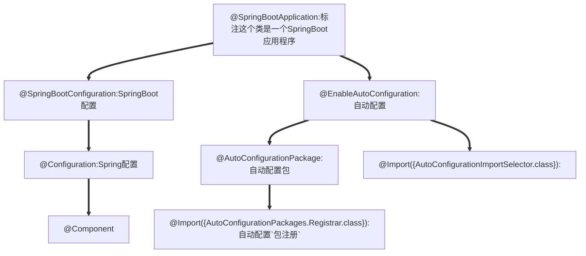

[Spring Boot框架入门教程（快速学习版） (biancheng.net)](http://c.biancheng.net/spring_boot/)

# 微服务

[微服务（Microservices）——Martin Flower - 船长&CAP - 博客园 (cnblogs.com)](https://www.cnblogs.com/liuning8023/p/4493156.html)

# 原理

## 父依赖

其中它主要是依赖一个父项目，主要是管理项目的资源过滤及插件！

```xml
<parent>
    <groupId>org.springframework.boot</groupId>
    <artifactId>spring-boot-starter-parent</artifactId>
    <version>2.7.0</version>
    <relativePath/> <!-- lookup parent from repository -->
</parent>
```

## 启动器 spring-boot-starter

```xml
<dependency>
    <groupId>org.springframework.boot</groupId>
    <artifactId>spring-boot-starter-web</artifactId>
</dependency>
```

**springboot-boot-starter-xxx**：就是spring-boot的场景启动器

**spring-boot-starter-web**：帮我们导入了web模块正常运行所依赖的组件；

SpringBoot将所有的功能场景都抽取出来，做成一个个的starter （启动器），只需要在项目中引入这些starter即可，所有相关的依赖都会导入进来 ， 我们要用什么功能就导入什么样的场景启动器即可 ；我们也可以自己自定义 starter；

## **主启动类**

### 默认的主启动类

```java
//标注这个类是一个SpringBoot应用程序
@SpringBootApplication
public class SpringBoot01Application {

    public static void main(String[] args) {
        //启动SpringBoot应用程序
        SpringApplication.run(SpringBoot01Application.class, args);
    }

}
```




### @SpringBootApplication

作用：标注在某个类上说明这个类是SpringBoot的主配置类 ， SpringBoot就应该运行这个类的main方法来启动SpringBoot应用；

### @ComponentScan

这个注解在Spring中很重要 ,它对应XML配置中的元素。

作用：自动扫描并加载符合条件的组件或者bean ， 将这个bean定义加载到IOC容器中