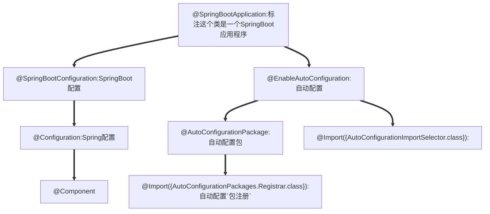

[Spring Boot框架入门教程（快速学习版） (biancheng.net)](http://c.biancheng.net/spring_boot/)

# 一、微服务

[微服务（Microservices）——Martin Flower - 船长&CAP - 博客园 (cnblogs.com)](https://www.cnblogs.com/liuning8023/p/4493156.html)

# 二、原理

## 父依赖

其中它主要是依赖一个父项目，主要是管理项目的资源过滤及插件！

```xml
<parent>
    <groupId>org.springframework.boot</groupId>
    <artifactId>spring-boot-starter-parent</artifactId>
    <version>2.7.0</version>
    <relativePath/> <!-- lookup parent from repository -->
</parent>
```

## 启动器 spring-boot-starter

```xml
<dependency>
    <groupId>org.springframework.boot</groupId>
    <artifactId>spring-boot-starter-web</artifactId>
</dependency>
```

**springboot-boot-starter-xxx**：就是spring-boot的场景启动器

**spring-boot-starter-web**：帮我们导入了web模块正常运行所依赖的组件；

SpringBoot将所有的功能场景都抽取出来，做成一个个的starter （启动器），只需要在项目中引入这些starter即可，所有相关的依赖都会导入进来 ， 我们要用什么功能就导入什么样的场景启动器即可 ；我们也可以自己自定义 starter；

## **主启动类**

### 默认的主启动类

```java
//标注这个类是一个SpringBoot应用程序
@SpringBootApplication
public class SpringBoot01Application {

    public static void main(String[] args) {
        //启动SpringBoot应用程序
        SpringApplication.run(SpringBoot01Application.class, args);
    }

}
```




### @SpringBootApplication

作用：标注在某个类上说明这个类是SpringBoot的主配置类 ， SpringBoot就应该运行这个类的main方法来启动SpringBoot应用；

### @ComponentScan

这个注解在Spring中很重要 ,它对应XML配置中的元素。

作用：自动扫描并加载符合条件的组件或者bean ， 将这个bean定义加载到IOC容器中

# 三、yaml语法

YAML是 "YAML Ain't a Markup Language" （YAML不是一种标记语言）的递归缩写。在开发的这种语言时，YAML 的意思其实是："Yet Another Markup Language"（仍是一种标记语言）

**这种语言以数据作为中心，而不是以标记语言为重点！**

## 基础语法

**语法要求严格！**

1、空格不能省略

2、以缩进来控制层级关系，只要是左边对齐的一列数据都是同一个层级的。

3、属性和值的大小写都是十分敏感的。

```yaml
#k: v
name: tx
#对象
student:
  name: tx
  age: 18
#对象行内写法
student1: {name: tx, age: 18}
#数组
students:
  - name: tx
    age: 18
  - name: wx
    age: 19
pets: [cat, dog]
pats1: [{name: cat, age: 2}, {name: dog, age: 3}]
```

## 注入配置文件

yaml文件更强大的地方在于，他可以给我们的实体类直接注入匹配值！

### yaml注入配置文件

#### 实体类，@Value，之前的注入方式

```java
@Data
@AllArgsConstructor
@NoArgsConstructor
@Component
public class Dog {
    @Value("旺财")
    private String name;
    @Value("3")
    private Integer age;
}
```

```java
@SpringBootTestclass DemoApplicationTests {
    @Autowired //将狗狗自动注入进来    
    Dog dog;
    @Test    
    public void contextLoads() {        
        System.out.println(dog); //打印看下狗狗对象    
    }
}
```

#### 现在的方式

```java
@Data
@NoArgsConstructor
@AllArgsConstructor
@Component
/*
@ConfigurationProperties作用：
将配置文件中配置的每一个属性的值，映射到这个组件中；
告诉SpringBoot将本类中的所有属性和配置文件中相关的配置进行绑定
参数 prefix = “person” : 将配置文件中的person下面的所有属性一一对应
*/
@ConfigurationProperties(prefix = "person")
public class Person {
    private String name;
    private Integer age;
    private Boolean happy;
    private Date birthday;
    private Map<String,Object> maps;
    private List<Object> lists;
    private Dog dog;
}

```

#### application.yaml

```yaml
person:
  name: tx
  age: 18
  happy: false
  birthday: 2022/5/28
  maps: {key1: value1, key2: value2}
  lists: [1, 2, 3]
  dog:
    name: 小菜
    age: 2
```

#### 使用`@ConfigurationProperties`时idea会提示springboot配置注解处理器没有找到

添加依赖

```xml
<!-- 配置注释处理器，导入配置文件处理器，配置文件进行绑定就会有提示，需要重启 -->
<dependency>
    <groupId>org.springframework.boot</groupId>
    <artifactId>spring-boot-configuration-processor</artifactId>
    <optional>true</optional>
</dependency>
```

不添加也不会报错。

### 加载指定的配置文件

#### 在resources目录下创建`person.properties`文件

```properties
name="饮梦"
```

```java
@PropertySource("classpath:person.properties")
public class Person {
    @Value("${name}")
}
```

## JSR303数据校验


```xml
<!--validation启动器-->
<dependency>
    <groupId>org.springframework.boot</groupId>
    <artifactId>spring-boot-starter-validation</artifactId>
</dependency>
```


| 注解   | 解释 |
| ---- | ---- |
| @NotNull      |   注解元素必须是非空 | 
|@Null    |       注解元素必须是空|
| @Digits    |      验证数字构成是否合|
| @Future         | 验证是否在当前系统时间之后|
| @Past            |验证是否在当前系统时间之前|
| @Max      |     验证值是否小于等于最大指定整数值|
| @Min      |      验证值是否大于等于最小指定整数值|
| @Pattern      |   验证字符串是否匹配指定的正则表达式|
| @Size       |    验证元素大小是否在指定范围内|
| @DecimalMax | 验证值是否小于等于最大指定小数值|
| @DecimalMin  |验证值是否大于等于最小指定小数值|
| @AssertTrue   |    被注释的元素必须为true|
| @AssertFalse   |被注释的元素必须为false|


Hibernate validator 在JSR303的基础上对校验注解进行了扩展，扩展注解如下：

| 注解   | 解释 |
| ---- | ---- |
| @Email    |      被注释的元素必须是电子邮箱地址|
| @Length      |    被注释的字符串的大小必须在指定的范围内|
| @NotEmpty    |   被注释的字符串的必须非空|
| @Range         | 被注释的元素必须在合适的范围内|

### 空检查

1. @Null       验证对象是否为null
2. @NotNull    验证对象是否不为null, 无法查检长度为0的字符串
3. @NotBlank   检查约束字符串是不是Null还有被Trim的长度是否大于0,只对字符串,且会去掉前后空格
4. @NotEmpty   检查约束元素是否为NULL或者是EMPTY.

### Booelan检查

1. @AssertTrue     验证 Boolean 对象是否为 true 
2. @AssertFalse    验证 Boolean 对象是否为 false 

### 长度检查

1. @Size(min=, max=) 验证对象（Array,Collection,Map,String）长度是否在给定的范围之内
2. @Length(min=, max=) string is between min and max included.

### 日期检查

1. @Past       验证 Date 和 Calendar 对象是否在当前时间之前
2. @Future     验证 Date 和 Calendar 对象是否在当前时间之后 

### 正则表达式

1. @Pattern    验证 String 对象是否符合正则表达式的规则

# 多环境切换

我们在主配置文件编写的时候，文件名可以是 `application-{profile}.properties/yml` , 用来指定多个环境版本；

**例如：**

application-test.properties 代表测试环境配置

application-dev.properties 代表开发环境配置

但是Springboot并不会直接启动这些配置文件，它**默认使用application.properties主配置文件**；

我们需要通过一个配置来选择需要激活的环境：

```properties
#比如在配置文件中指定使用dev环境，我们可以通过设置不同的端口号进行测试；
#我们启动SpringBoot，就可以看到已经切换到dev下的配置了；
spring.profiles.active=dev
```

## yaml的多文档块

和properties配置文件中一样，但是使用yml去实现不需要创建多个配置文件，更加方便了 !

```yaml
server:
  port: 8081
  #选择要激活那个环境块spring:  
  profiles:    
  active: prod
---server:
  port:
    8083spring:
      profiles: dev #配置环境的名称

---
server:
  port:
    8084spring:
      profiles: prod  #配置环境的名称
```

### 配置文件加载路径与顺序

1. `file:./config/`
2. `file:./`
3. `classpath:/config/`
4. `classpath:/`

优先级1：项目路径下的config文件夹配置文件

优先级2：项目路径下配置文件

优先级3：资源路径下的config文件夹配置文件

优先级4：资源路径下配置文件

# 四、thymeleaf

[thymeleaf文档](./documents/Thymeleaf3.0文档.pdf)


```xml
<!--Thymeleaf模板引擎-->
<dependency>
    <groupId>org.springframework.boot</groupId>
    <artifactId>spring-boot-starter-thymeleaf</artifactId>
</dependency>
<!--或者
<dependency>
    <groupId>org.thymeleaf</groupId>
    <artifactId>thymeleaf-spring5</artifactId>
</dependency>
<dependency>
    <groupId>org.thymeleaf.extras</groupId>
    <artifactId>thymeleaf-extras-java8time</artifactId>
</dependency>

```

# 国际化

## 在resources下创建`i18n`包

配置好相应的语言文字包


安装`Resource Bundle Editor`插件以便于管理


## 传参

```html
<a th:href="@{/index.html(l=zh_CN)}">中文</a>
<a th:href="@{/index.html(l=en_US)}">English</a>
```

## 重写`LocaleResolver`类的方法

```java
/**
 * @author TAN00XU
 * 自定义的国际化组件
 */
public class MyLocaleResolver implements LocaleResolver {
    @Override
    public Locale resolveLocale(HttpServletRequest request) {
        //获取语言参数
        String language = request.getParameter("l");
        //如果没有获取到，则使用默认的语言
        Locale locale = Locale.getDefault();
        //如果获取到了，则使用获取到的语言
        if (StringUtils.hasText(language)) {
            String[] split = language.split("_");
            //国家 地区
            locale = new Locale(split[0], split[1]);
        }

        return locale;
    }

    @Override
    public void setLocale(HttpServletRequest request, HttpServletResponse response, Locale locale) {

    }
}
```

## 将自己写的组件配置到容器中

```java
@Bean
public LocaleResolver localeResolver() {
    return new MyLocaleResolver();
}
```

# 集成`WebMvcConfigurer`

## 注意事项

在使用`addInterceptors`时，在`addInterceptor`方法中不应当使用`new LoginInterceptor()`，否则会出现空指针异常

### 错误示例

```java
@Override
public void addInterceptors(InterceptorRegistry registry) {
    registry.addInterceptor(new LoginInterceptor())
```

应当先注入bean之后去获得

## 正确做法

```java
   @Autowired
    private LoginInterceptor loginInterceptor;
//或
   @Bean
   public LoginInterceptor getLoginInterceptor() {
       return new LoginInterceptor();
   }
 
    @Override
    public void addInterceptors(InterceptorRegistry registry) {
        registry.addInterceptor(loginInterceptor)       
    }
```


# 五、SpringBoot整合数据库操作

## 5.1 整合JDBC

### 5.1.1 pom

```xml
<dependency>
   <groupId>org.springframework.boot</groupId>
   <artifactId>spring-boot-starter-jdbc</artifactId>
</dependency>

<dependency>
   <groupId>mysql</groupId>
   <artifactId>mysql-connector-java</artifactId>
   <scope>runtime</scope>
</dependency>
```

### 5.1.2 yaml配置

```yaml
spring:
  datasource:
    username: root
    password: 123123
    #时区 serverTimezone=UTC&
    url: jdbc:mysql://localhost:3306/test?useUnicode=true&characterEncoding=utf-8
    driver-class-name: com.mysql.cj.jdbc.Driver
```

### 5.1.3 测试

```java
@Autowired
DataSource dataSource;
@Test
void contextLoads() throws SQLException {
   //查看默认数据源 class com.zaxxer.hikari.HikariDataSource
   System.out.println(dataSource.getClass());
   //获得数据库连接
   Connection connection = dataSource.getConnection();
   System.out.println("\033[7;31;40m" + connection + "\033[0m");
   //关闭
   connection.close();
}
```

### 5.1.4 JdbcTemplate

#### 5.1.4.1 主要提供以下几类方法：

+ execute方法：可以用于执行任何SQL语句，一般用于执行DDL语句；
+ update方法及batchUpdate方法：update方法用于执行新增、修改、删除等语句；
+ batchUpdate方法用于执行批处理相关语句；
+ query方法及queryForXXX方法：用于执行查询相关语句；
+ call方法：用于执行存储过程、函数相关语句。

#### 5.1.4.2 测试

```java
package com.tan00xu.controler;

import org.springframework.beans.factory.annotation.Autowired;
import org.springframework.jdbc.core.JdbcTemplate;
import org.springframework.web.bind.annotation.GetMapping;
import org.springframework.web.bind.annotation.PathVariable;
import org.springframework.web.bind.annotation.RestController;

import java.util.List;
import java.util.Map;

@RestController
public class JdbcController {

    @Autowired
    JdbcTemplate jdbcTemplate;

    /**
     * 查询数据库的所有信息
     *
     * @return {@link List}<{@link Map}<{@link String}, {@link Object}>>
     */
    @GetMapping("/listALl")
    public List<Map<String,Object>> ListALl(){
        String sql = "select * from user";
        return jdbcTemplate.queryForList(sql);

    }

    /**
     * 添加用户
     *
     * @return {@link String}
     */
    @GetMapping("/addUser")
    public String addUser() {
        String sql = "insert into test.user(id,username,password) value (2,'张三','123123')";
        jdbcTemplate.update(sql);
        return "OK";
    }

    @GetMapping("/update/{id}")
    public String updateUser(@PathVariable("id") int id) {
        String sql = "update test.user set username =?,password =? where id="+id;
        //封装
        Object[] objects = new Object[2];
        objects[0] ="李四";
        objects[1] = "zzzzzz";

        jdbcTemplate.update(sql,objects);
        return "OK";
    }

    @GetMapping("/delete/{id}")
    public String deleteUse(@PathVariable("id") int id) {
        String sql = "delete from test.user where id=?";
        jdbcTemplate.update(sql,id);
        return "OK";
    }

}
```

## 5.2 整合Druid数据源

### 5.2.1 Druid简介

Java程序很大一部分要操作数据库，为了提高性能操作数据库的时候，又不得不使用数据库连接池。

Druid 是阿里巴巴开源平台上一个数据库连接池实现，结合了 C3P0、DBCP 等 DB 池的优点，同时加入了日志监控。

Druid 可以很好的监控 DB 池连接和 SQL 的执行情况，天生就是针对监控而生的 DB 连接池。

Druid已经在阿里巴巴部署了超过600个应用，经过一年多生产环境大规模部署的严苛考验。

Spring Boot 2.0 以上默认使用 Hikari 数据源，可以说 Hikari 与 Driud 都是当前 Java Web 上最优秀的数据源，我们来重点介绍 Spring Boot 如何集成 Druid 数据源，如何实现数据库监控。

Github地址：https://github.com/alibaba/druid/

### 5.2.2 pom

```xml
<dependency>
   <groupId>com.alibaba</groupId>
   <artifactId>druid</artifactId>
   <version>1.2.11</version>
</dependency>
```

```xml
<!--使用log4j日志-->
<dependency>
   <groupId>log4j</groupId>
   <artifactId>log4j</artifactId>
   <version>1.2.17</version>
</dependency>
```

### 5.2.3 yaml配置

```yaml
spring:
  datasource:
    username: root
    password: 123123
    #时区 serverTimezone=UTC&
    url: jdbc:mysql://localhost:3306/test?useUnicode=true&characterEncoding=utf-8
    driver-class-name: com.mysql.cj.jdbc.Driver
    #数据源
    type: com.alibaba.druid.pool.DruidDataSource
```

### 5.2.4 **com.alibaba.druid.pool.DruidDataSource**基本配置参数

| 配置                          | 缺省值             | 说明                                                         |
| ----------------------------- | ------------------ | ------------------------------------------------------------ |
| name                          |                    | 配置这个属性的意义在于，如果存在多个人数据源，监控的时候可以通过名字来区分开来。如果没有这个配置，将会生成一个名字，格式是："DataSouce-"+System.identityHashCode(this). |
| url                           |                    | 连接数据库的url，不同数据库不一样。<br />例如：<br />msql:<br />jdbc:mysql://localhost:3306/druid<br />oracle:<br />jdbc:oracle:thin:@machine_name:port:dbname |
| username                      |                    | 连接数据库的用户名                                           |
| password                      |                    | 连接数据库的密码。如果你不希望密码直接写在配置文件中，可以使用ConfigFilter。 |
| diverClassName                | 根据url自动识别    | 这一项可配可不配，如果不配置druid会根据url自动识别dbType ,然后选择相应的driverClassName |
| initialSize                   | 0                  | 初始化时建立物理连接的个数。初始化发生在显示调用init方法，或者第一次getConnection时 |
| maxActive                     | 8                  | 最大连接池数量                                               |
| maxIdle                       | 8                  | 已不再使用，配置了也没效果                                   |
| minIdle                       |                    | 最小连接池数量                                               |
| maxWait                       |                    | 获取连接时最大等待时间,单位毫秒。配置了maxWait之后,缺省启用公平锁，并发效率会有所下降，如果需要可以通过配置<br/>useUnfairLock属性为true使用非公平锁。 |
| poolPrearedStatements         | false              | 是否缓存preparedStatement，也就是PSCache。PsCache对支持游标的数据库性能提升巨大，比如说oracle。在mysql下建议关闭。 |
| maxOpenPrearedStatements      | -1                 | 要启用PSCache,必须配置大于0，当大于0时，poolPreparedStatements自动触发修改为true。在Druid中，不会存在Oracle 下PSCache占用内存过多的问题，可以把这个数值配置大一些，比如说100 |
| validationQuery               |                    | 用来检测连接是否有效的sql，要求是一个查询语句。如果validationQuery为null , testOnBorrow、testOnReturn.testWhileldle都不会其作用。 |
| validationQueryTimeout        |                    | 单位:秒，检测连接是否有效的超时时间。底层调用jdbcStatement对象的void setQueryTimeout(int seconds)方法 |
| testOnBorrow                  | true               | 申请连接时执行validationQuery检测连接是否有效，做了这个配置会降低性能。 |
| testOnReturn                  | false              | 归还连接时执行validationQuery检测连接是否有效，做了这个配置会降低性能 |
| testWhileIdle                 | false              | 建议配置为true，不影响性能，并且保证安全性。申请连接的时候检测，如果空闲时间大于timeBetweenEvictionRunsMillis，执行validationQuery检测连接是否有效。 |
| timeBetweenEvictionRunsMillis | 1分钟(1.0.14)      | 有两个含义:<br />1) Destroy线程会检测连接的间隔时间，如果连接空闲时间大于等于minEvictableldleTimeMillis则关闭物理连接<br />2)testWhileldle的判断依据,详细看testWhileldle属性的说明 |
| numTestsPerEvictionRun        |                    | 不再使用，一个DruidDataSource只支持一个EvictionRun           |
| minEvictableldleTimeMillis    | 30分钟( 1.0.14）   | 连接保持空闲而不被驱逐的最长时间                             |
| connectionInitSqls            |                    | 物理连接初始化的时候执行的sql                                |
| exceptionSorter               | 根据dbType自动识别 | 当数据库抛出一些不可恢复的异常时,抛弃连接                    |
| filters                       |                    | 属性类型是字符串，通过别名的方式配置扩展插件，常用的插件有:监控统计用的filter:stat 日志用的filter:log4j 防御sql注入的filter:wall |
| proxyFilters                  |                    | 关型是List<com.alibaba.druid.filter.Filter>，如果同时配置了filters和proxyFilters，是组合关系，并非替换关系 |

### 5.2.5 常用配置

```yaml
spring:
  datasource:
    username: root
    password: 123123
    #时区 serverTimezone=UTC&
    url: jdbc:mysql://localhost:3306/test?useUnicode=true&characterEncoding=utf-8
    driver-class-name: com.mysql.cj.jdbc.Driver
    #数据源
    type: com.alibaba.druid.pool.DruidDataSource
    #Spring Boot 默认是不注入这些属性值的，需要自己绑定
    #druid 数据源专有配置
    #druid:
    # 配置初始化大小、最小、最大线程数
    initialSize: 5
    minIdle: 5
    # CPU核数+1，也可以大些但不要超过20，数据库加锁时连接过多性能下降
    maxActive: 20
    # 最大等待时间，内网：800，外网：1200（三次握手1s）
    maxWait: 60000
    timeBetweenEvictionRunsMillis: 60000
    # 配置一个连接在池中最大空间时间，单位是毫秒
    minEvictableIdleTimeMillis: 300000
    validationQuery: SELECT 1
    testWhileIdle: true
    # 设置从连接池获取连接时是否检查连接有效性，true检查，false不检查
    testOnBorrow: false
    # 设置从连接池归还连接时是否检查连接有效性，true检查，false不检查
    testOnReturn: false
    # 可以支持PSCache（提升写入、查询效率）
    poolPreparedStatements: true
    # 配置监控统计拦截的filters，去掉后监控界面sql无法统计，'wall'用于防火墙，stat：监控统计、log4j：日志记录、wall：预防sql注入
    # 如果运行时报错 java.lang.ClassNotFoundException: org.apache.log4j
    # 则导入 log4j 依赖即可 https://mvnrepository.com/artifact/log4j/log4j
    filters: stat,wall,log4j
    # 保持长连接
    keepAlive: true
    maxPoolPreparedStatementPerConnectionSize: 20
    useGlobalDataSourceStat: true
    connectionProperties: druid.stat.mergeSql=true;druid.stat.slowSqlMillis=500
```

5.2.6 自定义数据源

```java
@Configuration
public class DruidConfig {
    /**
      将自定义的 Druid数据源添加到容器中，不再让 Spring Boot 自动创建
      绑定全局配置文件中的 druid 数据源属性到 com.alibaba.druid.pool.DruidDataSource从而让它们生效
      注解@ConfigurationProperties(prefix = "spring.datasource")：作用就是将 全局配置文件中
      前缀为 spring.datasource的属性值注入到 com.alibaba.druid.pool.DruidDataSource 的同名参数中
    */
    @ConfigurationProperties(prefix = "spring.datasource")
    @Bean
    public DataSource druidDataSource() {
        return new DruidDataSource();
    }
}
```

### 5.5.6 后台监控

```java
/**
 * 后台监控统计视图servlet
 * web.xml ServletRegistrationBean
 * 因为Springboot 内置了servlet容器，所以没有web.xml，替代方法ServletRegistrationBean
 *
 * @return {@link ServletRegistrationBean}
 */
@Bean
public ServletRegistrationBean StatViewServlet(){
    ServletRegistrationBean<StatViewServlet> statViewServletServletRegistrationBean = new ServletRegistrationBean<>(new StatViewServlet(), "/druid/*");
    //后台需要有人登录，账号密码配置
    HashMap<String,String> initParameters = new HashMap<>();
    //增加配置
    //登录key是固定的 loginUsername loginPassword
    initParameters.put("loginUsername","admin");
    initParameters.put("loginPassword","123123");

    //允许谁访问 参数为空所有人能访问,参数为localhost则本机能访问
    initParameters.put("allow","");

    //禁止谁能访问 initParameters.put("deny","192.168.137.1");

    //设置初始化参数
    statViewServletServletRegistrationBean.setInitParameters(initParameters);

    return statViewServletServletRegistrationBean;
}
```

### 5.5.7  配置 Druid web 监控 filter 过滤器


```java
/**
 * 过滤器
 * 配置 Druid 监控 之  web 监控的 filter
 * WebStatFilter：用于配置Web和Druid数据源之间的管理关联监控统计
 *
 * @return {@link FilterRegistrationBean}
 */
@Bean
public FilterRegistrationBean webStatFilter() {
    FilterRegistrationBean<Filter> filterFilterRegistrationBean = new FilterRegistrationBean<>();
    filterFilterRegistrationBean.setFilter(new WebStatFilter());
    //过滤请求
    Map<String,String> initParameters = new HashMap<>();
    //这些不统计
    initParameters.put("exclusions", "*.js,*.css,/druid/*");
    filterFilterRegistrationBean.setInitParameters(initParameters);
    return filterFilterRegistrationBean;
}
```

## 5.3 整合Mybatis

### 5.3.1 pom.xml

```xml
<dependency>
   <groupId>org.mybatis.spring.boot</groupId>
   <artifactId>mybatis-spring-boot-starter</artifactId>
   <version>2.2.2</version>
</dependency>
```

### 5.3.2 yaml配置

```yaml
#整合mybatis
mybatis:
  #resources/mybatis/mapper/*.xml
  mapper-locations: classpath:mybatis/mapper/*.xml
  type-aliases-package: com.tan00xu.pojo
```

### 5.3.3 mapper

```java
@Mapper
@Repository
public interface UserMapper {

    /**
     * 列出所有用户
     *
     * @return {@link List}<{@link User}>
     */
    List<User> listAllUser();

    /**
     * 根据id得到用户信息
     *
     * @param id id
     * @return {@link User}
     */
    User getUserById(int id);

    /**
     * 添加用户
     *
     * @param user 用户
     * @return int
     */
    int addUser(User user);

    /**
     * 更新用户
     *
     * @param user 用户
     * @return int
     */
    int updateUser(User user);

    /**
     * 通过id删除用户
     *
     * @param id id
     * @return int
     */
    int deleteUserById(int id);

}
```


### 5.3.4 mapper.xml

```xml
<?xml version="1.0" encoding="utf-8" ?>

<!DOCTYPE mapper
        PUBLIC "-//mybatis.org//DTD Mapper 3.0//EN"
        "http://mybatis.org/dtd/mybatis-3-mapper.dtd">
<mapper namespace="com.tan00xu.mapper.UserMapper">
    <insert id="addUser">
        insert into test.user (id, username, password)
        VALUES (#{id}, #{username}, #{password})
    </insert>

    <delete id="deleteUserById">
        delete
        from test.user
        where id = #{id}
    </delete>

    <update id="updateUser">
        update test.user
        set username=#{username},
            password=#{password}
        where id = #{id}
    </update>

    <select id="listAllUser" resultType="com.tan00xu.pojo.User">
        select *
        from test.user;
    </select>

    <select id="getUserById" resultType="com.tan00xu.pojo.User">
        select *
        from test.user
        where id = #{id};
    </select>
</mapper>
```

### 5.3.5 controller

```java
@RestController
public class UserController {

    @Autowired
    private UserMapper userMapper;

    @GetMapping("/listAllUser")
    public List<User> listAllUser(){
        List<User> userList = userMapper.listAllUser();
        userList.forEach(System.out::println);
        return userList;

    }

}
```

# 六、集成Spring Security

Spring Security是一个功能强大且高度可定制的身份验证和访问控制框架。它实际上是保护基于spring的应用程序的标准。

Spring Security是一个框架，侧重于为Java应用程序提供身份验证和授权。与所有Spring项目一样，Spring安全性的真正强大之处在于它可以轻松地扩展以满足定制需求

在用户认证方面，Spring Security 框架支持主流的认证方式，包括 HTTP 基本认证、HTTP 表单验证、HTTP 摘要认证、OpenID 和 LDAP 等。在用户授权方面，Spring Security 提供了基于角色的访问控制和访问控制列表（Access Control List，ACL），可以对应用中的领域对象进行细粒度的控制。

## 6.1 简介

Spring Security 是针对Spring项目的安全框架，也是Spring Boot底层安全模块默认的技术选型，他可以实现强大的Web安全控制，对于安全控制，我们仅需要引入 `spring-boot-starter-security `模块，进行少量的配置，即可实现强大的安全管理！

记住几个类：

+ `WebSecurityConfigurerAdapter`：自定义Security策略
+ `AuthenticationManagerBuilder`：自定义认证策略
+ `@EnableWebSecurity`：开启WebSecurity模式

Spring Security的两个主要目标是 **“认证”** 和 **“授权”**（访问控制）。

“认证”（Authentication）

身份验证是关于验证您的凭据，如用户名/用户ID和密码，以验证您的身份。

身份验证通常通过用户名和密码完成，有时与身份验证因素结合使用。

“授权” （Authorization）

授权发生在系统成功验证您的身份后，最终会授予您访问资源（如信息，文件，数据库，资金，位置，几乎任何内容）的完全权限。

这个概念是通用的，而不是只在Spring Security 中存在。

官网：https://spring.io/projects/spring-security

文档：https://docs.spring.io/spring-security/site/docs/

## 6.2 pom.xml

```xml
<!--security-->
<dependency>
    <groupId>org.springframework.boot</groupId>
    <artifactId>spring-boot-starter-security</artifactId>
</dependency>
```


## 6.3 SecurityConfig

```java
@EnableWebSecurity
public class SecurityConfig extends WebSecurityConfigurerAdapter {


    /**
     * 授权
     *
     * @param http http
     * @throws Exception 异常
     */
    @Override
    protected void configure(HttpSecurity http) throws Exception {
        //首页所有人可以访问，功能页只有对应有权限的人才能访问
        //请求授权的规则
        http.authorizeRequests()
                .antMatchers("/").permitAll()
                .antMatchers("/level1/**").hasRole("vip1")
                .antMatchers("/level2/**").hasRole("vip2")
                .antMatchers("/level3/**").hasRole("vip3");
        //没有权限默认会到登录页面
        http.formLogin()
                .loginPage("/toLogin")
                //用户名前端参数
//                .usernameParameter("user")
                //密码前端参数
//                .passwordParameter("pwd")
                //登录处理网址
//                .loginProcessingUrl("/login")
        ;

        //防跨站攻击 默认开启
        http.csrf().disable();//关闭功能
        //注销，跳到首页
        http.logout().logoutSuccessUrl("/");

        //开启记住我
        http.rememberMe()
                .rememberMeParameter("remember");
    }

    /**
     * 认证
     * 密码编码：PasswordEncoder
     *
     * @param auth 身份验证
     * @throws Exception 异常
     */
    @Override
    protected void configure(AuthenticationManagerBuilder auth) throws Exception {
        auth.inMemoryAuthentication().passwordEncoder(new BCryptPasswordEncoder())
                .withUser("123")
                .password(new BCryptPasswordEncoder().encode("123123"))
                .roles("vip1")

                .and()
                .withUser("tx")
                .password(new BCryptPasswordEncoder().encode("123123"))
                .roles("vip2", "vip3")

                .and()
                .withUser("root")
                .password(new BCryptPasswordEncoder().encode("123123"))
                .roles("vip1", "vip2", "vip3");
    }
}
```

# 七、shiro
