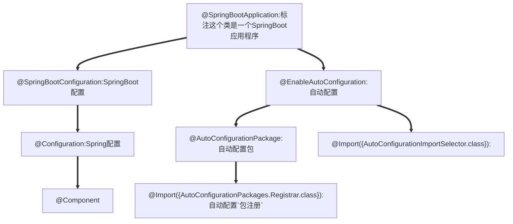

[Spring Boot框架入门教程（快速学习版） (biancheng.net)](http://c.biancheng.net/spring_boot/)

# 微服务

[微服务（Microservices）——Martin Flower - 船长&CAP - 博客园 (cnblogs.com)](https://www.cnblogs.com/liuning8023/p/4493156.html)

# 原理

## 父依赖

其中它主要是依赖一个父项目，主要是管理项目的资源过滤及插件！

```xml
<parent>
    <groupId>org.springframework.boot</groupId>
    <artifactId>spring-boot-starter-parent</artifactId>
    <version>2.7.0</version>
    <relativePath/> <!-- lookup parent from repository -->
</parent>
```

## 启动器 spring-boot-starter

```xml
<dependency>
    <groupId>org.springframework.boot</groupId>
    <artifactId>spring-boot-starter-web</artifactId>
</dependency>
```

**springboot-boot-starter-xxx**：就是spring-boot的场景启动器

**spring-boot-starter-web**：帮我们导入了web模块正常运行所依赖的组件；

SpringBoot将所有的功能场景都抽取出来，做成一个个的starter （启动器），只需要在项目中引入这些starter即可，所有相关的依赖都会导入进来 ， 我们要用什么功能就导入什么样的场景启动器即可 ；我们也可以自己自定义 starter；

## **主启动类**

### 默认的主启动类

```java
//标注这个类是一个SpringBoot应用程序
@SpringBootApplication
public class SpringBoot01Application {

    public static void main(String[] args) {
        //启动SpringBoot应用程序
        SpringApplication.run(SpringBoot01Application.class, args);
    }

}
```




### @SpringBootApplication

作用：标注在某个类上说明这个类是SpringBoot的主配置类 ， SpringBoot就应该运行这个类的main方法来启动SpringBoot应用；

### @ComponentScan

这个注解在Spring中很重要 ,它对应XML配置中的元素。

作用：自动扫描并加载符合条件的组件或者bean ， 将这个bean定义加载到IOC容器中

# yaml语法

YAML是 "YAML Ain't a Markup Language" （YAML不是一种标记语言）的递归缩写。在开发的这种语言时，YAML 的意思其实是："Yet Another Markup Language"（仍是一种标记语言）

**这种语言以数据作为中心，而不是以标记语言为重点！**

## 基础语法

**语法要求严格！**

1、空格不能省略

2、以缩进来控制层级关系，只要是左边对齐的一列数据都是同一个层级的。

3、属性和值的大小写都是十分敏感的。

```yaml
#k: v
name: tx
#对象
student:
  name: tx
  age: 18
#对象行内写法
student1: {name: tx, age: 18}
#数组
students:
  - name: tx
    age: 18
  - name: wx
    age: 19
pets: [cat, dog]
pats1: [{name: cat, age: 2}, {name: dog, age: 3}]
```

## 注入配置文件

yaml文件更强大的地方在于，他可以给我们的实体类直接注入匹配值！

### yaml注入配置文件

#### 实体类，@Value，之前的注入方式

```java
@Data
@AllArgsConstructor
@NoArgsConstructor
@Component
public class Dog {
    @Value("旺财")
    private String name;
    @Value("3")
    private Integer age;
}
```

```java
@SpringBootTestclass DemoApplicationTests {
    @Autowired //将狗狗自动注入进来    
    Dog dog;
    @Test    
    public void contextLoads() {        
        System.out.println(dog); //打印看下狗狗对象    
    }
}
```

#### 现在的方式

```java
@Data
@NoArgsConstructor
@AllArgsConstructor
@Component
/*
@ConfigurationProperties作用：
将配置文件中配置的每一个属性的值，映射到这个组件中；
告诉SpringBoot将本类中的所有属性和配置文件中相关的配置进行绑定
参数 prefix = “person” : 将配置文件中的person下面的所有属性一一对应
*/
@ConfigurationProperties(prefix = "person")
public class Person {
    private String name;
    private Integer age;
    private Boolean happy;
    private Date birthday;
    private Map<String,Object> maps;
    private List<Object> lists;
    private Dog dog;
}

```

#### application.yaml

```yaml
person:
  name: tx
  age: 18
  happy: false
  birthday: 2022/5/28
  maps: {key1: value1, key2: value2}
  lists: [1, 2, 3]
  dog:
    name: 小菜
    age: 2
```

#### 使用`@ConfigurationProperties`时idea会提示springboot配置注解处理器没有找到

添加依赖

```xml
<!-- 配置注释处理器，导入配置文件处理器，配置文件进行绑定就会有提示，需要重启 -->
<dependency>
    <groupId>org.springframework.boot</groupId>
    <artifactId>spring-boot-configuration-processor</artifactId>
    <optional>true</optional>
</dependency>
```

不添加也不会报错。

### 加载指定的配置文件

#### 在resources目录下创建`person.properties`文件

```properties
name="饮梦"
```

```java
@PropertySource("classpath:person.properties")
public class Person {
    @Value("${name}")
}
```

