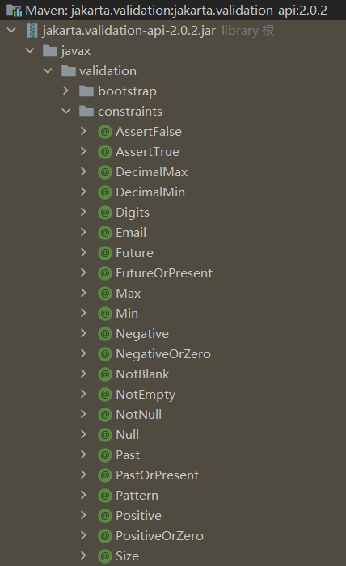

[Spring Boot框架入门教程（快速学习版） (biancheng.net)](http://c.biancheng.net/spring_boot/)

# 一、微服务

[微服务（Microservices）——Martin Flower - 船长&CAP - 博客园 (cnblogs.com)](https://www.cnblogs.com/liuning8023/p/4493156.html)

# 二、原理

## 父依赖

其中它主要是依赖一个父项目，主要是管理项目的资源过滤及插件！

```xml
<parent>
    <groupId>org.springframework.boot</groupId>
    <artifactId>spring-boot-starter-parent</artifactId>
    <version>2.7.0</version>
    <relativePath/> <!-- lookup parent from repository -->
</parent>
```

## 启动器 spring-boot-starter

```xml
<dependency>
    <groupId>org.springframework.boot</groupId>
    <artifactId>spring-boot-starter-web</artifactId>
</dependency>
```

**springboot-boot-starter-xxx**：就是spring-boot的场景启动器

**spring-boot-starter-web**：帮我们导入了web模块正常运行所依赖的组件；

SpringBoot将所有的功能场景都抽取出来，做成一个个的starter （启动器），只需要在项目中引入这些starter即可，所有相关的依赖都会导入进来 ， 我们要用什么功能就导入什么样的场景启动器即可 ；我们也可以自己自定义 starter；

## **主启动类**

### 默认的主启动类

```java
//标注这个类是一个SpringBoot应用程序
@SpringBootApplication
public class SpringBoot01Application {

    public static void main(String[] args) {
        //启动SpringBoot应用程序
        SpringApplication.run(SpringBoot01Application.class, args);
    }

}
```


### @SpringBootApplication

作用：标注在某个类上说明这个类是SpringBoot的主配置类 ， SpringBoot就应该运行这个类的main方法来启动SpringBoot应用；

### @ComponentScan

这个注解在Spring中很重要 ,它对应XML配置中的元素。

作用：自动扫描并加载符合条件的组件或者bean ， 将这个bean定义加载到IOC容器中

# 三、yaml语法

YAML是 "YAML Ain't a Markup Language" （YAML不是一种标记语言）的递归缩写。在开发的这种语言时，YAML 的意思其实是："Yet Another Markup Language"（仍是一种标记语言）

**这种语言以数据作为中心，而不是以标记语言为重点！**

## 基础语法

**语法要求严格！**

1、空格不能省略

2、以缩进来控制层级关系，只要是左边对齐的一列数据都是同一个层级的。

3、属性和值的大小写都是十分敏感的。

```yaml
#k: v
name: tx
#对象
student:
  name: tx
  age: 18
#对象行内写法
student1: {name: tx, age: 18}
#数组
students:
  - name: tx
    age: 18
  - name: wx
    age: 19
pets: [cat, dog]
pats1: [{name: cat, age: 2}, {name: dog, age: 3}]
```

## 注入配置文件

yaml文件更强大的地方在于，他可以给我们的实体类直接注入匹配值！

### yaml注入配置文件

#### 实体类，@Value，之前的注入方式

```java
@Data
@AllArgsConstructor
@NoArgsConstructor
@Component
public class Dog {
    @Value("旺财")
    private String name;
    @Value("3")
    private Integer age;
}
```

```java
@SpringBootTestclass DemoApplicationTests {
    @Autowired //将狗狗自动注入进来    
    Dog dog;
    @Test    
    public void contextLoads() {        
        System.out.println(dog); //打印看下狗狗对象    
    }
}
```

#### 现在的方式

```java
@Data
@NoArgsConstructor
@AllArgsConstructor
@Component
/*
@ConfigurationProperties作用：
将配置文件中配置的每一个属性的值，映射到这个组件中；
告诉SpringBoot将本类中的所有属性和配置文件中相关的配置进行绑定
参数 prefix = “person” : 将配置文件中的person下面的所有属性一一对应
*/
@ConfigurationProperties(prefix = "person")
public class Person {
    private String name;
    private Integer age;
    private Boolean happy;
    private Date birthday;
    private Map<String,Object> maps;
    private List<Object> lists;
    private Dog dog;
}

```

#### application.yaml

```yaml
person:
  name: tx
  age: 18
  happy: false
  birthday: 2022/5/28
  maps: {key1: value1, key2: value2}
  lists: [1, 2, 3]
  dog:
    name: 小菜
    age: 2
```

#### 使用`@ConfigurationProperties`时idea会提示springboot配置注解处理器没有找到

添加依赖

```xml
<!-- 配置注释处理器，导入配置文件处理器，配置文件进行绑定就会有提示，需要重启 -->
<dependency>
    <groupId>org.springframework.boot</groupId>
    <artifactId>spring-boot-configuration-processor</artifactId>
    <optional>true</optional>
</dependency>
```

不添加也不会报错。

### 加载指定的配置文件

#### 在resources目录下创建`person.properties`文件

```properties
name="饮梦"
```

```java
@PropertySource("classpath:person.properties")
public class Person {
    @Value("${name}")
}
```

## JSR303数据校验



```xml
<!--validation启动器-->
<dependency>
    <groupId>org.springframework.boot</groupId>
    <artifactId>spring-boot-starter-validation</artifactId>
</dependency>
```


| 注解   | 解释 |
| ---- | ---- |
| @NotNull      |   注解元素必须是非空 | 
|@Null    |       注解元素必须是空|
| @Digits    |      验证数字构成是否合|
| @Future         | 验证是否在当前系统时间之后|
| @Past            |验证是否在当前系统时间之前|
| @Max      |     验证值是否小于等于最大指定整数值|
| @Min      |      验证值是否大于等于最小指定整数值|
| @Pattern      |   验证字符串是否匹配指定的正则表达式|
| @Size       |    验证元素大小是否在指定范围内|
| @DecimalMax | 验证值是否小于等于最大指定小数值|
| @DecimalMin  |验证值是否大于等于最小指定小数值|
| @AssertTrue   |    被注释的元素必须为true|
| @AssertFalse   |被注释的元素必须为false|


Hibernate validator 在JSR303的基础上对校验注解进行了扩展，扩展注解如下：

| 注解   | 解释 |
| ---- | ---- |
| @Email    |      被注释的元素必须是电子邮箱地址|
| @Length      |    被注释的字符串的大小必须在指定的范围内|
| @NotEmpty    |   被注释的字符串的必须非空|
| @Range         | 被注释的元素必须在合适的范围内|

### 空检查

1. @Null       验证对象是否为null
2. @NotNull    验证对象是否不为null, 无法查检长度为0的字符串
3. @NotBlank   检查约束字符串是不是Null还有被Trim的长度是否大于0,只对字符串,且会去掉前后空格
4. @NotEmpty   检查约束元素是否为NULL或者是EMPTY.

### Booelan检查

1. @AssertTrue     验证 Boolean 对象是否为 true 
2. @AssertFalse    验证 Boolean 对象是否为 false 

### 长度检查

1. @Size(min=, max=) 验证对象（Array,Collection,Map,String）长度是否在给定的范围之内
2. @Length(min=, max=) string is between min and max included.

### 日期检查

1. @Past       验证 Date 和 Calendar 对象是否在当前时间之前
2. @Future     验证 Date 和 Calendar 对象是否在当前时间之后 

### 正则表达式

1. @Pattern    验证 String 对象是否符合正则表达式的规则

# 多环境切换

我们在主配置文件编写的时候，文件名可以是 `application-{profile}.properties/yml` , 用来指定多个环境版本；

**例如：**

application-test.properties 代表测试环境配置

application-dev.properties 代表开发环境配置

但是Springboot并不会直接启动这些配置文件，它**默认使用application.properties主配置文件**；

我们需要通过一个配置来选择需要激活的环境：

```properties
#比如在配置文件中指定使用dev环境，我们可以通过设置不同的端口号进行测试；
#我们启动SpringBoot，就可以看到已经切换到dev下的配置了；
spring.profiles.active=dev
```

## yaml的多文档块

和properties配置文件中一样，但是使用yml去实现不需要创建多个配置文件，更加方便了 !

```yaml
server:
  port: 8081
  #选择要激活那个环境块spring:  
  profiles:    
  active: prod
---server:
  port:
    8083spring:
      profiles: dev #配置环境的名称

---
server:
  port:
    8084spring:
      profiles: prod  #配置环境的名称
```

### 配置文件加载路径与顺序

1. `file:./config/`
2. `file:./`
3. `classpath:/config/`
4. `classpath:/`

优先级1：项目路径下的config文件夹配置文件

优先级2：项目路径下配置文件

优先级3：资源路径下的config文件夹配置文件

优先级4：资源路径下配置文件

# 四、thymeleaf

[thymeleaf文档](./documents/Thymeleaf3.0文档.pdf)


```xml
<!--Thymeleaf模板引擎-->
<dependency>
    <groupId>org.springframework.boot</groupId>
    <artifactId>spring-boot-starter-thymeleaf</artifactId>
</dependency>
<!--或者
<dependency>
    <groupId>org.thymeleaf</groupId>
    <artifactId>thymeleaf-spring5</artifactId>
</dependency>
<dependency>
    <groupId>org.thymeleaf.extras</groupId>
    <artifactId>thymeleaf-extras-java8time</artifactId>
</dependency>

```

# 国际化

## 在resources下创建`i18n`包

配置好相应的语言文字包


安装`Resource Bundle Editor`插件以便于管理


## 传参

```html
<a th:href="@{/index.html(l=zh_CN)}">中文</a>
<a th:href="@{/index.html(l=en_US)}">English</a>
```

## 重写`LocaleResolver`类的方法

```java
/**
 * @author TAN00XU
 * 自定义的国际化组件
 */
public class MyLocaleResolver implements LocaleResolver {
    @Override
    public Locale resolveLocale(HttpServletRequest request) {
        //获取语言参数
        String language = request.getParameter("l");
        //如果没有获取到，则使用默认的语言
        Locale locale = Locale.getDefault();
        //如果获取到了，则使用获取到的语言
        if (StringUtils.hasText(language)) {
            String[] split = language.split("_");
            //国家 地区
            locale = new Locale(split[0], split[1]);
        }

        return locale;
    }

    @Override
    public void setLocale(HttpServletRequest request, HttpServletResponse response, Locale locale) {

    }
}
```

## 将自己写的组件配置到容器中

```java
@Bean
public LocaleResolver localeResolver() {
    return new MyLocaleResolver();
}
```

# 集成`WebMvcConfigurer`

## 注意事项

在使用`addInterceptors`时，在`addInterceptor`方法中不应当使用`new LoginInterceptor()`，否则会出现空指针异常

### 错误示例

```java
@Override
public void addInterceptors(InterceptorRegistry registry) {
    registry.addInterceptor(new LoginInterceptor())
```

应当先注入bean之后去获得

## 正确做法

```java
   @Autowired
    private LoginInterceptor loginInterceptor;
//或
   @Bean
   public LoginInterceptor getLoginInterceptor() {
       return new LoginInterceptor();
   }
 
    @Override
    public void addInterceptors(InterceptorRegistry registry) {
        registry.addInterceptor(loginInterceptor)       
    }
```


# 五、SpringBoot整合数据库操作

## 5.1 整合JDBC

### 5.1.1 pom

```xml
<dependency>
   <groupId>org.springframework.boot</groupId>
   <artifactId>spring-boot-starter-jdbc</artifactId>
</dependency>

<dependency>
   <groupId>mysql</groupId>
   <artifactId>mysql-connector-java</artifactId>
   <scope>runtime</scope>
</dependency>
```

### 5.1.2 yaml配置

```yaml
spring:
  datasource:
    username: root
    password: 123123
    #时区 serverTimezone=UTC&
    url: jdbc:mysql://localhost:3306/test?useUnicode=true&characterEncoding=utf-8
    driver-class-name: com.mysql.cj.jdbc.Driver
```

### 5.1.3 测试

```java
@Autowired
DataSource dataSource;
@Test
void contextLoads() throws SQLException {
   //查看默认数据源 class com.zaxxer.hikari.HikariDataSource
   System.out.println(dataSource.getClass());
   //获得数据库连接
   Connection connection = dataSource.getConnection();
   System.out.println("\033[7;31;40m" + connection + "\033[0m");
   //关闭
   connection.close();
}
```

### 5.1.4 JdbcTemplate

#### 5.1.4.1 主要提供以下几类方法：

+ execute方法：可以用于执行任何SQL语句，一般用于执行DDL语句；
+ update方法及batchUpdate方法：update方法用于执行新增、修改、删除等语句；
+ batchUpdate方法用于执行批处理相关语句；
+ query方法及queryForXXX方法：用于执行查询相关语句；
+ call方法：用于执行存储过程、函数相关语句。

#### 5.1.4.2 测试

```java
package com.tan00xu.controler;

import org.springframework.beans.factory.annotation.Autowired;
import org.springframework.jdbc.core.JdbcTemplate;
import org.springframework.web.bind.annotation.GetMapping;
import org.springframework.web.bind.annotation.PathVariable;
import org.springframework.web.bind.annotation.RestController;

import java.util.List;
import java.util.Map;

@RestController
public class JdbcController {

    @Autowired
    JdbcTemplate jdbcTemplate;

    /**
     * 查询数据库的所有信息
     *
     * @return {@link List}<{@link Map}<{@link String}, {@link Object}>>
     */
    @GetMapping("/listALl")
    public List<Map<String,Object>> ListALl(){
        String sql = "select * from user";
        return jdbcTemplate.queryForList(sql);

    }

    /**
     * 添加用户
     *
     * @return {@link String}
     */
    @GetMapping("/addUser")
    public String addUser() {
        String sql = "insert into test.user(id,username,password) value (2,'张三','123123')";
        jdbcTemplate.update(sql);
        return "OK";
    }

    @GetMapping("/update/{id}")
    public String updateUser(@PathVariable("id") int id) {
        String sql = "update test.user set username =?,password =? where id="+id;
        //封装
        Object[] objects = new Object[2];
        objects[0] ="李四";
        objects[1] = "zzzzzz";

        jdbcTemplate.update(sql,objects);
        return "OK";
    }

    @GetMapping("/delete/{id}")
    public String deleteUse(@PathVariable("id") int id) {
        String sql = "delete from test.user where id=?";
        jdbcTemplate.update(sql,id);
        return "OK";
    }

}
```

## 5.2 整合Druid数据源

### 5.2.1 pom

```xml
<dependency>
   <groupId>com.alibaba</groupId>
   <artifactId>druid</artifactId>
   <version>1.2.11</version>
</dependency>
```

### 5.2.2 yaml配置

```yaml
spring:
  datasource:
    username: root
    password: 123123
    #时区 serverTimezone=UTC&
    url: jdbc:mysql://localhost:3306/test?useUnicode=true&characterEncoding=utf-8
    driver-class-name: com.mysql.cj.jdbc.Driver
    #数据源
    type: com.alibaba.druid.pool.DruidDataSource
```
