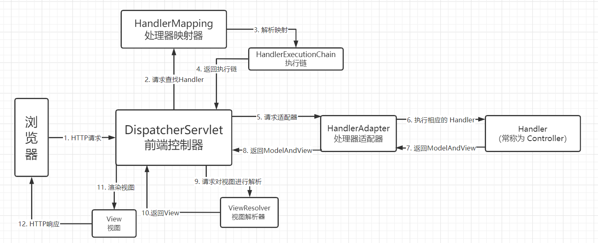

[TOC]


# SpringMVC

## 一、什么是MVC

- MVC是模型(Model)、视图(View)、控制器(Controller)的简写，是一种软件设计规范。

  + **Model（模型）：**数据模型，提供要展示的数据，因此包含数据和行为，可以认为是领域模型或JavaBean组件（包含数据和行为），不过现在一般都分离开来：Value Object（数据Dao） 和 服务层（行为Service）。也就是模型提供了模型数据查询和模型数据的状态更新等功能，包括数据和业务。

  + **View（视图）：**负责进行模型的展示，一般就是我们见到的用户界面，客户想看到的东西。

  + **Controller（控制器）：**接收用户请求，委托给模型进行处理（状态改变），处理完毕后把返回的模型数据返回给视图，由视图负责展示。也就是说控制器做了个调度员的工作。
- 是将业务逻辑、数据、显示分离的方法来组织代码。
- MVC主要作用是**降低了视图与业务逻辑间的双向偶合**。
- MVC不是一种设计模式，**MVC是一种架构模式**。当然不同的MVC存在差异。

Spring MVC 是 Spring 提供的一个基于 MVC 设计模式的轻量级 Web 开发框架，本质上相当于 Servlet。

Spring MVC 框架采用松耦合可插拔的组件结构，具有高度可配置性，比起其它 MVC 框架更具有扩展性和灵活性。


==Spring MVC是Spring Framework的一部分，是基于Java实现MVC的轻量级Web框架。==

 Spring MVC的特点：

1. 轻量级，简单易学
2. 高效 , 基于请求响应的MVC框架
3. 与Spring兼容性好，无缝结合
4. 约定优于配置
5. 功能强大：RESTful、数据验证、格式化、本地化、主题等
6. 简洁灵活


### [官方文档](https://docs.spring.io/spring/docs/5.2.0.RELEASE/spring-framework-reference/web.html#spring-web)

---


## 二、第一个SpringMVC程序

### 2.1、导入依赖

```xml
 <dependency>
     <groupId>junit</groupId>
     <artifactId>junit</artifactId>
     <version>4.13.2</version>
</dependency>

<dependency>
    <groupId>org.springframework</groupId>
    <artifactId>spring-webmvc</artifactId>
    <version>5.3.18</version>
</dependency>

<!-- https://mvnrepository.com/artifact/javax.servlet/javax.servlet-api -->
<dependency>
    <groupId>javax.servlet</groupId>
    <artifactId>javax.servlet-api</artifactId>
    <version>4.0.1</version>
    <scope>provided</scope>
</dependency>

<!-- https://mvnrepository.com/artifact/javax.servlet.jsp/jsp-api -->
<dependency>
    <groupId>javax.servlet.jsp</groupId>
    <artifactId>jsp-api</artifactId>
    <version>2.2</version>
    <scope>provided</scope>
</dependency>
<!-- https://mvnrepository.com/artifact/javax.servlet/jstl -->
<dependency>
    <groupId>javax.servlet</groupId>
    <artifactId>jstl</artifactId>
    <version>1.2</version>
</dependency>

```


### 2.2、配置web.xml  ， 注册DispatcherServlet

```xml
 <!--1.注册DispatcherServlet-->
<servlet>
    <servlet-name>springmvc</servlet-name>
    <servlet-class>org.springframework.web.servlet.DispatcherServlet</servlet-class>
    <!--关联一个springmvc的配置文件:【servlet-name】-servlet.xml-->
    <init-param>
        <param-name>contextConfigLocation</param-name>
        <param-value>classpath:springmvc-servlet.xml</param-value>
    </init-param>
    <!--启动级别-1-->
    <load-on-startup>1</load-on-startup>
</servlet>

<!--/ 匹配所有的请求；（不包括.jsp）-->
<!--/* 匹配所有的请求；（包括.jsp）-->
<servlet-mapping>
    <servlet-name>springmvc</servlet-name>
    <url-pattern>/</url-pattern>
</servlet-mapping>
```

### 2.3、编写SpringMVC 的 配置文件！名称：springmvc-servlet.xml  : [servletname]-servlet.xml

说明，这里的名称要求是按照官方来的

```xml

<?xml version="1.0" encoding="UTF-8"?>
<beans xmlns="http://www.springframework.org/schema/beans"
      xmlns:xsi="http://www.w3.org/2001/XMLSchema-instance"
      xsi:schemaLocation="http://www.springframework.org/schema/beans
       http://www.springframework.org/schema/beans/spring-beans.xsd">

</beans>
```

#### 2.3.1、添加 处理映射器

```xml
<!--处理器映射器-->
<bean class="org.springframework.web.servlet.handler.BeanNameUrlHandlerMapping"/>
```

#### 2.3.2、添加 处理器适配器

```xml
<!--处理器适配器-->
<bean class="org.springframework.web.servlet.mvc.SimpleControllerHandlerAdapter"/>
```

#### 2.3.3、添加 视图解析器

```xml
<!--视图解析器:DispatcherServlet给他的ModelAndView-->
<bean class="org.springframework.web.servlet.view.InternalResourceViewResolver" id="InternalResourceViewResolver">
   <!--前缀-->
   <property name="prefix" value="/WEB-INF/jsp/"/>
   <!--后缀-->
   <property name="suffix" value=".jsp"/>
</bean>
```

#### 2.3.4、将自己的类交给SpringIOC容器，注册bean

```
<!--Handler-->
<bean id="/hello" class="com.tan00xu.controller.HelloController"/>
```

#### 2.3.5、写要跳转的jsp页面

```jsp
<%@ page contentType="text/html;charset=UTF-8" language="java" %>
<html>
<head>
    <title>test</title>
</head>
<body>
${msg}
</body>
</html>
```


#### 可能出现404的情况，以及解决办法

如果代码没问题就按一下方法解决


重启Tomcat

还不能解决就仔细检查代码


---


## 三、Spring MVC执行流程




SpringMVC 的执行流程如下：

1. 用户点击某个请求路径，发起一个 HTTP request 请求，该请求会被提交到 DispatcherServlet（前端控制器）。
2. 由 DispatcherServlet 调用HandlerMapping，请求一个或多个 HandlerMapping（处理器映射器），HandlerMapping根据请求url查找Handler。
2. HandlerMapping会把请求映射为HandlerExecutionChain类型的handler对象
2. 然后返回一个执行链（HandlerExecutionChain）给DispatcherServlet 。
3. DispatcherServlet 将执行链返回的 Handler 信息发送给 HandlerAdapter（处理器适配器），其按照特定的规则去执行Handler。
4. HandlerAdapter 根据 Handler 信息找到并执行相应的 Handler（常称为 Controller）。
5. Handler 执行完毕后会返回给 HandlerAdapter 一个 ModelAndView 对象（Spring MVC的底层对象，包括 Model 数据模型和 View 视图信息）。
6. HandlerAdapter 接收到 ModelAndView 对象后，将其视图逻辑名或模型返回给 DispatcherServlet 。
7. DispatcherServlet 接收到 ModelAndView 对象后，会请调用ViewResolver（视图解析器）对视图进行解析。
8. ViewResolver 根据 View 信息匹配到相应的视图结果，并返回给 DispatcherServlet。
9. DispatcherServlet 接收到具体的 View 视图后，进行视图渲染，将 Model 中的模型数据填充到 View 视图中的 request 域，生成最终的 View（视图）。
10. 视图负责将结果显示到浏览器（客户端），最终视图呈现给用户。


---


## 四、注解

### 4.1、maven资源过滤问题

```xml
<build>
   <resources>
       <resource>
           <directory>src/main/java</directory>
           <includes>
               <include>**/*.properties</include>
               <include>**/*.xml</include>
           </includes>
           <filtering>false</filtering>
       </resource>
       <resource>
           <directory>src/main/resources</directory>
           <includes>
               <include>**/*.properties</include>
               <include>**/*.xml</include>
           </includes>
           <filtering>false</filtering>
       </resource>
   </resources>
</build>
```

### 4.2、配置web.xml

```xml
<?xml version="1.0" encoding="UTF-8"?>
<web-app xmlns="http://xmlns.jcp.org/xml/ns/javaee"
         xmlns:xsi="http://www.w3.org/2001/XMLSchema-instance"
         xsi:schemaLocation="http://xmlns.jcp.org/xml/ns/javaee
          http://xmlns.jcp.org/xml/ns/javaee/web-app_4_0.xsd"
         version="4.0">

    <!--1.注册DispatcherServlet-->
    <servlet>
        <servlet-name>springmvc</servlet-name>
        <servlet-class>org.springframework.web.servlet.DispatcherServlet</servlet-class>
        <!--通过初始化参数指定SpringMVC配置文件的位置，进行关联-->
        <init-param>
            <param-name>contextConfigLocation</param-name>
            <param-value>classpath:springmvc-servlet.xml</param-value>
        </init-param>
        <!--启动顺序，数字越小，启动越早-->
        <!--启动级别-1-->
        <load-on-startup>1</load-on-startup>
    </servlet>

    <!--/ 匹配所有的请求；（不包括.jsp）-->
    <!--/* 匹配所有的请求；（包括.jsp）-->
    <!--所有请求都会被springmvc拦截 -->
    <servlet-mapping>
        <servlet-name>springmvc</servlet-name>
        <url-pattern>/</url-pattern>
    </servlet-mapping>

</web-app>
```

**/ 和 /\* 的区别：**

< url-pattern > / </ url-pattern > 不会匹配到.jsp， 只针对我们编写的请求；即：.jsp 不会进入spring的 DispatcherServlet类 。

< url-pattern > /* </ url-pattern > 会匹配 *.jsp，会出现返回 jsp视图 时再次进入spring的DispatcherServlet 类，导致找不到对应的controller所以报404错。

### 4.3、**添加Spring MVC配置文件**

```xml
<?xml version="1.0" encoding="UTF-8"?>
<beans xmlns="http://www.springframework.org/schema/beans"
       xmlns:xsi="http://www.w3.org/2001/XMLSchema-instance"
       xmlns:context="http://www.springframework.org/schema/context"
       xmlns:mvc="http://www.springframework.org/schema/mvc"
       xsi:schemaLocation="http://www.springframework.org/schema/beans
       http://www.springframework.org/schema/beans/spring-beans.xsd
       http://www.springframework.org/schema/context
       https://www.springframework.org/schema/context/spring-context.xsd
       http://www.springframework.org/schema/mvc
       https://www.springframework.org/schema/mvc/spring-mvc.xsd">


    <!-- 自动扫描包，让指定包下的注解生效,由IOC容器统一管理 -->
    <context:component-scan base-package="com.tan00xu.controller"/>
    <!-- 让Spring MVC不处理静态资源 -->
    <mvc:default-servlet-handler />
    <!--
    支持mvc注解驱动
        在spring中一般采用@RequestMapping注解来完成映射关系
        要想使@RequestMapping注解生效
        必须向上下文中注册DefaultAnnotationHandlerMapping
        和一个AnnotationMethodHandlerAdapter实例
        这两个实例分别在类级别和方法级别处理。
        而annotation-driven配置帮助我们自动完成上述两个实例的注入。
     -->
    <mvc:annotation-driven />

    <!-- 视图解析器 -->
    <bean class="org.springframework.web.servlet.view.InternalResourceViewResolver" id="internalResourceViewResolver">
        <!-- 前缀 -->
        <property name="prefix" value="/WEB-INF/jsp/" />
        <!-- 后缀 -->
        <property name="suffix" value=".jsp" />
    </bean>
    
</beans>
```

Spring3.1之前版本，开启注解式处理器支持的配置为：`DefaultAnnotationHandlerMapping`和`AnnotationMethodHandlerAdapter`。

```xml
<!—Spring3.1之前的注解 HandlerMapping -->  
<bean   
class="org.springframework.web.servlet.mvc.annotation.DefaultAnnotationHandlerMapping"/>  
  
<!—Spring3.1之前的注解 HandlerAdapter -->  
<bean class="org.springframework.web.servlet.mvc.annotation.AnnotationMethodHandlerAdapter"/>  
```

Spring3.1开始的版本，使用`RequestMappingHandlerMapping`和`RequestMappingHandlerAdapter`

```xml
<!--Spring3.1开始的注解 HandlerMapping -->  
<bean   
class="org.springframework.web.servlet.mvc.method.annotation.RequestMappingHandlerMapping"/>  
<!--Spring3.1开始的注解 HandlerAdapter -->  
<bean  
class="org.springframework.web.servlet.mvc.method.annotation.RequestMappingHandlerAdapter"/> 
```

### 4.4、Controller

```java
package com.tan00xu.controller;

import org.springframework.stereotype.Controller;
import org.springframework.ui.Model;
import org.springframework.web.bind.annotation.RequestMapping;

@Controller
//若类上加了RequestMapping，则地址先经过类上的RequestMapping，再经过方法上的RequestMapping
@RequestMapping("/HelloController")
public class HelloController {

    //真实访问地址（http://localhost:8080/HelloController/hello）
    @RequestMapping("/hello")
    public String hello(Model model) {
        //向模型中添加属性msg与值，可以在JSP页面中取出并渲染
        model.addAttribute("msg","HELLO,SpringMVC annotation");
        //返回给视图解析器处理
        return "hello";
    }

}

```

- @Controller是为了让Spring IOC容器初始化时自动扫描到
- @RequestMapping是为了映射请求路径

- 方法中声明Model类型的参数是为了把Action中的数据带到视图中
- 方法返回的结果是视图的名称hello，加上配置文件中的前后缀变成WEB-INF/jsp/**hello**.jsp

4.5、视图层

1. 在WEB-INF/ jsp目录中创建hello.jsp ， 视图可以直接取出并展示从Controller带回的信息。

2. 可以通过EL表示取出Model中存放的值，或者对象。

```jsp
<%@ page contentType="text/html;charset=UTF-8" language="java" %>
<html>
<head>
    <title>Title</title>
</head>
<body>
${msg}
</body>
</html>
```

### 小结：

使用springMVC必须配置的三大件：

**处理器映射器、处理器适配器、视图解析器**

通常，我们只需要**手动配置视图解析器**，而**处理器映射器**和**处理器适配器**只需要开启**注解驱动**即可，而省去了大段的xml配置

**注解驱动**：

```xml
<mvc:annotation-driven />
```


---


## 五、控制器

### 5.1、控制器Controller

- 控制器负责提供访问应用程序的行为，通常通过接口定义或注解定义两种方法实现。
- 控制器负责解析用户的请求并将其转换为一个模型。
- 在Spring MVC中一个控制器类可以包含多个方法
- 在Spring MVC中，对于Controller的配置方式有很多种

### 5.2、实现Controller接口

Controller是一个接口，在org.springframework.web.servlet.mvc包下，接口中只有一个方法

```java
//实现该接口的类获得控制器功能
public interface Controller {
   //处理请求且返回一个模型与视图对象
   ModelAndView handleRequest(HttpServletRequest var1, HttpServletResponse var2) throws Exception;
}
```

### 5.3、测试

#### 5.3.1、Controller类

```java
package com.tan00xu.controller;

import org.springframework.web.servlet.ModelAndView;
import org.springframework.web.servlet.mvc.Controller;

import javax.servlet.http.HttpServletRequest;
import javax.servlet.http.HttpServletResponse;

public class ControllerTest1 implements Controller {
    @Override
    public ModelAndView handleRequest(HttpServletRequest request, HttpServletResponse response) throws Exception {
        ModelAndView modelAndView = new ModelAndView();
        modelAndView.addObject("msg", "tan00xu");
        modelAndView.setViewName("test");
        return modelAndView;
    }
}
```

#### 5.3.2、Springmvc-servlet.xml

```xml
<?xml version="1.0" encoding="UTF-8"?>
<beans xmlns="http://www.springframework.org/schema/beans"
       xmlns:xsi="http://www.w3.org/2001/XMLSchema-instance"
       xsi:schemaLocation="http://www.springframework.org/schema/beans
       http://www.springframework.org/schema/beans/spring-beans.xsd">


    <!-- 视图解析器 -->
    <bean class="org.springframework.web.servlet.view.InternalResourceViewResolver" id="internalResourceViewResolver">
        <!-- 前缀 -->
        <property name="prefix" value="/WEB-INF/jsp/" />
        <!-- 后缀 -->
        <property name="suffix" value=".jsp" />
    </bean>

    <!--注册请求的bean:name对应请求路径，class对应处理请求的类-->
    <bean id="/t1" class="com.tan00xu.controller.ControllerTest1"/>

</beans>
```

### 5.4、**说明：**

- 实现接口Controller定义控制器是较老的办法
- 缺点是：一个控制器中只有一个方法，如果要多个方法则需要定义多个Controller；定义的方式比较麻烦；

### 5.5、使用@Controller

- @Controller注解类型用于声明Spring类的实例是一个控制器

- Spring可以使用扫描机制来找到应用程序中所有基于注解的控制器类，为了保证Spring能找到你的控制器，需要在配置文件中声明组件扫描。

  ```xml
    <!-- 自动扫描指定的包，下面所有注解类交给IOC容器管理 -->
  <context:component-scan base-package="com.tan00xu.controller" />
  ```

  #### 5.5.1、注解实现

  ```java
  package com.tan00xu.controller;
  
  import org.springframework.stereotype.Controller;
  import org.springframework.ui.Model;
  import org.springframework.web.bind.annotation.RequestMapping;
  
  /**
   * 注解@Controller表示这是一个控制器，会被spring管理
   * 被这个注解标注的类，会被spring初始化，并且会被加载到容器中
   * 如果返回值是String，并且有@RequestMapping，则会被视图解析器解析，并跳转到指定的页面
   */
  @Controller
  public class ControllerTesr2 {
      @RequestMapping("/t2")
      public String test1(Model model){
          model.addAttribute("msg","ControllerTesr2");
          //返回视图的位置（及test.jsp）
          return "test";
      }
  }
  ```

  

  ---

  

  ## RestFul 风格

  **概念**

  Restful就是一个资源定位及资源操作的风格。不是标准也不是协议，只是一种风格。基于这个风格设计的软件可以更简洁，更有层次，更易于实现缓存等机制，安全：用户不知道参数。

  **功能**

  资源：互联网所有的事物都可以被抽象为资源

  资源操作：使用POST、DELETE、PUT、GET，使用不同方法对资源进行操作。

  分别对应 添加、 删除、修改、查询。

  **传统方式操作资源**  ：通过不同的参数来实现不同的效果！方法单一，post 和 get

  ​	http://127.0.0.1/item/queryItem.action?id=1 查询,GET

  ​	http://127.0.0.1/item/saveItem.action 新增,POST

  ​	http://127.0.0.1/item/updateItem.action 更新,POST

  ​	http://127.0.0.1/item/deleteItem.action?id=1 删除,GET或POST

  **使用RESTful操作资源** ：可以通过不同的请求方式来实现不同的效果！如下：请求地址一样，但是功能可以不同！

  ​	http://127.0.0.1/item/1 查询,GET

  ​	http://127.0.0.1/item 新增,POST

  ​	http://127.0.0.1/item 更新,PUT

  ​	http://127.0.0.1/item/1 删除,DELETE

### RestFullController

```java
package com.tan00xu.controller;

import org.springframework.stereotype.Controller;
import org.springframework.ui.Model;
import org.springframework.web.bind.annotation.PathVariable;
import org.springframework.web.bind.annotation.RequestMapping;

@Controller
public class RestFullController {
    //过去的方式 ： http://localhost:8080/add?a=1&b=2
    //RestFul风格的方式： http://localhost:8080/add/1/2
    @RequestMapping("/add/{a}/{b}")
    //使用@PathVariable注解接收参数
    public String test1(@PathVariable int a, @PathVariable int b, Model model) {
        int res = a+b;
        model.addAttribute("msg", "结果为"+res);
        return "test";
    }
}
```

==必须使用  @PathVariable 注解，让方法参数的值对应绑定到一个URI模板变量上==

### 可以使用method属性指定请求类型

用于约束请求的类型，可以收窄请求范围。可选类型有==`GET, POST, HEAD, OPTIONS, PUT, PATCH, DELETE, TRACE`==

可以通过{}来通过多个不同的请求，默认是GET请求

```java
    @RequestMapping(value = "/add/{a}/{b}",method={RequestMethod.GET,RequestMethod.POST,RequestMethod.PUT,RequestMethod.HEAD} )
```

也可以通过一下几种变体注解来直接实现约束请求类型

```java
@GetMapping("/add/{a}/{b}")
@PostMapping()
@PutMapping()
@DeleteMapping()
@PatchMapping()
```

### 建议：

+ 不建议使用**name**属性名定义路径``@RequestMapping(name = "/add/{a}/{b}"）``
+ *可能会出现404或无法匹配参数的情况*
+ 可以使用**value**或者**path**来代替`@RequestMapping(value = "/add/{a}/{b}")`、`@RequestMapping(path = "/add/{a}/{b}")`
+ 只有一个参数的情况下直接写请求路径`@RequestMapping("/add/{a}/{b}")`


---


## 六、转发和重定向

### 6.1、通过设置ServletAPI , 不需要视图解析器

1、通过HttpServletResponse进行输出

2、通过HttpServletResponse实现重定向

3、通过HttpServletResponse实现转发

```java
@Controller
public class ResultGo {

   @RequestMapping("/result/t1")
   public void test1(HttpServletRequest req, HttpServletResponse rsp) throws IOException {
       rsp.getWriter().println("Hello,Spring by servlet API");
  }

   @RequestMapping("/result/t2")
   public void test2(HttpServletRequest req, HttpServletResponse rsp) throws IOException {
       rsp.sendRedirect("/index.jsp");
  }

   @RequestMapping("/result/t3")
   public void test3(HttpServletRequest req, HttpServletResponse rsp) throws Exception {
       //转发
       req.setAttribute("msg","/result/t3");
       req.getRequestDispatcher("/WEB-INF/jsp/test.jsp").forward(req,rsp);
  }

}
```

### 6.2、通过SpringMVC来实现转发和重定向

#### 6.2.1、无视图解析器

```java
@Controller
public class ForwardController {
    @RequestMapping("/f1")
    public String test(Model model){
        model.addAttribute("msg","不走视图解析器");
        //转发
        return "/WEB-INF/jsp/test.jsp";
        //转发
        return "forward:/WEB-INF/jsp/test.jsp";
        //重定向
        return "redirect:/index.jsp";
    }
}
```

#### 6.2.2、有视图解析器

```java
 @RequestMapping("/f2")
    public String test2(Model model){
        model.addAttribute("msg","走视图解析器");
        //转发
        return "test";
        //重定向
        return "redirect:/index.jsp";
    }

```


---


## 七、数据处理

### 7.1、处理提交数据

#### 7.1.1、提交的域名称和处理方法的参数名一致

```java
@Controller
public class DataController {
    @GetMapping("t1")
    public String test(String name) {
        System.out.println("接收到的参数：" + name);
        return "test";
    }
}
```

访问路径：http://localhost:8080/t1?name=饮梦

接收到的参数：饮梦

#### 7.1.2、提交的域名称和处理方法的参数名不一致

```java
@Controller
public class DataController {
    @GetMapping("t1")
    //可以通过@RequestParam注解指定名称
    public String test(@RequestParam("username") String name) {
        System.out.println("接收到的参数：" + name);
        return "test";
    }
}
```

访问路径：http://localhost:8080/t1?username=饮梦

接收到的参数：饮梦

#### 7.1.3、提交的是一个对象

```java
/**
  * 1.接收前端用户传递的参数,判断参数的名字,假设名字直接在方法上,可以直接使用
  * 2.假设传递的是一个对象User,匹配User对象中的字段名
  *
  * 接收前端传递的对象：id,name,age
  */
@GetMapping("t2")
//可以通过@RequestParam注解指定名称
public String test2(User user) {
    System.out.println("接收到的参数：" + user);
    return "test";
}
```

访问路径：http://localhost:8080/t2?id=1&name=饮梦&age=18

接收到的参数：User(id=1, name=饮梦, age=18)

说明：如果使用对象的话，前端传递的参数名和对象名必须一致，否则就是null。

### 7.2、数据显示到前端

#### 7.2.1、通过ModelAndView

```java
public class ControllerTest1 implements Controller {
    @Override
    public ModelAndView handleRequest(HttpServletRequest request, HttpServletResponse response) throws Exception {
        ModelAndView modelAndView = new ModelAndView();
        modelAndView.addObject("msg", "tan00xu");
        modelAndView.setViewName("test");
        return modelAndView;
    }
}
```

#### 7.2.2、通过Model

```java
@GetMapping("t3")
public String test3(Model model) {
    model.addAttribute("msg", "hello world");
    return "test";
}
```

#### 7.2.3、通过ModelMap

```java
@GetMapping("t4")
public String test4(ModelMap modelMap) {
    modelMap.addAttribute("msg", "hello world");
    return "test";
}
```

#### 对比

```
Model 只有寥寥几个方法只适合用于储存数据，简化了新手对于Model对象的操作和理解；

ModelMap 继承了 LinkedMap ，除了实现了自身的一些方法，同样的继承 LinkedMap 的方法和特性；

ModelAndView 可以在储存数据的同时，可以进行设置返回的逻辑视图，进行控制展示层的跳转。
```

## 八、乱码问题

### 8.1、配置编码过滤器

#### EncodingFilter类

```java
public class EncodingFilter implements Filter {
    @Override
    public void init(FilterConfig filterConfig) throws ServletException {
        Filter.super.init(filterConfig);
    }

    @Override
    public void doFilter(ServletRequest servletRequest, ServletResponse servletResponse, FilterChain filterChain) throws IOException, ServletException {
        servletRequest.setCharacterEncoding("UTF-8");
        servletResponse.setCharacterEncoding("UTF-8");
        filterChain.doFilter(servletRequest, servletResponse);
    }

    @Override
    public void destroy() {
        Filter.super.destroy();
    }
}
```

#### 配置web.xml

```xml
<filter>
    <filter-name>encodingFilter</filter-name>
    <filter-class>com.tan00xu.filter.EncodingFilter</filter-class>
</filter>
<filter-mapping>
    <filter-name>encodingFilter</filter-name>
    <url-pattern>/*</url-pattern>
</filter-mapping>

```

### 8.2、配置Springmvc的编码过滤

```xml
<!--配置Springmvc的编码过滤-->
<filter>
    <filter-name>springmvcEncodingFilter</filter-name>
    <filter-class>org.springframework.web.filter.CharacterEncodingFilter</filter-class>
    <init-param>
        <param-name>encoding</param-name>
        <param-value>utf-8</param-value>
    </init-param>
</filter>
<filter-mapping>
    <filter-name>springmvcEncodingFilter</filter-name>
    <url-pattern>/*</url-pattern>
</filter-mapping>
```

### 8.3、修改tomcat配置文件 ：设置编码

"apache-tomcat\conf\server.xml"

```xml
<Connector URIEncoding="utf-8" port="8080" protocol="HTTP/1.1"
          connectionTimeout="20000"
          redirectPort="8443" />
```

### 8.4、一个自定义的通用过滤器

```java
/**
* 解决get和post请求 全部乱码的过滤器
*/
public class GenericEncodingFilter implements Filter {

   @Override
   public void destroy() {
  }

   @Override
   public void doFilter(ServletRequest request, ServletResponse response, FilterChain chain) throws IOException, ServletException {
       //处理response的字符编码
       HttpServletResponse myResponse=(HttpServletResponse) response;
       myResponse.setContentType("text/html;charset=UTF-8");

       // 转型为与协议相关对象
       HttpServletRequest httpServletRequest = (HttpServletRequest) request;
       // 对request包装增强
       HttpServletRequest myrequest = new MyRequest(httpServletRequest);
       chain.doFilter(myrequest, response);
  }

   @Override
   public void init(FilterConfig filterConfig) throws ServletException {
  }

}

//自定义request对象，HttpServletRequest的包装类
class MyRequest extends HttpServletRequestWrapper {

   private HttpServletRequest request;
   //是否编码的标记
   private boolean hasEncode;
   //定义一个可以传入HttpServletRequest对象的构造函数，以便对其进行装饰
   public MyRequest(HttpServletRequest request) {
       super(request);// super必须写
       this.request = request;
  }

   // 对需要增强方法 进行覆盖
   @Override
   public Map getParameterMap() {
       // 先获得请求方式
       String method = request.getMethod();
       if (method.equalsIgnoreCase("post")) {
           // post请求
           try {
               // 处理post乱码
               request.setCharacterEncoding("utf-8");
               return request.getParameterMap();
          } catch (UnsupportedEncodingException e) {
               e.printStackTrace();
          }
      } else if (method.equalsIgnoreCase("get")) {
           // get请求
           Map<String, String[]> parameterMap = request.getParameterMap();
           if (!hasEncode) { // 确保get手动编码逻辑只运行一次
               for (String parameterName : parameterMap.keySet()) {
                   String[] values = parameterMap.get(parameterName);
                   if (values != null) {
                       for (int i = 0; i < values.length; i++) {
                           try {
                               // 处理get乱码
                               values[i] = new String(values[i]
                                      .getBytes("ISO-8859-1"), "utf-8");
                          } catch (UnsupportedEncodingException e) {
                               e.printStackTrace();
                          }
                      }
                  }
              }
               hasEncode = true;
          }
           return parameterMap;
      }
       return super.getParameterMap();
  }

   //取一个值
   @Override
   public String getParameter(String name) {
       Map<String, String[]> parameterMap = getParameterMap();
       String[] values = parameterMap.get(name);
       if (values == null) {
           return null;
      }
       return values[0]; // 取回参数的第一个值
  }

   //取所有值
   @Override
   public String[] getParameterValues(String name) {
       Map<String, String[]> parameterMap = getParameterMap();
       String[] values = parameterMap.get(name);
       return values;
  }
}
```

## 九、JSON

### 9.1、Controller返回JSON数据

使用jackson

#### 9.1.1、导入jackson的包

```xml
<!-- https://mvnrepository.com/artifact/com.fasterxml.jackson.core/jackson-databind -->
<dependency>
    <groupId>com.fasterxml.jackson.core</groupId>
    <artifactId>jackson-databind</artifactId>
    <version>2.13.2.2</version>
</dependency>
```

#### 9.1.2、web.xml

```xml
<!--注册Servlet-->
    <servlet>
        <servlet-name>springmvc</servlet-name>
        <servlet-class>org.springframework.web.servlet.DispatcherServlet</servlet-class>
        <init-param>
            <param-name>contextConfigLocation</param-name>
            <param-value>classpath:springmvc-servlet.xml</param-value>
        </init-param>
        <load-on-startup>1</load-on-startup>
    </servlet>
    <servlet-mapping>
        <servlet-name>springmvc</servlet-name>
        <url-pattern>/</url-pattern>
    </servlet-mapping>


    <!--配置Springmvc的编码过滤-->
    <filter>
        <filter-name>springmvcEncodingFilter</filter-name>
        <filter-class>org.springframework.web.filter.CharacterEncodingFilter</filter-class>
        <init-param>
            <param-name>encoding</param-name>
            <param-value>utf-8</param-value>
        </init-param>
    </filter>
    <filter-mapping>
        <filter-name>springmvcEncodingFilter</filter-name>
        <url-pattern>/*</url-pattern>
    </filter-mapping>
```

#### 9.1.3、springmvc-servlet.xml

```xml
<!-- 自动扫描指定的包，下面所有注解类交给IOC容器管理 -->
<context:component-scan base-package="com.tan00xu.controller" />

<!-- 视图解析器 -->
<bean class="org.springframework.web.servlet.view.InternalResourceViewResolver" id="internalResourceViewResolver">
    <!-- 前缀 -->
    <property name="prefix" value="/WEB-INF/jsp/" />
    <!-- 后缀 -->
    <property name="suffix" value=".jsp" />
</bean>
```

#### 9.1.4、User实体类

```java
@Data
@NoArgsConstructor
@AllArgsConstructor
public class User {
    private String name;
    private int age;
    private String gender;
}
```

#### 9.1.5、UserController

```java
@Controller
public class UserController {

    //produces = "application/json;charset=UTF-8"设置返回的数据类型,解决JSON乱码问题
    @RequestMapping(value = "/j1",produces = "application/json;charset=UTF-8")
    //加上@ResponseBody注解后，就不会走视图解析器了，而是直接返回json数据
    @ResponseBody
    public String json1() throws JsonProcessingException {

        ObjectMapper objectMapper = new ObjectMapper();

        User user = new User("饮梦", 18, "男");

        String s = objectMapper.writeValueAsString(user);

        return s;
    }
}
```

### 9.2、JSON乱码问题

#### 方法一：

```java
//produces = "application/json;charset=UTF-8"设置返回的数据类型,解决JSON乱码问题
    @RequestMapping(value = "/j1",produces = "application/json;charset=UTF-8")
```

#### 方法二：统一进行解决，这个方式更便捷

```xml
<!--解决JSON乱码问题-->
<mvc:annotation-driven>
    <mvc:message-converters register-defaults="true">
        <bean class="org.springframework.http.converter.StringHttpMessageConverter">
            <constructor-arg value="UTF-8"/>
        </bean>
        <bean class="org.springframework.http.converter.json.MappingJackson2HttpMessageConverter">
            <property name="objectMapper">
                <bean class="org.springframework.http.converter.json.Jackson2ObjectMapperFactoryBean">
                    <property name="failOnEmptyBeans" value="false"/>
                </bean>
            </property>
        </bean>
    </mvc:message-converters>
</mvc:annotation-driven>
```

### 9.3、返回json字符串统一解决

在类上直接使用 **@RestController** ，这样子，里面所有的方法都只会返回 json 字符串了，不用再每一个都添加@ResponseBody ！我们在前后端分离开发中，一般都使用 @RestController ，十分便捷！

```java
//使用@RestController注解后，类中所有方法返回的都是json数据，不需要再写@ResponseBody注解，不会走视图解析器
@RestController
public class UserController {}
```

### 9.4、返回集合

```java
@RequestMapping("/j2")
public String json2() throws JsonProcessingException {

    ObjectMapper objectMapper = new ObjectMapper();

    List<User> userList = new ArrayList<User>();
    User user0 = new User("饮梦", 18, "男");
    User user1 = new User("饮梦", 18, "男");
    User user2 = new User("饮梦", 18, "男");
    User user3 = new User("饮梦", 18, "男");
    User user4 = new User("饮梦", 18, "男");

    userList.add(user0);
    userList.add(user1);
    userList.add(user2);
    userList.add(user3);
    userList.add(user4);

    String s = objectMapper.writeValueAsString(userList);

    return s;
}
```

### 9.5、返回时间对象

#### 原生simpleDateFormat方式转换格式

```java
@RequestMapping("/j3")
    public String json3() throws JsonProcessingException {
        ObjectMapper objectMapper = new ObjectMapper();

        Date date = new Date();

        SimpleDateFormat simpleDateFormat = new SimpleDateFormat("yyyy-MM-dd HH:mm:ss");

        //原生simpleDateFormat方式转换格式
        String dateFormat = simpleDateFormat.format(date);

        //ObjectMapper解析时间后的默认格式为：TimeStamp,时间戳格式
        return objectMapper.writeValueAsString(dateFormat);
    }
```

#### 通过objectMapper.setDateFormat设置时间格式

```java
@RequestMapping("/j3")
public String json3() throws JsonProcessingException {
    ObjectMapper objectMapper = new ObjectMapper();

    Date date = new Date();

    //使用ObjectMapper关闭格式化为时间戳，默认是true
    objectMapper.configure(SerializationFeature.WRITE_DATES_AS_TIMESTAMPS, false);

    SimpleDateFormat simpleDateFormat = new SimpleDateFormat("yyyy-MM-dd HH:mm:ss");
    //通过setDateFormat设置日期格式
    objectMapper.setDateFormat(simpleDateFormat);

    //ObjectMapper解析时间后的默认格式为：TimeStamp,时间戳格式
    return objectMapper.writeValueAsString(date);
}
```

### 9.6、写一个工具类JsonUtils

```java
package com.tan00xu.utils;

import com.fasterxml.jackson.core.JsonProcessingException;
import com.fasterxml.jackson.databind.ObjectMapper;
import com.fasterxml.jackson.databind.SerializationFeature;

import java.text.SimpleDateFormat;
import java.util.Date;

public class JsonUtils {

    public static String getJson(Object object) {
        return JsonUtils.getJson(object, "yyyy-MM-dd HH:mm:ss");
    }
    
    public static String getJson(Object object, String simpleDateFormat) {
        ObjectMapper objectMapper = new ObjectMapper();
        Date date = new Date();

        //使用ObjectMapper关闭格式化为时间戳，默认是true
        objectMapper.configure(SerializationFeature.WRITE_DATES_AS_TIMESTAMPS, false);

        SimpleDateFormat sdf = new SimpleDateFormat(simpleDateFormat);
        //通过setDateFormat设置日期格式
        objectMapper.setDateFormat(sdf);

        //ObjectMapper解析时间后的默认格式为：TimeStamp,时间戳格式
        try {
            return objectMapper.writeValueAsString(object);
        } catch (JsonProcessingException e) {
            e.printStackTrace();
        }
        return null;
    }
}
```

### 9.7、com.alibaba.fastjson

#### 导入依赖

```xml
<!-- https://mvnrepository.com/artifact/com.alibaba/fastjson -->
<dependency>
    <groupId>com.alibaba</groupId>
    <artifactId>fastjson</artifactId>
    <version>1.2.80</version>
</dependency>
```

#### 方法

```java
public static void main(String[] args) {
    List<User> userList = new ArrayList<User>();
    User user0 = new User("饮梦0", 18, "男");
    User user1 = new User("饮梦1", 18, "男");
    User user2 = new User("饮梦2", 18, "男");
    User user3 = new User("饮梦3", 18, "男");
    User user4 = new User("饮梦4", 18, "男");

    userList.add(user0);
    userList.add(user1);
    userList.add(user2);
    userList.add(user3);
    userList.add(user4);

    /*==============================================================*/
    System.out.println("*******Java对象 转 JSON字符串*******");
    String str1 = JSON.toJSONString(userList);
    System.out.println("JSON.toJSONString(list)==>\n"+str1);

    String str2 = JSON.toJSONString(user0);
    System.out.println("JSON.toJSONString(user1)==>\n"+str2);

    /*==============================================================*/
    System.out.println("\n****** JSON字符串 转 Java对象*******");
    User jp_user1=JSON.parseObject(str2,User.class);
    System.out.println("JSON.parseObject(str2,User.class)==>\n"+jp_user1);

    /*==============================================================*/
    System.out.println("\n****** Java对象 转 JSON对象 ******");
    JSONObject jsonObject1 = (JSONObject) JSON.toJSON(user2);
    System.out.println("(JSONObject) JSON.toJSON(user2)==>\n"+jsonObject1.getString("name"));

    /*==============================================================*/
    System.out.println("\n****** JSON对象 转 Java对象 ******");
    User to_java_user = JSON.toJavaObject(jsonObject1, User.class);
    System.out.println("JSON.toJavaObject(jsonObject1, User.class)==>\n"+to_java_user);
}
```


---


## 十、SSM整合

### 10.1、pom.xml依赖

```xml
  <dependencies>
        <!--Junit-->
        <dependency>
            <groupId>junit</groupId>
            <artifactId>junit</artifactId>
            <version>4.13.2</version>
        </dependency>
        <!--数据库驱动-->
        <dependency>
            <groupId>mysql</groupId>
            <artifactId>mysql-connector-java</artifactId>
            <version>8.0.28</version>
        </dependency>
        <!-- 数据库连接池 -->
        <dependency>
            <groupId>com.mchange</groupId>
            <artifactId>c3p0</artifactId>
            <version>0.9.5.5</version>
        </dependency>

        <!--Servlet - JSP -->
        <dependency>
            <groupId>javax.servlet</groupId>
            <artifactId>servlet-api</artifactId>
            <version>2.5</version>
        </dependency>
        <dependency>
            <groupId>javax.servlet.jsp</groupId>
            <artifactId>jsp-api</artifactId>
            <version>2.2</version>
        </dependency>
        <dependency>
            <groupId>javax.servlet</groupId>
            <artifactId>jstl</artifactId>
            <version>1.2</version>
        </dependency>

        <!--Mybatis-->
        <dependency>
            <groupId>org.mybatis</groupId>
            <artifactId>mybatis</artifactId>
            <version>3.5.9</version>
        </dependency>
        <dependency>
            <groupId>org.mybatis</groupId>
            <artifactId>mybatis-spring</artifactId>
            <version>2.0.7</version>
        </dependency>

        <!--Spring-->
        <!-- https://mvnrepository.com/artifact/org.springframework/spring-webmvc -->
        <dependency>
            <groupId>org.springframework</groupId>
            <artifactId>spring-webmvc</artifactId>
            <version>5.3.18</version>
        </dependency>
        <!--Spring操作数据库-->
        <!-- https://mvnrepository.com/artifact/org.springframework/spring-jdbc -->
        <dependency>
            <groupId>org.springframework</groupId>
            <artifactId>spring-jdbc</artifactId>
            <version>5.3.18</version>
        </dependency>
        
        <!--lombok-->
        <dependency>
            <groupId>org.projectlombok</groupId>
            <artifactId>lombok</artifactId>
            <version>1.18.22</version>
        </dependency>
        
    </dependencies>
```

10.2、Maven资源过滤设置

```xml
<build>
   <resources>
       <resource>
           <directory>src/main/java</directory>
           <includes>
               <include>**/*.properties</include>
               <include>**/*.xml</include>
           </includes>
           <filtering>false</filtering>
       </resource>
       <resource>
           <directory>src/main/resources</directory>
           <includes>
               <include>**/*.properties</include>
               <include>**/*.xml</include>
           </includes>
           <filtering>false</filtering>
       </resource>
   </resources>
</build>
```

### 10.3、数据库环境

```mysql
CREATE DATABASE `ssmbuild`;

USE `ssmbuild`;

DROP TABLE IF EXISTS `books`;

CREATE TABLE `books` (
`bookID` INT(10) NOT NULL AUTO_INCREMENT COMMENT '书id',
`bookName` VARCHAR(100) NOT NULL COMMENT '书名',
`bookCounts` INT(11) NOT NULL COMMENT '数量',
`detail` VARCHAR(200) NOT NULL COMMENT '描述',
KEY `bookID` (`bookID`)
) ENGINE=INNODB DEFAULT CHARSET=utf8

INSERT  INTO `books`(`bookID`,`bookName`,`bookCounts`,`detail`)VALUES
(1,'Java',1,'从入门到放弃'),
(2,'MySQL',10,'从删库到跑路'),
(3,'Linux',5,'从进门到进牢');
```

### 10.4、pojo,dao,service

```java
@Data
@NoArgsConstructor
@AllArgsConstructor
public class Books {
    private int bookID;
    private String bookName;
    private int cookCounts;
    private String detail;
}
```

```java
public interface BookMapper {
    /**
     * 增加一本书
     */
    int addBook(Books book);

    /**
     *  删除一本书
     */
    int deleteBook(@Param("bookId") int id);

    /**
     * 更新一本书
     */
    int updateBook(Books book);

    /**
     * 查询一本书
     */
    Books selectBookById(int id);

    /**
     * 查询所有书
     */
    List<Books> listBooks();
}
```

```xml
<?xml version="1.0" encoding="UTF-8" ?>
<!DOCTYPE mapper
        PUBLIC "-//mybatis.org//DTD Mapper 3.0//EN"
        "http://mybatis.org/dtd/mybatis-3-mapper.dtd">
<mapper namespace="com.tan00xu.dao.BookMapper">

    <insert id="addBook" parameterType="Books">
        insert into ssmbuild.books (bookID, bookName, bookCounts, detail)
        VALUES (#{bookID}, #{bookName}, #{bookCounts}, #{detail})
    </insert>

    <delete id="deleteBook" parameterType="int">
        delete
        from ssmbuild.books
        where bookID = #{bookId}
    </delete>

    <update id="updateBook" parameterType="Books">
        update ssmbuild.books
        set bookName   = #{bookName},
            bookCounts = #{bookCounts},
            detail     = #{detail}
        where bookID = #{bookID}
    </update>

    <select id="selectBookById" resultType="com.tan00xu.pojo.Books">
        select *
        from ssmbuild.books
        where bookID = #{bookID}
    </select>

    <select id="listBooks" resultType="com.tan00xu.pojo.Books">
        select *
        from ssmbuild.books
    </select>
</mapper>
```

```java
public interface BookService {
    /**
     * 增加一本书
     */
    int addBook(Books book);

    /**
     *  删除一本书
     */
    int deleteBook(@Param("bookId") int id);

    /**
     * 更新一本书
     */
    int updateBook(Books book);

    /**
     * 查询一本书
     */
    Books selectBookById(int id);

    /**
     * 查询所有书
     */
    List<Books> listBooks();
}
```

```java
public class BookServiceImpl implements BookService {

    /**
     * service调用dao层的方法
     */
    private BookMapper bookMapper;

    public void setBookMapper(BookMapper bookMapper) {
        this.bookMapper = bookMapper;
    }

    @Override
    public int addBook(Books book) {
        return bookMapper.addBook(book);
    }

    @Override
    public int deleteBook(int id) {
        return bookMapper.deleteBook(id);
    }

    @Override
    public int updateBook(Books book) {
        return bookMapper.updateBook(book);
    }

    @Override
    public Books selectBookById(int id) {
        return bookMapper.selectBookById(id);
    }

    @Override
    public List<Books> listBooks() {
        return bookMapper.listBooks();
    }
}
```

### 10.5、配置文件

#### mybatis-config.xml

```xml
<?xml version="1.0" encoding="UTF-8"?>
<!DOCTYPE configuration
        PUBLIC "-//mybatis.org//DTD Config 3.0//EN" "http://mybatis.org/dtd/mybatis-3-config.dtd">
<configuration>
    <!--配置数据源，交给Spring去做-->

    <!--别名-->
    <typeAliases>
        <package name="com.tan00xu.pojo"/>
    </typeAliases>

    <mappers>
        <mapper class="com.tan00xu.dao.BookMapper"/>
    </mappers>

</configuration>
```

#### database.properties

```properties
username = root
password = 123123
driver = com.mysql.cj.jdbc.Driver
#url = jdbc:mysql://localhost:3306/mybatis
#8.0以上必须加上serverTimezone时区配置
url = jdbc:mysql://localhost:3306/mybatis?serverTimezone=UTC&amp;useSSL=true&amp;useUnicode=true&amp;characterEncoding=UTF8
```

#### spring-dao.xml

```xml
<!--关联数据库配置文件-->
<context:property-placeholder location="classpath:database.properties"/>

<!--；连接池
    dbcp：半自动化操作，不能自动连接
    c3p0：自动化操作，自动化的加载配置文件，并且可以自动设置到对象中
    druid
    hikari
 -->
<bean id="dataSource" class="com.mchange.v2.c3p0.ComboPooledDataSource">
    <!--配置连接池属性-->
    <property name="driverClass" value="${driver}"/>
    <property name="jdbcUrl" value="${url}"/>
    <property name="user" value="${username}"/>
    <property name="password" value="${password}"/>

    <!-- c3p0连接池的私有属性 -->
    <property name="maxPoolSize" value="30"/>
    <property name="minPoolSize" value="10"/>
    <!-- 关闭连接后不自动commit -->
    <property name="autoCommitOnClose" value="false"/>
    <!-- 获取连接超时时间 -->
    <property name="checkoutTimeout" value="10000"/>
    <!-- 当获取连接失败重试次数 -->
    <property name="acquireRetryAttempts" value="2"/>
</bean>

<!--sqlSessionFactory-->
<bean id="sqlSessionFactory" class="org.mybatis.spring.SqlSessionFactoryBean">
    <!--配置数据源-->
    <property name="dataSource" ref="dataSource"/>
    <!--配置mybatis的配置文件-->
    <property name="configLocation" value="classpath:mybatis-config.xml"/>
    <!--配置别名包-->
    <!--        <property name="typeAliasesPackage" value=""/>-->
</bean>

<!--配置dao接口扫描包，动态实现了dao接口可以注入到Spring容器中-->
<bean class="org.mybatis.spring.mapper.MapperScannerConfigurer">
    <!--注入sqlSessionFactory-->
    <property name="sqlSessionFactoryBeanName" value="sqlSessionFactory"/>
    <!--扫描的包名-->
    <property name="basePackage" value="com.tan00xu.dao"/>
</bean>

</beans>
```

#### spring-service.xml

```xml
<!--扫描service下的包-->
<context:component-scan base-package="com.tan00xu.service"/>

<!--将业务类，注入到Spring，可以通过配置或注解实现-->
<bean id="bookServiceImpl" class="com.tan00xu.service.BookServiceImpl">
    <property name="bookMapper" ref="bookMapper"/>
</bean>

<!--声明事务配置-->
<bean id="transactionManager" class="org.springframework.jdbc.datasource.DataSourceTransactionManager">
    <!--注入数据源-->
    <property name="dataSource" ref="dataSource"/>
</bean>
```


