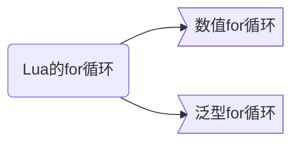
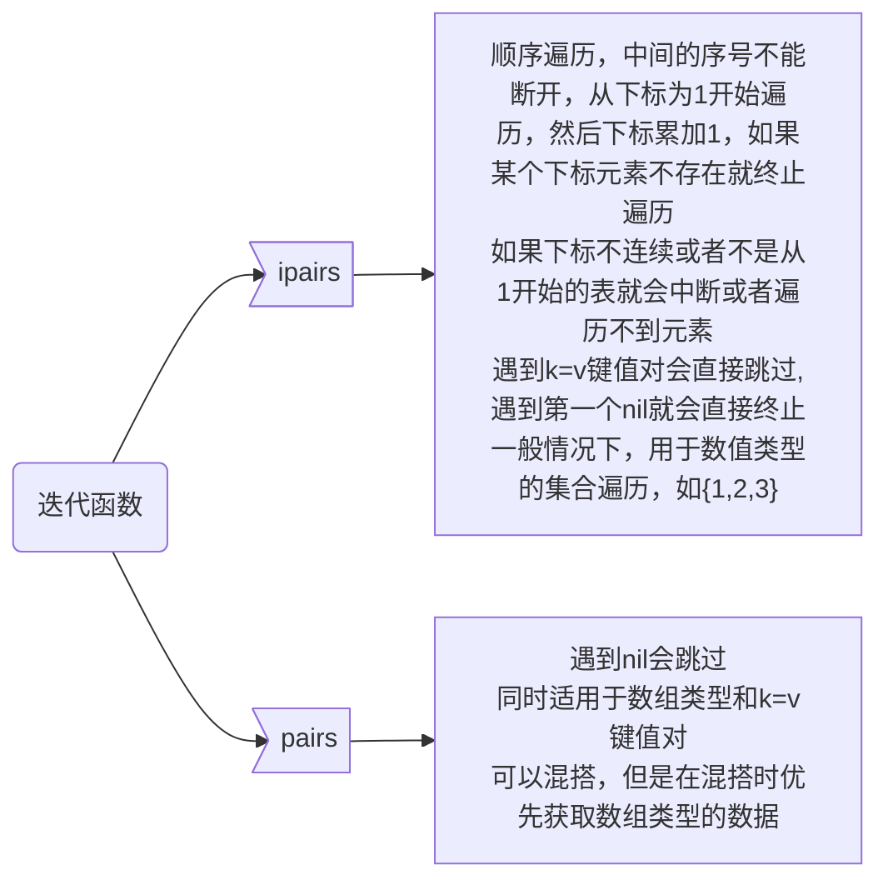
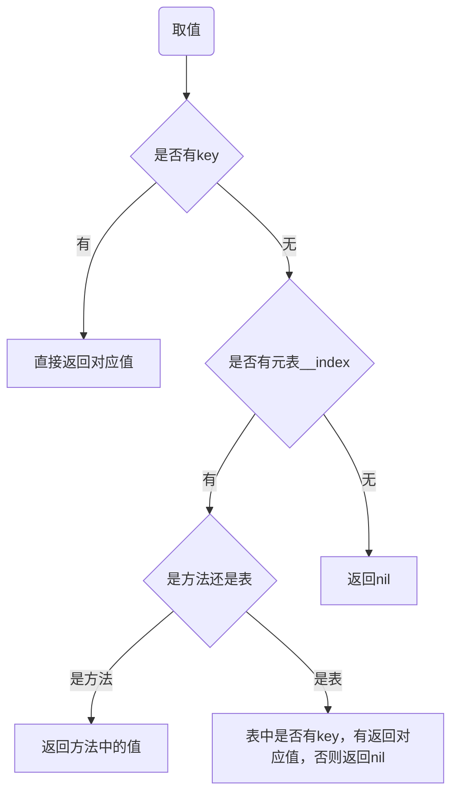
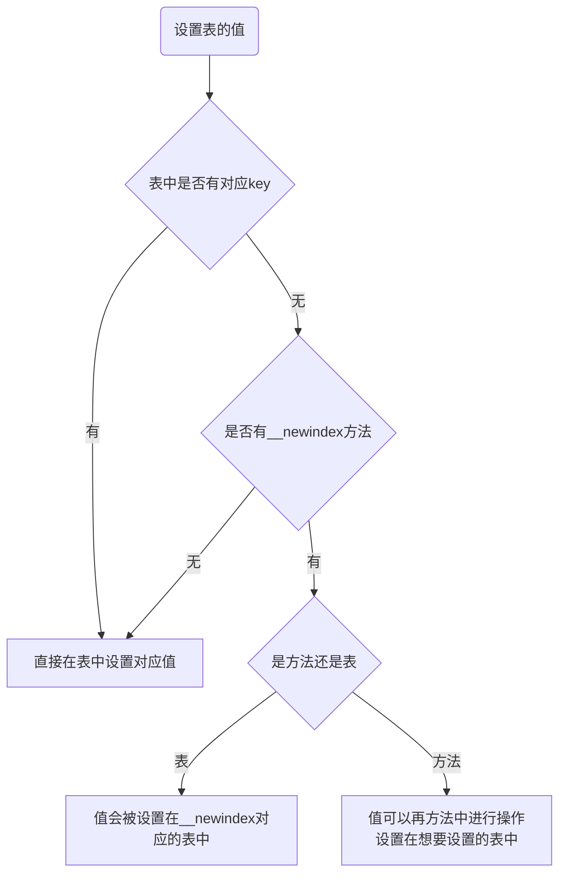

# Lua基础

> lua在线测试 <https://wiki.luatos.com/_static/luatos-emulator/lua.html>

> Lua 5.3 参考手册 - 目录 <https://www.runoob.com/manual/lua53doc/contents.html#index>

> Lua 教程 | 菜鸟教程  <https://www.runoob.com/lua/lua-tutorial.html>

## 一、注释


###### 1.1 单行注释

```lua
-- 单行注释
```

###### 1.2 多行注释

```l\ua
--[[
 多行注释
 多行注释
--]]
```


## 二、命名规范

1. Lua 标示符用于定义一个变量，函数获取其他用户定义的项。
2. 标示符以一个字母 A 到 Z 或 a 到 z 或下划线 **_** 开头后加上 0 个或多个字母，下划线，数字（0 到 9）。
3. 最好不要使用下划线加大写字母的标示符，因为Lua的保留字也是这样的。
4. Lua 不允许使用特殊字符如 **@**, **$**, 和 **%** 来定义标示符。 
5. Lua 是一个区分大小写的编程语言。


## 三、关键字

==以下列出了 Lua 的保留关键词。保留关键字不能作为常量或变量或其他用户自定义标示符：==

|          |       |       |        |
| -------- | ----- | ----- | ------ |
| and      | break | do    | else   |
| elseif   | end   | false | for    |
| function | if    | in    | local  |
| nil      | not   | or    | repeat |
| return   | then  | true  | until  |
| while    | goto  |       |        |

一般约定，以下划线开头连接一串大写字母的名字（比如 _VERSION）被保留用于 Lua 内部全局变量。

## 四、变量作用域

###### 4.1 全局变量

以下两种都是全局的

```lua
global = "";
function global()
    ---
end
```

###### 4.2 局部变量

我们可以使用`local`标志来新建临时变量，使用`local`创建一个局部变量，与全局变量不同，局部变量只在被声明的那个代码块内有效。

```lua
function add()
    local n = a+2
    print(n)
end
```

`n`就是一个局部变量，它只在`这个funcion`中有效，并且函数运行完后会自动回收这部分的内存。

> 尽可能的使用局部变量，以方便lua虚拟机自动回收内存空间，同时减少资源占用提高运行速度。


## 五、数据类型

### 5.1 八种数据类型

| 数据类型 | 描述                                                         |
| :------- | :----------------------------------------------------------- |
| nil      | 这个最简单，只有值nil属于该类，表示一个无效值（在条件表达式中相当于false）。 |
| boolean  | 包含两个值：false和true。                                    |
| number   | 表示双精度类型的实浮点数                                     |
| string   | 字符串由一对双引号或单引号来表示                             |
| function | 由 C 或 Lua 编写的函数                                       |
| userdata | 自定义数据格式，表示任意存储在变量中的C数据结构              |
| thread   | 表示执行的独立线路，用于执行协同程序                         |
| table    | Lua 中的表（table）其实是一个"关联数组"（associative arrays），数组的索引可以是数字、字符串或表类型。在 Lua 里，table 的创建是通过"构造表达式"来完成，最简单构造表达式是{}，用来创建一个空表。 |


> 注意: Lua中只有`nil`和`false`为假，其它都为真，包括`空字符串`和`0值`


### 5.2 使用type函数测试给定变量或者值的类型

`type(X)` 函数实质是返回的是字符串，是一个` string` 类型，做比较时应该使用`type(X)=="nil"`

```lua
print(type("Hello world"))      --> string
print(type(1*2))             --> number
print(type(print))              --> function
print(type(type))               --> function
print(type(true))               --> boolean
print(type(nil))                --> nil
print(type(type(X)))            --> string
```


## 六、运算符


### 6.1 数学运算符

设定 A 的值为10，B 的值为 20：

| 操作符 | 描述                 | 实例                |
| :----- | :------------------- | :------------------ |
| +      | 加法                 | A + B 输出结果 30   |
| -      | 减法                 | A - B 输出结果 -10  |
| *      | 乘法                 | A * B 输出结果 200  |
| /      | 除法                 | B / A 输出结果 2    |
| %      | 取余                 | B % A 输出结果 0    |
| ^      | 乘幂                 | A^2 输出结果 100    |
| -      | 负号                 | -A 输出结果 -10     |
| //     | 整除运算符(>=lua5.3) | **5//2** 输出结果 2 |


### 6.2 关系运算符

设定 A 的值为10，B 的值为 20：

| 操作符 | 描述                                                         | 实例                  |
| :----- | :----------------------------------------------------------- | :-------------------- |
| ==     | 等于，检测两个值是否相等，相等返回 true，否则返回 false      | (A == B) 为 false。   |
| ~=     | 不等于，检测两个值是否相等，不相等返回 true，否则返回 false  | (A ~= B) 为 true。    |
| >      | 大于，如果左边的值大于右边的值，返回 true，否则返回 false    | (A > B) 为 false。    |
| <      | 小于，如果左边的值大于右边的值，返回 false，否则返回 true    | (A < B) 为 true。     |
| >=     | 大于等于，如果左边的值大于等于右边的值，返回 true，否则返回 false | (A >= B) 返回 false。 |
| <=     | 小于等于， 如果左边的值小于等于右边的值，返回 true，否则返回 false | (A <= B) 返回 true。  |


### 6.3 逻辑运算符

设定 A 的值为 true，B 的值为 false：

| 操作符 | 描述                                                         | 实例                   |
| :----- | :----------------------------------------------------------- | :--------------------- |
| and    | 逻辑与操作符。 若 A 为 false，则返回 A，否则返回 B。         | (A and B) 为 false。   |
| or     | 逻辑或操作符。 若 A 为 true，则返回 A，否则返回 B。          | (A or B) 为 true。     |
| not    | 逻辑非操作符。与逻辑运算结果相反，如果条件为 true，逻辑非为 false。 | not(A and B) 为 true。 |


### 6.3 其他运算符

| 操作符 | 描述                               | 实例                                                         |
| :----- | :--------------------------------- | :----------------------------------------------------------- |
| ..     | 连接两个字符串                     | a..b ，其中 a 为 "Hello " ， b 为 "World", 输出结果为 "Hello World"。 |
| #      | 一元运算符，返回字符串或表的长度。 | #"Hello" 返回 5                                              |


#### 6.3.1 运算符`#`取长度问题

lua的table可以用数字或字符串等作为key， #号得到的是用整数作为索引的最开始连续部分的大小

```lua
tab1 = {"1","2"}
print("tab1长度"..#tab1)
tab2 = {key1="1","2"}
print("tab2长度"..#tab2)
tab3 = {}
tab3[1]="1"
tab3[2]="2"
tab3[4]="4"
print("tab3长度"..#tab3)

-- tab1长度2
-- tab2长度1
-- tab3长度2

local tab = {}
tab[1] = 1
tab[2] = 2
tab[3] = nil
print(#tab)
--结果为2

local tab2 = {}
tab2[1] = nil
tab2[2] = 2
tab2[3] = 3
print(#tab2)
--结果为0
```

如果table的第一个元素key为非数字，那么#tb获取到的长度也是0

```lua
local tab1 = {}
tab1["1"] = 1
tab1["2"] = 2
tab1["3"] = 3
print(#tab1)
--结果为0
```


==在平时开发过程中不建议直接使用`#`来直接获取table的元素个数==

可使用该封装方法:

```lua
function table.length(t)
    local i = 0
    for k, v in pairs(t) do
        i = i + 1
    end
    return i
end
```


### 6.4 运算符优先级

从高到低的顺序：

```lua
^
not    - (unary)
*      /       %
+      -
..
<      >      <=     >=     ~=     ==
and
or
```

==除了 **^** 和 **..** 外所有的二元运算符都是左连接的==

```lua
a+i < b/2+1          <-->       (a+i) < ((b/2)+1)
5+x^2*8              <-->       5+((x^2)*8)
a < y and y <= z     <-->       (a < y) and (y <= z)
-x^2                 <-->       -(x^2)
x^y^z                <-->       x^(y^z)
```


## 七、流程控制

Lua 提供了以下控制结构语句：

| 语句                   | 描述                                                         |
| :--------------------- | :----------------------------------------------------------- |
| if 语句                | **if 语句** 由一个布尔表达式作为条件判断，其后紧跟其他语句组成。 |
| if...else 语句         | **if 语句** 可以与 **else 语句**搭配使用, 在 if 条件表达式为 false 时执行 else 语句代码。 |
| if...elseif...else语句 | 当**if语句**的判断条件不成立时执行**elseif语句**的判断条件，可以多个**elseif语句**连续判断，**else语句**可以省略，当且仅当上面所有的**if语句**和**elseif语句**的判断条件都不成立时执行**else语句**中的代码。<br />在**if...elseif...else语句**中，从上到下执行，只要有一个条件满足后，就会短路，不再执行之后的语句。 |
| if 嵌套语句            | 你可以在**if** 或 **else if**中使用一个或多个 **if** 或 **else if** 语句 。 |


### 7.1 if语句

**if 语句语法格式如下：**

```lua
if (布尔表达式) then
   --[ 在布尔表达式为 true 时执行的语句 --]
end
```


### 7.2 if...else 语句

 **if...else 语句语法格式如下：**

```lua
if (布尔表达式) then
   --[ 布尔表达式为 true 时执行该语句块 --]
else
   --[ 布尔表达式为 false 时执行该语句块 --]
end
```


### 7.3 if...elseif...else 语句

**if...elseif...else 语句语法格式如下：**

```lua
if (布尔表达式 1) then
   --[ 在布尔表达式 1 为 true 时执行该语句块 --]

elseif (布尔表达式 2) then
   --[ 在布尔表达式 2 为 true 时执行该语句块 --]
elseif (布尔表达式 3) then
   --[ 在布尔表达式 3 为 true 时执行该语句块 --]
else 
   --[ 如果以上布尔表达式都不为 true 则执行该语句块 --]
end
```

**示例：**

```lua
--[ 定义变量 --]
a = 100
--[ 检查布尔条件 --]
if (a > 100)  then
   --[ 如果条件为 true 打印以下信息 --]
   print("a 大于 100")
elseif a > 90 then
   --[ if else if 条件为 true 时打印以下信息 --]
   print("a 大于 90")
elseif( a > 80 )then
   --[ if else if condition 条件为 true 时打印以下信息 --]
   print("a 大于 80")
else
   --[ 以上条件语句没有一个为 true 时打印以下信息 --]
   print("a不大于以上值" )
end

--输出-- a 大于 90
```


### 7.4 if 嵌套语句

**if 嵌套语句语法格式如下：**

```lua
if( 布尔表达式 1)then
   --[ 布尔表达式 1 为 true 时执行该语句块 --]
   if(布尔表达式 2)then
      --[ 布尔表达式 2 为 true 时执行该语句块 --]
   end
end
```


## 八、循环

Lua 语言提供了以下几种循环处理方式：

| 循环类型       | 描述                                                         |
| :------------- | :----------------------------------------------------------- |
| while 循环     | 在条件为 true 时，让程序重复地执行某些语句。执行语句前会先检查条件是否为 true。 |
| for 循环       | 重复执行指定语句，重复次数可在 for 语句中控制。              |
| repeat...until | 重复执行循环，直到 指定的条件为真时为止                      |
| 循环嵌套       | 可以在循环内嵌套一个或多个循环语句（while do ... end;for ... do ... end;repeat ... until;） |

> while 循环中，条件不成立时，结束循环
>
> repeat...until中，条件成立时，结束循环


Lua 支持以下循环控制语句：

| 控制语句   | 描述                                             |
| :--------- | :----------------------------------------------- |
| break 语句 | 退出当前循环或语句，并开始脚本执行紧接着的语句。 |
| goto 语句  | 将程序的控制点转移到一个标签处。                 |


### 8.1 while 循环

**while 循环语法：**

```lua
while(condition)do
   -- 语句 statements
end
```

在 **condition(条件)** 为 **true **时执行循环体语句


### 8.2 repeat...until循环

 **repeat...until 循环语法格式：**

```lua
repeat
    -- 语句 statements
until( condition )
```

循环条件判断语句（condition）在循环体末尾部分，所以在条件进行判断前循环体都会执行一次。

如果条件判断语句（condition）为 **false**，循环会重新开始执行，直到条件判断语句（condition）为 **true **才会停止执行


### 8.3 for 循环




#### 8.3.1 数值for循环

**数值 for 循环语法格式：**

```lua
for var=exp1,exp2,exp3 do  
    --执行语句  
end  

for 变量名=初始值,结束值,步长(默认值为1，可省略) do  
    --执行语句  
end  
```

expression可以是函数

for的三个表达式在循环开始前一次性求值，以后不再进行求值。f(x)只会在循环开始前执行一次

```lua
function f1(x)
    print("function1")  
    return x
end

function f2(x)  
    print("function2")  
    return x*2  
end  

for i=f1(1),f2(5) do 
    print(i)  
end

--输出--
function1
function2
1
2
3
4
5
6
7
8
9
10
```


#### 8.3.2 泛型for循环

泛型 for 循环通过一个迭代器函数来遍历所有值，类似 java 中的 foreach 语句。

**泛型 for 循环语法格式：**

```lua
--打印数组a的所有值  
aTable = {"one", "two", "three"}
for i, v in ipairs(aTable) do
    print(i, v)
end 

--输出--
1	one
2	two
3	three
```




> pairs的适用范围大于ipairs
>
> 不确定用什么的时候，优先选pairs


+ ipairs

  

  ```lua
  for i, v in ipairs({1,2,nil,3,4,5}) do
      print(i, v)
  end 
  --输出--
  1	1
  2	2
  
  for i, v in ipairs({"TX",1,2,3,4,5}) do
      print(i, v)
  end 
  --输出--
  1	TX
  2	1
  3	2
  4	3
  5	4
  6	5
  
  for i, v in ipairs({name="TX",1,2,3,4,5}) do
      print(i, v)
  end 
  --输出--
  1	TX
  2	1
  3	2
  4	3
  5	4
  6	5
  ```

  

+ pairs

  

  ```lua
  for k, v in pairs({1,2,3,4,5}) do
      print(k, v)
  end 
  --输出--
  1	1
  2	2
  3	3
  4	4
  5	5
  
  for k, v in pairs({"TX",1,2,3,4,5}) do
      print(k, v)
  end 
  --输出--
  1	TX
  2	1
  3	2
  4	3
  5	4
  6	5
  
  for k, v in pairs({name="TX",1,2,3,4,5}) do
      print(k, v)
  end 
  --输出--
  1	1
  2	2
  3	3
  4	4
  5	5
  name	TX
  ```

  


### 8.4 循环嵌套

示例

```lua
for i = 1, 9 do
    for j = 1, i do
        io.write(string.format("%d*%d=%d ", j, i, i * j))
        --io.write(j, "*", i, "=", i * j, "\t")
    end
    io.write("\n")
end
--输出--
1*1=1 
1*2=2 2*2=4 
1*3=3 2*3=6 3*3=9 
1*4=4 2*4=8 3*4=12 4*4=16 
1*5=5 2*5=10 3*5=15 4*5=20 5*5=25 
1*6=6 2*6=12 3*6=18 4*6=24 5*6=30 6*6=36 
1*7=7 2*7=14 3*7=21 4*7=28 5*7=35 6*7=42 7*7=49 
1*8=8 2*8=16 3*8=24 4*8=32 5*8=40 6*8=48 7*8=56 8*8=64 
1*9=9 2*9=18 3*9=27 4*9=36 5*9=45 6*9=54 7*9=63 8*9=72 9*9=81 
```


### 8.5 break语句

Lua 编程语言 break 语句插入在循环体中，用于退出当前循环或语句，并开始脚本执行紧接着的语句。

如果你使用循环嵌套，break语句将停止最内层循环的执行，并开始执行的外层的循环语句。

```lua
--[ 定义变量 --]
a = 10

--[ while 循环 --]
while (a < 20) do
    print("a 的值为:", a)
    a = a + 1
    if (a > 15) then
        --[ 使用 break 语句终止循环 --]
        break
    end
end
--输出--
a 的值为:	10
a 的值为:	11
a 的值为:	12
a 的值为:	13
a 的值为:	14
a 的值为:	15
```


### 8.6  goto 语句

Lua 语言中的 goto 语句允许将控制流程无条件地转到被标记的语句处。

语法格式如下所示：

```lua
goto Label
```

Label 的格式为：

```lua
:: Label ::
```


示例

```lua
local a = 1
:: label ::
print("--- goto label ---" .. a)

a = a + 1
if a < 3 then
    goto label   -- a 小于 3 的时候跳转到标签 label
end
--输出--
--- goto label ---1
--- goto label ---2
```

```lua
for i=1, 3 do
    if i <= 2 then
        print(i, "yes continue")
        goto continue
    end
    print(i, " no continue")
    ::continue::
    print([[i'm end]])
end
--输出--
1   yes continue
i'm end
2   yes continue
i'm end
3    no continue
i'm end
```


#### label不可见原则

**代码块**：`do ... end`


1. 不能从外面`goto`到代码块里面去，因为代码块里面的`lable`，对外面的`goto`来说是不可见的。
   
   
   ```lua
   goto label;
   do
       :: label :: ;
       print("Hello, world!");
   end
   print("END")
   --输出--
   no visible label 'label' for <goto> at line 1
   ```

   
   
2. 不能跳出或跳入一个函数，因为函数也是一个block(块)
   
   
   ```lua
   function func()
       :: label :: ;
       print("func");
   end
   
   print("Hello World");
   func();
   goto label;
   --输出--
   no visible label 'label' for <goto> at line 8
   ```
   
   
   
   ```lua
   function func()
       print("func");
       goto label;
   end
   
   func();
   :: label :: ;
   print("Hello World");
   --输出--
   no visible label 'label' for <goto> at line 3
   ```
   
   
   
3. 不能跳入本地变量作用域
   
   
   ```lua
   do
       print("Hello World");
       goto label;
       local a = 1;
       print(a);
       :: label ::
       print("本地变量作用域");
   end
   --输出--
   <goto label> at line 3 jumps into the scope of local 'a'
   
   --goto在本地变量作用域内可以跳转
   do
       print("Hello World");
       local a = 1;
       print(a);
       :: label ::
       print("本地变量作用域");
       goto label;
   end
   --输出--
   --[[死循环]]--
   ```

   

   

## 九、表Table常用api

   

### 9.1 `table.concat(list[, sep [, i [, j]]])`

将数组中的元素拼接成一个字符串

返回字符串 `list[i]..sep..list[i+1] ··· sep..list[j]`

+ `separation` 默认为空字符串
+ `i` 默认值为1
+ `j` 默认值为`#list`
+ 如果 `i` 比 `j` 大，返回空串

   

### 9.2 `table.insert (list, [pos,] value)`

向指定位置插入元素，默认插入到最后

   在 `list` 的位置 `pos` 处插入元素 `value` ， 并后移元素 `list[pos], list[pos+1], ···, list[#list]`

+ `position`的默认值为 `#list+1`。直接调用 `table.insert(t,x)` 会将 `x` 插在列表 `t` 的末尾

   

### 9.3 `table.remove (list [, pos])`

删除数组中的元素，默认删除最后一个

移除 `list` 中 `pos` 位置上的元素，并返回这个被**移除的值**，其后的元素会被前移。

+ `pos` 默认为 `#list`， 因此调用 `table.remove(l)` 将移除表 `l` 的最后一个元素


### 9.4 `table.move(a1,f,e,t[,a2])` 

把表a1中从下标f到e的value移动到表a2中，位置为a2下标从t开始

+ `a2` 默认值为`a1`

```lua
local table1 = { 1, 2, 3, 4, 5 };

local table2 = { "TX" };
table.move(table1, 1, 5, 2, table2);

print(table.concat(table1, "-"));
print(table.concat(table2, "-"));
--输出--
1-2-3-4-5
TX-1-2-3-4-5
```


### 9.5 `table.sort (list [, comp])`

数组排序，默认从小到大，可自定义排序规则

+ 在表内从 `list[1]` 到 `list[#list]` *原地* 对其间元素按指定次序排序，直接操作原表无返回值
+  如果提供了 `comp` ， 它必须是一个可以接收两个列表内元素为参数的函数。
+ 如果没有提供 `comp`， 将使用标准 Lua 操作 `<` 作为替代品。及**从小到大**排序。

```lua
local myTable = { 5, 4, 1, 3, 2 }
table.sort(myTable)
print(table.concat(myTable, "-"))
--输出--
1-2-3-4-5
```

```lua
local myTable = { 5, 4, 1, 3, 2 }
function desc(a, b)
    return a > b
end
table.sort(myTable, desc)
print(table.concat(myTable, "-"))
--输出--
5-4-3-2-1
```


## 十、String常用api

### 10.1 字符串，转义字符

Lua 语言中字符串可以使用以下三种方式来表示：

- 单引号间的一串字符。
- 双引号间的一串字符。
- **[[** 与 **]]** 间的一串字符。

义字符用于表示不能直接显示的字符，比如后退键，回车键，等。如在字符串转换双引号可以使用 "\""。

所有的转义字符和所对应的意义：

| 转义字符 | 意义                                | ASCII码值（十进制） |
| -------- | ----------------------------------- | ------------------- |
| \a       | 响铃(BEL)                           | 007                 |
| \b       | 退格(BS) ，将当前位置移到前一列     | 008                 |
| \f       | 换页(FF)，将当前位置移到下页开头    | 012                 |
| \n       | 换行(LF) ，将当前位置移到下一行开头 | 010                 |
| \r       | 回车(CR) ，将当前位置移到本行开头   | 013                 |
| \t       | 水平制表(HT) （跳到下一个TAB位置）  | 009                 |
| \v       | 垂直制表(VT)                        | 011                 |
| \\       | 代表一个反斜线字符''\'              | 092                 |
| \'       | 代表一个单引号（撇号）字符          | 039                 |
| \"       | 代表一个双引号字符                  | 034                 |
| \0       | 空字符(NULL)                        | 000                 |
| \ddd     | 1到3位八进制数所代表的任意字符      | 三位八进制          |
| \xhh     | 1到2位十六进制所代表的任意字符      | 二位十六进制        |


### 10.2 `string.upper (s)`

接收一个字符串，将其中的小写字符都转为大写后返回其副本。 其它的字符串不会更改。 对小写字符的定义取决于当前的区域设置。

```lua
local s = "Hello World";
print(string.upper(s));
--输出--
HELLO WORLD
```


### 10.3 `string.lower (s)`

接收一个字符串，将其中的大写字符都转为小写后返回其副本。 其它的字符串不会更改。 对大写字符的定义取决于当前的区域设置。

```lua
local s = "Hello World";
print(string.lower(s));
--输出--
hello world
```


### 10.4 `string.len (s)`

接收一个字符串，返回其长度。 空串 `""` 的长度为 0 。 内嵌零也统计在内，因此 `"a\000bc\000"` 的长度为 5 。

```lua
local s = "Hello World";
print(string.len(s));
--输出--
11
```

 

### 10.5 `string.reverse (s)`

返回字符串 `s` 的翻转串。

```lua
local s = "Hello World";
print(string.reverse(s))
--输出--
dlroW olleH
```


### 10.6 连接符`..`

字符串连接符

```lua
print("Hello" .. "World")
--输出--
HelloWorld
```


### 10.7 `string.sub (s, i [, j])`

截取字符串

- s：要截取的字符串。
- i：截取开始位置。
- j：截取结束位置，默认为 -1，最后一个字符。

+ 返回 `s` 的子串， 该子串从 `i` 开始到 `j` 为止； `i` 和 `j` 都可以为负数。 
+ 如果不给出 `j` ，就当它是 -1 （和字符串长度相同）。 特别是， 调用 `string.sub(s,1,j)` 可以返回 `s` 的长度为 `j` 的前缀串， 而 `string.sub(s, -i)` 返回长度为 `i` 的后缀串。
+ 如果在对负数索引转义后 `i` 小于 1 的话，就修正回 1 。 如果 `j` 比字符串的长度还大，就修正为字符串长度。 如果在修正之后，`i` 大于 `j`， 函数返回空串。

```lua
local s = "Hello World";
print("原始字符串", "\'" .. s .. "\'", "字符串长度", string.len(s));
print("第一次截取", string.sub(s, 1, 4));
print("第二次截取", string.sub(s, 1, -1));
print("第三次截取", string.sub(s, 1, 22));
print("第四次截取", string.sub(s, 5, 11));
print("第五次截取", string.sub(s, 7));
print("第六次截取", string.sub(s, 7, -1));
print("第七次截取", string.sub(s, 7, -3));
print("第八次截取", string.sub(s, -5));
print("第九次截取", string.sub(s, -5, -1));
print("第十次截取", string.sub(s, -5, -3));
print("第十一次截取", string.sub(s, -11));
print("第十二次截取", string.sub(s, -22));
print("第十三次截取", string.sub(s, -22, -5));

--输出--
原始字符串	'Hello World'	字符串长度	11
第一次截取	Hell
第二次截取	Hello World
第三次截取	Hello World
第四次截取	o World
第五次截取	World
第六次截取	World
第七次截取	Wor
第八次截取	World
第九次截取	World
第十次截取	Wor
第十一次截取	Hello World
第十二次截取	Hello World
第十三次截取	Hello W
```


### 10.8 `string.find (s, pattern [, init [, plain]])`

+ 在一个指定的目标字符串 `s`中搜索指定的内容 `pattern `，如果找到了一个匹配的子串，就会返回这个子串的起始索引和结束索引，不存在则返回 nil。

+ **init** 指定了搜索的起始位置，默认为 1，可以一个负数，表示从后往前数的字符个数。

+ **plain** 表示是否使用简单模式，默认为 false，true 只做简单的查找子串的操作，false 表示使用正则模式匹配。

```lua
print(string.find("Hello Lua user", "Lua", 1));
--输出--
7    9

print(string.find("Hello Lua user", "%w+", 1, false));
--输出--
1	5
```


### 10.9 `string.gsub (s, pattern, repl [, n])`

将字符串 `s` 中，所有的（或是在 `n` 给出时的前 `n` 个） `pattern` 都替换成 `repl` ，并返回其副本。 `repl` 可以是字符串、表、或函数。 `gsub` 还会在第二个返回值返回一共发生了多少次匹配。 `gsub` 这个名字来源于 *Global SUBstitution* 。

```lua
-- 全部替换
print(string.gsub("TTTT", "T", "X"))
--输出--
XXXX	4

--替换3次
print(string.gsub("TTTT", "T", "X", 3))
--输出--
XXXT	3
```


```lua
print(string.gsub("hello world", "(%w+)", "%1 %1"))
--输出--
hello hello world world	2
-----------------------------------
print(string.gsub("hello world", "%w+", "%0 %0", 1))
--输出--
hello hello world	1
-----------------------------------
print(string.gsub("hello world from Lua", "(%w+)%s*(%w+)", "%2 %1"))
--输出--
world hello Lua from	2
-----------------------------------
print(string.gsub("4+5 = $return 4+5$", "%$(.-)%$",
        function(s)
            return load(s)() --将字符串 s 转换为函数，然后执行这个函数，返回函数的返回值
        end)
)
--输出--
4+5 = 9	1
-----------------------------------
-- 使用 load() 函数加载字符串并编译为函数
local func = load("print('Hello, World!')")
-- 调用刚刚生成的函数
func()
--输出--
Hello, World!
-----------------------------------
local t = { name = "lua", version = "5.3" }
print(string.gsub("$name-$version.tar.gz", "%$(%w+)", t))
--输出--
lua-5.3.tar.gz	2
```


### 10.10 `string.byte (s [, i [, j]])`和`string.char (···)`

+  `byte `转换字符为整数值(可以指定某个字符，默认第一个字符)。 `i` 的默认值是 1 ； `j` 的默认值是 `i`。
+ `char `将整型数字转成字符并连接。接收零或更多的整数。 返回和参数数量相同长度的字符串。 其中每个字符的内部编码值等于对应的参数值

```lua
print(string.byte("ABCD"))
print(string.byte("ABCD", 2))
print(string.byte("ABCD", 1, 4))
--输出--
65
66
65	66	67	68

print(string.char(65, 66, 67, 68, 97, 98, 99, 100))
--输出--
ABCDabcd
```


### 10.11 `string.format (formatstring, ···)`

+ 返回不定数量参数的格式化版本， 格式化串为第一个参数（必须是一个字符串）。 
+ 格式化字符串遵循 ISO C 函数 `sprintf` 的规则。 不同点在于选项 `*`, `h`, `L`, `l`, `n`, `p` 不支持， 另外还增加了一个选项 `q`。 `q` 选项将一个字符串格式化为两个双引号括起，对内部字符做恰当的转义处理的字符串。

```lua
print(string.format("the value is:%d", 4))
--输出--
the value is:4

print(string.format('%q', 'a string with "quotes" and \n new line'))
--输出--
"a string with \"quotes\" and \
 new line"
```


### 10.12 `string.match (s, pattern [, init])`

+ 在字符串 `s` 中找到第一个能用 `pattern` 匹配到的部分。 如果能找到，`match` 返回其中的捕获物； 否则返回 **nil** 。 
+ 如果 `pattern` 中未指定捕获， 返回整个 `pattern` 捕获到的串。 
+ 第三个可选数字参数 `init` 指明从哪里开始搜索； 它默认为 1 且可以是负数。

```lua
a, b = string.match("I have 2 questions for you.", "(%d+) (%w+)")
print(a .. "---" .. b)
--输出--
2---questions

print(string.format("%d, %q", string.match("I have 2 questions for you.", "(%d+) (%w+)")))
--输出--
2, "questions"
```


## 十一、函数 function

Lua 编程语言函数定义格式如下：

```lua
optional_function_scope function function_name( argument1, argument2, argument3..., argumentn)
    function_body
    return result_params_comma_separated
end
```

- **optional_function_scope:** 该参数是可选的指定函数是全局函数还是局部函数，未设置该参数默认为全局函数，如果你需要设置函数为局部函数需要使用关键字 **local**。

- **function_name:** 指定函数名称。

- **argument1, argument2, argument3..., argumentn:** 函数参数，多个参数以逗号隔开，函数也可以不带参数。

- **function_body:** 函数体，函数中需要执行的代码语句块。

- **result_params_comma_separated:** 函数返回值，Lua语言函数可以返回多个值，每个值以逗号隔开。

  

### 11.1 function 常见形式

```lua
-- 直接调用
function show(a, b)
    print(a, b);
end
show("hello", "world");
--输出--
hello	world
---------------------------
-- 当右值，赋值给一个变量，然后调用
func1 = show;
func1("hello", "world");
--输出--
hello	world
---------------------------
-- 匿名函数当右值，直接调用
func2 = function(a, b)
    print(a, b);
end
func2("hello", "world");
--输出--
hello	world
---------------------------
-- 当参数
function show2(a, b, func)
    func(a, b);
end
show2("hello", "world", show);
show2("hello", "world", function(a, b)
    print(a, b);
end);
--输出--
hello	world
---------------------------
-- 当返回值
function show3(a, b)
    return function()
        print(a, b);
    end
end
show3("hello", "world")();
-- 或者
--func3 = show3("hello", "world");
--func3();
--输出--
hello	world
---------------------------
-- 多返回值
function show4(a, b)
    return a, b;
end
print(show4("hello", "world"));
--输出--
hello	world
---------------------------
-- 可变参数
function add(...)
    local s = 0;
    for i, v in ipairs { ... } do --> {...} 表示一个由所有变长参数构成的数组  
        s = s + v;
    end
    return s;
end
print(add(1, 2, 3, 4, 5));
--输出--
15
---------------------------
-- 函数只有一个参数时，可以省略括号
function show5(a)
    print(a);
end
show5 "hello world";
--输出--
hello world
---------------------------
```


### 11.2 table中的function

```lua
function show(a)
    print(a);
end

t1 = {
    show = show,
    add  = function(a, b)
        return a + b;
    end
}
t1.show("hello world");
t1["show"]("hello world");
print(t1.add(1, 2));
t1.show(t1.add(1, 2));

t1.sub = function(a, b)
    return a - b;
end

print(t1.sub(1, 2));

--输出--
hello world
hello world
3
3
-1
```


```lua
calc = {
    a    = 1,
    b    = 2,
    add  = function(self)
        return self.a + self.b;
    end,
    sub  = function(self)
        calc.result = self.a - self.b;
        return self;
    end,
    show = function(self)
        print(self.result);
    end
    
}
print(calc.add(calc));
print(calc:sub():show()); --> 使用":"调用函数，会默认把自身传入
print(calc.sub(calc).show(calc)); --> 使用self时，用"."调用函数需要手动传入self
--输出--
3
-1

-1

```


#### **`.`和`:`的区别***

+ `.` 用来访问table中的元素
+ `:` 用来调用table中的函数，相当于传递了self参数
+ 如果函数中没有`self`参数，那么`:`和`.`是一样的
+ 一般情况下，如果函数中有`self`参数，那么就用`:`，否则就用`.`
+ 如果函数中有self参数，但是不想用`:`，那么可以用`.`，但是需要手动传递`self`参数
+ 如果函数中没有self参数，但是想用`:`，那么可以用`:`，但是不要传递self参数
+ 如果函数中没有self参数，但是想用`:`，并且传递了self参数，那么self参数会被忽略


### 11.3 `select`处理可变参函数

- **`select('#', …)`** 返回可变参数的长度。
- **`select(n, …)`** 用于返回从起点 **n** 开始到结束位置的所有参数列表。

```lua
function show(...)
    print(select("#", ...));
end
show(1, 2, 3, 4, 5);
--输出--
5
----------------------
function show(...)
    print(select(3, ...));
end
show(1, 2, 3, 4, 5);
--输出--
3	4	5
```

```lua
function show(...)
    print(select("#", ...));
    print(select(1, ...));
end
show(1, 2, 3, 4, 5, "#", "", nil, { table }, function() end);
--输出--
10
1	2	3	4	5	#		nil	table: 0000000000ff9280	function: 0000000000ffd440

```


### 11.4 `pack`处理可变参函数

将可变参数打包成一个table，且会在最后多出一个`n`键，值为可变参的参数个数

`table.pack`返回用所有参数以键 1,2, 3等填充的新表， 并将 "`n`" 这个域设为参数的总数。 注意这张返回的表不一定是一个序列。

```lua
function show(...)
    local t = table.pack(...);
    for i, v in pairs(t) do
        print(i, v);
    end
    print(t[8])；
end
show(1, 2, 3, 4, 5, "#", "", nil, { table }, function() end);
--输出--
1	11
2	22
3	33
4	44
5	55
6	#
7	
9	table: 00000000006f94c0
10	function: 00000000006fd560
n	10
nil
```

### 11.5 `table.unpack (list [, i [, j]])`

解包，将table解包为可变参

返回列表中的元素。 这个函数等价于

```lua
     return list[i], list[i+1], ···, list[j]
```

`i` 默认为 1 ，`j` 默认为 `#list`。


```lua
function func(...)
    return table.pack(...);
end
print(func(1, 2, 3, 4, 5));
print(table.unpack(func(1, 2, 3, 4, 5)));
print(table.unpack(func(1, 2, 3, 4, 5), 2, 3));
--输出--
table: 0000000000f99400
1	2	3	4	5
2	3
```


## 十二、元表(Metatable)

在 Lua table 中我们可以访问对应的 key 来得到 value 值，但是却无法对两个 table 进行操作(比如相加)。

因此 Lua 提供了元表(Metatable)，允许我们改变 table 的行为，每个行为关联了对应的元方法。

例如，使用元表我们可以定义 Lua 如何计算两个 table 的相加操作 a+b。

当 Lua 试图对两个表进行相加时，先检查**两者之一**是否有元表，之后检查是否有一个叫 **__add** 的字段，若找到，则调用对应的值。 **__add** 等即时字段，其对应的值（往往是一个函数或是 table）就是"元方法"。

- **`setmetatable(table,metatable)`:** 对指定 table 设置元表(metatable)，如果元表(metatable)中存在 __metatable 键值，setmetatable 会失败。返回表table。
- **`getmetatable(table)`:** 返回对象的元表(metatable)。


### 12.1 元表方法

| 键值       | 操作                        | 描述                                                         |
| ---------- | --------------------------- | ------------------------------------------------------------ |
| __add      | +                           | 如果任何不是数字的值（包括不能转换为数字的字符串）做加法， Lua 就会尝试调用元方法。 首先、Lua 检查第一个操作数（即使它是合法的）， 如果这个操作数没有为 " |
| __sub      | -                           | 行为和 "add" 操作类似。                                      |
| __mul      | *                           | 行为和 "add" 操作类似。                                      |
| __div      | /                           | 行为和 "add" 操作类似。                                      |
| __mod      | %                           | 行为和 "add" 操作类似。                                      |
| __pow      | ^ （次方）                  | 行为和 "add" 操作类似。                                      |
| __unm      | - （取负）                  | 行为和 "add" 操作类似。                                      |
| __idiv     | // （向下取整除法）         | 行为和 "add" 操作类似。                                      |
| __band     | & （按位与）                | 行为和 "add" 操作类似， 不同的是 Lua 会在任何一个操作数无法转换为整数时 尝试取元方法。 |
| __bor      | \| （按位或）               | （按位或）操作                                               |
| __bxor     | ~ （按位异或）              | 行为和 "band" 操作类似。                                     |
| __bnot     | ~ （按位非）                | 行为和 "band" 操作类似。                                     |
| __shl      | << （左移）                 | 行为和 "band" 操作类似。                                     |
| __shr      | >> （右移）                 | 行为和 "band" 操作类似。                                     |
| __concat   | .. （连接）                 | 行为和 "add" 操作类似， 不同的是 Lua 在任何操作数即不是一个字符串 也不是数字（数字总能转换为对应的字符串）的情况下尝试元方法。 |
| __len      | # （取长度）                | 如果对象不是字符串，Lua 会尝试它的元方法。 如果有元方法，则调用它并将对象以参数形式传入， 而返回值（被调整为单个）则作为结果。 如果对象是一张表且没有元方法， Lua 使用表的取长度操作。 其它情况，均抛出错误。 |
| __eq       | == （等于）                 | 和 "add" 操作行为类似， 不同的是 Lua 仅在两个值都是表或都是完全用户数据 且它们不是同一个对象时才尝试元方法。 调用的结果总会被转换为布尔量。 |
| __lt       | < （小于）                  | 和 "add" 操作行为类似， 不同的是 Lua 仅在两个值不全为整数也不全为字符串时才尝试元方法。 调用的结果总会被转换为布尔量。 |
| __le       | <= （小于等于）             | 和其它操作不同， 小于等于操作可能用到两个不同的事件。 首先，像 "lt" 操作的行为那样，Lua 在两个操作数中查找 " |
| __index    | 索引 table[key]             | 当 table 不是表或是表 table 中不存在 key 这个键时，这个事件被触发。 此时，会读出 table 相应的元方法。<br />尽管名字取成这样， 这个事件的元方法其实可以是一个函数也可以是一张表。 如果它是一个函数，则以 table 和 key 作为参数调用它。 如果它是一张表，最终的结果就是以 key 取索引这张表的结果。 （这个索引过程是走常规的流程，而不是直接索引， 所以这次索引有可能引发另一次元方法。） |
| __newindex | 索引赋值 table[key] = value | 和索引事件类似，它发生在 table 不是表或是表 table 中不存在 key 这个键的时候。 此时，会读出 table 相应的元方法。<br />同索引过程那样， 这个事件的元方法即可以是函数，也可以是一张表。 如果是一个函数， 则以 table、 key、以及 value 为参数传入。 如果是一张表， Lua 对这张表做索引赋值操作。 （这个索引过程是走常规的流程，而不是直接索引赋值， 所以这次索引赋值有可能引发另一次元方法。）一旦有了 "newindex" 元方法， Lua 就不再做最初的赋值操作。 （如果有必要，在元方法内部可以调用 rawset 来做赋值。） |
| __call     | 函数调用操作 func(args)     | 当 Lua 尝试调用一个非函数的值的时候会触发这个事件 （即 func 不是一个函数）。 查找 func 的元方法， 如果找得到，就调用这个元方法， func 作为第一个参数传入，原来调用的参数（args）后依次排在后面。 |


### 12.2 不触发任何元方法

> 以下方法都不经过元表


#### 12.2.1 `rawequal (v1, v2)`

在不触发任何元方法的情况下 检查 `v1` 是否和 `v2` 相等。 返回一个布尔量。


#### 12.2.2 `rawlen (v)`

在不触发任何元方法的情况下 返回对象 `v` 的长度。 `v` 可以是表或字符串。 它返回一个整数。


#### 12.2.3 `rawset (table, index, value)`

在不触发任何元方法的情况下 将 `table[index]` 设为 `value`。 `table` 必须是一张表， `index` 可以是 **nil** 与 NaN 之外的任何值。 `value` 可以是任何 Lua 值。

这个函数返回 `table`。


#### 12.2.4 `rawget (table, index)`

在不触发任何元方法的情况下 获取 `table[index]` 的值。 `table` 必须是一张表； `index` 可以是任何值。


### 12.3 元方法及示例


#### 12.3.1* **`__index`**

这是 metatable 最常用的键。

当你通过键来访问 table 的时候，如果这个键没有值，那么Lua就会寻找该table的metatable（假定有metatable）中的\__index 键。如果__index包含一个表格，Lua会在表格中查找相应的键。


Lua 查找一个表元素时的规则，其实就是如下 3 个步骤:

1. 在表中查找，如果找到，返回该元素，找不到则继续
2. 判断该表是否有元表，如果没有元表，返回 nil，有元表则继续。
3. 判断元表有没有 __index 方法，如果 __index 方法为 nil，则返回 nil；如果 __index 方法是一个表，则重复 1、2、3；如果 __index 方法是一个函数，则返回该函数的返回值。





```lua
t = { name = TX, age = 18 }
print(t.address) -- 没有key，没有元表__index-->nil 
--输出--
nil
---------------------

t = { name = TX, age = 18 }
meta = {
    __index = {
        address = "China"
    }
}
t.address = "中国";
setmetatable(t, meta);
print(t.address); -- 自己有key，有元表__index，不管元表-->中国
--输出--
China
---------------------

t = { name = TX, age = 18 }
meta = {
    __index = {
        address = "China"
    }
}
setmetatable(t, meta)
print(t.address) -- 没有key，有元表__index，且__index是表有对应key-->China
--输出--
China
---------------------

myTable = setmetatable({ name = "TX" }, {
    __index = function(t, key)
        if key == "address" then
            return "China";
        else
            return "noValue";
        end
    end
})
print(myTable.name, myTable.address, myTable.age);
--输出--
TX	China	noValue
---------------------
```


#### 12.3.2* **`__newindex`**

__newindex 元方法用来对表更新，__index则用来对表访问 。

当你给表的一个缺少的索引赋值，解释器就会查找__newindex 元方法：如果存在则调用这个函数而不进行赋值操作。




```lua
myMetatable = {}
myTable = setmetatable({ key1 = "value1" }, { __newindex = myMetatable })

print(myTable.key1)

myTable.newKey = "新值2"
print(myTable.newKey, myMetatable.newKey)

myTable.key1 = "新值1"
print(myTable.key1, myMetatable.key1)
--输出--
value1
nil	新值2
新值1	nil
----------------------------
myTable = setmetatable({ key1 = "value1" }, {
    __newindex = function(myTable, key, value)
        --在不触发任何元方法的情况下设置值，必须使用该方法给自身表设值，否则会出现死循环栈溢出
        rawset(myTable, key, "[" .. value .. "]") 
    end
})

myTable.key1 = "new value"
myTable.key2 = 4
myTable.key3 = "value3"

print(myTable.key1, myTable.key2, myTable.key3)
--输出--
new value	[4]	[value3]
```


#### 12.3.3 `__add`

```lua
t1 = { 11, 22, 33, 44, 55 }
t2 = { 66, 77, 88, 99 }
meta = {
    __add = function(t1, t2)
        local result = {}
        for k, v in pairs(t1) do
            table.insert(result, v)
        end
        for k, v in pairs(t2) do
            table.insert(result, v)
        end
        return result
    end
}
setmetatable(t1, meta)
--setmetatable(t2, meta)
result = t1 + t2
for k, v in pairs(result) do
    print(k, v)
end
--输出--
1	11
2	22
3	33
4	44
5	55
6	66
7	77
8	88
9	99
```

```lua
t1 = { 11, 22, 33, 44, 55 }
t2 = { 66, 77, 88, 99 }
meta = {}
meta.__add = function(t1, t2)
    local len = #t1 > #t2 and #t1 or #t2;
    local result = {}
    for i = 1, len do
        result[i] = (t1[i] or 0) + (t2[i] or 0);
    end
    return result;
end

setmetatable(t1, meta);
--setmetatable(t2, meta);

for k, v in pairs(t1 + t2) do
    print(k, v);
end
--输出--
1	77
2	99
3	121
4	143
5	55
```


#### 12.3.4 `__eq`

```lua
t1 = { 11, 22, 33, 44, 55 }
t2 = { 11, 22, 33, 44, 55 }
setmetatable(t1, {
    __eq = function(t1, t2)
        if #t1 ~= #t2 then
            return false;
        end
        for i = 1, #t1 do
            if t1[i] ~= t2[i] then
                return false;
            end
        end
        return true;
    end
})
print(t1 == t2)
--输出--
true
```


#### 12.3.5 `__tostring`


```lua
t = {
    name   = "LuaMeta",
    time   = "5/28",
    author = "TX",
}
meta = {
    __tostring = function(table)
        local result = "{\n";
        for k, v in pairs(table) do
            result = result .. k .. "=" .. v .. ",\n";
        end
        return result .. "}";
    end
}
setmetatable(t, meta);
print(t);
--输出--
{
name=LuaMeta,
author=TX,
time=5/28,
}
```


#### 12.3.6 `__call`

`__call` 元方法在 Lua 调用一个值时调用

当 Lua 尝试调用一个非函数的值的时候会触发这个事件 。 查找表的元方法， 如果找得到，就调用这个元方法，本表作为第一个参数传入，原来调用的参数（`args`）后依次排在后面。


```lua
t = { 1, 2, 3, 4, 5 }
setmetatable(t, {
    __call = function(table, ...)
        local result = 0;
        for k, v in pairs(t) do
            result = result + v;
        end
        return result;
    end
})
print(t())
--输出--
15
---------------------------

t = {}
setmetatable(t, {
    __call = function(t, ...)
        for k, v in pairs({ ... }) do
            print(k, v);
        end
    end
})
t(1, 2, 3, 4, 5)
--输出--
1	1
2	2
3	3
4	4
5	5
```

