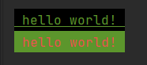
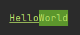

# 方法一

```cmd
\033[字体显示方式;字体颜色;字体背景色m'字符' \033[0m
```

+ 显示方式：
  + 0（默认值）、1（高亮）、22（非粗体）、4（下划线）、24（非下划线）、 5（闪烁）、25（非闪烁）、7（反显）、27（非反显）
+ 字体色：
  + 30（黑色）、31（红色）、32（绿色）、 33（黄色）、34（蓝色）、35（洋 红）、36（青色）、37（白色）
+ 字体背景色：
  + 40（黑色）、41（红色）、42（绿色）、 43（黄色）、44（蓝色）、45（洋 红）、46（青色）、47（白色）

## 例子

```java
/**
 * + 显示方式：
 *   + 0（默认值）、1（高亮）、22（非粗体）、4（下划线）、24（非下划线）、 5（闪烁）、25（非闪烁）、7（反显）、27（非反显）
 * + 字体色：
 *   + 30（黑色）、31（红色）、32（绿色）、 33（黄色）、34（蓝色）、35（洋 红）、36（青色）、37（白色）
 * + 字体背景色：
 *   + 40（黑色）、41（红色）、42（绿色）、 43（黄色）、44（蓝色）、45（洋 红）、46（青色）、47（白色）
 * + 语法：
 *   \033[字体显示方式;字体颜色;字体背景色m'字符' \033[0m
 */
@Test
public void cmdOrder(){
    System.out.println("\033[4;32;40m hello world! \033[0m");
    System.out.println("\033[0;31;42m hello world! \033[0m");
}
```



# 方法二

## 导入依赖

```xml
<dependency>
    <groupId>org.fusesource.jansi</groupId>
    <artifactId>jansi</artifactId>
    <version>2.4.0</version>
</dependency>
```

## 例子

```java
@Test
public void  testJansi() {
    System.out.println(
            ansi()
            .eraseScreen()
            .fgRgb(188,232,105) // 使用rgb颜色
            .a(Ansi.Attribute.UNDERLINE) // + 下划线
            .a("Hello") // 作用于"Hello"文字上
            .bg(GREEN) // 绿色背景
            .fgRgb(189,233,105)
            .a(Ansi.Attribute.UNDERLINE_OFF) // - 下划线
            .a("World") // 作用于...
            .reset()); // 输出
}
```

