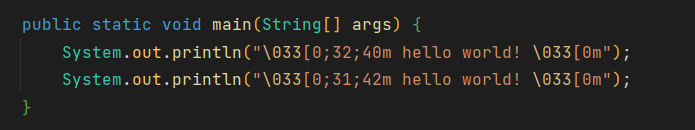

# 方法一

```cmd
\033[字体显示方式;字体颜色;字体背景色m'字符' \033[0m
```

+ 显示方式: 0（默认值）、1（高亮）、22（非粗体）、4（下划线）、24（非下划线）、 5（闪烁）、25（非闪烁）、7（反显）、27（非反显）
+ 字体色: 30（黑色）、31（红色）、32（绿色）、 33（黄色）、34（蓝色）、35（洋 红）、36（青色）、37（白色）
+ 字体背景色: 40（黑色）、41（红色）、42（绿色）、 43（黄色）、44（蓝色）、45（洋 红）、46（青色）、47（白色）

## 例子



